# 태스크릿 지향 처리

---

## 태스크릿 지향 처리 특징

- 단순 작업에 적합
  - 태스크릿 지향 처리는 알림 발송, 파일 복사, 오래된 데이터 삭제 등 단순 작업을 처리하는 Step 유형이다.
- Tasklet 인터페이스 구현
  - 태스크릿 지향 처리는 Tasklet 인터페이스를 구현하여 execute() 메서드에서 작업 로직을 정의한다.
  - 이를 `StepBuilder.tasklet()` 메서드를 사용하여 Step에 할당한다.
- RepeatStatus 로 실행 제어
  - `Tasklet.execute()` 메서드는 `RepeatStatus`를 반환하여 작업의 완료 상태를 나타낸다.
  - `RepeatStatus.FINISHED`를 반환하면 작업이 완료되고, `RepeatStatus.CONTINUABLE`를 반환하면 작업이 계속 실행된다.
- 트랜잭션 지원
  - Spring Batch는 `Tasklet.execute()` 메서드 실행전후로 트랜잭션을 시작하고 커밋하여, DB 일관성과 원자성을 보장한다.
  - 만약 단순 파일 작업이나 외부 API 호출 등 트랜잭션이 필요없는 작업이라면, `ResourcelessTransactionManager` 를 사용하여 트랜잭션 오버헤드를 줄일 수 있다.

## 예시 코드

- [src/main/java/com/system/batch/tasklet/ZombieProcessCleanupTasklet.java](src/main/java/com/system/batch/tasklet/ZombieProcessCleanupTasklet.java)
- [src/main/java/com/system/batch/config/ZombieBatchConfig.java](src/main/java/com/system/batch/config/ZombieBatchConfig.java)

# 청크 지향 처리

---

## 청크 지향 처리 특징

- 대부분의 배치 작업, 특히 데이터를 다루는 작업은 `읽기 -> 처리 -> 쓰기 패턴`을 따른다.
- `읽기 -> 처리 -> 쓰기 패턴`을 청크 단위로 수행하는 것을 청크 지향 처리라고 한다.
  - 청크 : 데이터를 일정 단위로 쪼갠 덩어리를 말한다.
- 청크 단위 처리시 장점
  - 대량의 데이터를 한번에 메모리에 올리지 않고도 처리할 수 있다.
  - 트랜잭션 단위를 청크 단위로 설정하여, 실패시 재시도 및 복구가 용이하다.
- 청크 지향 처리 구성 요소
  - `ItemReader` : 데이터를 읽어오는 역할을 한다.
  - `ItemProcessor` : 읽어온 데이터를 가공하는 역할을 한다.
  - `ItemWriter` : 가공된 데이터를 저장하는 역할을 한다.

## `ItemReader` : 데이터 읽기

```java
public interface ItemReader<T> {
    T read() throws Exception, 
        UnexpectedInputException, 
        ParseException, 
        NonTransientResourceException;
}
```

- `ItemReader`는 데이터를 한 건씩 읽어오는 역할을 한다.
- `read()` 메서드는 아이템(row)를 한 건씩 반환하며, 더 이상 읽을 데이터가 없으면 `null`을 반환하며 종료를 알린다.
  - `ItemReader`가 `null`을 반환하는 것이 청크 지향 처리 Step의 종료 시점이라는 점에 주의해야 한다.

## `ItemProcessor` : 데이터 가공 및 처리

```java
public interface ItemProcessor<I, O> {
    O process(I item) throws Exception;
}
```

- `ItemProcessor`는 읽어온 데이터를 가공하는 역할을 한다.
- `process()` 메서드는 입력 아이템(`I`)을 받아 가공된 출력 아이템(`O`)을 반환한다.
- 필요에 따라 `null`을 반환하여 해당 아이템을 건너뛸 수도 있다. 즉, `null`을 반환하면 해당 아이템은 `ItemWriter`로 전달되지 않는다. 유효하지 않은 데이터나 생략할 수 있는 데이터를 필터링할 때 유용하다.
- 경우에 따라, 입력 데이터의 유효성을 검사할 때도 사용된다. 조건에 맞지 않는 데이터를 만나는 경우, 예외를 발생시켜 배치 작업을 중단할 수도 있다.
- `ItemProcessor`는 선택적 구성 요소이다. 모든 청크 지향 처리 Step에 반드시 포함될 필요는 없다.
- 청크 크기만큼 `ItemReader.read()` 메서드로 데이터를 모두 읽어온 후에, 각 아이템에 대해 `ItemProcessor.process()` 메서드를 호출하여 가공한다.
  - 한 개의 데이터를 `ItemReader.read()` 가 읽어온 뒤 바로 `ItemProcessor.process()` 가 처리하는 것이 아니다.

## `ItemWriter` : 데이터 쓰기

```java
public interface ItemWriter<T> {
    void write(Chunk<? extends T> chunk) throws Exception;
}
```

- `ItemWriter`는 가공된 데이터를 저장하는 역할을 한다.
- `write()` 메서드는 가공된 아이템들을 청크 단위로 받아, 한 번에 저장한다. (파라미터 타입이 `Chunk` 인 것에 주목하자.)
  - `ItemProcessor` 의 `process()` 메서드는 청크 전체를 입력받지 않고, 아이템 단위로 처리한다.
- `ItemWriter`는 데이터베이스에 저장하거나, 파일에 기록하거나, 외부 시스템에 전송하는 등 다양한 방식으로 데이터를 쓸 수 있다.

## Reader-Processer-Writer 패턴

청크 지향 처리의 핵심은 `ItemReader`, `ItemProcessor`, `ItemWriter`가 협력하여 데이터를 처리하는 것이다.

이를 통한 장점은 다음과 같다.

1. **완벽한 책임 분리** : 각 컴포넌트는 자신의 역할만 수행한다. `ItemReader`는 읽기, `ItemProcessor`는 가공, `ItemWriter`는 쓰기에만 집중한다. 덕분에 코드는 명확해지고 유지보수는 간단해진다.

2. **재사용성 극대화** : 컴포넌트들은 독립적으로 설계되어 있어 어디서든 재사용 가능하다. 새로운 배치를 만들 때도 기존 컴포넌트들을 조합해서 빠르게 구성할 수 있다.

3. **높은 유연성** : 요구사항이 변경되어도 해당 컴포넌트만 수정하면 된다. 데이터 형식이 바뀌면 `ItemProcessor`만, 데이터 소스가 바뀌면 `ItemReader`만 수정하면 된다. 이런 독립성 덕분에 변경에 강하다.

4. **대용량 처리의 표준** : 데이터를 다루는 배치 작업은 결국 '읽고-처리하고-쓰는' 패턴을 따른다. Spring Batch는 이 패턴을 완벽하게 구조화했다.

## 예시 코드

```java
@Bean
public Step processStep(JobRepository jobRepository, PlatformTransactionManager transactionManager) {
   return new StepBuilder("processStep", jobRepository)
           .<CustomerDetail, CustomerSummary>chunk(10, transactionManager)  // 청크 지향 처리 활성화
           .reader(itemReader())       // 데이터 읽기 담당
           .processor(itemProcessor()) // 데이터 처리 담당
           .writer(itemWriter())      // 데이터 쓰기 담당
           .build();
}

@Bean
public Job customerProcessingJob(JobRepository jobRepository, Step processStep) {
   return new JobBuilder("customerProcessingJob", jobRepository)
           .start(processStep)  // processStep으로 Job 시작
           .build();
}
```

- `reader()`: `ItemReader` 구현체를 전달받아 Step의 읽기 작업을 담당할 컴포넌트로 등록한다.
- `processor()`: `ItemProcessor` 구현체를 전달받아 Step의 처리 작업을 담당할 컴포넌트로 등록한다. `ItemProcessor`가 필요하지 않다면 생략 가능하며, 이 경우 `ItemReader`가 읽은 데이터가 그대로 `ItemWriter`로 전달된다.
- `writer()`: `ItemWriter` 구현체를 전달받아 Step의 쓰기 작업을 담당할 컴포넌트로 등록한다.

## 청크 지향 처리 흐름도

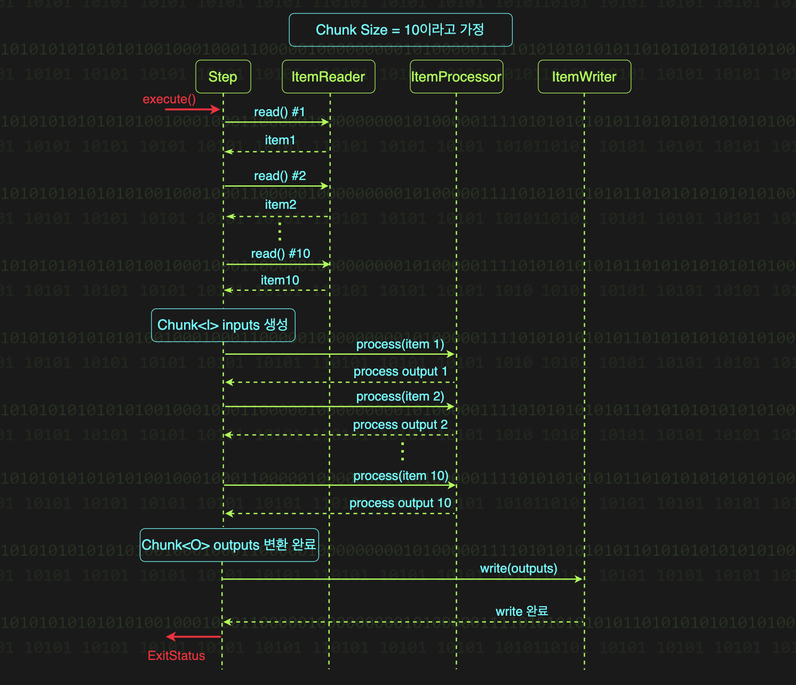

## 청크 지향 처리 반복 흐름도

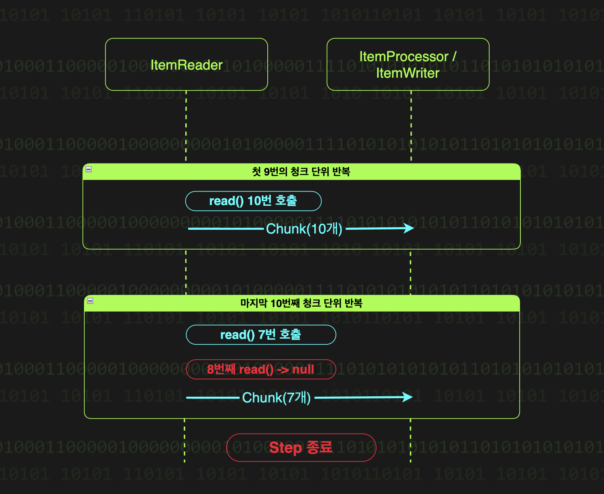


# JobParameters

---

## JobParameters 란

- `JobParameters`는 Spring Batch에서 배치 작업 실행 시 전달되는 매개변수 집합을 나타낸다.
- **배치 작업 실행 시점**에 동적으로 값을 주입하여, 동일한 Job 을 다양한 상황에 맞게 실행할 수 있도록 한다.

## 다양한 JobParameters 전달 방법

### 커맨드라인에서 잡 파라미터 전달하기

JobParameters는 커맨드라인에서 `key=value,type` 형식으로 전달할 수 있다.

단, `type`은 생략 가능하며, 생략 시 기본적으로 `String` 타입으로 간주된다.

> `key=valuye,type,identificationFlag` 형식도 지원되며, `identificationFlag`는 해당 파라미터가 Job 식별에 사용되는지 여부를 나타낸다. 기본값은 `true` 이다.
> 자세한 내용은 추후 다룬다.

```
--spring.batch.job.name={jobName} {key1}={value1},{type1} {key2}={value2},{type2} ...
```

아래는 예시이다.

```shell
./gradlew bootRun --args='--spring.batch.job.name=dataProcessingJob inputFilePath=/data/input/users.csv,java.lang.String'
```

커맨드라인 문자열로 전달된 JobParameters는 Spring Batch의 `DefaultJobParametersConverter` 컴포넌트를 통해 적절한 타입으로 변환된다.

자세한 내용은 [DefaultJobParametersConverter](https://docs.spring.io/spring-batch/docs/current/api/org/springframework/batch/core/converter/DefaultJobParametersConverter.html)와 [DefaultConversionService](https://docs.spring.io/spring-framework/docs/current/javadoc-api/org/springframework/core/convert/support/DefaultConversionService.html) 를 참고하자.

### 기본 파라미터 표기법의 한계

- 파라미터 값에 쉼표 문자가 포함된 경우, 기본 표기법으로는 이를 구분할 수 없다.
- 예를 들어, `filePath=/data/input/file,name.csv,String` 와 같이 쉼표가 포함된 값을 전달하면, Spring Batch는 이를 `filePath` 키에 대한 값으로 올바르게 인식하지 못한다.
- 이 경우, JSON 형식의 JobParameters를 사용할 수 있다.

### JSON 형식으로 JobParameters 전달하기

아래와 같은 형식으로 JSON 문자열을 사용하여 JobParameters를 전달할 수 있다.

```
key1='{ "value":"value1", "type":"java.lang.String", "identifying":true }' key2='{ "value":"value1", "type":"java.lang.String", "identifying":false }''
```

## JobLauncherApplicationRunner

### JobLauncherApplicationRunner 란?

- JobLauncherApplicationRunner 는 Spring Boot 가 제공하는 ApplicationRunner의 한 종류이다.
- 커맨드라인으로 전달된 Spring Batch 잡 파라미터를 해석하고 이를 바탕으로 실제 Job을 실행하는 역할을 수행한다.

### JobLauncherApplicationRunner 가 수행하는 처리 과정

1. Job 목록 준비
    - Spring Boot에 의해 ApplicationContext에 등록된 모든 Job 타입 Bean이 JobLauncherApplicationRunner 에 자동 주입된다.
2. 유효성 검증
    - 만약 애플리케이션 컨텍스트에 Job 타입의 Bean 이 여러개인 경우 : `--spring.batch.job.name` 을 지정하지 않으면 검증 실패
    - 만약 애플리케이션 컨텍스트에 Job 타입의 하나인 경우 : `--spring.batch.job.name` 생략 가능
3. 명령어 해석
    - 커맨드라인으로 전달된 값들을 파싱한다.
    - DefaultJobParametersConverter 을 사용하여, `key=value` 형식의 인자들을 적절한 타입의 JobParameter 로 변환한다.
4. Job 실행
    - 1번에서 주입받은 Job 목록 중, `--spring.batch.job.name` 에 해당하는 Job을 찾는다.
    - 해당 Job을 변환된 JobParameters 와 함께 실행한다.

## Job Parameter 를 가져오는 방법

### `@Value` 사용

```java
@Bean
@StepScope //꼭 함께 사용해야함.
public Tasklet terminatorTasklet1(
    @Value("#{jobParameters['terminatorId']}") String terminatorId,
    @Value("#{jobParameters['targetCount']}") Integer targetCount
) { ... }
```

### Context 에서 가져오기

```java
@Component
public class SystemDestructionTasklet implements Tasklet {
    @Override
    public RepeatStatus execute(StepContribution contribution, ChunkContext chunkContext) throws Exception {
        //스텝 컨텍스트 객체로부터 가져온다.
        JobParameters jobParameters = chunkContext.getStepContext()
            .getStepExecution()
            .getJobParameters();

        String targetSystem = jobParameters.getString("system.target");
        long desctructionLevel = jobParameters.getLong("system.destruction.level");
     
        //...
    }
}
```
## Job Parameter 값 검증

### 직접 Validator 구현하는 방법

#### 1. JobParametersValidator 구현

```java
@Component
public class MyJobParametersValidator implements JobParametersValidator {
    @Override
    public void validate(JobParameters parameters) throws JobParametersInvalidException {
        if (parameters.getLong("system.destruction.level") < 0) {
            throw new JobParametersInvalidException("system.destruction.level must be greater than or equal to 0");
        }
    }
}
```

#### 2. JobParametersValidator 를 Job에 등록

```java
@Bean
public Job processTerminatorJob(JobRepository jobRepository, Step terminationStep, MyJobParametersValidator myJobParametersValidator) {
    return new JobBuilder("processTerminatorJob", jobRepository)
        .validator(systemDestructionValidator) //잡 파라미터 검증기 등록
        .start(terminationStep)
        .build();
}
```

### 기본 Validator 사용

Spring Batch 에서는 `DefaultJobParametersValidator` 이라는 기본 구현체를 제공한다.

단순히 파라미터의 존재 여부만 확인하며 될 때는 이걸 사용하면 된다.

#### 예시 코드

```java
@Bean
public Job systemDestructionJob(
    JobRepository jobRepository, 
    Step systemDestructionStep
) {
    return new JobBuilder("systemDestructionJob", jobRepository)
        .validator(new DefaultJobParametersValidator(
            new String[]{"destructionPower", "other param1"},  // 필수 파라미터
            new String[]{"targetSystem", "other param2"}       // 선택적 파라미터
        ))
        .start(systemDestructionStep)
        .build();
}
```

- `DefaultJobParametersValidator` 생성자의 첫번째 파라미터로 전달한 값이 필수 파라미터가 된다.
- `DefaultJobParametersValidator` 생성자의 두번째 파라미터로 전달한 값이 선택적 파라미터가 된다.

# Job 과 Step 의 Scope

---

일반적인 Spring 애플리케이션은 싱글톤 기본 스코프를 제공한다.

하지만 Spring Batch 는 이와 다르게, **JobScope** 와 **StepScope** 를 제공한다.

## JobScope 와 StepScope 의 라이프사이클

- JobScope 와 StepScope 가 선언된 Bean 은 애플리케이션 구동 시점에서는 우선 프록시 객체로만 존재한다.
- 그 후, Job 이나 Step 이 실행된 후에 프록시 객체에 접근을 시도하면 그때 실제 Bean 이 생성된다.

아래는 전체적인 라이프사이클이다.

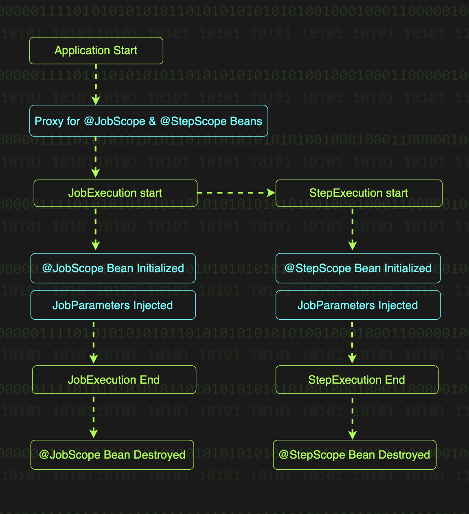

## `@JobScope`

`@JobScope` 는 Job이 실행될 때 실제 빈이 생성되고, Job이 종료될 때 함께 제거되는 스코프이다. 즉, JobExcution 과 생명주기를 같이 한다.

```java
@Bean
@JobScope
public Step systemDestructionStep(
    @Value("#{jobParameters['destructionPower']}") Long destructionPower
) {
    return new StepBuilder("systemDestructionStep", jobRepository)
        .tasklet((contribution, chunkContext) -> {
            log.info("시스템 파괴 프로세스가 시작되었습니다. 파괴력: {}", destructionPower);
            return RepeatStatus.FINISHED;
        }, transactionManager)
        .build();
}
```

위 코드에 선언된 `@JobScope` 로 발생하는 효과는 아래와 같다.

- **지연된 빈 생성 (Lazy Bean Creation)**
  - `@JobScope` 가 적용된 빈은 애플리케이션 구동 시점에서 프록시 객체만 생성된다.
  - 빈의 실제 인스턴스는 Job이 실행될 때 생성되고, Job이 종료되면 소멸한다.
- **Job 파라미터와의 연동**
  - 빈이 지연 생성되니, **애플리케이션 실행 중에 전달되는 JobParameters를 Job 실행 시점에 생성되는 `systemDestructionStep` 빈에 넣어줄 수 있게 된다.**
- **병렬처리 지원**
  - 여러 쓰레드가 "동일한 Job 정의"를 실행하더라도, 각각의 JobExecution 마다 서로 다른 `systemDestructionStep` 빈이 생성된다. 따라서 동시성 문제에 대해 안전해진다.

아래 예시로 좀더 쉽게 이해될 것이다.

### RestAPI로 요청을 받아서, 동적으로 Batch 를 실행하는 예시

1. SpringMVC 와 SpringBatch 로 구현된 하나의 애플리케이션이 존재.
2. 애플리케이션 실행
3. `@JobScope` 가 적용된 Bean 은 즉시 초기화되는 것이 아니라, 프록시 상태로 존재하게 됨.
   - 이 시점에서는 아직 JobParameter 를 전달받지 못했다. (RestAPI로 요청이 들어와야 알 수 있으므로)
   - 따라서 `@Value` 로 전달받을 JobParameter 값을 아직 모르고, 그렇기 때문에 프록시 객체로 생성되어야 한다.
4. 동시에 여러 요청 A, B가 들어왔고, 각각 다른 JobParameter 를 전달한다.
   - 이 요청에 따라, 각 쓰레드는 서로 동일한 "Job 정의" 를 실행하여 각각의 JobExecution 이 동작한다.
   - `@JobScope` 가 적용된 Bean 은 JobExecution 마다 생성/초기화되기 때문에 동시성 문제에서 자유롭다.

## `@StepScope`

`@StepScope` 는 `@JobScope` 와 동일한 방식으로 동작하지만, 적용 범위에 있어 차이가 있다.

- `@JobScope` : Job 의 실행범위에서 빈을 관리한다.
- `@StepScope` : Step 의 실행범위에서 빈을 관리한다.

### 예시 코드

```java
@Bean
public Step infiltrationStep(
    JobRepository jobRepository,
    PlatformTransactionManager transactionManager,
    Tasklet systemInfiltrationTasklet
) {
    return new StepBuilder("infiltrationStep", jobRepository)
        .tasklet(systemInfiltrationTasklet, transactionManager)
        .build();
}

@Bean 
@StepScope 
public Tasklet systemInfiltrationTasklet(
    @Value("#{jobParameters['infiltrationTargets']}") String infiltrationTargets
) {
    return (contribution, chunkContext) -> {
        String[] targets = infiltrationTargets.split(",");
        log.info("시스템 침투 시작");
        log.info("주 타겟: {}", targets[0]);
        log.info("보조 타겟: {}", targets[1]);
        log.info("침투 완료");
        return RepeatStatus.FINISHED;
    };
}
```

- `systemInfiltrationTasklet` 에 `@StepScope` 가 적용되어 있다. 이 Tasklet 빈이 Step 의 생명주기와 함께한다는 것을 알 수 있다.
- 즉, 각각의 Step 마다 새로운 `systemInfiltrationTasklet` 이 생성되고, Step 이 종료될 때 함께 제거된다.
- 만약 동시에 여러 Step이 실행되면서 `systemInfiltrationTasklet` 을 사용한다고 해도, `@StepScope` 가 있기 때문에 각 Step 실행마다 독립적인 Tasklet 인스턴스가 생성된다. 따라서 어떠한 동시성 이슈도 발생하지 않는다.

## JobScope 와 StepScope 사용시 주의사항

### 1. 프록시 대상의 타입이 클래스인 경우, 반드시 상속 가능한 클래스여야 한다.

- `@JobScope` 와 `@StepScope` 모두 프록시 객체를 만들기 위해서, CGLIB 를 사용해 클래스 기반의 프록시를 생성한다.
- 따라서 프록시 생성을 위해 반드시 상속 가능한 클래스여야 한다.

### 2. Step 빈에는 `@StepScope` 와 `@JobScope` 를 사용하면 안된다.

#### 2-1. Step 빈에 `@StepScope` 를 설정하는 경우

```java
@Bean
@StepScope
public Step systemDestructionStep(
    SystemInfiltrationTasklet tasklet
) {
    return new StepBuilder("systemDestructionStep", jobRepository)
        .tasklet(tasklet, transactionManager)
        .build();
}
```

- 위 코드를 보면 "Step 정의 빈"에 `@StepScope` 를 적용했다. 이 경우, 오류가 발생하게 된다.
- 이유는 당연하다. 아직 Step 이 없는데, StepScope 를 찾으니 그렇다.

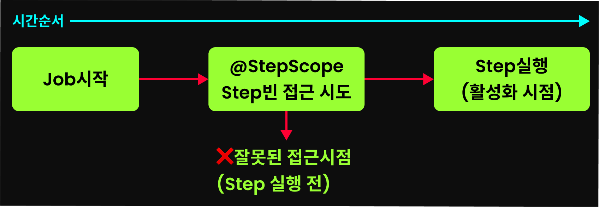

#### 2-2. Step 빈에 `@JobScope` 를 설정하는 경우

```java
@Bean
@JobScope  // Step에 @JobScope를 달았다
public Step systemDestructionStep(
   @Value("#{jobParameters['targetSystem']}") String targetSystem
) {
   return new StepBuilder("systemDestructionStep", jobRepository)
       .tasklet((contribution, chunkContext) -> {
           log.info("{} 시스템 침투 시작", targetSystem);
           return RepeatStatus.FINISHED;
       }, transactionManager)
       .build();
}
```

- 이번에는 "Step 정의 빈"에 `@JobScope` 를 적용했다. 이 경우, 실행시 오류가 발생하지는 않는다. (Job 실행 후, JobScope 를 찾았으므로)
- 하지만 이 경우, 아래 상황에서 문제가 발생할 수 있다. (자세한 것은 추후 설명한다.)
  - JobOperator를 통한 Step 실행 제어 시
  - Spring Integration(Remote Partitioning)을 활용한 배치 확장 기능 사용 시
- 따라서 위 코드를 아래와 같이 Tasklet 을 사용하도록 수정해야 한다.

```java
@Bean
public Step systemDestructionStep(
    SystemInfiltrationTasklet tasklet  // Tasklet을 주입받는다
) {
    return new StepBuilder("systemDestructionStep", jobRepository)
        .tasklet(tasklet, transactionManager)
        .build();
}

@Slf4j
@Component
@StepScope  // Tasklet에 @StepScope를 달았다
public class SystemInfiltrationTasklet implements Tasklet {
    private final String targetSystem;

    public SystemInfiltrationTasklet(
        @Value("#{jobParameters['targetSystem']}") String targetSystem
    ) {
        this.targetSystem = targetSystem;
    }

    @Override
    public RepeatStatus execute(StepContribution contribution, ChunkContext context) {
        log.info("{} 시스템 침투 시작", targetSystem);
        return RepeatStatus.FINISHED;
    }
}
```

## 컴파일 시점에 없는 Job Parameter 값을 참조하는 방법

JobBuilder 빈에서 StepBuilder 빈을 참조할 때, 아래와 같이 처리할 수 있다.

```java
// 1. 빈 주입 방식
@Bean
public Job systemTerminationJob(Step systemDestructionStep) {  // Spring이 주입
    return new JobBuilder("systemTerminationJob", jobRepository)
            .start(systemDestructionStep)
            .build();
}

// 2. 메서드 직접 호출 방식
@Bean
public Job systemTerminationJob() {
    return new JobBuilder("systemTerminationJob", jobRepository)
            .start(systemDestructionStep(null))  // Job 파라미터 자리에 null 전달
            .build();
}
```

null을 전달하여 당장의 코드 레벨에서의 참조를 만족시키면, 실제 값은 Job이 실행될 때 입력받은 JobParameters의 값으로 주입된다.

## JobScope 와 StepScope 빈에서 ExecutionContext 의 데이터에 접근하는 방법

### ExecutionContext 란?

- 비즈니스 로직 처리 중에 발생하는 커스텀 데이터를 관리할 방법이 필요한데, 이때 사용하는 것이 바로 ExecutionContext라는 데이터 컨테이너다.
- ExecutionContext를 활용하면 커스텀 컬렉션의 마지막 처리 인덱스나 집계 중간 결과물 같은 데이터를 저장할 수 있다.
- 이는 Job이 중단된 후 재시작할 때 특히 유용하다. Spring Batch가 재시작 시 ExecutionContext의 데이터를 자동으로 복원하므로, 중단된 지점부터 처리를 이어갈 수 있기 때문이다.
- ExecutionContext도 메타데이터 저장소에서 관리하여, 안전하게 보존된다.

### ExecutionContext 에서 데이터 꺼내기

```java
@Bean
@JobScope  
public Tasklet systemDestructionTasklet(
  @Value("#{jobExecutionContext['previousSystemState']}") String prevState
) {
  // JobExecution의 ExecutionContext에서 이전 시스템 상태를 주입받는다
}

@Bean
@StepScope
public Tasklet infiltrationTasklet(
  @Value("#{stepExecutionContext['targetSystemStatus']}") String targetStatus
) {
  // StepExecution의 ExecutionContext에서 타겟 시스템 상태를 주입받는다
}

@Bean
@StepScope
public Tasklet infiltrationTasklet(
        @Value("#{jobExecutionContext['previousSystemState']}") String prevState
) {
    // StepScope 에서도 JobExecution의 ExecutionContext에 접근할 수 있다.
}
```

위 코드의 `jobExecutionContext`와 `stepExecutionContext` 는 각각 다른 범위를 가진다.

- `@JobScope` 에서 가져온 ExecutionContext : Job에 속한 모든 컴포넌트(Step, Tasklet 등등...)에서 `@Value("#{jobExecutionContext['key']}")` 로 접근할 수 있다.
- `@StepScope` 에서 가져온 ExecutionContext : 해당 Step에 속한 컴포넌트에서만 접근할 수 있다.
- Step ExecutionContext 의 데이터 접근 제한 : Step 간의 데이터 독립성을 보장하기 위해, 아래와 같은 제약사항이 있다.
  - Step의 ExecutionContext에 저장된 데이터는 `@Value("#{jobExecutionContext['key']}")` 로 접근할 수 없다. 즉, Step 수준의 데이터를 Job 수준에서 가져올 수 없다.
  - 한 Step의 ExecutionContext는 다른 Step에서 접근할 수 없다. 예를 들어, StepA의 ExecutionContext에 저장된 데이터를 StepB에서 `@Value("#{stepExecutionContext['key']}")` 로 가져올 수 없다.

# Spring Batch Listener

---

## Spring Batch Listener 란?

리스너는 배치 처리의 주요 순간들을 관찰하고, 각 시점에 필요한 동작을 정의할 수 있는 강력한 도구이다.

즉, 배치 처리 중 발생하는 특정 이벤트를 감지하고 원하는 로직을 실행할 수 있게 해준다.

이를 통해, 로깅, 모니터링, 알림 전송, 리소스 정리 등 다양한 부가 기능을 손쉽게 구현할 수 있다.

## Spring Batch가 제공하는 주요 Listener 인터페이스

### JobExecutionListener

```java
public interface JobExecutionListener {
    default void beforeJob(JobExecution jobExecution) { }
    default void afterJob(JobExecution jobExecution) { }
}
```

- Job의 시작과 종료 시점에 호출되는 리스너 인터페이스이다.
- `beforeJob()` 메서드는 Job이 시작되기 전에 호출되며, 초기화 작업이나 로깅 등에 활용할 수 있다.
- `afterJob()` 메서드는 Job이 종료된 후에 호출되며, 결과 처리나 정리 작업 등에 활용할 수 있다.
  - 특히, Job의 성공/실패 여부와 관계없이 무조건 호출된다.

### StepExecutionListener

```java
public interface StepExecutionListener extends StepListener {
    default void beforeStep(StepExecution stepExecution) {
    }

    @Nullable
    default ExitStatus afterStep(StepExecution stepExecution) {
	return null;
    }
}
```

- Step의 시작과 종료 시점에 호출되는 리스너 인터페이스이다.
- `beforeStep()` 메서드는 Step이 시작되기 전에 호출되며, Step 초기화 작업이나 로깅 등에 활용할 수 있다.
- `afterStep()` 메서드는 Step이 종료된 후에 호출되며, 결과 처리나 정리 작업 등에 활용할 수 있다.
  - Step의 성공/실패 여부와 관계없이 무조건 호출된다.

### ChunkListener

```java
public interface ChunkListener extends StepListener {
    default void beforeChunk(ChunkContext context) {
    }

    default void afterChunk(ChunkContext context) {
    }
	
    default void afterChunkError(ChunkContext context) {
    }
}
```

- 청크 단위 처리의 시작과 종료 시점에 호출되는 리스너 인터페이스이다.
- `beforeChunk()` 메서드는 청크 처리가 시작되기 전에 호출되며, 초기화 작업이나 로깅 등에 활용할 수 있다.
- `afterChunk()` 메서드는 트랜잭션이 커밋된 후에 호출된다.
- `afterChunkError()` 메서드는 청크 트랜잭션이 롤백된 이후에 호출된다.

> ChunkListener 는 청크 지향 Step 뿐만 아니라, Tasklet 지향 Step 에서도 사용할 수 있다.
> Tasklet 의 `execute()` 메서드 호출 전후, 그리고 예외 발생 시점에 각각 호출된다.
> 또한 RepeatStatus.CONTINUABLE 을 반환하여 반복 실행되는 Tasklet 에서도 매 반복마다 호출된다. (StepExecutionListener 는 Step 의 시작/종료 시점에만 호출되므로, 반복되는 Tasklet 이라도 한번만 호출된다.)

### ItemReadListener, ItemProcessListener, ItemWriteListener

```java
// ItemReadListener.java
public interface ItemReadListener<T> extends StepListener {
    default void beforeRead() { }
    default void afterRead(T item) { }
    default void onReadError(Exception ex) { }
}

// ItemProcessListener.java
public interface ItemProcessListener<T, S> extends StepListener {
    default void beforeProcess(T item) { }
    default void afterProcess(T item, @Nullable S result) { }
    default void onProcessError(T item, Exception e) { }
}

// ItemWriteListener.java
public interface ItemWriteListener<S> extends StepListener {
    default void beforeWrite(Chunk<? extends S> items) { }
    default void afterWrite(Chunk<? extends S> items) { }
    default void onWriteError(Exception exception, Chunk<? extends S> items) { }
}
```

- 청크 지향 처리 Step에서 각각 읽기, 처리, 쓰기 작업의 시작과 종료 시점에 호출되는 리스너 인터페이스들이다.
- 각 메서드들은 아이템 단위의 처리 전후와 에러 발생 시점에 호출된다.
- 주요 포인트
  - `ItemReadListener.afterRead()` : `ItemReader.read()` 호출 후에 호출되지만, 더이상 읽을 데이터가 없어 `null`을 반환하는 경우에는 호출되지 않는다.
  - `ItemProcessListener.afterProcess()` : `ItemProcessor.process()` 메서드가 `null`을 반환하는 경우에도 호출된다. (즉, 해당 아이템이 필터링된 경우에도 호출된다.)
  - `ItemWriteListener.afterWrite()` : 트랜잭션이 커밋되기 전, 그리고 `ChunkListener.afterChunk()` 보다 먼저 호출된다.

### 각 리스너들의 호출 시점

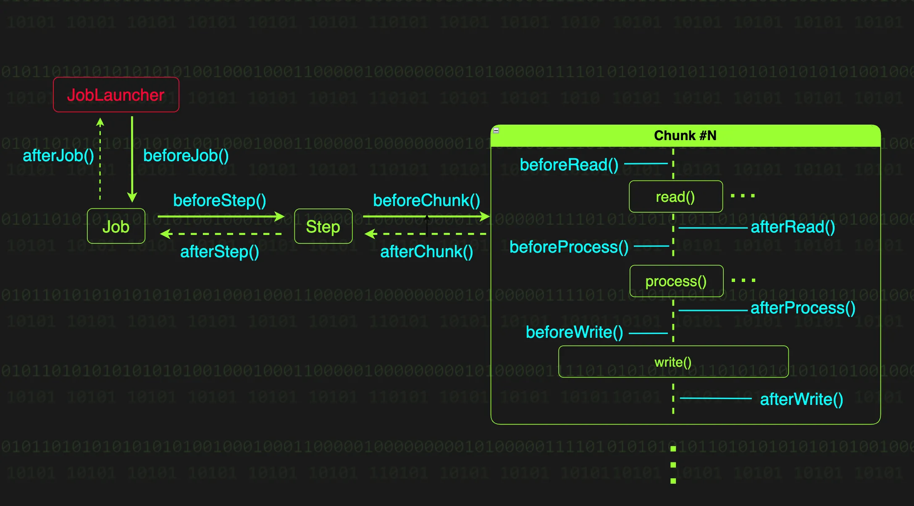

### 리스너 활용 예시

- 단계별 모니터링 및 추적 : 처리 단계별 로깅 등
- 실행 결과에 따른 후속 처리
- 데이터 가공 및 전달 : 실제 처리 로직 전후에 데이터를 추가로 정제하거나 변환할 수 있다. Step간 데이터 전달이나 다음 처리에 필요한 정보를 미리 준비할 수 있다.
- 부가 기능 분리

## 배치 리스너 구현 방법

### 구현 방법 1) 전용 리스너 인터페이스를 직접 구현하는 방식

- [src/main/java/com/system/batch/lesson/listener/BigBrotherJobExecutionListener.java](src/main/java/com/system/batch/lesson/listener/BigBrotherJobExecutionListener.java)
- [src/main/java/com/system/batch/lesson/listener/BigBrotherStepExecutionListener.java](src/main/java/com/system/batch/lesson/listener/BigBrotherStepExecutionListener.java)
- 리스너 등록
  - ```java
    @Bean
    public Job systemMonitoringJob(JobRepository jobRepository, Step monitoringStep) {
        return new JobBuilder("systemMonitoringJob", jobRepository)
            .listener(new BigBrotherJobExecutionListener())
            .start(monitoringStep)
            .build();
    }
    ```

### 구현 방법 2) 리스너 특화 애너테이션을 사용하는 방식

- [src/main/java/com/system/batch/lesson/listener/ServerRackControlListener.java](src/main/java/com/system/batch/lesson/listener/ServerRackControlListener.java)
- [src/main/java/com/system/batch/lesson/listener/ServerRoomInfiltrationListener.java](src/main/java/com/system/batch/lesson/listener/ServerRoomInfiltrationListener.java)
- 리스너 등록
  - ```java
    @Bean
    public Step serverRackControlStep(Tasklet destructiveTasklet) {
        return new StepBuilder("serverRackControlStep", jobRepository)
            .tasklet(destructiveTasklet(), transactionManager)
            .listener(new ServerRackControlListener()) // 빌더의 listener() 메서드에 전달
            .build();
    }
    ```
- 제공 애너테이션 종류
  - ```
    @AfterChunk, @AfterChunkError, @AfterJob, @AfterProcess, @AfterRead, @AfterStep, @AfterWrite, @BeforeChunk, @BeforeJob, @BeforeProcess, @BeforeRead, @BeforeStep, @BeforeWrite, @OnProcessError, @OnReadError, @OnSkipInProcess, @OnSkipInRead, @OnSkipInWrite
    ```
    
## JobExecutionListener 와 ExecutionContext 를 활용한 동적 데이터 전달

잡 파라미터만으로는 전달할 수 없는 동적인 데이터가 필요한 경우, `JobExecutionListener` 의 `beforeJob()` 메서드를 활용하면 추가적인 동적 데이터를 각 Step에 전달할 수 있다.

### 예시 코드

- [JobExecutionListener 구현체](src/main/java/com/system/batch/lesson/listener/InfiltrationPlanListener.java)
- [Job 설정 코드](src/main/java/com/system/batch/lesson/listener/AdvancedSystemInfiltrationConfig.java)

## JobParameter 가 아닌 ExecutionContext 를 사용하는 이유

- 배치 작업의 재현 가능성과 일관성을 보장하기 위해, **JobParameter 는 불변성**을 갖기 때문이다.
  - 재현 가능성: 동일한 JobParameters로 실행한 Job은 항상 동일한 결과를 생성해야 한다. 실행 중간에 JobParameters가 변경되면 이를 보장할 수 없다.
  - 추적 가능성: 배치 작업의 실행 기록(JobInstance, JobExecution)과 JobParameters는 메타데이터 저장소에 저장된다. JobParameters가 변경 가능하다면 기록과 실제 작업의 불일치가 발생할 수 있다.
- **따라서, 실행 시점에 동적으로 결정되는 데이터는 JobParameters가 아닌 ExecutionContext에 저장하여 전달하는 것이 바람직하다.**

### ExecutionContext 사용시 주의사항

#### 잘못된 코드

```java
@Override
public void beforeJob(JobExecution jobExecution) {
    jobExecution.getExecutionContext()
        .put("targetDate", LocalDate.now()); // 치명적인 실수
}
```

- 위 코드는 `LocalDate.now()` 를 ExecutionContext 에 저장하고 있다.
- 문제점
  - `LocalDate.now()` 는 실행 시점에 따라 값이 달라진다.
  - 따라서, Job 이 재시작될 때마다 ExecutionContext 에 저장된 값이 달라질 수 있다.
  - 이는 배치 작업의 재현 가능성과 일관성을 해친다. 어제 데이터를 다시 처리하고 싶으면? 불가능하다. 프로그램을 수정하지 않으면 그날의 데이터를 다시 처리할 수 없다.

### 올바른 코드

```shell
# 외부에서 파라미터로 받는다.
./gradlew bootRun --args='--spring.batch.job.name=systemInfiltrationJob -date=2024-10-13'
```

- 외부에서 날짜 값을 전달받으면, 배치 작업의 유연성을 극대화할 수 있다.
- JobParameters를 사용할 수 있다면 그 방법을 사용하라. 외부에서 값을 받는 것이 훨씬 더 안전하고 유연하다.
- JobExecutionListener와 ExecutionContext는 외부에서 값을 받을 수 없는 경우에만 사용하자.

## 보다 간결하게 ExecutionContext 가져오기

Step 에서 스텝간 공유할 수 있는 ExecutionContext 를 가져올때, Step의 ExecutionContext 을 먼저 가져오고, 다시 거기서 Job 수준의 ExecutionContext 를 가져오는 번거로운 과정을 거쳐야 한다.

즉, `chunkContext.getStepContext().getStepExecution().getJobExecution().getExecutionContext()` 와 같이 긴 코드를 작성하는 것은 번거롭다.

ExecutionContextPromotionListener 를 사용해서, 보다 간결하게 스텝간 데이터 공유를 할 수 있다.

### ExecutionContextPromotionListener 란?

- Step 수준 ExecutionContext 의 데이터를 Job 수준 ExecutionContext 로 **승격(Promote)** 시켜주는 리스너이다.
  - Spring Batch에서는 Step 수준의 ExecutionContext 데이터를 Job 수준의 ExecutionContext로 옮기는 과정을 승격(Promote)이라 부른다.
- `ExecutionContextPromotionListener` 의 `setKeys()` 메서드를 사용하여, 승격시킬 키 목록을 지정할 수 있다.
- [사용 예시코드](src/main/java/com/system/batch/lesson/listener/SystemTerminationConfig.java)


### ExecutionContextPromotionListener 사용시 주의사항

각 Step은 가능한 한 독립적으로 설계하여 재사용성과 유지보수성을 높이는 것이 좋다.

불가피한 경우가 아니라면 Step 간 데이터 의존성은 최소화하는 것이 좋다.

Step 간 데이터 공유가 늘어날수록 복잡도가 증가한다.

## Listener 와 `@JobScope`, `@StepScope` 통합

리스너 구현체에 `@JobScope` 또는 `@StepScope` 애너테이션을 적용할 수 있다.

이를 통해 "실행 시점에 결정되는 값(잡 파라미터)"들을 리스너 내에서도 활용할 수 있다.

- [예시 코드](src/main/java/com/system/batch/lesson/listener/SystemDestructionConfig.java)

## 리스너를 효과적으로 다루는 방법

### 적절한 리스너 사용

작업 범위와 목적에 따라 적절한 리스너를 선택해야한다.

- JobExecutionListener: 전체 작업의 시작과 종료
- StepExecutionListener: 각 작업 단계의 실행
- ChunkListener: 작업을 청크단위로 실행할 때, 반복의 시작과 종료 시점을 통제
- Item[Read|Process|Write]Listener: 개별 아이템 식별 통제

### 예외 처리는 신중하게

`JobExecutionListener`의 `beforeJob()`과 `StepExecutionListener`의 `beforeStep()`에서 예외가 발생하면 Job과 Step이 실패한 것으로 판단된다.

하지만 모든 예외가 Step을 중단시켜야 할 만큼 치명적인 것은 아니다. 이런 경우는 직접 예외를 잡아서 무시하고 진행하는 것이 현명하다.

> `JobExecutionListener.afterJob()`과 `StepExecutionListener.afterStep()`에서 발생한 예외는 무시된다. 즉, 예외가 발생해도 Job과 Step의 실행 결과에 영향을 미치진 않는다.

```java
@Override
public void beforeStep(StepExecution stepExecution) {
    try {
        // 치명적인 로직 수행
        systemMetricCollector.collect();
    } catch (Exception e) {
        // 심각하지 않은 예외는 로그만 남기고 진행
        log.warn("메트릭 수집 실패. 작전은 계속 진행: {}", e.getMessage());
        // 정말 심각한 문제면 예외를 던져서 Step을 중단시킨다
        // throw new RuntimeException("치명적 오류 발생", e);
    }
}
```

### 단일 책임 원칙 준수

리스너는 감시와 통제만 담당한다. 비즈니스 로직은 분리하는 것이 좋다. 리스너가 너무 많은 일을 하면 유지보수가 어려워지고 시스템 동작을 파악하기 힘들어진다.

#### 성능 최적화) 실행 빈도 고려

- `JobExecutionListener` / `StepExecutionListener`
  - Job, Step 실행당 한 번씩만 실행되므로 비교적 안전하다
  - 무거운 로직이 들어가도 전체 성능에 큰 영향 없음
- `ItemReadListener` / `ItemProcessListener`
  - 매 아이템마다 실행되므로 치명적일 수 있다

```java
// 이런 코드는 시스템을 마비시킬 수 있다
@Override
public void afterRead(Object item) {
    heavyOperation();  // 매 아이템마다 실행되면 시스템이 마비된다
    remoteApiCall();   // 외부 API 호출은 더더욱 위험
}
```

### 성능 최적화) 리소스 사용 최소화

- 데이터베이스 연결, 파일 I/O, 외부 API 호출은 최소화
- 리스너 내 로직은 가능한 한 가볍게 유지하라
- 특히 Item 단위 리스너에서는 더욱 중요하다


// FlatFileItemReader

#### 고정 길이 형식의 파일 읽기

```
ERR001  2024-01-19 10:15:23  CRITICAL  1234  SYSTEM  CRASH DETECT \n
ERR002  2024-01-19 10:15:25  FATAL     1235  MEMORY  OVERFLOW FAIL\n
```

위와 같이 단순히 고정 길이 형식의 파일을 읽어야 하는 경우, `FlatFileItemReader.fixedLength()` 를 사용할 수 있다.

[예시코드](src/main/java/com/system/batch/lesson/flatfileitemreader/FixedLengthSystemFailureJobConfig.java)

#### 정규식으로 파일 읽기

```
[WARNING][Thread-156][CPU: 78%] Thread pool saturation detected - 45/50 threads in use...
[ERROR][Thread-157][CPU: 92%] Thread deadlock detected between Thread-157 and Thread-159
[FATAL][Thread-159][CPU: 95%] Thread dump initiated - system unresponsive for 30s
```

위와 같이 정규식 패턴으로 파일을 읽어야 하는 경우, `RegexLineTokenizer` 를 사용할 수 있다.

[예시코드](src/main/java/com/system/batch/lesson/flatfileitemreader/RegexSystemLogJobConfig.java)


# 파일 기반 배치 처리

---

## FlatFileItemReader 와 FlatFileItemWriter

파일 기반 배치 처리의 기본적인 Reader/Writer 는 FlatFileItemReader 와 FlatFileItemWriter 이다.

### FlatFile 이란?

먼저 FlatFile 이란 아래와 같다.

- CSV 파일처럼 단순하게 행열로 구성된 파일이다.
- 각 라인이 하나의 데이터이다.
- 다양한 구분자를 지원한다. (`,` , `\t` 등)
- 강력한 호환성과 범용성

### FlatFileItemReader

FlatFileItemReader 는 플랫 파일로부터 데이터를 읽어오는 기본적인 Reader 이다.

#### `FlatFileItemReader.doRead()`

- 파일에서 한 줄을 읽어온다.
- 읽어온 한 줄의 문자열을 우리가 사용할 객체로 변환해 리턴한다. 

아래는 `doRead()` 함수의 예시 코드이다.

```java
...
String line = readLine(); // 한 줄의 데이터를 읽어온다.
...
// 문자열을 도메인 객체로 변환해 리턴한다. 
return lineMapper.mapLine(line, lineCount); 
```

`doRead()` 는 읽어들인 문자열을 `lineMapper.mapLine()` 로 도메인 객체로 변환하게 된다.

SpringBatch 는 LineMapper 인터페이스의 기본적인 구현체 `DefaultLineMapper` 를 제공한다.

#### 문자열을 쪼개서 도메인 객체로 매핑하기: `DefaultLineMapper`

`DefaultLineMapper` 의 동작은 크게 두 단계로 나뉜다.

1. 문자열 라인 토큰화
    - e.g) `a,b,c,d` 처럼 구성된 문자열을 쉼표를 기준으로 나눠, `a` , `b` , `c` , `d` 로 토큰화한다.
2. 분리된 각 토큰들을 도메인 객체의 프로퍼티에 매핑한다.

`DefaultLineMapper.mapLine()` 은 아래와 같이 구현되어 있다.

```java
// DefaultLineMapper.java
@Override
public T mapLine(String line, int lineNumber) throws Exception {
    FieldSet fieldSet = tokenizer.tokenize(line);  // 1단계: 문자열을 토큰화해 FieldSet 반환
    return fieldSetMapper.mapFieldSet(fieldSet);  // 2단계: FieldSet을 객체로 매핑	 
}
```

- `tokenizer.tokenize(line)`
  - LineTokenizer 구현체의 메서드 `tokenize()` 를 사용하여 문자열을 토큰화한다.
  - LineTokenizer 는 대표적인 구현체로, `DelimitedLineTokenizer` 와 `FixedLengthTokenizer` 가 있다.
  - `DelimitedLineTokenizer` : 쉼표 문자와 같은 구분자로 구분된 데이터를 토큰화한다.
    - e.g) `ERR001,2024-01-19,CRITICAL` -> `["ERR001", "2024-01-19", "CRITICAL"]`
  - `FixedLengthTokenizer` : 고정 길이로 구분된 데이터를 토큰화한다.
    - e.g) `ERR00120240119CRITICAL` -> `["ERR001", "20240119", "CRITICAL"]` (각각 6자리, 8자리, 8자리)
- `fieldSetMapper.mapFieldSet(fieldSet)`
  - 해당 메서드를 통해서, 토큰화된 필드들을 객체에 매핑한다.
  - 별도의 설정이 없다면, `BeanWrapperFieldSetMapper` 가 기본 FieldSetMapper 로 사용된다.
  - `BeanWrapperFieldSetMapper` 는 자바 빈 규약을 따르는 객체에 데이터를 매핑한다. `setter` 메서드를 호출해서 데이터를 설정하게 된다.
  - 매핑 예시
    - ```java
      /* FieldSet 데이터
       * FieldSet {
       * tokens: ["ERR001", "2024-01-19 10:15:23", "CRITICAL", "1234", "SYSTEM_CRASH"]
       * names: ["errorId", "errorDateTime", "severity", "processId", "errorMessage"]
       * }
       */
    
      // 매핑될 객체
      @Data     // setter 메서드 반드시 필요
      public static class SystemFailure {
      private String errorId;        // "ERR001" 매핑
      private String errorDateTime;  // "2024-01-19 10:15:23" 매핑
      private String severity;       // "CRITICAL" 매핑
      private Integer processId;     // "1234" -> 1234로 타입 변환 후 매핑
      private String errorMessage;   // "SYSTEM_CRASH" 매핑
      }
      ```

#### FlatFileItemReader 원리 정리

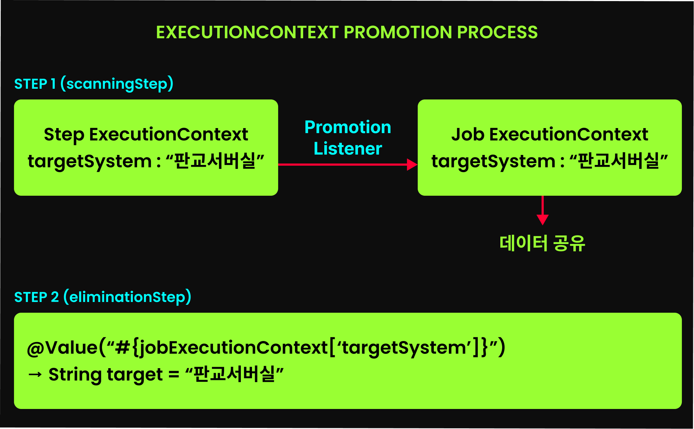

#### 예시코드 1) 구분자로 토큰화해서 읽기

[SystemFailureJobConfig](src/main/java/com/system/batch/lesson/flatfileitemreader/SystemFailureJobConfig.java)

하기는 예시 파일

```
에러ID,발생시각,심각도,프로세스ID,에러메시지
ERR001,2024-01-19 10:15:23,CRITICAL,1234,SYSTEM_CRASH
ERR002,2024-01-19 10:15:25,FATAL,1235,MEMORY_OVERFLOW
```

#### 예시코드 2) 고정 길이로 토큰화해서 읽기

[FixedLengthSystemFailureJobConfig](src/main/java/com/system/batch/lesson/flatfileitemreader/FixedLengthSystemFailureJobConfig.java)

하기는 예시 파일

```
ERR001  2024-01-19 10:15:23  CRITICAL  1234  SYSTEM  CRASH DETECT \n
ERR002  2024-01-19 10:15:25  FATAL     1235  MEMORY  OVERFLOW FAIL\n
```

> 공백문자는 단순히 자리 맞추기 용도로 사용됨.

#### 예시코드 3) 정규식으로 토큰화해서 읽기

[RegexSystemLogJobConfig](src/main/java/com/system/batch/lesson/flatfileitemreader/RegexSystemLogJobConfig.java)

하기는 예시 파일

```
[WARNING][Thread-156][CPU: 78%] Thread pool saturation detected - 45/50 threads in use...
[ERROR][Thread-157][CPU: 92%] Thread deadlock detected between Thread-157 and Thread-159
[FATAL][Thread-159][CPU: 95%] Thread dump initiated - system unresponsive for 30s
```

#### 예시코드 4) 조건에 따라 다른 Tokenizer 와 FieldSetMapper 사용하기

[PatternMatchingSystemFailureJobConfig](src/main/java/com/system/batch/lesson/flatfileitemreader/PatternMatchingSystemFailureJobConfig.java)

하기는 예시 파일

```
ERROR,mysql-prod,OOM,2024-01-24T09:30:00,heap space killing spree,85%,/var/log/mysql
ABORT,spring-batch,MemoryLeak,2024-01-24T10:15:30,forced termination,-1,/usr/apps/batch,TERMINATED
COLLECT,heap-dump,PID-9012,2024-01-24T11:00:15,/tmp/heapdump
ERROR,redis-cache,SocketTimeout,2024-01-24T13:45:00,connection timeout,92%,/var/log/redis
ABORT,zombie-process,Deadlock,2024-01-24T13:46:20,kill -9 executed,-1,/proc/dead,TERMINATED
```

> 각 라인은 서로 다른 구조와 형식을 가지고 있다.
> - ERROR: 장애 발생 이벤트 (시스템의 비정상 징후)
>   - 형식: 타입,애플리케이션,장애유형,발생시각,메시지,리소스사용률,로그경로
> - ABORT: 프로세스 중단 이벤트 (비정상 프로세스 제거)
>   - 형식: 타입,애플리케이션,장애유형,중단시각,중단사유,종료코드,프로세스경로,상태
> - COLLECT: 사후 분석 이벤트 (시스템 부검)
>   - 형식: 타입,덤프종류,프로세스ID,수집시각,저장경로

#### 예시코드 5) 여러 파일을 읽어서 배치 실행하기

- MultiResourceItemReader 를 사용해서, 파일 A, 파일 B, ...를 순차적으로 읽어가며 chunk 처리할 수 있다.

[MultiResourceSystemFailureJobConfig](src/main/java/com/system/batch/lesson/flatfileitemreader/MultiResourceSystemFailureJobConfig.java)

#### 번외) Record 클래스 객체로 FieldSetMapper 적용하기

```java
@Bean
@StepScope
public FlatFileItemReader<SystemDeath> systemDeathReader(
        @Value("#{jobParameters['inputFile']}") String inputFile) {
    return new FlatFileItemReaderBuilder<SystemDeath>()
            .name("systemKillReader")
            .resource(new FileSystemResource(inputFile))
            .delimited()
            .names("command", "cpu", "status")
            .targetType(SystemDeath.class) //Record 클래스를 넘기면 끝.
            .linesToSkip(1)
            .build();
}

public record SystemDeath(String command, int cpu, String status) {}
```

- `targetType()` 메서드의 매개변수로 Record 클래스가 넘어오면, Spring Batch 는 내부적으로 BeanWrapperFieldSetMapper 대신 **RecordFieldSetMapper**를 사용
- RecordFieldSetMapper 은 setter 를 사용하는 것이 아니라, record 의 생성자를 사용해서 매핑한다.

# FlatFileItemWriter

---

## FlatFileItemWriter 란?

- FlatFileItemWriter 는 도메인 객체를 플랫 파일 형식으로 출력하는 Writer 이다.
- 총 두개의 과정, `필드 추출` 과 `문자열 결합`으로 구성된다.
  - `필드 추출` : `FieldExtractor` 인터페이스를 사용하여, 도메인 객체에서 출력할 필드들을 추출한다.
  - `문자열 결합` : `LineAggregator` 인터페이스를 사용하여, 추출된 필드들을 하나의 문자열 라인으로 결합한다.

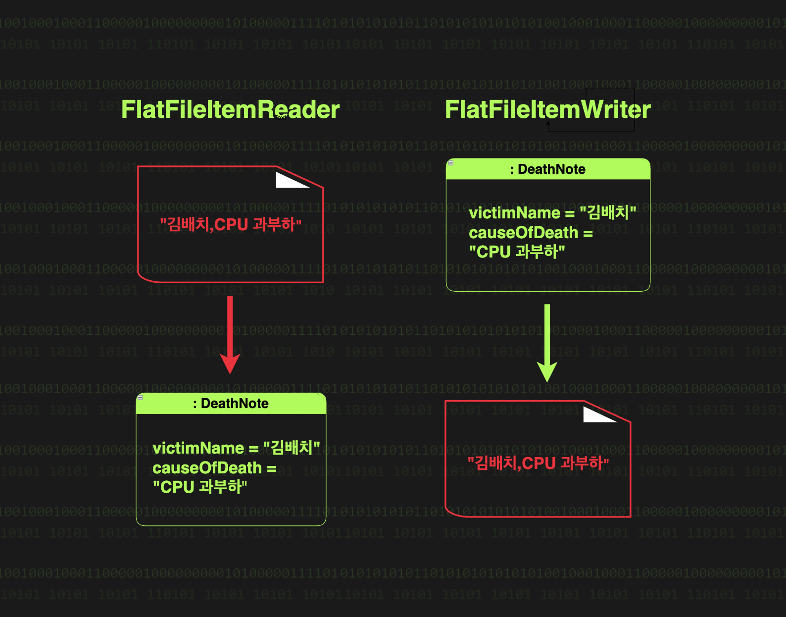

### 1단계: FieldExtractor (필드 추출)

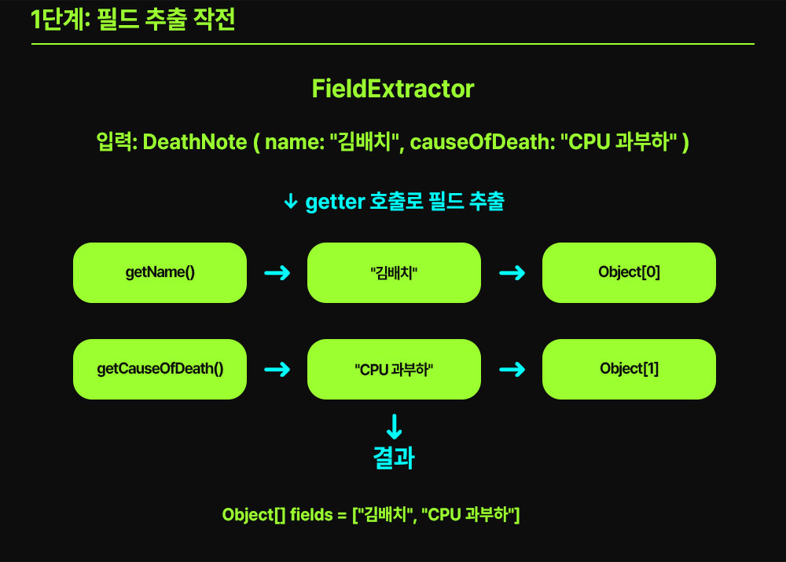

```java
public interface FieldExtractor<T> {
    Object[] extract(T item);
}
```

- `extract()` 메서드는 도메인 객체(`T`)를 받아서, 출력할 필드들을 Object 배열로 반환한다.
- 그 예시는 아래와 같다.

```java
public class DeathNoteFieldExtractor implements FieldExtractor<DeathNote> {
    @Override
    public Object[] extract(DeathNote deathNote) {
        return new Object[]{deathNote.getName(), deathNote.getCauseOfDeath()};
    }
}
```

- 위 예시에서 `DeathNote` 객체에서 `name` 과 `causeOfDeath` 필드를 추출하여 Object 배열로 반환하고 있다.
- Spring Batch 는 `FieldExtractor` 의 기본 구현체로 `BeanWrapperFieldExtractor` 와 `RecordFieldExtractor` 를 제공한다.
  - `BeanWrapperFieldExtractor` : 자바 빈 규약을 따르는 객체에서 필드를 추출한다. (getter 메서드 사용)
  - `RecordFieldExtractor` : 자바 Record 클래스에서 필드를 추출한다.
  - SpringBatch 는 파일에 쓸 도메인 객체의 타입에 따라, 이 두 구현체 중 하나를 자동으로 선택한다.
    - 도메인 객체가 Record 클래스라면 `RecordFieldExtractor` 를 사용하고, 그렇지 않다면 `BeanWrapperFieldExtractor` 를 사용한다.

### 2단계 - 구분자로 문자열 합치기: `LineAggregator` -> `DelimitedLineAggregator`

- `LineAggregator` 인터페이스는 추출된 필드들을 하나의 문자열 라인으로 결합하는 역할을 한다. SpringBatch에서 제공하는 구현체로는 `DelimitedLineAggregator` 와 `FormatterLineAggregator` 가 있다.
  - `DelimitedLineAggregator` : 구분자(예: 쉼표)로 필드들을 결합한다.
  - `FormatterLineAggregator` : 고정 길이 형식을 포함한 다른 형식으로 파일을 쓸 때 사용된다.

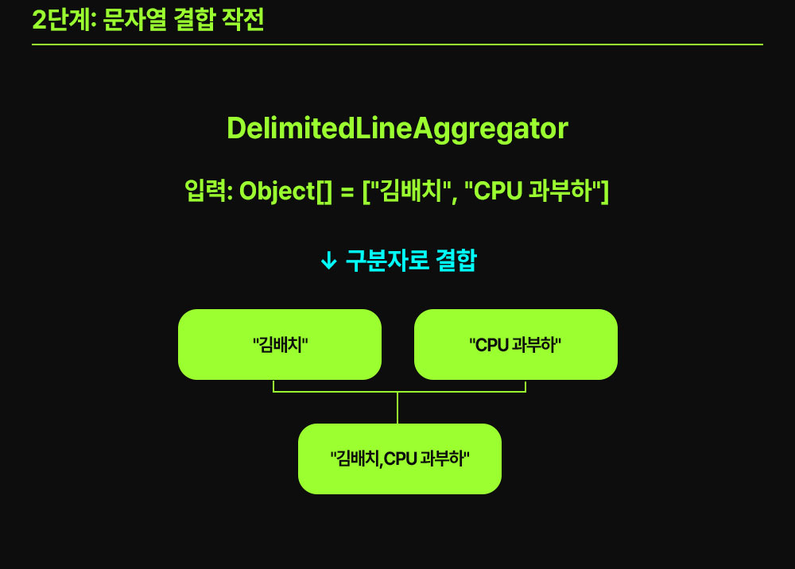

```java
public interface LineAggregator<T> {
    String aggregate(T item);
}
```

- `aggregate()` 메서드는 도메인 객체(`T`)를 받아서, 하나의 문자열 라인으로 결합하여 반환한다.
- `FlatFileItemWriter` 는 `LineAggregator` 만을 의존하는데, `LineAggregator` 가 내부적으로 `FieldExtractor` 를 사용하여 필드값을 추출한 뒤 문자열로 변환하게 된다.
  - 즉, `FlatFileItemWriter` 에서 `FieldExtractor` 를 직접 사용하는 것이 아니라, `LineAggregator` 가 `FieldExtractor` 를 사용한다.

### 예시코드

- [DelimitedDeathNoteJobConfig](src/main/java/com/system/batch/lesson/flatfileitemwriter/DelimitedDeathNoteWriteJobConfig.java)

### 2단계 - 커스텀 포맷 형식으로 문자열 합치기: `LineAggregator` -> `FormatterLineAggregator`

`LineAggregator`의 또다른 구현체인 `FormatterLineAggregator` 를 사용해서, 원하는 포맷으로 파일에 쓸 수 있다.

[FormatterDeathNoteJobConfig](src/main/java/com/system/batch/lesson/flatfileitemwriter/FormatterDeathNoteWriteJobConfig.java)

## FlatFileItemWriter 의 롤백 전략: 버퍼링을 통한 안전한 파일 쓰기

- DB와 달리 파일은 이미 쓰여진 데이터를 롤백할 수 없다는 문제가 있다. 이 문제를 해결하기 위해 `FlatFileItemWriter` 는 데이터를 즉시 파일에 쓰지 않고, 내부 버퍼에 일시적으로 저장해둔다.
- 이후 청크 처리가 정상적으로 완료되어 트랜잭션이 커밋되려고 할 때, 비로소 버퍼의 데이터를 파일에 쓴다.

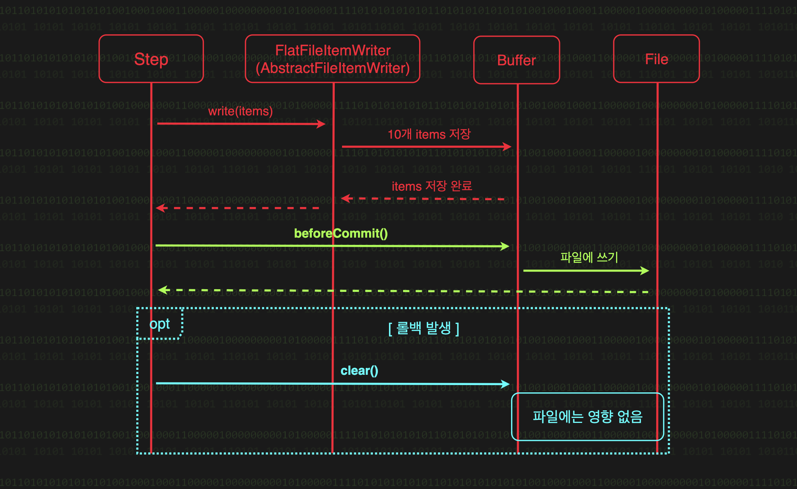

## 파일 쓰기와 OS 캐시: `forceSync()`

- OS는 성능을 위해 매번 디스크에 직접 쓰지 않고 메모리 캐시에 데이터를 먼저 저장한다. 이로 인해, **OS가 갑자기 중단되면 캐시의 데이터가 디스크에 쓰이지 못하고 유실될 수 있다.**
- `forceSync()` 를 사용하면 캐시가 아닌 디스크에 즉시 동기화되어 OS 중단이나 파일 시스템 문제가 발생해도 데이터 손실 위험이 적다. 다만 성능 저하가 발생할 순 있다.

## 대용량 파일의 분할 처리: `MultiResourceItemWriter`

- `MultiResourceItemWriter` 는 여러 개의 리소스 (파일)에 데이터를 분배하는 특별한 ItemWriter 구현체이다.
- 대용량 데이터를 관리하기 쉬운 크기의 여러 파일로 분할해서 저장하므로, 데이터 처리가 훨씬 효율적으로 이루어진다.
- **`MultiResourceItemWriter` 는 직접 파일을 쓰지는 않는다. 실제 파일 쓰기는 `FlatFileItemWriter` 같은 ItemWriter 에 위임한다.**
  - 즉, FileItemWriter 는 2개 종류로 나눌 수 있다. 실제로 파일에 쓰는 작업을 수행하는 FileItemWriter 구현체가 있고, 쓰기 작업을 관리하고 배분하는 FileItemWriter 가 있다.
  - 실제로 파일에 쓰는 작업을 수행하는 FileItemWriter 는 반드시 `ResourceAwareItemWriterItemStream` 인터페이스를 구현해야 한다. (`FlatFileItemWriter` 는 이미 이를 구현하고 있다.)

### 예시 코드

[MultiResourceDeathNoteWriteJobConfig](src/main/java/com/system/batch/lesson/multiresourceitemwriter/MultiResourceDeathNoteWriteJobConfig.java)

# FlatFileItemReader 와 FlatFileItemWriter 실전 예제

[LogProcessingJobConfig](src/main/java/com/system/batch/lesson/flatfileitemwriter/LogProcessingJobConfig.java)

# JSON 파일 읽고 쓰기 예제

[JsonFileSystemDeathJobConfig](src/main/java/com/system/batch/lesson/jsonfile/JsonFileSystemDeathJobConfig.java)

# 관계형 데이터베이스 읽고 쓰기

## 관계형 DB 읽기

데이터베이스를 읽기 위해 사용되는 전략에는 크게 두가지가 있다.

- `JdbcCursorItemReader` : 커서 기반 처리
  - 데이터베이스와 연결을 유지하면서 데이터를 순차적으로 가져온다.
  - 하나의 커넥션으로 데이터를 스트리밍하듯 처리한다.
  - 메모리는 최소한으로 사용하면서 최대한의 성능을 뽑아낸다.
- `JdbcPagingItemReader` : 페이징 기반 처리
  - 데이터를 정확한 크기로 잘라서 차근차근 처리한다.
  - 각 페이지마다 새로운 쿼리를 날려 안정성을 보장한다.

| 장단점 | `JdbcCursorItemReader` : 커서 기반 처리                                                                                                                      | `JdbcPagingItemReader` : 페이징 기반 처리                                                           |
|-----|--------------------------------------------------------------------------------------------------------------------------------------------------------|----------------------------------------------------------------------------------------------|
| 장점  | offset 등을 계산할 필요없이 커서를 하나씩 옮기면 되기에 조회성능이 좋다. 첫번째 청크와 마지막 청크의 읽기 속도가 거의 동일하다. 또한, 커서를 여는 시점(읽기 트랜잭션 시작 시점)을 기준으로 데이터를 읽기 때문에, 작업 도중 데이터 변경에 영향을 받지 않는다. | 한 페이지(청크)를 읽을 때만 커넥션을 맺기에 긴 배치 작업에도 커넥션 관리가 유용하다. 페이지 단위로 쿼리를 날리기에 병렬 처리에 유리하다.              |
| 단점  | 배치 작업이 끝날때까지 읽기 트랜잭션이 오래 유지된다. 따라서 네트워크 중단이나 다른 자원의 사용에 불리하다. 또한 커서 자체가 쓰레드(하나의 커넥션)에 종속되기에 멀티 쓰레딩이 어렵다.                                               | 커서 방식에 비해 조회 성능이 느리다. 배치 실행 중, 앞쪽 페이지 데이터가 삭제되거나 정렬 기준값이 변경되면 페이지 경계가 틀어져 누락 및 중복이 발생할 수 있다. |

### `JdbcCursorItemReader` : 커서 기반 처리

커서 기반 처리 방식은 DB와 끊김없는 연결을 유지하면서, `ResultSet`을 통해 데이터를 가져오는 방식이다.

- `JdbcCursorItemReader` 가 초기화(`open`)될 때, 빌더를 통해서 지정된 SQL 쿼리를 실행하고, 그 결과를 가리키는 커서를 생성한다.
- 이후 `read()` 가 호출될때마다 `ResultSet.next()` 를 실행하며 한 행씩 데이터를 가져온다.

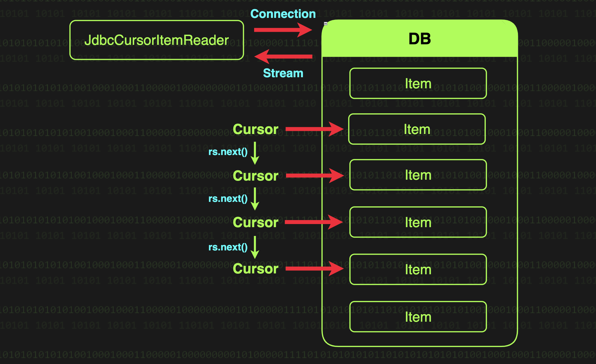

즉 `JdbcCursorItemReader` 는 매번 새로운 쿼리를 실행하는 것이 아니라, **이미 열린 `ResultSet` 에서 커서를 이동하면서 데이터를 하나씩 읽어오는 구조**이다.

이 덕분에 대량의 데이터를 한번에 메모리에 올리지 않고도 처리할 수 있다.

단, **DB와의 연결을 유지한 채 배치작업이 진행되므로, 커넥션이 너무 오래 유지될 수 있다.**

#### `JdbcCursorItemReader` 구성요소

- `DataSource` : DB 연결을 관리한다.
- `SQL` : 데이터 조회 쿼리
- `RowMapper` : `ResultSet` -> `Java 객체` 변환
  - `BeanPropertyRowMapper` : setter 기반 매핑 방식이다. 자바빈 규약을 만족하는 클래스를 대상으로, DB 칼럼명과 객체의 필드명이 일치하면 자동으로 매핑해준다. (스네이크케이스를 카멜케이스로 자동 변환 지원)
  - `DataClassRowMapper` : record 와 같은 불변 객체를 위해, 생성자 파라미터를 통해 매핑을 수행한다. 생성자에 없는 필드는 setter 방식으로 매핑한다.
  - 커스텀 row mapper : 별도의 복잡한 변환 로직이 필요할 때 직접 구현하여 사용할 수 있다.
- `PreparedStatement` : 쿼리 실행 및 결과 조회
- `PreparedStatementSetter` (Optional) : 쿼리의 파라미터에 값을 동적 바인딩한다. 인젝션 공격 등을 방지한다.

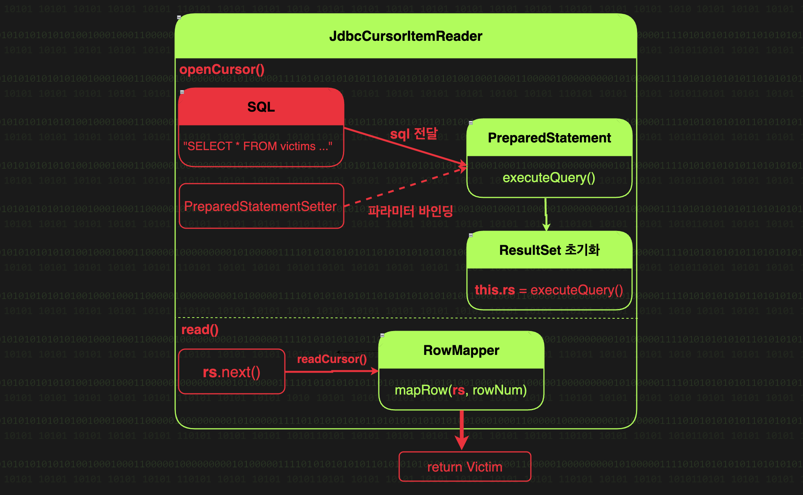

#### `JdbcCursorItemReader` 예시 코드

[JdbcCursorItemReaderJobConfig](src/main/java/com/system/batch/lesson/rdbms/CursorItemVictimRecordConfig.java)

#### JDBC 드라이버의 내부 최적화

- JDBC 드라이버는 기본적으로 여러 개의 row를 미리 가져와서 `ResultSet` 의 내부 버퍼에 저장해둔다.
- 그리고 `ResultSet.next()` 가 호출될 때마다 해당 버퍼에서 데이터를 하나씩 꺼낸다. 만약 버퍼가 비었다면, **그때 다시 쿼리를 실행해서 다음 여러 개의 row를 버퍼에 저장**한다.

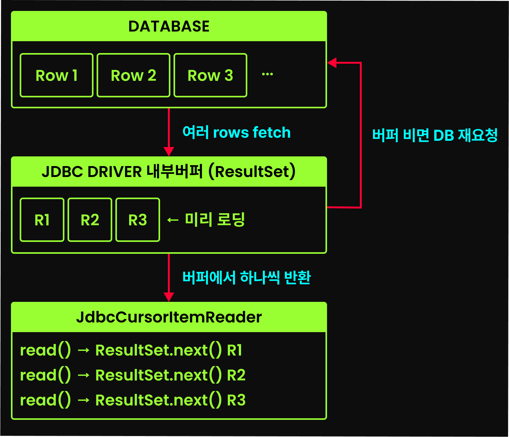

#### 커서의 연속성

- 청크 지향 처리의 경우, 각 청크 단계마다 트랜잭션이 커밋된다. 그럼 `트랜잭션이 청크마다 커밋되는데, 커서가 닫히지 않고 데이터를 계속 읽을 수 있나?` 하는 의문이 들 수 있다.
  - _DB에서 트랜잭션이 커밋되면 일반적으로 커서도 함께 닫힌다._
- 결론적으로 문제없다. 왜냐하면, "청크별 write 커밋에 사용되는 Step 트랜잭션"과 "데이터를 읽어오는 트랜잭션"은 서로 다른 DB 커넥션을 사용하기 때문이다.

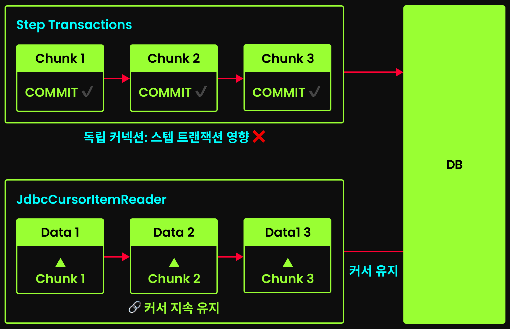

#### 스냅샷 읽기

- "`ItemReader` 가 조회하는 데이터"를 Step 에서 변경한다면, `ItemReader` 가 그 변화를 조회할 수 있을까? 역시 알지 못한다.
- `ItemReader` 는 읽기 시작한 시점 (트랜잭션이 시작된 시점) 을 기준으로 데이터를 읽어들인다. 따라서 이후에 변경된 사항이 있더라도 알 수 없다.
  - _트랜잭션 격리 수준에 따라 달라질 순 있을 것 같다._

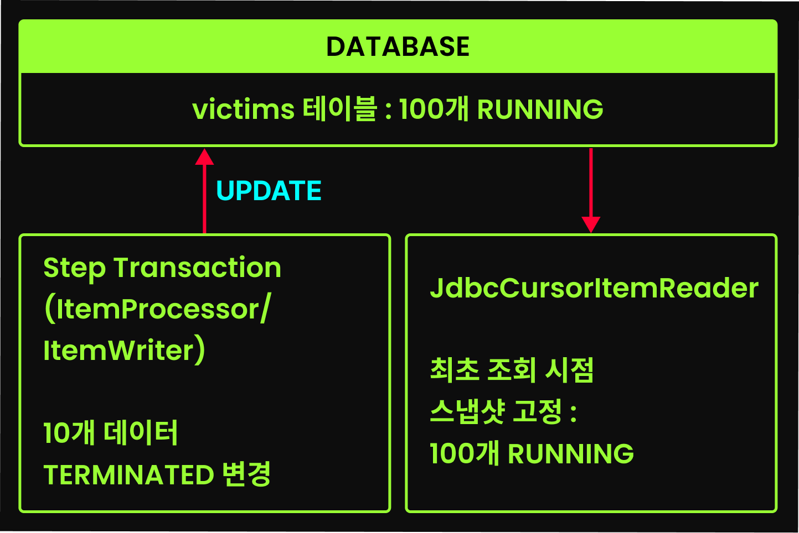

#### JdbcCursorItemReader 의 SQL `ORDER BY` 설정

- 사실 `JdbcCursorItemReader` 의 sql에 `ORDER BY` 절이 필요하다.
- Step 이 실패하여 재시작되는 경우, `JdbcCursorItemReader` 는 `jumpToItem()` 을 통해서 **이전에 실패했던 지점부터 다시 시작**한다. 이때 `ResultSet.next()` 를 호출해서 실패 지점까지 커서를 이동시킨다.
- **만약 쿼리 결과의 순서가 매번 다르다면, 잘못된 위치에서부터 재시작될 수 있다.**
- 따라서 `ORDER BY` 절을 반드시 추가해야하며 보통 PK로 설정한다.

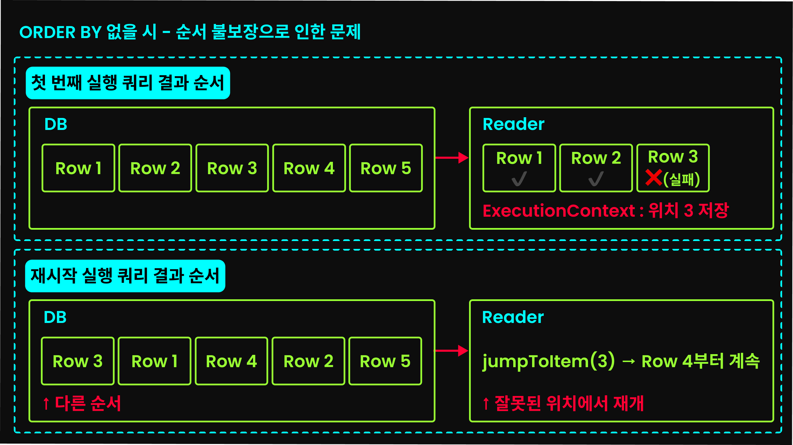

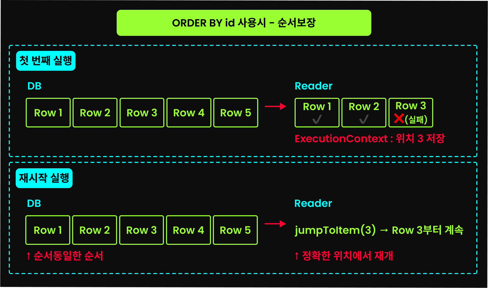

### `JdbcPagingItemReader` : 페이징 기반 처리

이번에는 커서 기반 처리 대신 페이징 기반 처리에 대해 알아보자.

페이징 기반 처리를 위해서, `JdbcPagingItemReader` 를 사용한다. `JdbcPagingItemReader` 는 **Keyset 기반 페이징**을 수행한다.

> [페이징 처리 방식; `Offset 기반 페이징` VS `Keyset 기반 페이징`]
> 
> 일반적으로 페이징 처리를 하는 방식에는 두가지 `Offset 기반 페이징` 와 `Keyset 기반 페이징`가 있다.
> 
> - `Offset 기반 페이징` : DB가 데이터셋을 정렬한 후에, 일정 offset 만큼 건너뛰고 limit 만큼 데이터를 가져오는 방식. 단순하지만, offset 만큼의 데이터를 읽어야하기 때문에 결국 테이블 풀스캔이 일어나 성능 저하가 발생한다.
> - `Keyset 기반 페이징` : 특정 데이터를 기준으로 이후의 데이터를 가져온다. 기준 데이터를 탐색할때 index 를 사용한다면, 테이블 풀스캔이 일어나지 않아 성능상 유리하다.
> 
> 자세한 내용은 [다른 포스팅](https://taegyunwoo.github.io/tech/Tech_DBPagination#no-offset-%EB%B0%A9%EC%8B%9D%EC%9C%BC%EB%A1%9C-%EC%84%B1%EB%8A%A5-%EA%B0%9C%EC%84%A0) 을 참고해주세요.

#### `JdbcPagingItemReader` 구성요소

- `DataSource` : DB 연결을 담당하는 객체이다.
- `RowMapper` : DB 조회 결과를 Java 객체로 매핑하는 객체
- `NamedParameterJdbcTemplate` : 위치 기반으로 파라미터 값을 매핑하는 것 대신, 이름을 가진 파라미터를 사용할 수 있다.
- `PagingQueryProvider` : Keyset 기반 페이징을 담당하며, 사용하는 DB 종류에 따라 다른 구현체가 사용된다.

#### `JdbcPagingItemReaderBuilder` 의 쿼리 설정 메서드

- `selectClause()` : 가져올 칼럼을 지정한다.
- `fromClause()` : 데이터를 가져올 테이블을 지정한다.
- `whereClause()` (선택) : 필요한 데이터만 필터링한다.
- `groupClause()` (선택) : 데이터 집계가 필요한 경우 사용한다.
- `sortKeys()` : `ORDER BY` 절에 사용될 정렬 키를 지정한다. 해당 키는 반드시 유니크한 키여야 한다. 유니크하지 않다면, 동일한 값을 가진 데이터들의 순서가 보장되지 않는다. 따라서 일반적으로 PK나 인덱스가 있는 칼럼을 사용한다. (성능적으로도, 인덱스를 탈 수 있는 칼럼을 지정하는 것이 좋다.)

#### `JdbcPagingItemReader` 예시 코드

[JdbcPagingItemReaderJobConfig](src/main/java/com/system/batch/lesson/rdbms/PagingItemVictimRecordConfig.java)

## 관계형 DB 쓰기

Spring Batch 에서는 가장 기본적인 RDB 쓰기를 위해 `JdbcBatchItemWriter` 를 제공한다.

`JdbcBatchItemWriter` 는 내부적으로 `NamedParameterJdbcTemplate` 를 사용하고, JdbcTemplate 의 batchUpdate를 활용해서 청크 단위로 모아진 아이템들을 효율적으로 DB에 저장한다.

### DB Insert 방식; `일반 INSERT` vs `Multi-value INSERT` vs `Batch Update`

#### `일반 INSERT` : 매 쿼리마다 네트워크 패킷 발생

```sql
-- 패킷1
INSERT INTO victims (id, name) VALUES (1, '김배치');
-- 패킷2
INSERT INTO victims (id, name) VALUES (2, '사불링');
```

#### `Multi-Value INSERT` : 여러 값을 하나의 쿼리로 한 번에 전송

```sql
-- 패킷1
INSERT INTO victims (id, name) VALUES (1, '김배치'), (2, '사불링');
```

#### `Batch Update`

`PreparedStatement` 를 재사용하여 쿼리 템플릿 하나와 여러 파라미터 세트를 함께 전송한다.

이렇게 전달된 배치 쿼리는 DB 서버에서 처리되며, 모든 작업은 **하나의 트랜잭션 내에서 수행**된다.

**이를 통해, 청크 단위로 묶인 수백 건의 데이터에 대해 원자성이 보장된다.**

```sql
-- -------[ 패킷1 ]-------
-- 템플릿 등록
PREPARE insert_victim (int, text) AS
    INSERT INTO victims (id, name) VALUES ($1, $2);

-- 첫번째 레코드
EXECUTE insert_victim(1, '김배치');

-- 두번째 레코드
EXECUTE insert_victim(2, '사불링');

-- 템플릿 제거
DEALLOCATE insert_victim;

-- 다만, 실제 데이터베이스에 전달되는 데이터 형식은 데이터베이스 드라이버 구현체별로 다르다.
```

또한, 모든 데이터가 한번의 네트워크 호출로 전송되므로, 네트워크 왕복 횟수가 최소화된다.

**INSERT 작업을 할 경우, `Mutli-Value INSERT` 를 적극 권장한다.** 기본적으로 `batchUpdate` 는 DB 서버에서 각각의 INSERT 가 개별적으로 실행된다.

하지만 `Multi-Value INSERT` 를 사용하면 하나의 통합된 쿼리로 실행되어 파싱 및 실행 횟수를 줄여 성능을 높일 수 있다.

MySQL과 PostgreSQL에서는 각각 다음과 같은 설정을 통해 드라이버 레벨에서 `batchUpdate`를 `Multi-Value INSERT`로 자동 변환해준다.

```text
## application.yml

# MYSQL
url: jdbc:mysql://localhost:3306/mysql?rewriteBatchedStatements=true 
#POSTGRESQL
url: jdbc:postgresql://localhost:5432/postgres?reWriteBatchedInserts=true 
```

> 다만, 업데이트 작업의 경우, `Multi-Value INSERT` 로 성능 개선을 기대하기엔 어렵다.

### `JdbcBatchItemWriter` 구성요소

- `NamedParameterJdbcTemplate` : 네임드 파라미터 바인딩을 지원하는 JdbcTemplate 이다. SQL 실행과 결과 처리를 담당한다.
- `SQL` : `JdbcBatchItemWriter` 가 실행할 SQL 구문을 정의한다. `INSERT`, `UPDATE`, `DELETE` 와 같은 DML 구문이 될 수 있고, 파라미터 바인딩을 위해 아래 두 가지 방식을 지원한다.
  - 물음표 (`?`) 위치 기반 플레이스 홀더
  - 네임드 파라미터 (`:param1`)
- `ItemSqlParameterSourceProvider` : "Java 객체의 프로퍼티"를 "`SQL`의 네임드 파라미터"에 매핑하는 역할을 담당한다.
  - `JdbcBatchItemWriterBuilder` 의 `beanMapped()` 메서드 사용시, `BeanPropertyItemSqlParameterSourceProvider` 구현체가 사용된다.
  - `BeanPropertyItemSqlParameterSourceProvider` : 자바빈 규약을 따르는 객체(레코드 포함)에 대해 리플렉션을 기반으로 필드값을 바인딩한다. (`userName` -> `:userName`)
  - 만약 직접 구현체를 만든다면, `JdbcBatchItemWriterBuilder` 의 `itemSqlParameterSourceProvider()` 메서드에 커스텀 구현체를 지정하면 된다.
- `ItemPreparedStatementSetter` : Java 객체의 데이터를 PreparedStatement의 파라미터(`?` 파라미터)에 설정하는 역할을 한다.
  - `ItemSqlParameterSourceProvider` (네임드 파라미터) 와 `ItemPreparedStatementSetter` (`?` 파라미터) 중, 어떤 것을 사용해서 파라미터에 값을 할당할 것인지 선택해야 한다.
  - `ItemPreparedStatementSetter` 를 사용한다면, 아래와 같이 어떤 필드를 바인딩할 것인지 설정해야 한다.
    - ```java
      builder.itemPreparedStatementSetter(new VictimPreparedStatementSetter())
      
      //...
      
      public class VictimPreparedStatementSetter implements ItemPreparedStatementSetter<Victim> {
        @Override
        public void setValues(Victim victim, PreparedStatement ps) throws SQLException {
            ps.setLong(1, victim.getId());                  
            ps.setString(2, victim.getName());       
            ps.setString(3, victim.getProcessId());        
            ps.setTimestamp(3,  Timestamp.valueOf(terminatedAt));
            ps.setDouble(5, victim.getStatus());
        }
      }
      ```

### JdbcBatchItemWriter 내부 동작 구조

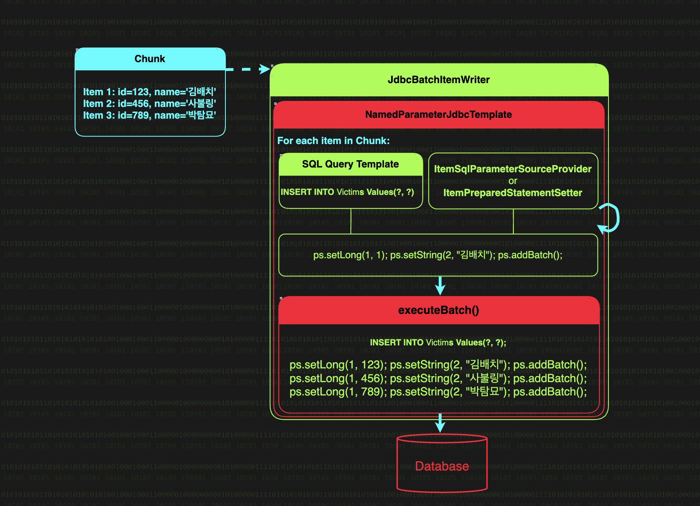

- 청크로 모아진 아이템들이 `JdbcBatchItemWriter`에 전달된다.
- `NamedParameterJdbcTemplate`은 `ItemSqlParameterSourceProvider` 또는 `ItemPreparedStatementSetter`를 사용하여 PreparedStatement의 파라미터를 설정한다. 이렇게 각 아이템마다 설정된 `PreparedStatement`는 배치에 순차적으로 추가된다.
- 마지막 아이템까지 처리가 완료되면, 배치에 누적된 모든 `PreparedStatement`가 단일 네트워크 호출로 데이터베이스에 전송된다.

### JdbcPagingItemReader와 JdbcBatchItemWriter 예제 코드

[ReaderAndWriterOrderRecoveryJobConfig](src/main/java/com/system/batch/lesson/rdbms/ReaderAndWriterOrderRecoveryJobConfig.java)

## JpaCursorItemReader

JpaCursorItemReader 는 cursor 방식으로 데이터를 순차적으로 읽어들이는 JPA 기반의 ItemReader 이다.

JdbcCursorItemReader 와의 주된 차이점은 내부적으로 entityManager를 사용해 데이터를 읽는다는 점이다. 이를 통해서 SQL이 아닌 엔티티 중심의 처리가 가능하다.

### JpaCursorItemReader 구성요소

- `queryString(JPQL)` or `JpaQueryProvider`
  - `queryString(JPQL)` : JpaCursorItemReader 가 데이터를 조회하기 위한 JPQL 쿼리이다. `EntityManager` 가 이 `queryString`을 사용하여 실제 실행 가능한 Query 객체를 생성한다.
  - `JpaQueryProvider` : `queryString` 대신 `JpaQueryProvider` 를 사용하여 쿼리를 생성할수도 있다. 종류는 총 2가지, `JpaNamedQueryProvider` 와 `JpaNativeQueryProvider` 가 존재한다.
    - `JpaNamedQueryProvider` : 엔티티 등에 미리 정의된 Named Query를 사용한다.
    - `JpaNativeQueryProvider` : Native SQL을 사용하여 데이터를 조회한다.
- `EntityManager` : JPA에서 엔티티의 생명주기를 관리하고 실제 DB 작업을 수행한다. JpaCursorItemReader 는 이 `EntityManager` 를 사용하여 커서 기반의 DB 조회를 실행한다. 
- `Query` : `EntityManager` 에 의해서 생성된다. 이를 통해 데이터를 스트리밍 방식으로 읽어온다.

### JpaCursorItemReader 실행 흐름

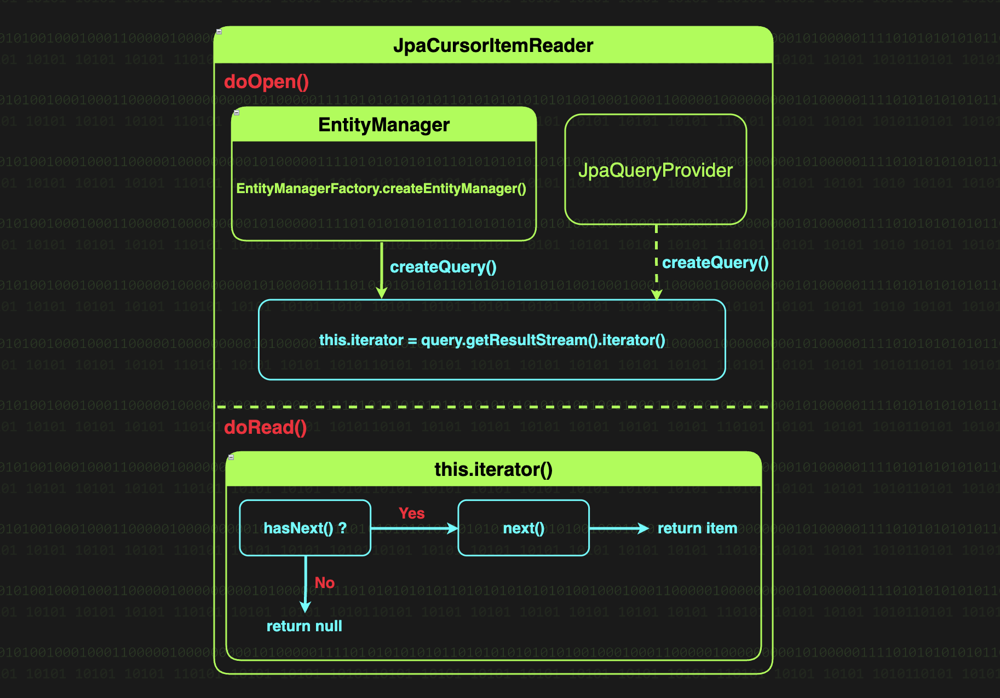

1. `doOpen()`
    - JpaCursorItemReader 초기화 시점에 호출된다.
    - EntityManger 와 JpaQueryProvider 가 협력하여 실행 가능한 Query 객체를 생성한다.
    - 이 Query 객체는 `getResultStream()` 을 호출하여 DB 커서를 순회할 Iterator 를 준비한다.
2. `doRead()`
   - 준비된 Iterator를 통해서 실제 데이터를 한건씩 읽어온다.
   - `iterator.hasNext()`로 다음 데이터의 존재 여부를 확인하고, 데이터가 있다면 `iterator.next()`를 통해 한 건의 데이터를 반환한다. 더 이상 읽을 데이터가 없다면 `null`을 반환하여 읽기를 종료한다.

### JpaCursorItemReader 예시 코드

- [JpaCursorItemReaderPostBlockBatchConfig.java](src/main/java/com/system/batch/lesson/rdbms/JpaCursorItemReaderPostBlockBatchConfig.java)

## JpaPagingItemReader

JpaPagingItemReader 는 JpaCursorItemReader 와 달리, JPA를 사용하여 데이터를 페이지 단위로 조회한다.

여기서 중요한 점은 이전에 살펴본 JdbcPagingItemReader 와 달리, **JpaPagingItemReader 는 offset 방식으로 페이징 처리를 수행**한다. (JdbcPagingItemReader 는 `Keyset 기반 페이징`)

**따라서 실시간으로 변경되는 데이터에 대해, JpaPagingItemReader 를 사용하면 데이터 중복 조회나 생략이 발생할 수 있다.**

**실시간으로 데이터가 변경되는 경우엔, 스트리밍 방식(JpaCursorItemReader)을 고려해야 한다.**

### JpaPagingItemReader 구성요소

- `queryString(JPQL)` or `JpaQueryProvider` : Query 생성에 사용된다. 
- `EntityManager` : JPA 핵심 엔진

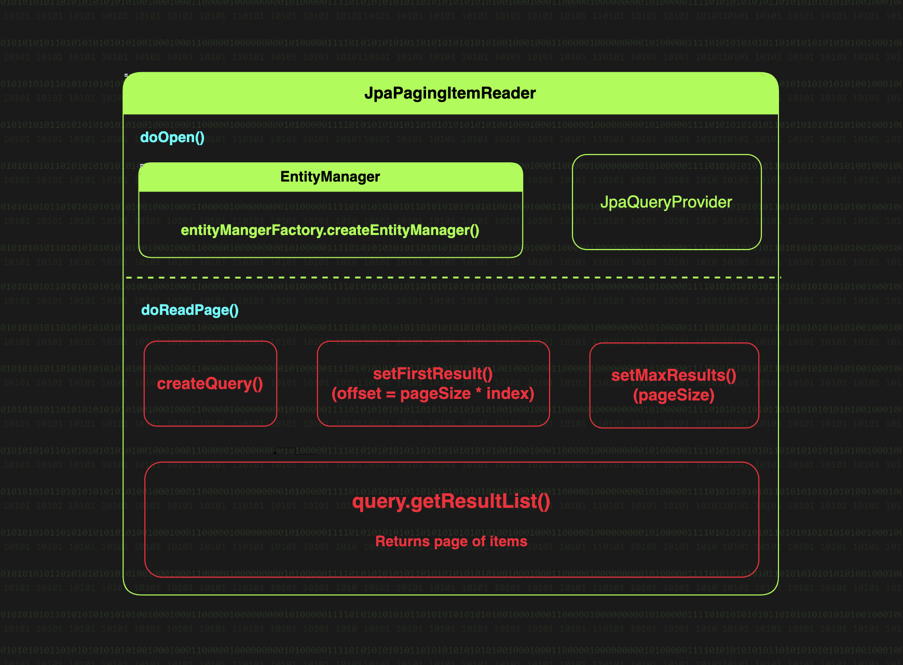

1. `doReadPage()` 메서드가 호출될 때마다, 새로운 쿼리를 생성 및 실행한다.
2. `setFirstResult()` : 현재 페이지의 시작 위치(`offset`)을 설정한다.
3. `setMaxResults()` : 페이지 크기 설정
4. `getResultList()` : 해당 페이지의 데이터를 가져온다.

### JpaPagingItemReader 사용시 주의사항

- JPQL 의 `FETCH JOIN` 은 사용하지 않는 것이 좋다. 왜냐하면, offset 만큼의 엔티티를 건너뛸 때, 굳이 건널뛸 엔티티의 연관 엔티티를 함께 메모리에 로드할 필요는 없기 때문이다.
- `N+1` 문제는 아래와 같이 해결하는 것이 좋다.
  - 연관 엔티티 `FetchType` 을 `EAGER` 로 설정하고, `@BatchSize` 를 조정하여 해결한다.
  - `EAGER` 이 아닌 `LAZY` 로 설정하면, JpaPagingItemReader 의 내부 트랜잭션 처리 로직상 `@BatchSize` 가 적용되지 않는다. 따라서 반드시 `EAGER` 로 설정해야 한다.
  - `LAZY` 인 경우 실제 연관 엔티티에 접근시 로드되는데, 이때는 이미 JpaPagingItemReader 의 읽기 트랜잭션이 끝난 후라서 `@BatchSize` 가 적용되지 않는다. (`@BatchSize` 는 트랜잭션 내에서만 동작)
- `transacted(false)` 설정은 하는 것이 좋다. JpaPagingItemReader 내부 로직상, transacted가 true라면 데이터를 읽기 전에 EntityManager 를 `flush()` 하고 `clear()` 한다. 따라서 예상치 못한 데이터 변경이 일어날 수 있다.

이런 문제들을 해결한 커스텀 구현체가 존재하며, 아래에서 사용할 수 있다.

https://github.com/jojoldu/spring-batch-querydsl

### JpaPagingItemReader 예시 코드

[JpaPagingItemReaderPostBlockBatchConfig.java](src/main/java/com/system/batch/lesson/rdbms/JpaPagingItemReaderPostBlockBatchConfig.java)

## JpaItemWriter

spring boot 로 spring batch 를 사용하는 경우, `spring-boot-starter-data-jpa` 의존성을 추가하면 `PlatformTransactionManager` 구현체가 `JpaTransactionManager` 로 변경된다.

`JpaTransactionManager` 를 통해서, JPA 가 제공하는 영속성 컨텍스트, 1차 캐시, 더키체크 등을 사용할 수 있게 된다.

만약 spring boot 를 사용하지 않고 스프링 배치와 jpa를 사용한다면, 아래와 같이 JpaTransactionManager를 직접 구성해야 한다.

```java
@Bean
public JpaTransactionManager transactionManager(EntityManagerFactory emf) {
    return new JpaTransactionManager(emf);
}
```

### JpaItemWriter 사용시 주의사항

- ID 시퀀스 할당을 어떻게 할 것인가?
  - Hibernate 는 성능 최적화를 위해서, 스퀀스 값을 여러 개 미리 할당받아 메모리에 저장해둔다.
  - Hibernate 는 기본적으로 한번에 50개씩 할당받는다. 다만 아래와 같은 설정이 DB에 되어있어야 한다.
    - ```SQL
      ALTER SEQUENCE blocked_posts_id_seq INCREMENT BY 50;
      ```
  - 배치 작업에서 DB INSERT를 수행할 때, 시퀀스 조회 횟수를 최소하기 위해선 `allocationSize` 를 최대한 크게 잡아야한다.
    - _단, DB의 `INCREMENT BY` 설정값이 너무크다면, 번호 공백이 생길 수도 있다는 점을 고려해야한다._
- ID 할당에서 IDENTITY 전략 사용시 배치 처리 제약사항
  - IDENTITY 전략 사용시, DB에서 자동으로 할당되는 ID값을 사용해야 한다. 따라서 JPA가 엔티티를 영속화하기 위해서는 반드시 INSERT 를 먼저 실행해야 한다.
  - **이는 결과적으로, 모든 INSERT 가 개별적으로 실행되어야 함을 의미한다.**
  - 따라서 Hibernate는 여러 개의 INSERT 문을 하나의 배치로 묶어서 처리할 수 없게 된다. 만약 성능이 중요하다면, SEQUENCE 전략을 권장한다.
- 기존 엔티티를 수정하는 경우, 데이터를 읽기 위한 ItemReader로 `JpaCursorItemReader` 사용이 권장된다.
  - 위에서 설명했듯, `JpaPagingItemReader` 는 데이터를 읽기 전에 내부적으로 entityManager.flush() 를 수행하기에 의도치않은 데이터 변경이 일어날 수 있다.

### 예제 코드

- 새로운 데이터 INSERT : [JpaItemWriterPostBlockBatchConfig.java](src/main/java/com/system/batch/lesson/rdbms/JpaItemWriterPostBlockBatchConfig.java)
- 기존 데이터 UPDATE : [JpaItemWriterMergePostBlockBatchConfig.java](src/main/java/com/system/batch/lesson/rdbms/JpaItemWriterMergePostBlockBatchConfig.java)

# 위임 ItemWriter 와 ItemReader

## CompositeItemReader

`CompositeItemReader` 는 여러 ItemReader 들을 순차적으로 실행한다. 아래와 같이 생성해서 사용할 수 있다.

```java
List<ItemStreamReader<Customer>> readers = List.of(
    shard1ItemReader,
    shard2ItemReader
);
CompositeItemReader<Customer> compositeItemReader = new CompositeItemReader<>(readers);
```

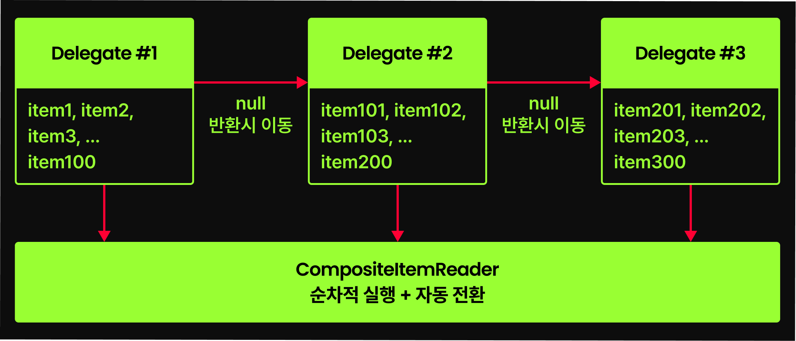

1. 같은 타입의 데이터를 반환하는 ItemReader들을 List에 넣어 전달하면, CompositeItemReader가 이를 순서대로 실행한다.
2. 이전 ItemReader가 더이상 읽을 게 없다고 `null` 반환시, 자동으로 다음 ItemReader로 넘어간다.

### CompositeItemReader 가 유용한 경우

- DB가 여러 샤드로 분산되어 있는 경우 유용하다. 별도의 샤드 관리 없이, 각 샤드를 바라보는 ItemReader들만 준비해서 전달하면 되기 때문이다.
- 레거시 시스템과 신규 시스템의 데이터를 하나의 흐름으로 처리할 때도 유용하다.

## CompositeItemWriter

CompositeItemWriter는 여러 ItemWriter를 사용하여 데이터를 쓸때 사용된다. CompositeItemWriter는 내부적으로 아래와 같이 구현되어 있다. 

```java
public void write(Chunk<? extends T> chunk) throws Exception {
    for (ItemWriter<? super T> writer : delegates) { //각 ItemWriter마다 청크단위로 write() 호출
        writer.write(chunk);
    }
}
```

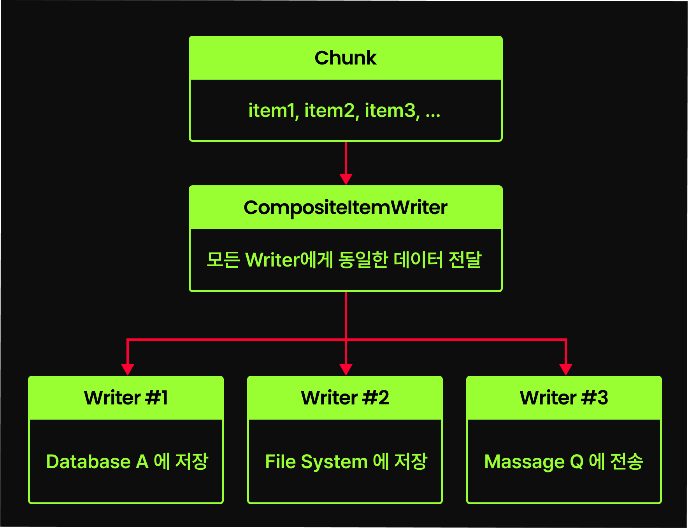

CompositeItemWriter의 구성방법은 아래와 같다.

```java
// 방법 1) 생성자에 직접 Writer 주입
CompositeItemWriter<Hacker> writer = new CompositeItemWriter<>(
    List.of(
        firstWriter,
        secondWriter,
        thirdWriter
    )
);

// 방법 2) 전용 빌더 사용
CompositeItemWriterBuilder<Hacker> builder = new CompositeItemWriterBuilder<>()
    .delegates(List.of(firstWriter, secondWriter, thirdWriter))
    .build();
```

### CompositeItemWriter 가 유용한 경우

- RDB와 NoSQL에 각각 다른 방식으로 저장하는 것처럼, 하나의 데이터를 여러 시스템에 쓰는 경우
- DB에 정보를 저장하고, 동시에 이메일로도 발송하는 것과 같은 경우

### 여러 시스템에 쓰기 작업을 할때의 트랜잭션 관리

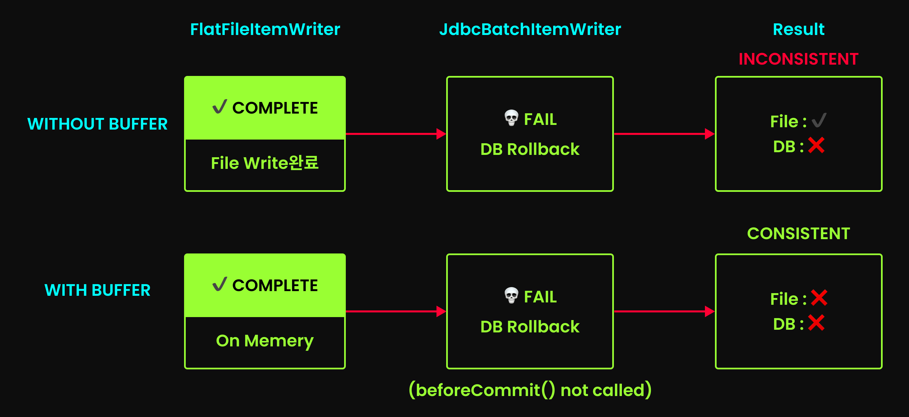

위 그림은 FlatFileItemWriter 와 JdbcBatchItemWriter 를 CompositeItemWriter 로 함께 사용하는 경우에 대한 설명이다.

**결론적으로 FlatFileItemWriter 는 내부 버퍼를 통해서 쓰기 작업을 한 뒤에, 이상이 없는 경우 실제 파일 쓰기 작업을 수행(`buffer.flush()`)를 하기 때문에 데이터 일관성을 보장할 수 있다.**

1. WITHOUT BUFFER 는 FlatFileItemWriter 가 버퍼 없이 바로 파일에 쓴다고 가정했을 때 발생하는 문제이다. RDB 쓰기 작업은 롤백되었지만, 파일은 그대로 남아있게 된다.
2. WITH BUFFER 는 RDB 쓰기 작업과 파일 쓰기 작업이 함께 롤백될 수 있다.

ItemWriter 는 기본적으로 아래와 같이 동작한다.

1. 쓰기 작업을 임시로 저장하기 위해서, `write()` 메서드를 호출한다.
    - `write()` : ItemWriter 구현체에 따라 다르게 동작한다. 내부 버퍼 (메모리) 에 데이터를 저장하거나, 영속성 컨텍스트에 엔티티를 저장하는 등의 작업을 수행한다.
2. 모든 쓰기 작업이 성공했다면, `beforeCommit()` 메서드를 호출한다.
   - `beforeCommit()` : 역시 ItemWriter 구현체에 따라 다르게 동작한다. 버퍼에 있는 내용을 그대로 파일에 flush 하거나, DB에 쓰는 등 실제 시스템에 반영하는 작업을 수행한다. 만약 문제가 발생한다면, `beforeCommit()` 을 호출하지 않기 때문에 데이터 정합성을 유지할 수 있다.
3. 최종적으로 `commit()` 한다.

## ClassifierCompositeItemWriter

ClassifierCompositeItemWriter 는 Spring 의 Classifier를 사용해서, 규칙에 따라 ItemWriter를 선택하여 데이터 쓰기 작업을 수행한다.

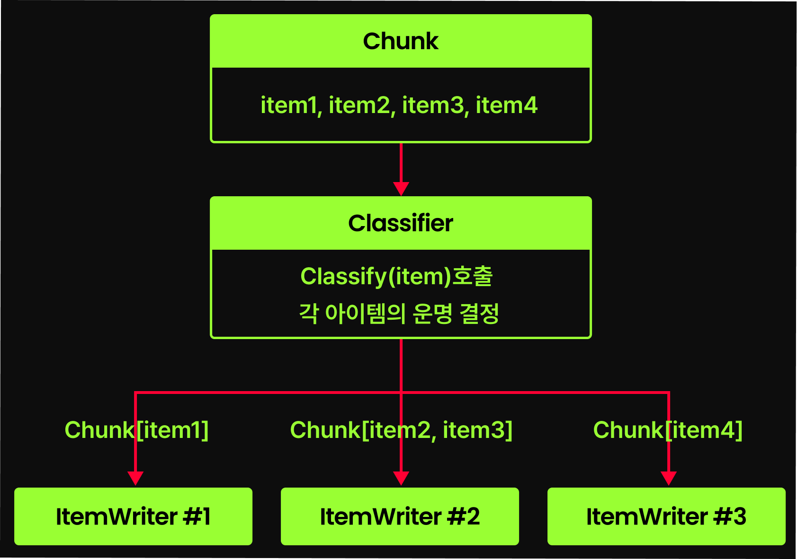

ClassifierCompositeItemWriter 는 내부적으로 아래와 같이 구현되어 있다.

```java
private Classifier<T, ItemWriter<? super T>> classifier = new ClassifierSupport<>(null);
```

`T` 타입의 데이터를 분류해서 각 데이터의 쓰기 작업을 수행할 담당 ItemWriter 를 지정한다.

1. 청크 단위로 들어온 데이터를 하나씩 분류(`classify`)한다.
2. 분류된 결과에 따라 적절한 위임 대상 ItemWriter에 item을 매핑한다.
3. 청크의 모든 item이 분류되면, 각 ItemWriter가 자기에게 할당된 item을 처리한다.

### ClassifierCompositeItemWriter 예시코드

[MandateSystemLogProcessingConfig](src/main/java/com/system/batch/lesson/mandate/MandateSystemLogProcessingConfig.java)

# ItemStream

ItemStream 은 Spring Batch 의 핵심 인터페이스로, 대부분의 ItemReader와 일부 ItemWriter 구현체에서 ItemStream 인터페이스를 공통적으로 구현하고 있다.

```java
public interface ItemStream {
    default void open(ExecutionContext executionContext) throws ItemStreamException {}
	
    default void update(ExecutionContext executionContext) throws ItemStreamException {}
	
    default void close() throws ItemStreamException {}
}
```

## ItemStream 의 역할

- 자원 초기화 및 해제
- 메타데이터 관리 및 상태 추적

그럼 하나씩 ItemStream 의 기능을 알아본다.

## ItemStream : 자원 초기화 및 해제

- open() : 자원을 초기화할때 사용되는 메서드이다.
- close() : 자원에 대한 사용을 끝내고 자원을 해제할 때 사용되는 메서드이다.

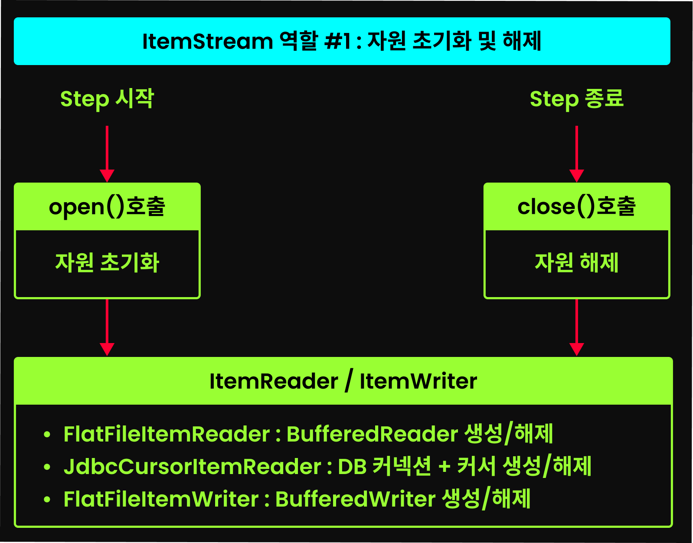

ItemStream 의 `open()` 과 `close()` 는 Step 이 호출한다. (하기 다이어그램 참고)

- 스텝 시작 직후 : `ItemStream.open()` 호출
- 스텝 실행 완료시 : `ItemStream.close()` 호출

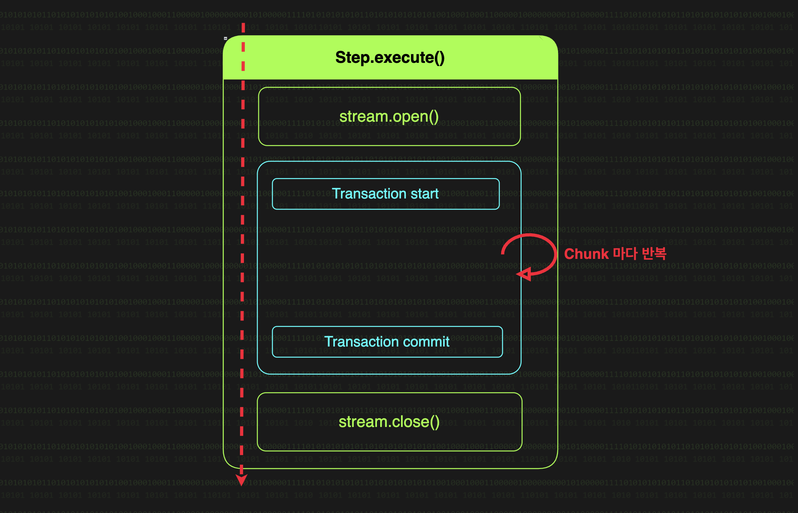

## ItemStream : 메타 데이터 관리 및 상태 추적

Spring Batch는 매 트랜잭션마다 현재 실행 상태를 메타데이터 저장소에 기록한다. 이것이 바로 ItemStream이 담당하는 메타데이터 관리의 핵심이다.

### open() : 저장된 실행 정보 복원

open() 메서드는 스텝 시작 시점에 호출되어, **작업을 실패한 시점부터 이어서 실행할 수 있도록 상태를 복원하는 역할**을 한다.

```java
default void open(ExecutionContext executionContext) throws ItemStreamException {
}
```

위와 같이 `open()` 메서드는 파라미터로 `ExecutionContext` 를 받는다. `ExecutionContext` 는 이전 스텝에 대한 실행 정보가 담겨져있고, ItemStream 구현체들은 이 `ExecutionContext`를 사용해 자신의 이전 상태를 복원한다.

```java
//FlatFileItemReader의 부모 클래스인 AbstractItemCountingItemStreamItemReader의 open() 메서드 예시
public void open(ExecutionContext executionContext) throws ItemStreamException {
    //...
    
    //최대 몇개의 아이템을 읽을 것인지(READ_COUNT_MAX)에 대한 값 복원
    if (executionContext.containsKey(getExecutionContextKey(READ_COUNT_MAX))) {
        maxItemCount = executionContext.getInt(getExecutionContextKey(READ_COUNT_MAX));
    }
    
    //...

    //이전 실행에서 몇개의 아이템을 읽었는지(READ_COUNT)에 대한 값 복원
    int itemCount = 0;
    if (executionContext.containsKey(getExecutionContextKey(READ_COUNT))) {
        itemCount = executionContext.getInt(getExecutionContextKey(READ_COUNT));
    }
    
    //...
    
    //이전 실행에서 읽었던 곳까지 jump
    if (itemCount > 0 && itemCount < maxItemCount) {
        try {
            jumpToItem(itemCount); //readLine() 을 반복 호출해서, itemCount까지 점프한다.
        }
        catch (Exception e) {
            throw new ItemStreamException("Could not move to stored position on restart", e);
        }
    }

    currentItemCount = itemCount;
}
```

`JdbcCursorItemReader` 도 위와 유사하게 동작한다. 다만 `jumpToItem()` 호출시, 첫번째 row에 위치한 커서를 하나씩 다음 row로 이동시켜 jump하게 된다.

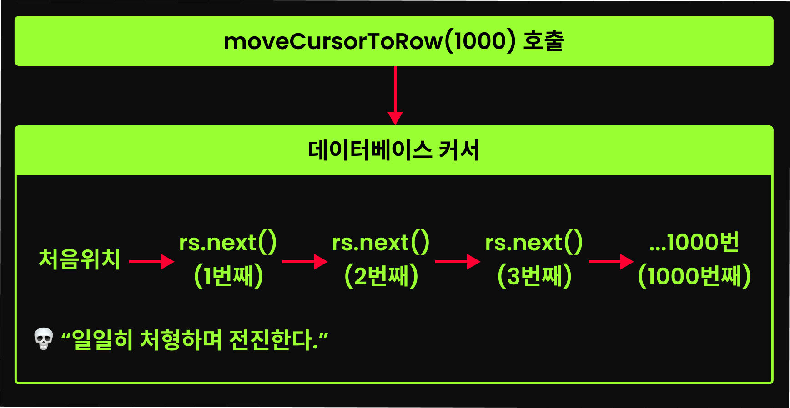

`JdbcPagingItemReader` 같은 경우는, 하기와 같이 pageSize 와 itemIndex 만 있으면 어떤 페이지의 어떤 위치부터 읽어야 하는지 수식 계산으로 알아낼 수 있기 때문에, 재시작 지점을 한번에 알아낼 수 있어 효율적이다.

```java
@Override
protected void jumpToItem(int itemIndex) throws Exception {
   this.lock.lock();
   try {
      page = itemIndex / pageSize;
      current = itemIndex % pageSize;
   }
   finally {
      this.lock.unlock();
   }
   ...
}
```

### update() : 상태 저장

update() 메서드는 **현재 작업이 어디까지 진행되었는지를 저장**한다. 이렇게 저장된 정보가 `open()` 에 의해 사용되어, 작업이 실패했을 때 정확한 재시작 지점을 파악하는데 사용된다.

```java
default void update(ExecutionContext executionContext) throws ItemStreamException {
}
```

update() 메서드 역시 `ExecutionContext` 를 파라미터로 받는다. ItemStream 구현체들은 update() 메서드에서 해당 `ExecutionContext` 에 자신의 현재 실행 정보를 저장한다.

update() 메서드는 매 트랜잭션의 커밋 직전에 호출된다. 단, 처리 도중 예외가 발생하여 트랜잭션이 롤백되는 경우에는 호출되지 않는다. 이는 실패한 처리 내용이 실행 정보에 반영되는 것을 방지한다.

그리고 `ExecutionContext` 에 기록한 정보는 Step이 안전하게 메타데이터 저장소에 보관한다.

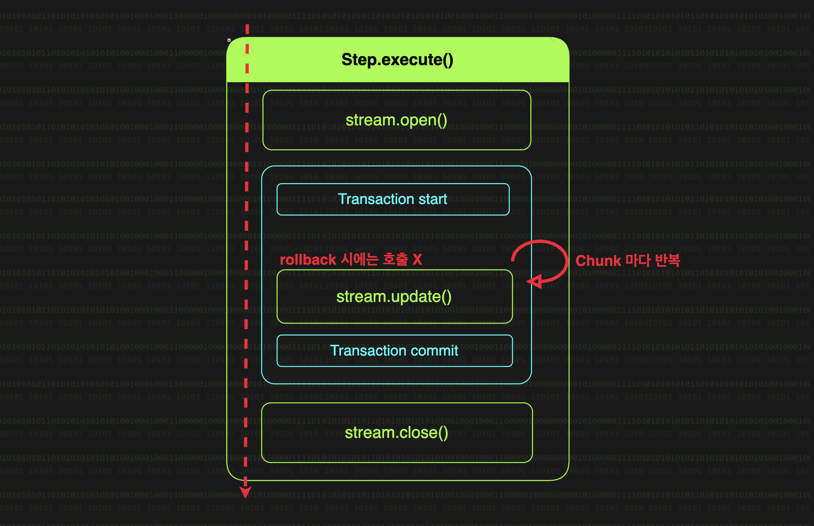

이에 대한 예시로, AbstractItemCountingItemStreamItemReader의 update() 메서드를 보자.

```java
//AbstractItemCountingItemStreamItemReader의 update() 예시
@Override
public void update(ExecutionContext executionContext) throws ItemStreamException {
    //...

    //현재까지 읽은 item 개수 저장
    executionContext.putInt(getExecutionContextKey(READ_COUNT), currentItemCount);

    if (maxItemCount < Integer.MAX_VALUE) {
        executionContext.putInt(getExecutionContextKey(READ_COUNT_MAX), maxItemCount); //읽어들일 수 있는 최대 item 개수 저장
    }

    //...
}
```

> #### 재시작 불가 사례: RedisItemReader
> 
> `RedisItemReader` 는 재시작을 지원하지 않는다. **SCAN 명령의 순서 불일치 때문이다.**

지금까지 살펴본 내용을 정리하자면 하기와 같다.

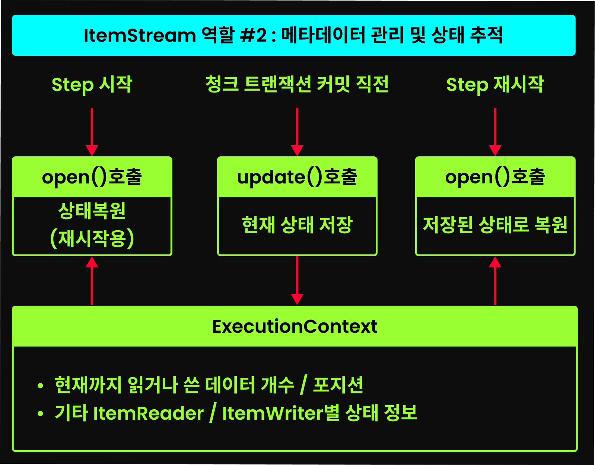

### `CompositeItemReader` 의 ItemStream 처리

```java
//CompositeItemReader 내부코드 예시

@Override
public void open(ExecutionContext executionContext) throws ItemStreamException {
    for (ItemStreamReader<? extends T> delegate : delegates) {
       delegate.open(executionContext);
    }
}

@Override
public void update(ExecutionContext executionContext) throws ItemStreamException {
    if (this.currentDelegate != null) {
        this.currentDelegate.update(executionContext);
    }
}

@Override
public void close() throws ItemStreamException {
    for (ItemStreamReader<? extends T> delegate : delegates) {
        delegate.close();
    }
}
```

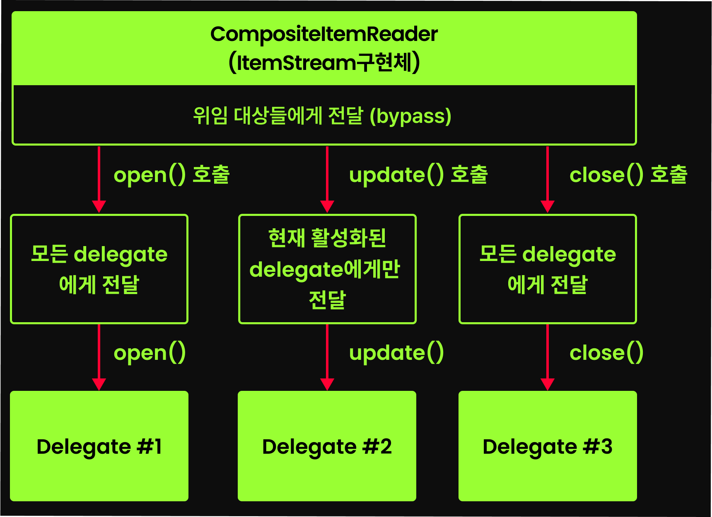

Spring Batch의 스텝이 CompositeItemReader의 open(), update(), close() 메서드를 호출하면, CompositeItemReader는 이를 자신이 가진 위임 대상 ItemReader에게 전달(bypass)한다.

> Spring Batch 5.2.1까지의 CompositeItemReader와 CompositeItemWriter의 close()메소드는, 여러 위임 대상 중 하나의 close() 에서 예외 발생시, 나머지 위임 대상의 close() 가 실행되지 않는 심각한 문제가 있었다.
> 
> 이로 인해 자원 누수가 발생하였으나, 5.2.2 버전에서 해소되었다.

### ItemStream 수동 설정

스텝 빌더를 통해, ItemStream 구현체를 직접 설정할 수 있다.

```java
@Bean
public Step systemLogProcessingStep() {
    return new StepBuilder("systemLogProcessingStep", jobRepository)
            .<SystemLog, SystemLog>chunk(10, transactionManager)
            .reader(systemLogProcessingReader())
            .writer(classifierWriter())
            .stream(criticalLogWriter()) // ItemStream 구현체 직접 전달 (criticalLogWriter 에서 ItemStream 인터페이스를 구현하고 있음)
            .stream(normalLogWriter()) // ItemStream 구현체 직접 전달 (normalLogWriter 에서 ItemStream 인터페이스를 구현하고 있음)
            .build();
}
```

이렇게 직접 설정시 아래 빌더 메서드에 의해 설정되고, 스텝에 등록된 ItemStream 구현체들은 Spring Batch 스텝에 의해 open(), update(), close() 메서드가 자동으로 호출된다.

```java
public B stream(ItemStream stream) {
    streams.add(stream);
    return self();
}
```

### ItemStream 자동 등록 메커니즘

만약 위와 같이 스텝 빌더에서 ItemStream 을 직접 설정하지 않는다면, **`reader()`, `writer()`, `processor()` 메서드로 전달한 컴포넌트가 ItemStream도 구현하고 있는지 확인하여 자동으로 등록한다.**

이는 빌드(`build()`) 시점에 이루어진다.

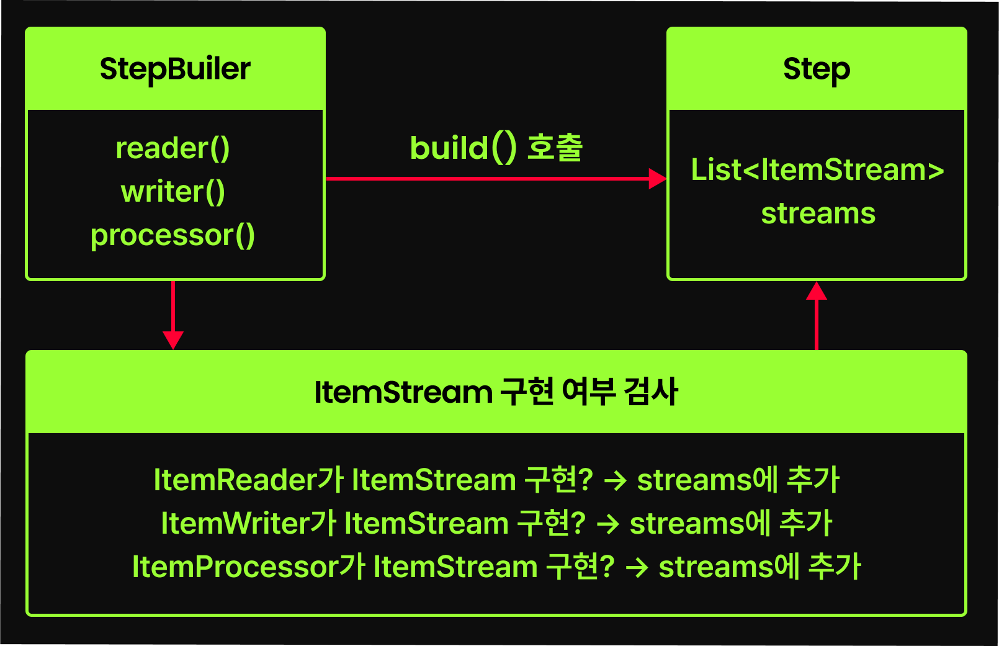

### ItemStream 을 구현한 컴포넌트를 `@StepScope` 로 사용시 주의사항

아래와 같이 Bean 메서드의 반환 타입을 인터페이스로 지정하면, JDK Dynamic Proxy 에 의해 ItemStream 구현이 누락된다.

```java
/**
 * ItemStream 가 구현된 ItemReader 를 ItemReader 인터페이스 타입으로 반환 처리
 */
@Bean
@StepScope //프록시 객체로 생성
public ItemReader<SuspiciousDevice> cafeSquadReader() {
    //...
    //return MongoCursorItemReader -> ItemStream 가 구현되어 있다.
}
```

JDK Dynamic Proxy는 **메서드 반환 타입으로 선언된 인터페이스(`ItemReader`)만을 구현한 프록시 객체를 생성**한다.

따라서 MongoCursorItemReader가 ItemStream을 구현하고 있더라도, 생성된 프록시 객체는 ItemStream 인터페이스를 아예 구현하지 않는 별개의 객체가 되어버린다.

이로 인해, 스텝 빌더는 해당 객체를 **ItemStream과 무관한 것으로 취급하여 ItemStream 등록을 하지 않는다.** 결과적으로 open(), update(), close() 메서드가 호출되지 않는다.

그렇기에, ItemStream가 구현된 컴포넌트를 Bean으로 등록할때는 반드시 구체 구현 클래스 타입으로 반환 타입을 설정해야 한다.

```java
/**
 * MongoCursorItemReader 라는 ItemStream 인터페이스의 구현 클래스로 반환 타입을 설정했기에 문제없다.
 */
@Bean
@StepScope //프록시 객체로 생성
public MongoCursorItemReader<SuspiciousDevice> cafeSquadReader() {
    //...
    //return MongoCursorItemReader -> ItemStream 가 구현되어 있다.
}
```

# ItemProcessor 의 데이터 처리 방식

## 1) `null` 반환을 통한 데이터 필터링 vs 데이터 검증을 통한 실패 처리

ItemProcessor의 `process()` 메서드가 `null`을 반환하면 해당 item은 ItemWriter로 전달되는 Chunk에서 완전히 제외된다.

이 필터링 과정은 구체적으로 하기와 같이 진행된다.

1. Spring Batch는 먼저 지정된 청크 사이즈만큼 `read()` 메서드를 호출하여 input chunk를 생성한다.
2. 생성된 input chunk의 각 item에 대해 ItemProcessor의 `process()` 메서드를 호출한다.
3. 이 과정에서 `process()`가 `null`을 반환한 item은 최종 output chunk에서 제외된다.
4. 결과적으로 ItemWriter에 전달되는 output chunk의 크기는 input chunk의 크기보다 작거나 같아진다.

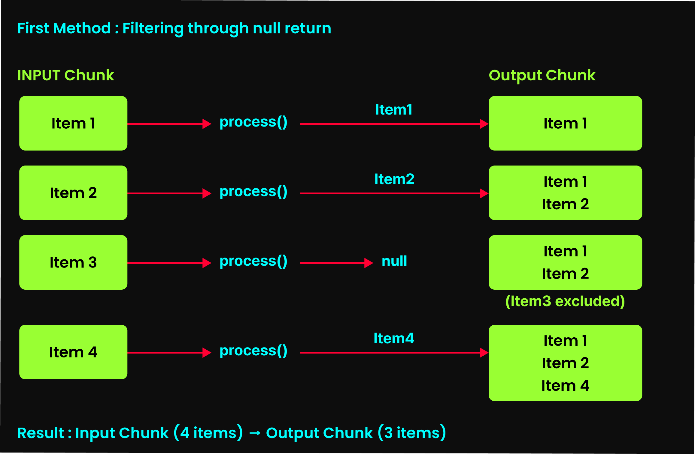

대표적인 필터링 시나리오는 아래와 같다.

- 유효하지 않은 데이터 제거 (비정상적인 금액, 잘못된 주문상태 등)
- 처리가 불필요한 데이터 제외 (휴면계정, 탈퇴회원 등)
- 특정 조건에 맞지 않는 데이터 제외 (기준금액 이하 거래, 특정 상태의 주문 등)

### 데이터 필터링 예시 코드

```java
@Slf4j
public class ExecutionerProcessor implements ItemProcessor<Command, Command> {
    @Override
    public Command process(Command command) {
        // 시스템 파괴 명령어 실행자는 처단
        if (command.getCommandText().contains("rm -rf /") ||
            command.getCommandText().contains("kill -9")) {
            log.info("☠️ {}의 {} -> 시스템 파괴자 처단 완료. 기록에서 말살.",
                command.getUserId(),
                command.getCommandText());
            return null; //필터링
        }

        // sudo 권한 남용자는 처단
        if (command.isSudoUsed() &&
            command.getTargetProcess().contains("system")) {
            log.info("☠️ {}의 sudo {} -> 권한 남용자 처단 완료. 기록에서 抹殺.",
                command.getUserId(),
                command.getCommandText());
            return null; //필터링
        }

        log.info("⚔️ {}의 {} -> 시스템 준수자 생존. 최종 기록 허가.",
            command.getUserId(),
            command.getCommandText());
        return command; //필터링X
    }
}
```

위 코드는 아래와 같이 동작하게 된다.

```text
[Step 시작]

(원본 명령어 로그)
1. ItemReader    → [
   {userId: "dev01", commandText: "ls -al", isSudoUsed: false},
   {userId: "kill9", commandText: "rm -rf /", isSudoUsed: true},
   {userId: "dev02", commandText: "grep kill.log", isSudoUsed: false},
   {userId: "kill9", commandText: "kill -9", isSudoUsed: true}
] 

2. ItemProcessor → userId "kill9"의 치명적 명령어들 `null` 반환 (처단됨)


3. 최종 output Chunk    → [
   {userId: "dev01", commandText: "ls -al", isSudoUsed: false},
   {userId: "dev02", commandText: "grep log", isSudoUsed: false}
]

4. ItemWriter    → 선량한 개발자들의 명령어만 기록에 남음
```

### ValidatingItemProcessor

Spring Batch에서는 이러한 `null` 반환 방식을 활용해 데이터를 검증하는 ItemProcessor 구현체를 제공한다. 그것이 바로 ValidatingItemProcessor 이다.

ValidatingItemProcessor 는 내부적으로 하기와 같은 **Validator를 사용하여 데이터 필터링을 수행**한다.

```java
public interface Validator<T> {
    void validate(T value) throws ValidationException;
}
```

만약 데이터가 검증 조건을 만족하지 못하면, `ValidationException` 을 던지도록 구현하면 된다.

아래는 사용 예시이다.

```java
/**
 * ValidatingItemProcessor 에서 사용할 Validator 구현체
 */
import org.springframework.batch.item.validator.Validator;
import org.springframework.batch.item.validator.ValidationException;

public class CommandValidator implements Validator<Command> {
    @Override
    public void validate(Command command) throws ValidationException {
        if (command.getCommandText().contains("rm -rf /") || 
            command.getCommandText().contains("kill -9")) {
            //하기 예외를 던져, 필터링한다.
            throw new ValidationException(
                "☠️ " + command.getUserId() + 
                "의 " + command.getCommandText() + 
                " → 시스템 파괴 명령어 감지. 처단.");
        }
        
        if (command.isSudoUsed() && 
            command.getTargetProcess().contains("system")) {
            //하기 예외를 던져, 필터링한다.
            throw new ValidationException(
                "☠️ " + command.getUserId() + 
                "의 sudo " + command.getCommandText() + 
                " → 권한 남용 감지. 처단.");
        }
    }
}

@Configuration
public class JobConfiguration {
    @Bean
    public ItemProcessor<Command, Command> commandProcessor(
        Validator<Command> commandValidator
    ) {
        ValidatingItemProcessor<Command> processor = new ValidatingItemProcessor<>(commandValidator);
        processor.setFilter(true); // ValidationException 발생시 null을 반환하여 필터링을 수행하도록 설정
        //processor.setFilter(false); // ValidationException 발생시 예외가 상위로 전달되어 Step이 실패한다.
        return processor;
    }
    
    @Bean
    public Validator<Command> commandValidator() {
        return new CommandValidator();
    }
}
```

만약 `processor.setFilter(false)` 로 설정시, ValidationException 예외가 상위로 전달되어 Step이 실패하게 된다.


## 2) 데이터 변환

ItemReader 에서 읽어온 객체를 비즈니스 요구사항에 맞춰 다른 타입으로 변환해줘야 하는 경우에도 ItemProcessor가 사용될 수 있다.

```java
public interface ItemProcessor<I, O> {
    @Nullable
    O process(@NonNull I item) throws Exception;
}
```

위 ItemProcessor 인터페이스에서 제네릭 타입을 보자.

- `I` : ItemReader 로부터 읽어온 데이터 타입
- `O` : ItemWriter로 전달할 데이터 타입

이는 Spring Batch 스텝의 데이터 흐름을 결정하는데, 스텝빌더를 사용할때 `.<Input, Output>chunk()` 과 같이 메서드를 호출했었을 것이다.

여기서 `Input` 과 `Output` 제네릭 타입은 ItemProcessor의 제네릭 타입 `I`, `O`와 아래와 같은 관계를 갖는다.

- `Input` : ItemReader 에서 읽은 데이터가 ItemProcessor의 입력 `I` 로 전달된다.
- `Output` : ItemProcessor 에서 변환된 데이터 `O` 가 ItemWriter의 입력으로 전달된다.

### 데이터 변환 예시 코드

```java
/**
 * ItemReader 에서 읽은 데이터 타입으로, ItemProcessor에 전달된다.
 */
public class SystemLog {
    private Long userId;      // 실행한 사용자
    private String rawCommand;  // 원본 명령어
    private LocalDateTime executedAt; // 실행 시간
}

/**
 * ItemProcessor에서 SystemLog를 본 클래스타입으로 변환한다. 이를 ItemWriter에 전달한다. 
 */
public class CommandReport {
    private Long executorId;    // 처리된 사용자 ID
    private String action;      // 처리된 행동 설명
    private String severity;    // 위험 등급
    private LocalDateTime timestamp; // 실행 시간
}

/**
 * SystemLog -> CommandReport 변환
 */
@Slf4j
public class CommandAnalyzer implements ItemProcessor<SystemLog, CommandReport> {
    @Override
    public CommandReport process(SystemLog systemLog) {
        CommandReport report = new CommandReport();
        report.setExecutorId(systemLog.getUserId());
        report.setTimestamp(systemLog.getExecutedAt());

        // 명령어 분석 및 위험도 평가 💀
        if (systemLog.getRawCommand().contains("rm -rf")) {
            report.setAction("시스템 파일 제거 시도");
            report.setSeverity("CRITICAL");
        } else if (systemLog.getRawCommand().contains("kill -9")) {
            report.setAction("프로세스 강제 종료 시도");
            report.setSeverity("HIGH");
        } else {
            report.setAction(analyzeCommand(systemLog.getRawCommand()));
            report.setSeverity("LOW");
        }

        log.info("⚔️ {}의 행적 분석 완료: {}", 
                systemLog.getUserId(), 
                report.getAction());
        return report;
    }

    private String analyzeCommand(String command) {
        // 일반 명령어 분석 로직 💀
        return "일반 시스템 명령어 실행";
    }
}
```

## 3) 데이터 보강

때로는 외부 시스템이나 DB에서 추가 정보를 가져와 기존 데이터를 보강해야 하는 경우처럼, 읽어온 데이터만으로는 충분하지 않을 수 있다.

데이터 보강 시나리오는 아래와 같다.

- 거래 내역에 실시간 환율 적용 (외환 API를 통한 원화 환산)
- 주문 데이터에 재고 현황 추가 (창고 시스템 API 조회)
- IP 주소에 지역 정보 보강 (GeoIP API를 통한 국가/도시 정보)

### 데이터 보강 예시 코드

```java
public class SystemLog {
    private Long userId;      // 실행한 사용자
    private String rawCommand;  // 원본 명령어
    private LocalDateTime executedAt; // 실행 시간
    
    // API 호출로 보강될 필드들
    private String serverName;  // 서버 정보
    private String processName; // 프로세스 정보  
    private String riskLevel;   // 위험 등급
}

@Slf4j
@RequiredArgsConstructor
public class SystemLogEnrichItemProcessor implements ItemProcessor<SystemLog, SystemLog> {
    private final ObservabilityApiClient observabilityApiClient;

    @Override
    public SystemLog process(SystemLog systemLog) {
        // 입력: SystemLog{userId=666, rawCommand='kill -9 1234', executedAt=2025-01-15T10:30:00, serverName=null, processName=null, riskLevel=null}

        // 외부 API 호출해서 서버 정보 보강 💀
        ServerInfo serverInfo = observabilityApiClient.getServerInfo(systemLog.getUserId());

        // 기존 SystemLog 객체에 보강된 정보 추가 💀
        systemLog.setServerName(serverInfo.getHostName());
        systemLog.setProcessName(serverInfo.getCurrentProcess());
        systemLog.setRiskLevel(calculateRiskLevel(serverInfo, systemLog.getRawCommand()));

        // 출력: SystemLog{userId=666, rawCommand='kill -9 1234', executedAt=2025-01-15T10:30:00, serverName='chaos-api-05', processName='system-reaper', riskLevel='HIGH'}
        return systemLog;
    }
}
```

### `ItemWriteListener.beforeWrite()`를 통한 외부 시스템 통신 최적화

데이터 보강을 위해 외부 API를 호출하는 경우, 심각한 성능 이슈가 발생할 수 있다.

ItemProcessor의 `process()` 메서드는 **아이템을 하나씩 처리하는 단위성 작업**이다. 이런 특성때문에, Item의 개수만큼 API 호출이 발생할 수 있다.

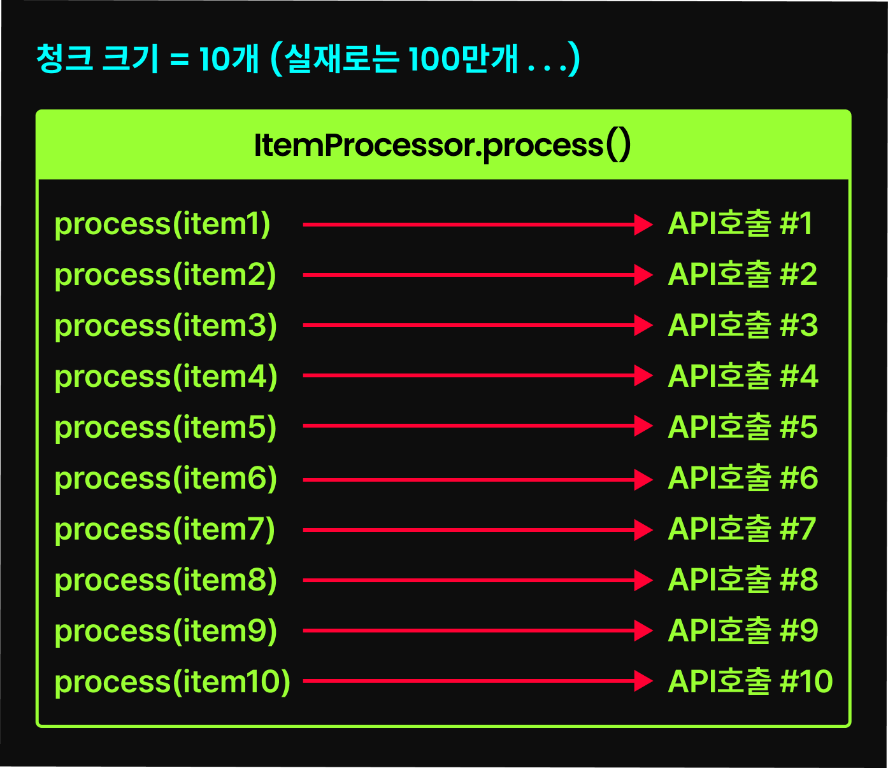

이 문제를 ItemWriteListener 의 `beforeWrite()` 메서드로 해결할 수 있다.

```java
default void beforeWrite(Chunk<? extends S> items) {
}
```

`beforeWrite()` 메서드는 위와 같이 청크 전체를 입력으로 받는다. 따라서 데이터 보강을 위한 API 호출을 `beforeWrite()` 에서 수행하면 통신 횟수를 극적으로 줄일 수 있다.

아래는 청크단위로 벌크API를 호출하여 최적화하는 예시이다.

```java
@Slf4j
@RequiredArgsConstructor
public class SystemLogEnrichListener implements ItemWriteListener<SystemLog> {
    private final ObservabilityApiClient observabilityApiClient;

    @Override
    public void beforeWrite(Chunk<? extends SystemLog> items) {
        List<Long> userIds = items.getItems().stream()
            .map(SystemLog::getUserId)
            .toList();

        // 벌크 API 호출: 청크 단위로 서버 정보를 한 번에 조회 💀
        Map<Long, ServerInfo> serverInfoMap = observabilityApiClient.fetchServerInfos(userIds);

        // 조회된 정보로 각 SystemLog 보강 💀
        items.getItems().forEach(systemLog -> {
            ServerInfo serverInfo = serverInfoMap.get(systemLog.getUserId());
            if (serverInfo != null) {
                systemLog.setServerName(serverInfo.getHostName());
                systemLog.setProcessName(serverInfo.getCurrentProcess());
                systemLog.setRiskLevel(calculateRiskLevel(serverInfo, systemLog.getRawCommand()));
            }
        });

        log.info("💀 청크 내 {}건의 SystemLog 데이터 보강 완료", items.size());
    }
}
```

> ItemWriter 에서 API 호출을 통한 데이터 보강과 데이터 쓰기까지 한번에 수행한다면?
> 
> 가능은 하겠지만, ItemWriter 는 읽기가 아닌 쓰기 작업을 위한 컴포넌트이다. 따라서 단일 책임 원칙에 어긋난다.

## CompositeItemProcessor : 여러 ItemProcessor 사용하기

CompositeItemProcessor 는 여러 위임 대상 ItemProcessor를 순차적으로 실행하는 위임 ItemProcessor 구현체다.

**각 ItemProcessor는 순차적으로 실행되며, 이전 ItemProcessor의 반환값이 다음 ItemProcessor의 입력으로 전달된다. 따라서 타입의 연속성이 매우 중요하다.**

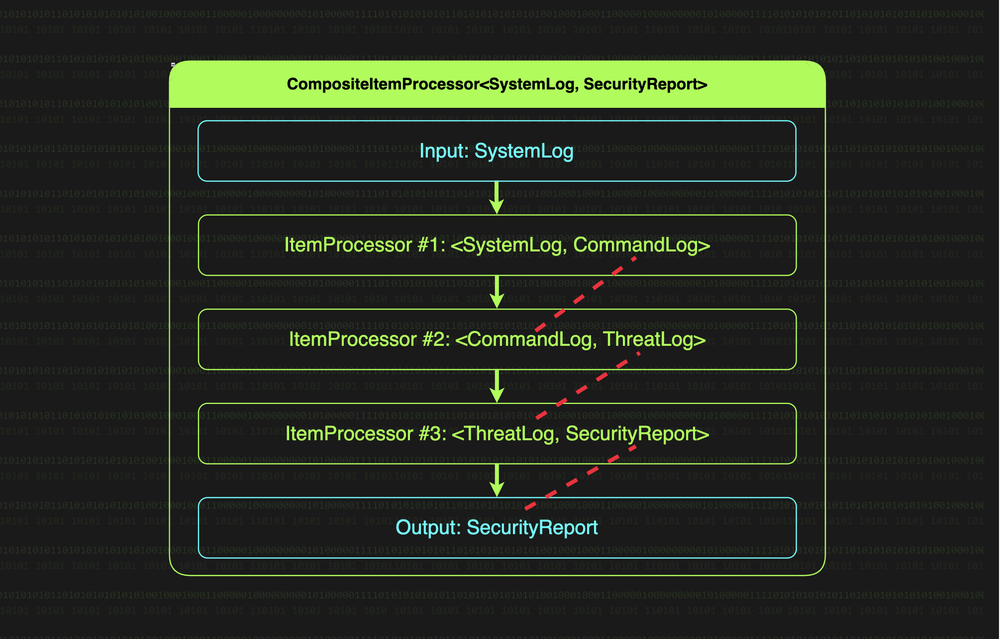

빨간 점선이 보여주듯이 앞단 ItemProcessor의 출력 타입이 다음 ItemProcessor의 입력 타입과 일치해야 한다.

CompositeItemProcessor를 사용하는 방법에는 하기 2가지가 존재한다.

- 생성자에 위임 대상 ItemProcessor들을 전달
- `CompositeItemProcessorBuilder.delegates()` 메서드를 통해 설정

```java
// CompositeItemProcessor 사용
public CompositeItemProcessor(ItemProcessor<?, ?>... delegates) {
    this(Arrays.asList(delegates));
}

// CompositeItemProcessorBuilder 사용
public CompositeItemProcessorBuilder<I, O> delegates(List<? extends ItemProcessor<?, ?>> delegates) {
    this.delegates = delegates;

    return this;
}
```

## ClassifierCompositeItemProcessor : 아이템을 처리할 ItemProcessor 라우팅

ClassifierCompositeItemProcessor는 `Spring의 Classifier`를 사용해 아이템을 처리할 ItemProcessor를 라우팅한다.

이때 주의할 점은 "`Classifier`가 반환하는 모든 ItemProcessor의 입력 타입과 출력 타입"이 "ClassifierCompositeItemProcessor 에서 선언된 타입"과 일치해야 한다는 것이다.

```java
// ClassifierCompositeItemProcessor 사용
public void setClassifier(Classifier<? super I, ItemProcessor<?, ? extends O>> classifier) {
    this.classifier = classifier;
}

// ClassifierCompositeItemProcessorBuilder 사용
public ClassifierCompositeItemProcessorBuilder<I, O> classifier(
        Classifier<? super I, ItemProcessor<?, ? extends O>> classifier) {
    this.classifier = classifier;
    return this;
}
```
