# 태스크릿 지향 처리

---

## 태스크릿 지향 처리 특징

- 단순 작업에 적합
  - 태스크릿 지향 처리는 알림 발송, 파일 복사, 오래된 데이터 삭제 등 단순 작업을 처리하는 Step 유형이다.
- Tasklet 인터페이스 구현
  - 태스크릿 지향 처리는 Tasklet 인터페이스를 구현하여 execute() 메서드에서 작업 로직을 정의한다.
  - 이를 `StepBuilder.tasklet()` 메서드를 사용하여 Step에 할당한다.
- RepeatStatus 로 실행 제어
  - `Tasklet.execute()` 메서드는 `RepeatStatus`를 반환하여 작업의 완료 상태를 나타낸다.
  - `RepeatStatus.FINISHED`를 반환하면 작업이 완료되고, `RepeatStatus.CONTINUABLE`를 반환하면 작업이 계속 실행된다.
- 트랜잭션 지원
  - Spring Batch는 `Tasklet.execute()` 메서드 실행전후로 트랜잭션을 시작하고 커밋하여, DB 일관성과 원자성을 보장한다.
  - 만약 단순 파일 작업이나 외부 API 호출 등 트랜잭션이 필요없는 작업이라면, `ResourcelessTransactionManager` 를 사용하여 트랜잭션 오버헤드를 줄일 수 있다.

## 예시 코드

- [batch-system/src/main/java/com/system/batch/tasklet/ZombieProcessCleanupTasklet.java](batch-system/src/main/java/com/system/batch/tasklet/ZombieProcessCleanupTasklet.java)
- [batch-system/src/main/java/com/system/batch/config/ZombieBatchConfig.java](batch-system/src/main/java/com/system/batch/config/ZombieBatchConfig.java)

# 청크 지향 처리

---

## 청크 지향 처리 특징

- 대부분의 배치 작업, 특히 데이터를 다루는 작업은 `읽기 -> 처리 -> 쓰기 패턴`을 따른다.
- `읽기 -> 처리 -> 쓰기 패턴`을 청크 단위로 수행하는 것을 청크 지향 처리라고 한다.
  - 청크 : 데이터를 일정 단위로 쪼갠 덩어리를 말한다.
- 청크 단위 처리시 장점
  - 대량의 데이터를 한번에 메모리에 올리지 않고도 처리할 수 있다.
  - 트랜잭션 단위를 청크 단위로 설정하여, 실패시 재시도 및 복구가 용이하다.
- 청크 지향 처리 구성 요소
  - `ItemReader` : 데이터를 읽어오는 역할을 한다.
  - `ItemProcessor` : 읽어온 데이터를 가공하는 역할을 한다.
  - `ItemWriter` : 가공된 데이터를 저장하는 역할을 한다.

## `ItemReader` : 데이터 읽기

```java
public interface ItemReader<T> {
    T read() throws Exception, 
        UnexpectedInputException, 
        ParseException, 
        NonTransientResourceException;
}
```

- `ItemReader`는 데이터를 한 건씩 읽어오는 역할을 한다.
- `read()` 메서드는 아이템(row)를 한 건씩 반환하며, 더 이상 읽을 데이터가 없으면 `null`을 반환하며 종료를 알린다.
  - `ItemReader`가 `null`을 반환하는 것이 청크 지향 처리 Step의 종료 시점이라는 점에 주의해야 한다.

## `ItemProcessor` : 데이터 가공 및 처리

```java
public interface ItemProcessor<I, O> {
    O process(I item) throws Exception;
}
```

- `ItemProcessor`는 읽어온 데이터를 가공하는 역할을 한다.
- `process()` 메서드는 입력 아이템(`I`)을 받아 가공된 출력 아이템(`O`)을 반환한다.
- 필요에 따라 `null`을 반환하여 해당 아이템을 건너뛸 수도 있다. 즉, `null`을 반환하면 해당 아이템은 `ItemWriter`로 전달되지 않는다. 유효하지 않은 데이터나 생략할 수 있는 데이터를 필터링할 때 유용하다.
- 경우에 따라, 입력 데이터의 유효성을 검사할 때도 사용된다. 조건에 맞지 않는 데이터를 만나는 경우, 예외를 발생시켜 배치 작업을 중단할 수도 있다.
- `ItemProcessor`는 선택적 구성 요소이다. 모든 청크 지향 처리 Step에 반드시 포함될 필요는 없다.
- 청크 크기만큼 `ItemReader.read()` 메서드로 데이터를 모두 읽어온 후에, 각 아이템에 대해 `ItemProcessor.process()` 메서드를 호출하여 가공한다.
  - 한 개의 데이터를 `ItemReader.read()` 가 읽어온 뒤 바로 `ItemProcessor.process()` 가 처리하는 것이 아니다.

## `ItemWriter` : 데이터 쓰기

```java
public interface ItemWriter<T> {
    void write(Chunk<? extends T> chunk) throws Exception;
}
```

- `ItemWriter`는 가공된 데이터를 저장하는 역할을 한다.
- `write()` 메서드는 가공된 아이템들을 청크 단위로 받아, 한 번에 저장한다. (파라미터 타입이 `Chunk` 인 것에 주목하자.)
  - `ItemProcessor` 의 `process()` 메서드는 청크 전체를 입력받지 않고, 아이템 단위로 처리한다.
- `ItemWriter`는 데이터베이스에 저장하거나, 파일에 기록하거나, 외부 시스템에 전송하는 등 다양한 방식으로 데이터를 쓸 수 있다.

## Reader-Processer-Writer 패턴

청크 지향 처리의 핵심은 `ItemReader`, `ItemProcessor`, `ItemWriter`가 협력하여 데이터를 처리하는 것이다.

이를 통한 장점은 다음과 같다.

1. **완벽한 책임 분리** : 각 컴포넌트는 자신의 역할만 수행한다. `ItemReader`는 읽기, `ItemProcessor`는 가공, `ItemWriter`는 쓰기에만 집중한다. 덕분에 코드는 명확해지고 유지보수는 간단해진다.

2. **재사용성 극대화** : 컴포넌트들은 독립적으로 설계되어 있어 어디서든 재사용 가능하다. 새로운 배치를 만들 때도 기존 컴포넌트들을 조합해서 빠르게 구성할 수 있다.

3. **높은 유연성** : 요구사항이 변경되어도 해당 컴포넌트만 수정하면 된다. 데이터 형식이 바뀌면 `ItemProcessor`만, 데이터 소스가 바뀌면 `ItemReader`만 수정하면 된다. 이런 독립성 덕분에 변경에 강하다.

4. **대용량 처리의 표준** : 데이터를 다루는 배치 작업은 결국 '읽고-처리하고-쓰는' 패턴을 따른다. Spring Batch는 이 패턴을 완벽하게 구조화했다.

## 예시 코드

```java
@Bean
public Step processStep(JobRepository jobRepository, PlatformTransactionManager transactionManager) {
   return new StepBuilder("processStep", jobRepository)
           .<CustomerDetail, CustomerSummary>chunk(10, transactionManager)  // 청크 지향 처리 활성화
           .reader(itemReader())       // 데이터 읽기 담당
           .processor(itemProcessor()) // 데이터 처리 담당
           .writer(itemWriter())      // 데이터 쓰기 담당
           .build();
}

@Bean
public Job customerProcessingJob(JobRepository jobRepository, Step processStep) {
   return new JobBuilder("customerProcessingJob", jobRepository)
           .start(processStep)  // processStep으로 Job 시작
           .build();
}
```

- `reader()`: `ItemReader` 구현체를 전달받아 Step의 읽기 작업을 담당할 컴포넌트로 등록한다.
- `processor()`: `ItemProcessor` 구현체를 전달받아 Step의 처리 작업을 담당할 컴포넌트로 등록한다. `ItemProcessor`가 필요하지 않다면 생략 가능하며, 이 경우 `ItemReader`가 읽은 데이터가 그대로 `ItemWriter`로 전달된다.
- `writer()`: `ItemWriter` 구현체를 전달받아 Step의 쓰기 작업을 담당할 컴포넌트로 등록한다.

## 청크 지향 처리 흐름도


## 청크 지향 처리 반복 흐름도


# JobParameters

---

## JobParameters 란

- `JobParameters`는 Spring Batch에서 배치 작업 실행 시 전달되는 매개변수 집합을 나타낸다.
- **배치 작업 실행 시점**에 동적으로 값을 주입하여, 동일한 Job 을 다양한 상황에 맞게 실행할 수 있도록 한다.

## 다양한 JobParameters 전달 방법

### 커맨드라인에서 잡 파라미터 전달하기

JobParameters는 커맨드라인에서 `key=value,type` 형식으로 전달할 수 있다.

단, `type`은 생략 가능하며, 생략 시 기본적으로 `String` 타입으로 간주된다.

> `key=valuye,type,identificationFlag` 형식도 지원되며, `identificationFlag`는 해당 파라미터가 Job 식별에 사용되는지 여부를 나타낸다. 기본값은 `true` 이다.
> 자세한 내용은 추후 다룬다.

```
--spring.batch.job.name={jobName} {key1}={value1},{type1} {key2}={value2},{type2} ...
```

아래는 예시이다.

```shell
./gradlew bootRun --args='--spring.batch.job.name=dataProcessingJob inputFilePath=/data/input/users.csv,java.lang.String'
```

커맨드라인 문자열로 전달된 JobParameters는 Spring Batch의 `DefaultJobParametersConverter` 컴포넌트를 통해 적절한 타입으로 변환된다.

자세한 내용은 [DefaultJobParametersConverter](https://docs.spring.io/spring-batch/docs/current/api/org/springframework/batch/core/converter/DefaultJobParametersConverter.html)와 [DefaultConversionService](https://docs.spring.io/spring-framework/docs/current/javadoc-api/org/springframework/core/convert/support/DefaultConversionService.html) 를 참고하자.

### 기본 파라미터 표기법의 한계

- 파라미터 값에 쉼표 문자가 포함된 경우, 기본 표기법으로는 이를 구분할 수 없다.
- 예를 들어, `filePath=/data/input/file,name.csv,String` 와 같이 쉼표가 포함된 값을 전달하면, Spring Batch는 이를 `filePath` 키에 대한 값으로 올바르게 인식하지 못한다.
- 이 경우, JSON 형식의 JobParameters를 사용할 수 있다.

### JSON 형식으로 JobParameters 전달하기

아래와 같은 형식으로 JSON 문자열을 사용하여 JobParameters를 전달할 수 있다.

```
key1='{ "value":"value1", "type":"java.lang.String", "identifying":true }' key2='{ "value":"value1", "type":"java.lang.String", "identifying":false }''
```

## JobLauncherApplicationRunner

### JobLauncherApplicationRunner 란?

- JobLauncherApplicationRunner 는 Spring Boot 가 제공하는 ApplicationRunner의 한 종류이다.
- 커맨드라인으로 전달된 Spring Batch 잡 파라미터를 해석하고 이를 바탕으로 실제 Job을 실행하는 역할을 수행한다.

### JobLauncherApplicationRunner 가 수행하는 처리 과정

1. Job 목록 준비
    - Spring Boot에 의해 ApplicationContext에 등록된 모든 Job 타입 Bean이 JobLauncherApplicationRunner 에 자동 주입된다.
2. 유효성 검증
    - 만약 애플리케이션 컨텍스트에 Job 타입의 Bean 이 여러개인 경우 : `--spring.batch.job.name` 을 지정하지 않으면 검증 실패
    - 만약 애플리케이션 컨텍스트에 Job 타입의 하나인 경우 : `--spring.batch.job.name` 생략 가능
3. 명령어 해석
    - 커맨드라인으로 전달된 값들을 파싱한다.
    - DefaultJobParametersConverter 을 사용하여, `key=value` 형식의 인자들을 적절한 타입의 JobParameter 로 변환한다.
4. Job 실행
    - 1번에서 주입받은 Job 목록 중, `--spring.batch.job.name` 에 해당하는 Job을 찾는다.
    - 해당 Job을 변환된 JobParameters 와 함께 실행한다.

## Job Parameter 를 가져오는 방법

### `@Value` 사용

```java
@Bean
@StepScope //꼭 함께 사용해야함.
public Tasklet terminatorTasklet1(
    @Value("#{jobParameters['terminatorId']}") String terminatorId,
    @Value("#{jobParameters['targetCount']}") Integer targetCount
) { ... }
```

### Context 에서 가져오기

```java
@Component
public class SystemDestructionTasklet implements Tasklet {
    @Override
    public RepeatStatus execute(StepContribution contribution, ChunkContext chunkContext) throws Exception {
        //스텝 컨텍스트 객체로부터 가져온다.
        JobParameters jobParameters = chunkContext.getStepContext()
            .getStepExecution()
            .getJobParameters();

        String targetSystem = jobParameters.getString("system.target");
        long desctructionLevel = jobParameters.getLong("system.destruction.level");
     
        //...
    }
}
```
## Job Parameter 값 검증

### 직접 Validator 구현하는 방법

#### 1. JobParametersValidator 구현

```java
@Component
public class MyJobParametersValidator implements JobParametersValidator {
    @Override
    public void validate(JobParameters parameters) throws JobParametersInvalidException {
        if (parameters.getLong("system.destruction.level") < 0) {
            throw new JobParametersInvalidException("system.destruction.level must be greater than or equal to 0");
        }
    }
}
```

#### 2. JobParametersValidator 를 Job에 등록

```java
@Bean
public Job processTerminatorJob(JobRepository jobRepository, Step terminationStep, MyJobParametersValidator myJobParametersValidator) {
    return new JobBuilder("processTerminatorJob", jobRepository)
        .validator(systemDestructionValidator) //잡 파라미터 검증기 등록
        .start(terminationStep)
        .build();
}
```

### 기본 Validator 사용

Spring Batch 에서는 `DefaultJobParametersValidator` 이라는 기본 구현체를 제공한다.

단순히 파라미터의 존재 여부만 확인하며 될 때는 이걸 사용하면 된다.

#### 예시 코드

```java
@Bean
public Job systemDestructionJob(
    JobRepository jobRepository, 
    Step systemDestructionStep
) {
    return new JobBuilder("systemDestructionJob", jobRepository)
        .validator(new DefaultJobParametersValidator(
            new String[]{"destructionPower", "other param1"},  // 필수 파라미터
            new String[]{"targetSystem", "other param2"}       // 선택적 파라미터
        ))
        .start(systemDestructionStep)
        .build();
}
```

- `DefaultJobParametersValidator` 생성자의 첫번째 파라미터로 전달한 값이 필수 파라미터가 된다.
- `DefaultJobParametersValidator` 생성자의 두번째 파라미터로 전달한 값이 선택적 파라미터가 된다.

# Job 과 Step 의 Scope

---

일반적인 Spring 애플리케이션은 싱글톤 기본 스코프를 제공한다.

하지만 Spring Batch 는 이와 다르게, **JobScope** 와 **StepScope** 를 제공한다.

## JobScope 와 StepScope 의 라이프사이클

- JobScope 와 StepScope 가 선언된 Bean 은 애플리케이션 구동 시점에서는 우선 프록시 객체로만 존재한다.
- 그 후, Job 이나 Step 이 실행된 후에 프록시 객체에 접근을 시도하면 그때 실제 Bean 이 생성된다.

아래는 전체적인 라이프사이클이다.


## `@JobScope`

`@JobScope` 는 Job이 실행될 때 실제 빈이 생성되고, Job이 종료될 때 함께 제거되는 스코프이다. 즉, JobExcution 과 생명주기를 같이 한다.

```java
@Bean
@JobScope
public Step systemDestructionStep(
    @Value("#{jobParameters['destructionPower']}") Long destructionPower
) {
    return new StepBuilder("systemDestructionStep", jobRepository)
        .tasklet((contribution, chunkContext) -> {
            log.info("시스템 파괴 프로세스가 시작되었습니다. 파괴력: {}", destructionPower);
            return RepeatStatus.FINISHED;
        }, transactionManager)
        .build();
}
```

위 코드에 선언된 `@JobScope` 로 발생하는 효과는 아래와 같다.

- **지연된 빈 생성 (Lazy Bean Creation)**
  - `@JobScope` 가 적용된 빈은 애플리케이션 구동 시점에서 프록시 객체만 생성된다.
  - 빈의 실제 인스턴스는 Job이 실행될 때 생성되고, Job이 종료되면 소멸한다.
- **Job 파라미터와의 연동**
  - 빈이 지연 생성되니, **애플리케이션 실행 중에 전달되는 JobParameters를 Job 실행 시점에 생성되는 `systemDestructionStep` 빈에 넣어줄 수 있게 된다.**
- **병렬처리 지원**
  - 여러 쓰레드가 "동일한 Job 정의"를 실행하더라도, 각각의 JobExecution 마다 서로 다른 `systemDestructionStep` 빈이 생성된다. 따라서 동시성 문제에 대해 안전해진다.

아래 예시로 좀더 쉽게 이해될 것이다.

### RestAPI로 요청을 받아서, 동적으로 Batch 를 실행하는 예시

1. SpringMVC 와 SpringBatch 로 구현된 하나의 애플리케이션이 존재.
2. 애플리케이션 실행
3. `@JobScope` 가 적용된 Bean 은 즉시 초기화되는 것이 아니라, 프록시 상태로 존재하게 됨.
   - 이 시점에서는 아직 JobParameter 를 전달받지 못했다. (RestAPI로 요청이 들어와야 알 수 있으므로)
   - 따라서 `@Value` 로 전달받을 JobParameter 값을 아직 모르고, 그렇기 때문에 프록시 객체로 생성되어야 한다.
4. 동시에 여러 요청 A, B가 들어왔고, 각각 다른 JobParameter 를 전달한다.
   - 이 요청에 따라, 각 쓰레드는 서로 동일한 "Job 정의" 를 실행하여 각각의 JobExecution 이 동작한다.
   - `@JobScope` 가 적용된 Bean 은 JobExecution 마다 생성/초기화되기 때문에 동시성 문제에서 자유롭다.

## `@StepScope`

`@StepScope` 는 `@JobScope` 와 동일한 방식으로 동작하지만, 적용 범위에 있어 차이가 있다.

- `@JobScope` : Job 의 실행범위에서 빈을 관리한다.
- `@StepScope` : Step 의 실행범위에서 빈을 관리한다.

### 예시 코드

```java
@Bean
public Step infiltrationStep(
    JobRepository jobRepository,
    PlatformTransactionManager transactionManager,
    Tasklet systemInfiltrationTasklet
) {
    return new StepBuilder("infiltrationStep", jobRepository)
        .tasklet(systemInfiltrationTasklet, transactionManager)
        .build();
}

@Bean 
@StepScope 
public Tasklet systemInfiltrationTasklet(
    @Value("#{jobParameters['infiltrationTargets']}") String infiltrationTargets
) {
    return (contribution, chunkContext) -> {
        String[] targets = infiltrationTargets.split(",");
        log.info("시스템 침투 시작");
        log.info("주 타겟: {}", targets[0]);
        log.info("보조 타겟: {}", targets[1]);
        log.info("침투 완료");
        return RepeatStatus.FINISHED;
    };
}
```

- `systemInfiltrationTasklet` 에 `@StepScope` 가 적용되어 있다. 이 Tasklet 빈이 Step 의 생명주기와 함께한다는 것을 알 수 있다.
- 즉, 각각의 Step 마다 새로운 `systemInfiltrationTasklet` 이 생성되고, Step 이 종료될 때 함께 제거된다.
- 만약 동시에 여러 Step이 실행되면서 `systemInfiltrationTasklet` 을 사용한다고 해도, `@StepScope` 가 있기 때문에 각 Step 실행마다 독립적인 Tasklet 인스턴스가 생성된다. 따라서 어떠한 동시성 이슈도 발생하지 않는다.

## JobScope 와 StepScope 사용시 주의사항

### 1. 프록시 대상의 타입이 클래스인 경우, 반드시 상속 가능한 클래스여야 한다.

- `@JobScope` 와 `@StepScope` 모두 프록시 객체를 만들기 위해서, CGLIB 를 사용해 클래스 기반의 프록시를 생성한다.
- 따라서 프록시 생성을 위해 반드시 상속 가능한 클래스여야 한다.

### 2. Step 빈에는 `@StepScope` 와 `@JobScope` 를 사용하면 안된다.

#### 2-1. Step 빈에 `@StepScope` 를 설정하는 경우

```java
@Bean
@StepScope
public Step systemDestructionStep(
    SystemInfiltrationTasklet tasklet
) {
    return new StepBuilder("systemDestructionStep", jobRepository)
        .tasklet(tasklet, transactionManager)
        .build();
}
```

- 위 코드를 보면 "Step 정의 빈"에 `@StepScope` 를 적용했다. 이 경우, 오류가 발생하게 된다.
- 이유는 당연하다. 아직 Step 이 없는데, StepScope 를 찾으니 그렇다.


#### 2-2. Step 빈에 `@JobScope` 를 설정하는 경우

```java
@Bean
@JobScope  // Step에 @JobScope를 달았다
public Step systemDestructionStep(
   @Value("#{jobParameters['targetSystem']}") String targetSystem
) {
   return new StepBuilder("systemDestructionStep", jobRepository)
       .tasklet((contribution, chunkContext) -> {
           log.info("{} 시스템 침투 시작", targetSystem);
           return RepeatStatus.FINISHED;
       }, transactionManager)
       .build();
}
```

- 이번에는 "Step 정의 빈"에 `@JobScope` 를 적용했다. 이 경우, 실행시 오류가 발생하지는 않는다. (Job 실행 후, JobScope 를 찾았으므로)
- 하지만 이 경우, 아래 상황에서 문제가 발생할 수 있다. (자세한 것은 추후 설명한다.)
  - JobOperator를 통한 Step 실행 제어 시
  - Spring Integration(Remote Partitioning)을 활용한 배치 확장 기능 사용 시
- 따라서 위 코드를 아래와 같이 Tasklet 을 사용하도록 수정해야 한다.

```java
@Bean
public Step systemDestructionStep(
    SystemInfiltrationTasklet tasklet  // Tasklet을 주입받는다
) {
    return new StepBuilder("systemDestructionStep", jobRepository)
        .tasklet(tasklet, transactionManager)
        .build();
}

@Slf4j
@Component
@StepScope  // Tasklet에 @StepScope를 달았다
public class SystemInfiltrationTasklet implements Tasklet {
    private final String targetSystem;

    public SystemInfiltrationTasklet(
        @Value("#{jobParameters['targetSystem']}") String targetSystem
    ) {
        this.targetSystem = targetSystem;
    }

    @Override
    public RepeatStatus execute(StepContribution contribution, ChunkContext context) {
        log.info("{} 시스템 침투 시작", targetSystem);
        return RepeatStatus.FINISHED;
    }
}
```

### JobScope와 StepScope의 동작원리

Spring Batch는 ThreadLocal에 `ExecutionContext` 와 `JobParameters` 를 바인딩함으로써, JobScope와 StepScope를 구현한다.

구조적인 흐름은 아래와 같다. 설명하지 않은 키워드는 글 후반부에서 알수있다.

#### JobScope 구조적 흐름

| 단계 | 수행주체 | 동작내용                                        |
|----|------|---------------------------------------------|
|  1. 로딩 시점  |   Spring Container   | `@JobScope` 빈을 Proxy 객체로 등록 (실제 생성 보류)      |
| 2. Job 실행 직전   |   JobLauncher / Job   | **JobSynchronizationManager**를 통해 현재 쓰레드의 ThreadLocal에 **JobContext**를 바인딩 |
|  3. 빈 주입/사용 시점  |   Proxy Bean   | JobParameters나 JobExecutionContext의 값을 참조하는 시점에 JobContext에서 데이터를 꺼내 실제 빈을 생성 |
|  4. Job 종료 시점  |   Job   | Job 실행이 완료되면 JobSynchronizationManager에서 컨텍스트를 제거하고 관련 빈들을 소멸        |

#### StepScope 구조적 흐름

| 단계 | 수행주체 | 동작내용 |
|----|------|------|
|  1. 로딩 시점  |   Spring Container   |    `@StepScope` 빈을 Proxy 객체로 등록 (실제 생성 보류)  |
| 2. 실행 시점   |   StepRunner   |    현재 쓰레드의 **ThreadLocal**에 StepContext를 바인딩  |
|  3. 호출 시점  |   Proxy Bean   |   메서드 호출 시 ThreadLocal에서 데이터를 꺼내 진짜 빈 생성 및 주입   |
|  4. 종료 시점  |   StepRunner   |   해당 쓰레드에서 StepContext를 제거 (Clean-up)   |

#### JobScope와 StepScope의 동작원리의 핵심

여기서 중요한 것은 Job 레벨의 ExecutionContext와 Step 레벨의 ExecutionContext가 **ThreadLocal 에 저장**된다는 것이다.

이를 통해, 동일한 Job 정의를 여러 쓰레드가 동시에 실행하더라도, **각 쓰레드는 자신만의 독립적인 ExecutionContext를 가지게 된다.**

따라서 동시성 문제에서 자유로워진다.

### SpEL 표현식과 JobContext/StepContext 간의 관계

`#{jobParameters}` 이런식으로 SpEL을 사용하여 관련 값을 가져왔었다.

이는 JobContext/StepContext 의 getter 메서드를 사용하는 것과 같다.

JobContext 와 StepContext 의 내부 메서드를 보면 아래와 같다.

```java
public Map<String, Object> getStepExecutionContext() {
    return stepExecution.getExecutionContext().toMap();
}

public Map<String, Object> getJobExecutionContext() {
    return stepExecution.getJobExecution().getExecutionContext().toMap();
}

public Map<String, Object> getJobParameters() {
    Map<String, Object> result = new HashMap<>();
    for (Entry<String, JobParameter<?>> entry : stepExecution.getJobParameters().getParameters().entrySet()) {
       result.put(entry.getKey(), entry.getValue().getValue());
    }
    return Collections.unmodifiableMap(result);
}
```

| SpEL 표현식  | JobContext/StepContext 메서드 |
|---|----------------------------|
| #{jobParameters}  |      getJobParameters()                      |
| #{stepExecutionContext}  |         getStepExecutionContext()                   |
| #{jobExecutionContext}  |               getJobExecutionContext()             |

**위와 같이 매핑되고, JobContext/StepContext에 존재하는 다른 메서드를 당연히 호출할 수도 있다.**

이것이 가능한 이유는 아래처럼 `BeanWrapperImpl` 로 생성되기 때문이다.

```java
// StepScope.resolveContextualObject()
@Override
public Object resolveContextualObject(String key) {
    StepContext context = getContext();  // 1. StepContext 확보
    return new BeanWrapperImpl(context).getPropertyValue(key);  // 2. BeanWrapperImpl
}
```

`#{jobParameters['name']}` 를 예시로 값을 가져오는 절차를 정리해보면 아래와 같다.

1. SpEL 엔진의 가동
   - Spring Batch가 `@StepScope` 빈을 만들 때 `#{...}`를 발견하면 `SpelExpressionParser`를 깨운다.
   - 엔진은 `jobParameters`라는 단어와 `['name']`이라는 키를 인식한다.
2. 데이터 타겟(EvaluationContext) 지정
   - 엔진은 값을 어디서 찾을지 결정해야하는데, Spring Batch는 현재 실행 중인 스텝의 정보를 담은 **StepContext**를 엔진에게 던져준다.
   - 이것이 EvaluationContext 가 된다.
3. BeanWrapperImpl의 개입
   - 엔진이 StepContext에서 `jobParameters`라는 속성을 찾으려고 할 때, 직접 객체를 뒤지는 게 아니라 **BeanWrapperImpl**을 사용한다.
4. BeanWrapperImpl 를 통한 값 조회
   - BeanWrapperImpl은 StepContext 클래스를 슥 훑어서 `getJobParameters()`라는 메서드가 있는지 확인.
   - 메서드가 있으면 리플렉션으로 호출해서 실제 `Map<String, Object>` 객체를 받아옴.
   - 이제 SpEL 엔진은 받아온 Map에서 `['name']`이라는 키로 값을 꺼내옴.


## 컴파일 시점에 없는 Job Parameter 값을 참조하는 방법

JobBuilder 빈에서 StepBuilder 빈을 참조할 때, 아래와 같이 처리할 수 있다.

```java
// 1. 빈 주입 방식
@Bean
public Job systemTerminationJob(Step systemDestructionStep) {  // Spring이 주입
    return new JobBuilder("systemTerminationJob", jobRepository)
            .start(systemDestructionStep)
            .build();
}

// 2. 메서드 직접 호출 방식
@Bean
public Job systemTerminationJob() {
    return new JobBuilder("systemTerminationJob", jobRepository)
            .start(systemDestructionStep(null))  // Job 파라미터 자리에 null 전달
            .build();
}
```

null을 전달하여 당장의 코드 레벨에서의 참조를 만족시키면, 실제 값은 Job이 실행될 때 입력받은 JobParameters의 값으로 주입된다.

## JobScope 와 StepScope 빈에서 ExecutionContext 의 데이터에 접근하는 방법

### ExecutionContext 란?

- 비즈니스 로직 처리 중에 발생하는 커스텀 데이터를 관리할 방법이 필요한데, 이때 사용하는 것이 바로 ExecutionContext라는 데이터 컨테이너다.
- ExecutionContext를 활용하면 커스텀 컬렉션의 마지막 처리 인덱스나 집계 중간 결과물 같은 데이터를 저장할 수 있다.
- 이는 Job이 중단된 후 재시작할 때 특히 유용하다. Spring Batch가 재시작 시 ExecutionContext의 데이터를 자동으로 복원하므로, 중단된 지점부터 처리를 이어갈 수 있기 때문이다.
- ExecutionContext도 메타데이터 저장소에서 관리하여, 안전하게 보존된다.

### ExecutionContext 에서 데이터 꺼내기

```java
@Bean
@JobScope  
public Tasklet systemDestructionTasklet(
  @Value("#{jobExecutionContext['previousSystemState']}") String prevState
) {
  // JobExecution의 ExecutionContext에서 이전 시스템 상태를 주입받는다
}

@Bean
@StepScope
public Tasklet infiltrationTasklet(
  @Value("#{stepExecutionContext['targetSystemStatus']}") String targetStatus
) {
  // StepExecution의 ExecutionContext에서 타겟 시스템 상태를 주입받는다
}

@Bean
@StepScope
public Tasklet infiltrationTasklet(
        @Value("#{jobExecutionContext['previousSystemState']}") String prevState
) {
    // StepScope 에서도 JobExecution의 ExecutionContext에 접근할 수 있다.
}
```

위 코드의 `jobExecutionContext`와 `stepExecutionContext` 는 각각 다른 범위를 가진다.

- `@JobScope` 에서 가져온 ExecutionContext : Job에 속한 모든 컴포넌트(Step, Tasklet 등등...)에서 `@Value("#{jobExecutionContext['key']}")` 로 접근할 수 있다.
- `@StepScope` 에서 가져온 ExecutionContext : 해당 Step에 속한 컴포넌트에서만 접근할 수 있다.
- Step ExecutionContext 의 데이터 접근 제한 : Step 간의 데이터 독립성을 보장하기 위해, 아래와 같은 제약사항이 있다.
  - Step의 ExecutionContext에 저장된 데이터는 `@Value("#{jobExecutionContext['key']}")` 로 접근할 수 없다. 즉, Step 수준의 데이터를 Job 수준에서 가져올 수 없다.
  - 한 Step의 ExecutionContext는 다른 Step에서 접근할 수 없다. 예를 들어, StepA의 ExecutionContext에 저장된 데이터를 StepB에서 `@Value("#{stepExecutionContext['key']}")` 로 가져올 수 없다.

# Spring Batch Listener

---

## Spring Batch Listener 란?

리스너는 배치 처리의 주요 순간들을 관찰하고, 각 시점에 필요한 동작을 정의할 수 있는 강력한 도구이다.

즉, 배치 처리 중 발생하는 특정 이벤트를 감지하고 원하는 로직을 실행할 수 있게 해준다.

이를 통해, 로깅, 모니터링, 알림 전송, 리소스 정리 등 다양한 부가 기능을 손쉽게 구현할 수 있다.

## Spring Batch가 제공하는 주요 Listener 인터페이스

### JobExecutionListener

```java
public interface JobExecutionListener {
    default void beforeJob(JobExecution jobExecution) { }
    default void afterJob(JobExecution jobExecution) { }
}
```

- Job의 시작과 종료 시점에 호출되는 리스너 인터페이스이다.
- `beforeJob()` 메서드는 Job이 시작되기 전에 호출되며, 초기화 작업이나 로깅 등에 활용할 수 있다.
- `afterJob()` 메서드는 Job이 종료된 후에 호출되며, 결과 처리나 정리 작업 등에 활용할 수 있다.
  - 특히, Job의 성공/실패 여부와 관계없이 무조건 호출된다.

### StepExecutionListener

```java
public interface StepExecutionListener extends StepListener {
    default void beforeStep(StepExecution stepExecution) {
    }

    @Nullable
    default ExitStatus afterStep(StepExecution stepExecution) {
	return null;
    }
}
```

- Step의 시작과 종료 시점에 호출되는 리스너 인터페이스이다.
- `beforeStep()` 메서드는 Step이 시작되기 전에 호출되며, Step 초기화 작업이나 로깅 등에 활용할 수 있다.
- `afterStep()` 메서드는 Step이 종료된 후에 호출되며, 결과 처리나 정리 작업 등에 활용할 수 있다.
  - Step의 성공/실패 여부와 관계없이 무조건 호출된다.

### ChunkListener

```java
public interface ChunkListener extends StepListener {
    default void beforeChunk(ChunkContext context) {
    }

    default void afterChunk(ChunkContext context) {
    }
	
    default void afterChunkError(ChunkContext context) {
    }
}
```

- 청크 단위 처리의 시작과 종료 시점에 호출되는 리스너 인터페이스이다.
- `beforeChunk()` 메서드는 청크 처리가 시작되기 전에 호출되며, 초기화 작업이나 로깅 등에 활용할 수 있다.
- `afterChunk()` 메서드는 트랜잭션이 커밋된 후에 호출된다.
- `afterChunkError()` 메서드는 청크 트랜잭션이 롤백된 이후에 호출된다.

> ChunkListener 는 청크 지향 Step 뿐만 아니라, Tasklet 지향 Step 에서도 사용할 수 있다.
> Tasklet 의 `execute()` 메서드 호출 전후, 그리고 예외 발생 시점에 각각 호출된다.
> 또한 RepeatStatus.CONTINUABLE 을 반환하여 반복 실행되는 Tasklet 에서도 매 반복마다 호출된다. (StepExecutionListener 는 Step 의 시작/종료 시점에만 호출되므로, 반복되는 Tasklet 이라도 한번만 호출된다.)

### ItemReadListener, ItemProcessListener, ItemWriteListener

```java
// ItemReadListener.java
public interface ItemReadListener<T> extends StepListener {
    default void beforeRead() { }
    default void afterRead(T item) { }
    default void onReadError(Exception ex) { }
}

// ItemProcessListener.java
public interface ItemProcessListener<T, S> extends StepListener {
    default void beforeProcess(T item) { }
    default void afterProcess(T item, @Nullable S result) { }
    default void onProcessError(T item, Exception e) { }
}

// ItemWriteListener.java
public interface ItemWriteListener<S> extends StepListener {
    default void beforeWrite(Chunk<? extends S> items) { }
    default void afterWrite(Chunk<? extends S> items) { }
    default void onWriteError(Exception exception, Chunk<? extends S> items) { }
}
```

- 청크 지향 처리 Step에서 각각 읽기, 처리, 쓰기 작업의 시작과 종료 시점에 호출되는 리스너 인터페이스들이다.
- 각 메서드들은 아이템 단위의 처리 전후와 에러 발생 시점에 호출된다.
- 주요 포인트
  - `ItemReadListener.afterRead()` : `ItemReader.read()` 호출 후에 호출되지만, 더이상 읽을 데이터가 없어 `null`을 반환하는 경우에는 호출되지 않는다.
  - `ItemProcessListener.afterProcess()` : `ItemProcessor.process()` 메서드가 `null`을 반환하는 경우에도 호출된다. (즉, 해당 아이템이 필터링된 경우에도 호출된다.)
  - `ItemWriteListener.afterWrite()` : 트랜잭션이 커밋되기 전, 그리고 `ChunkListener.afterChunk()` 보다 먼저 호출된다.

### 각 리스너들의 호출 시점


### 리스너 활용 예시

- 단계별 모니터링 및 추적 : 처리 단계별 로깅 등
- 실행 결과에 따른 후속 처리
- 데이터 가공 및 전달 : 실제 처리 로직 전후에 데이터를 추가로 정제하거나 변환할 수 있다. Step간 데이터 전달이나 다음 처리에 필요한 정보를 미리 준비할 수 있다.
- 부가 기능 분리

## 배치 리스너 구현 방법

### 구현 방법 1) 전용 리스너 인터페이스를 직접 구현하는 방식

- [batch-system/src/main/java/com/system/batch/lesson/listener/BigBrotherJobExecutionListener.java](batch-system/src/main/java/com/system/batch/lesson/listener/BigBrotherJobExecutionListener.java)
- [batch-system/src/main/java/com/system/batch/lesson/listener/BigBrotherStepExecutionListener.java](batch-system/src/main/java/com/system/batch/lesson/listener/BigBrotherStepExecutionListener.java)
- 리스너 등록
  - ```java
    @Bean
    public Job systemMonitoringJob(JobRepository jobRepository, Step monitoringStep) {
        return new JobBuilder("systemMonitoringJob", jobRepository)
            .listener(new BigBrotherJobExecutionListener())
            .start(monitoringStep)
            .build();
    }
    ```

### 구현 방법 2) 리스너 특화 애너테이션을 사용하는 방식

- [batch-system/src/main/java/com/system/batch/lesson/listener/ServerRackControlListener.java](batch-system/src/main/java/com/system/batch/lesson/listener/ServerRackControlListener.java)
- [batch-system/src/main/java/com/system/batch/lesson/listener/ServerRoomInfiltrationListener.java](batch-system/src/main/java/com/system/batch/lesson/listener/ServerRoomInfiltrationListener.java)
- 리스너 등록
  - ```java
    @Bean
    public Step serverRackControlStep(Tasklet destructiveTasklet) {
        return new StepBuilder("serverRackControlStep", jobRepository)
            .tasklet(destructiveTasklet(), transactionManager)
            .listener(new ServerRackControlListener()) // 빌더의 listener() 메서드에 전달
            .build();
    }
    ```
- 제공 애너테이션 종류
  - ```
    @AfterChunk, @AfterChunkError, @AfterJob, @AfterProcess, @AfterRead, @AfterStep, @AfterWrite, @BeforeChunk, @BeforeJob, @BeforeProcess, @BeforeRead, @BeforeStep, @BeforeWrite, @OnProcessError, @OnReadError, @OnSkipInProcess, @OnSkipInRead, @OnSkipInWrite
    ```
    
## JobExecutionListener 와 ExecutionContext 를 활용한 동적 데이터 전달

잡 파라미터만으로는 전달할 수 없는 동적인 데이터가 필요한 경우, `JobExecutionListener` 의 `beforeJob()` 메서드를 활용하면 추가적인 동적 데이터를 각 Step에 전달할 수 있다.

### 예시 코드

- [JobExecutionListener 구현체](batch-system/src/main/java/com/system/batch/lesson/listener/InfiltrationPlanListener.java)
- [Job 설정 코드](batch-system/src/main/java/com/system/batch/lesson/listener/AdvancedSystemInfiltrationConfig.java)

## JobParameter 가 아닌 ExecutionContext 를 사용하는 이유

- 배치 작업의 재현 가능성과 일관성을 보장하기 위해, **JobParameter 는 불변성**을 갖기 때문이다.
  - 재현 가능성: 동일한 JobParameters로 실행한 Job은 항상 동일한 결과를 생성해야 한다. 실행 중간에 JobParameters가 변경되면 이를 보장할 수 없다.
  - 추적 가능성: 배치 작업의 실행 기록(JobInstance, JobExecution)과 JobParameters는 메타데이터 저장소에 저장된다. JobParameters가 변경 가능하다면 기록과 실제 작업의 불일치가 발생할 수 있다.
- **따라서, 실행 시점에 동적으로 결정되는 데이터는 JobParameters가 아닌 ExecutionContext에 저장하여 전달하는 것이 바람직하다.**

### ExecutionContext 사용시 주의사항

#### 잘못된 코드

```java
@Override
public void beforeJob(JobExecution jobExecution) {
    jobExecution.getExecutionContext()
        .put("targetDate", LocalDate.now()); // 치명적인 실수
}
```

- 위 코드는 `LocalDate.now()` 를 ExecutionContext 에 저장하고 있다.
- 문제점
  - `LocalDate.now()` 는 실행 시점에 따라 값이 달라진다.
  - 따라서, Job 이 재시작될 때마다 ExecutionContext 에 저장된 값이 달라질 수 있다.
  - 이는 배치 작업의 재현 가능성과 일관성을 해친다. 어제 데이터를 다시 처리하고 싶으면? 불가능하다. 프로그램을 수정하지 않으면 그날의 데이터를 다시 처리할 수 없다.

### 올바른 코드

```shell
# 외부에서 파라미터로 받는다.
./gradlew bootRun --args='--spring.batch.job.name=systemInfiltrationJob -date=2024-10-13'
```

- 외부에서 날짜 값을 전달받으면, 배치 작업의 유연성을 극대화할 수 있다.
- JobParameters를 사용할 수 있다면 그 방법을 사용하라. 외부에서 값을 받는 것이 훨씬 더 안전하고 유연하다.
- JobExecutionListener와 ExecutionContext는 외부에서 값을 받을 수 없는 경우에만 사용하자.

## 보다 간결하게 ExecutionContext 가져오기

Step 에서 스텝간 공유할 수 있는 ExecutionContext 를 가져올때, Step의 ExecutionContext 을 먼저 가져오고, 다시 거기서 Job 수준의 ExecutionContext 를 가져오는 번거로운 과정을 거쳐야 한다.

즉, `chunkContext.getStepContext().getStepExecution().getJobExecution().getExecutionContext()` 와 같이 긴 코드를 작성하는 것은 번거롭다.

ExecutionContextPromotionListener 를 사용해서, 보다 간결하게 스텝간 데이터 공유를 할 수 있다.

### ExecutionContextPromotionListener 란?

- Step 수준 ExecutionContext 의 데이터를 Job 수준 ExecutionContext 로 **승격(Promote)** 시켜주는 리스너이다.
  - Spring Batch에서는 Step 수준의 ExecutionContext 데이터를 Job 수준의 ExecutionContext로 옮기는 과정을 승격(Promote)이라 부른다.
- `ExecutionContextPromotionListener` 의 `setKeys()` 메서드를 사용하여, 승격시킬 키 목록을 지정할 수 있다.
- [사용 예시코드](batch-system/src/main/java/com/system/batch/lesson/listener/SystemTerminationConfig.java)


### ExecutionContextPromotionListener 사용시 주의사항

각 Step은 가능한 한 독립적으로 설계하여 재사용성과 유지보수성을 높이는 것이 좋다.

불가피한 경우가 아니라면 Step 간 데이터 의존성은 최소화하는 것이 좋다.

Step 간 데이터 공유가 늘어날수록 복잡도가 증가한다.

## Listener 와 `@JobScope`, `@StepScope` 통합

리스너 구현체에 `@JobScope` 또는 `@StepScope` 애너테이션을 적용할 수 있다.

이를 통해 "실행 시점에 결정되는 값(잡 파라미터)"들을 리스너 내에서도 활용할 수 있다.

- [예시 코드](batch-system/src/main/java/com/system/batch/lesson/listener/SystemDestructionConfig.java)

## 리스너를 효과적으로 다루는 방법

### 적절한 리스너 사용

작업 범위와 목적에 따라 적절한 리스너를 선택해야한다.

- JobExecutionListener: 전체 작업의 시작과 종료
- StepExecutionListener: 각 작업 단계의 실행
- ChunkListener: 작업을 청크단위로 실행할 때, 반복의 시작과 종료 시점을 통제
- Item[Read|Process|Write]Listener: 개별 아이템 식별 통제

### 예외 처리는 신중하게

`JobExecutionListener`의 `beforeJob()`과 `StepExecutionListener`의 `beforeStep()`에서 예외가 발생하면 Job과 Step이 실패한 것으로 판단된다.

하지만 모든 예외가 Step을 중단시켜야 할 만큼 치명적인 것은 아니다. 이런 경우는 직접 예외를 잡아서 무시하고 진행하는 것이 현명하다.

> `JobExecutionListener.afterJob()`과 `StepExecutionListener.afterStep()`에서 발생한 예외는 무시된다. 즉, 예외가 발생해도 Job과 Step의 실행 결과에 영향을 미치진 않는다.

```java
@Override
public void beforeStep(StepExecution stepExecution) {
    try {
        // 치명적인 로직 수행
        systemMetricCollector.collect();
    } catch (Exception e) {
        // 심각하지 않은 예외는 로그만 남기고 진행
        log.warn("메트릭 수집 실패. 작전은 계속 진행: {}", e.getMessage());
        // 정말 심각한 문제면 예외를 던져서 Step을 중단시킨다
        // throw new RuntimeException("치명적 오류 발생", e);
    }
}
```

### 단일 책임 원칙 준수

리스너는 감시와 통제만 담당한다. 비즈니스 로직은 분리하는 것이 좋다. 리스너가 너무 많은 일을 하면 유지보수가 어려워지고 시스템 동작을 파악하기 힘들어진다.

#### 성능 최적화) 실행 빈도 고려

- `JobExecutionListener` / `StepExecutionListener`
  - Job, Step 실행당 한 번씩만 실행되므로 비교적 안전하다
  - 무거운 로직이 들어가도 전체 성능에 큰 영향 없음
- `ItemReadListener` / `ItemProcessListener`
  - 매 아이템마다 실행되므로 치명적일 수 있다

```java
// 이런 코드는 시스템을 마비시킬 수 있다
@Override
public void afterRead(Object item) {
    heavyOperation();  // 매 아이템마다 실행되면 시스템이 마비된다
    remoteApiCall();   // 외부 API 호출은 더더욱 위험
}
```

### 성능 최적화) 리소스 사용 최소화

- 데이터베이스 연결, 파일 I/O, 외부 API 호출은 최소화
- 리스너 내 로직은 가능한 한 가볍게 유지하라
- 특히 Item 단위 리스너에서는 더욱 중요하다


// FlatFileItemReader

#### 고정 길이 형식의 파일 읽기

```
ERR001  2024-01-19 10:15:23  CRITICAL  1234  SYSTEM  CRASH DETECT \n
ERR002  2024-01-19 10:15:25  FATAL     1235  MEMORY  OVERFLOW FAIL\n
```

위와 같이 단순히 고정 길이 형식의 파일을 읽어야 하는 경우, `FlatFileItemReader.fixedLength()` 를 사용할 수 있다.

[예시코드](batch-system/src/main/java/com/system/batch/lesson/flatfileitemreader/FixedLengthSystemFailureJobConfig.java)

#### 정규식으로 파일 읽기

```
[WARNING][Thread-156][CPU: 78%] Thread pool saturation detected - 45/50 threads in use...
[ERROR][Thread-157][CPU: 92%] Thread deadlock detected between Thread-157 and Thread-159
[FATAL][Thread-159][CPU: 95%] Thread dump initiated - system unresponsive for 30s
```

위와 같이 정규식 패턴으로 파일을 읽어야 하는 경우, `RegexLineTokenizer` 를 사용할 수 있다.

[예시코드](batch-system/src/main/java/com/system/batch/lesson/flatfileitemreader/RegexSystemLogJobConfig.java)


# 파일 기반 배치 처리

---

## FlatFileItemReader 와 FlatFileItemWriter

파일 기반 배치 처리의 기본적인 Reader/Writer 는 FlatFileItemReader 와 FlatFileItemWriter 이다.

### FlatFile 이란?

먼저 FlatFile 이란 아래와 같다.

- CSV 파일처럼 단순하게 행열로 구성된 파일이다.
- 각 라인이 하나의 데이터이다.
- 다양한 구분자를 지원한다. (`,` , `\t` 등)
- 강력한 호환성과 범용성

### FlatFileItemReader

FlatFileItemReader 는 플랫 파일로부터 데이터를 읽어오는 기본적인 Reader 이다.

#### `FlatFileItemReader.doRead()`

- 파일에서 한 줄을 읽어온다.
- 읽어온 한 줄의 문자열을 우리가 사용할 객체로 변환해 리턴한다. 

아래는 `doRead()` 함수의 예시 코드이다.

```java
...
String line = readLine(); // 한 줄의 데이터를 읽어온다.
...
// 문자열을 도메인 객체로 변환해 리턴한다. 
return lineMapper.mapLine(line, lineCount); 
```

`doRead()` 는 읽어들인 문자열을 `lineMapper.mapLine()` 로 도메인 객체로 변환하게 된다.

SpringBatch 는 LineMapper 인터페이스의 기본적인 구현체 `DefaultLineMapper` 를 제공한다.

#### 문자열을 쪼개서 도메인 객체로 매핑하기: `DefaultLineMapper`

`DefaultLineMapper` 의 동작은 크게 두 단계로 나뉜다.

1. 문자열 라인 토큰화
    - e.g) `a,b,c,d` 처럼 구성된 문자열을 쉼표를 기준으로 나눠, `a` , `b` , `c` , `d` 로 토큰화한다.
2. 분리된 각 토큰들을 도메인 객체의 프로퍼티에 매핑한다.

`DefaultLineMapper.mapLine()` 은 아래와 같이 구현되어 있다.

```java
// DefaultLineMapper.java
@Override
public T mapLine(String line, int lineNumber) throws Exception {
    FieldSet fieldSet = tokenizer.tokenize(line);  // 1단계: 문자열을 토큰화해 FieldSet 반환
    return fieldSetMapper.mapFieldSet(fieldSet);  // 2단계: FieldSet을 객체로 매핑	 
}
```

- `tokenizer.tokenize(line)`
  - LineTokenizer 구현체의 메서드 `tokenize()` 를 사용하여 문자열을 토큰화한다.
  - LineTokenizer 는 대표적인 구현체로, `DelimitedLineTokenizer` 와 `FixedLengthTokenizer` 가 있다.
  - `DelimitedLineTokenizer` : 쉼표 문자와 같은 구분자로 구분된 데이터를 토큰화한다.
    - e.g) `ERR001,2024-01-19,CRITICAL` -> `["ERR001", "2024-01-19", "CRITICAL"]`
  - `FixedLengthTokenizer` : 고정 길이로 구분된 데이터를 토큰화한다.
    - e.g) `ERR00120240119CRITICAL` -> `["ERR001", "20240119", "CRITICAL"]` (각각 6자리, 8자리, 8자리)
- `fieldSetMapper.mapFieldSet(fieldSet)`
  - 해당 메서드를 통해서, 토큰화된 필드들을 객체에 매핑한다.
  - 별도의 설정이 없다면, `BeanWrapperFieldSetMapper` 가 기본 FieldSetMapper 로 사용된다.
  - `BeanWrapperFieldSetMapper` 는 자바 빈 규약을 따르는 객체에 데이터를 매핑한다. `setter` 메서드를 호출해서 데이터를 설정하게 된다.
  - 매핑 예시
    - ```java
      /* FieldSet 데이터
       * FieldSet {
       * tokens: ["ERR001", "2024-01-19 10:15:23", "CRITICAL", "1234", "SYSTEM_CRASH"]
       * names: ["errorId", "errorDateTime", "severity", "processId", "errorMessage"]
       * }
       */
    
      // 매핑될 객체
      @Data     // setter 메서드 반드시 필요
      public static class SystemFailure {
      private String errorId;        // "ERR001" 매핑
      private String errorDateTime;  // "2024-01-19 10:15:23" 매핑
      private String severity;       // "CRITICAL" 매핑
      private Integer processId;     // "1234" -> 1234로 타입 변환 후 매핑
      private String errorMessage;   // "SYSTEM_CRASH" 매핑
      }
      ```

#### FlatFileItemReader 원리 정리


#### 예시코드 1) 구분자로 토큰화해서 읽기

[SystemFailureJobConfig](batch-system/src/main/java/com/system/batch/lesson/flatfileitemreader/SystemFailureJobConfig.java)

하기는 예시 파일

```
에러ID,발생시각,심각도,프로세스ID,에러메시지
ERR001,2024-01-19 10:15:23,CRITICAL,1234,SYSTEM_CRASH
ERR002,2024-01-19 10:15:25,FATAL,1235,MEMORY_OVERFLOW
```

#### 예시코드 2) 고정 길이로 토큰화해서 읽기

[FixedLengthSystemFailureJobConfig](batch-system/src/main/java/com/system/batch/lesson/flatfileitemreader/FixedLengthSystemFailureJobConfig.java)

하기는 예시 파일

```
ERR001  2024-01-19 10:15:23  CRITICAL  1234  SYSTEM  CRASH DETECT \n
ERR002  2024-01-19 10:15:25  FATAL     1235  MEMORY  OVERFLOW FAIL\n
```

> 공백문자는 단순히 자리 맞추기 용도로 사용됨.

#### 예시코드 3) 정규식으로 토큰화해서 읽기

[RegexSystemLogJobConfig](batch-system/src/main/java/com/system/batch/lesson/flatfileitemreader/RegexSystemLogJobConfig.java)

하기는 예시 파일

```
[WARNING][Thread-156][CPU: 78%] Thread pool saturation detected - 45/50 threads in use...
[ERROR][Thread-157][CPU: 92%] Thread deadlock detected between Thread-157 and Thread-159
[FATAL][Thread-159][CPU: 95%] Thread dump initiated - system unresponsive for 30s
```

#### 예시코드 4) 조건에 따라 다른 Tokenizer 와 FieldSetMapper 사용하기

[PatternMatchingSystemFailureJobConfig](batch-system/src/main/java/com/system/batch/lesson/flatfileitemreader/PatternMatchingSystemFailureJobConfig.java)

하기는 예시 파일

```
ERROR,mysql-prod,OOM,2024-01-24T09:30:00,heap space killing spree,85%,/var/log/mysql
ABORT,spring-batch,MemoryLeak,2024-01-24T10:15:30,forced termination,-1,/usr/apps/batch,TERMINATED
COLLECT,heap-dump,PID-9012,2024-01-24T11:00:15,/tmp/heapdump
ERROR,redis-cache,SocketTimeout,2024-01-24T13:45:00,connection timeout,92%,/var/log/redis
ABORT,zombie-process,Deadlock,2024-01-24T13:46:20,kill -9 executed,-1,/proc/dead,TERMINATED
```

> 각 라인은 서로 다른 구조와 형식을 가지고 있다.
> - ERROR: 장애 발생 이벤트 (시스템의 비정상 징후)
>   - 형식: 타입,애플리케이션,장애유형,발생시각,메시지,리소스사용률,로그경로
> - ABORT: 프로세스 중단 이벤트 (비정상 프로세스 제거)
>   - 형식: 타입,애플리케이션,장애유형,중단시각,중단사유,종료코드,프로세스경로,상태
> - COLLECT: 사후 분석 이벤트 (시스템 부검)
>   - 형식: 타입,덤프종류,프로세스ID,수집시각,저장경로

#### 예시코드 5) 여러 파일을 읽어서 배치 실행하기

- MultiResourceItemReader 를 사용해서, 파일 A, 파일 B, ...를 순차적으로 읽어가며 chunk 처리할 수 있다.

[MultiResourceSystemFailureJobConfig](batch-system/src/main/java/com/system/batch/lesson/flatfileitemreader/MultiResourceSystemFailureJobConfig.java)

#### 번외) Record 클래스 객체로 FieldSetMapper 적용하기

```java
@Bean
@StepScope
public FlatFileItemReader<SystemDeath> systemDeathReader(
        @Value("#{jobParameters['inputFile']}") String inputFile) {
    return new FlatFileItemReaderBuilder<SystemDeath>()
            .name("systemKillReader")
            .resource(new FileSystemResource(inputFile))
            .delimited()
            .names("command", "cpu", "status")
            .targetType(SystemDeath.class) //Record 클래스를 넘기면 끝.
            .linesToSkip(1)
            .build();
}

public record SystemDeath(String command, int cpu, String status) {}
```

- `targetType()` 메서드의 매개변수로 Record 클래스가 넘어오면, Spring Batch 는 내부적으로 BeanWrapperFieldSetMapper 대신 **RecordFieldSetMapper**를 사용
- RecordFieldSetMapper 은 setter 를 사용하는 것이 아니라, record 의 생성자를 사용해서 매핑한다.

# FlatFileItemWriter

---

## FlatFileItemWriter 란?

- FlatFileItemWriter 는 도메인 객체를 플랫 파일 형식으로 출력하는 Writer 이다.
- 총 두개의 과정, `필드 추출` 과 `문자열 결합`으로 구성된다.
  - `필드 추출` : `FieldExtractor` 인터페이스를 사용하여, 도메인 객체에서 출력할 필드들을 추출한다.
  - `문자열 결합` : `LineAggregator` 인터페이스를 사용하여, 추출된 필드들을 하나의 문자열 라인으로 결합한다.


### 1단계: FieldExtractor (필드 추출)


```java
public interface FieldExtractor<T> {
    Object[] extract(T item);
}
```

- `extract()` 메서드는 도메인 객체(`T`)를 받아서, 출력할 필드들을 Object 배열로 반환한다.
- 그 예시는 아래와 같다.

```java
public class DeathNoteFieldExtractor implements FieldExtractor<DeathNote> {
    @Override
    public Object[] extract(DeathNote deathNote) {
        return new Object[]{deathNote.getName(), deathNote.getCauseOfDeath()};
    }
}
```

- 위 예시에서 `DeathNote` 객체에서 `name` 과 `causeOfDeath` 필드를 추출하여 Object 배열로 반환하고 있다.
- Spring Batch 는 `FieldExtractor` 의 기본 구현체로 `BeanWrapperFieldExtractor` 와 `RecordFieldExtractor` 를 제공한다.
  - `BeanWrapperFieldExtractor` : 자바 빈 규약을 따르는 객체에서 필드를 추출한다. (getter 메서드 사용)
  - `RecordFieldExtractor` : 자바 Record 클래스에서 필드를 추출한다.
  - SpringBatch 는 파일에 쓸 도메인 객체의 타입에 따라, 이 두 구현체 중 하나를 자동으로 선택한다.
    - 도메인 객체가 Record 클래스라면 `RecordFieldExtractor` 를 사용하고, 그렇지 않다면 `BeanWrapperFieldExtractor` 를 사용한다.

### 2단계 - 구분자로 문자열 합치기: `LineAggregator` -> `DelimitedLineAggregator`

- `LineAggregator` 인터페이스는 추출된 필드들을 하나의 문자열 라인으로 결합하는 역할을 한다. SpringBatch에서 제공하는 구현체로는 `DelimitedLineAggregator` 와 `FormatterLineAggregator` 가 있다.
  - `DelimitedLineAggregator` : 구분자(예: 쉼표)로 필드들을 결합한다.
  - `FormatterLineAggregator` : 고정 길이 형식을 포함한 다른 형식으로 파일을 쓸 때 사용된다.


```java
public interface LineAggregator<T> {
    String aggregate(T item);
}
```

- `aggregate()` 메서드는 도메인 객체(`T`)를 받아서, 하나의 문자열 라인으로 결합하여 반환한다.
- `FlatFileItemWriter` 는 `LineAggregator` 만을 의존하는데, `LineAggregator` 가 내부적으로 `FieldExtractor` 를 사용하여 필드값을 추출한 뒤 문자열로 변환하게 된다.
  - 즉, `FlatFileItemWriter` 에서 `FieldExtractor` 를 직접 사용하는 것이 아니라, `LineAggregator` 가 `FieldExtractor` 를 사용한다.

### 예시코드

- [DelimitedDeathNoteJobConfig](batch-system/src/main/java/com/system/batch/lesson/flatfileitemwriter/DelimitedDeathNoteWriteJobConfig.java)

### 2단계 - 커스텀 포맷 형식으로 문자열 합치기: `LineAggregator` -> `FormatterLineAggregator`

`LineAggregator`의 또다른 구현체인 `FormatterLineAggregator` 를 사용해서, 원하는 포맷으로 파일에 쓸 수 있다.

[FormatterDeathNoteJobConfig](batch-system/src/main/java/com/system/batch/lesson/flatfileitemwriter/FormatterDeathNoteWriteJobConfig.java)

## FlatFileItemWriter 의 롤백 전략: 버퍼링을 통한 안전한 파일 쓰기

- DB와 달리 파일은 이미 쓰여진 데이터를 롤백할 수 없다는 문제가 있다. 이 문제를 해결하기 위해 `FlatFileItemWriter` 는 데이터를 즉시 파일에 쓰지 않고, 내부 버퍼에 일시적으로 저장해둔다.
- 이후 청크 처리가 정상적으로 완료되어 트랜잭션이 커밋되려고 할 때, 비로소 버퍼의 데이터를 파일에 쓴다.


## 파일 쓰기와 OS 캐시: `forceSync()`

- OS는 성능을 위해 매번 디스크에 직접 쓰지 않고 메모리 캐시에 데이터를 먼저 저장한다. 이로 인해, **OS가 갑자기 중단되면 캐시의 데이터가 디스크에 쓰이지 못하고 유실될 수 있다.**
- `forceSync()` 를 사용하면 캐시가 아닌 디스크에 즉시 동기화되어 OS 중단이나 파일 시스템 문제가 발생해도 데이터 손실 위험이 적다. 다만 성능 저하가 발생할 순 있다.

## 대용량 파일의 분할 처리: `MultiResourceItemWriter`

- `MultiResourceItemWriter` 는 여러 개의 리소스 (파일)에 데이터를 분배하는 특별한 ItemWriter 구현체이다.
- 대용량 데이터를 관리하기 쉬운 크기의 여러 파일로 분할해서 저장하므로, 데이터 처리가 훨씬 효율적으로 이루어진다.
- **`MultiResourceItemWriter` 는 직접 파일을 쓰지는 않는다. 실제 파일 쓰기는 `FlatFileItemWriter` 같은 ItemWriter 에 위임한다.**
  - 즉, FileItemWriter 는 2개 종류로 나눌 수 있다. 실제로 파일에 쓰는 작업을 수행하는 FileItemWriter 구현체가 있고, 쓰기 작업을 관리하고 배분하는 FileItemWriter 가 있다.
  - 실제로 파일에 쓰는 작업을 수행하는 FileItemWriter 는 반드시 `ResourceAwareItemWriterItemStream` 인터페이스를 구현해야 한다. (`FlatFileItemWriter` 는 이미 이를 구현하고 있다.)

### 예시 코드

[MultiResourceDeathNoteWriteJobConfig](batch-system/src/main/java/com/system/batch/lesson/multiresourceitemwriter/MultiResourceDeathNoteWriteJobConfig.java)

# FlatFileItemReader 와 FlatFileItemWriter 실전 예제

[LogProcessingJobConfig](batch-system/src/main/java/com/system/batch/lesson/flatfileitemwriter/LogProcessingJobConfig.java)

# JSON 파일 읽고 쓰기 예제

[JsonFileSystemDeathJobConfig](batch-system/src/main/java/com/system/batch/lesson/jsonfile/JsonFileSystemDeathJobConfig.java)

# 관계형 데이터베이스 읽고 쓰기

## 관계형 DB 읽기

데이터베이스를 읽기 위해 사용되는 전략에는 크게 두가지가 있다.

- `JdbcCursorItemReader` : 커서 기반 처리
  - 데이터베이스와 연결을 유지하면서 데이터를 순차적으로 가져온다.
  - 하나의 커넥션으로 데이터를 스트리밍하듯 처리한다.
  - 메모리는 최소한으로 사용하면서 최대한의 성능을 뽑아낸다.
- `JdbcPagingItemReader` : 페이징 기반 처리
  - 데이터를 정확한 크기로 잘라서 차근차근 처리한다.
  - 각 페이지마다 새로운 쿼리를 날려 안정성을 보장한다.

| 장단점 | `JdbcCursorItemReader` : 커서 기반 처리                                                                                                                      | `JdbcPagingItemReader` : 페이징 기반 처리                                                           |
|-----|--------------------------------------------------------------------------------------------------------------------------------------------------------|----------------------------------------------------------------------------------------------|
| 장점  | offset 등을 계산할 필요없이 커서를 하나씩 옮기면 되기에 조회성능이 좋다. 첫번째 청크와 마지막 청크의 읽기 속도가 거의 동일하다. 또한, 커서를 여는 시점(읽기 트랜잭션 시작 시점)을 기준으로 데이터를 읽기 때문에, 작업 도중 데이터 변경에 영향을 받지 않는다. | 한 페이지(청크)를 읽을 때만 커넥션을 맺기에 긴 배치 작업에도 커넥션 관리가 유용하다. 페이지 단위로 쿼리를 날리기에 병렬 처리에 유리하다.              |
| 단점  | 배치 작업이 끝날때까지 읽기 트랜잭션이 오래 유지된다. 따라서 네트워크 중단이나 다른 자원의 사용에 불리하다. 또한 커서 자체가 쓰레드(하나의 커넥션)에 종속되기에 멀티 쓰레딩이 어렵다.                                               | 커서 방식에 비해 조회 성능이 느리다. 배치 실행 중, 앞쪽 페이지 데이터가 삭제되거나 정렬 기준값이 변경되면 페이지 경계가 틀어져 누락 및 중복이 발생할 수 있다. |

### `JdbcCursorItemReader` : 커서 기반 처리

커서 기반 처리 방식은 DB와 끊김없는 연결을 유지하면서, `ResultSet`을 통해 데이터를 가져오는 방식이다.

- `JdbcCursorItemReader` 가 초기화(`open`)될 때, 빌더를 통해서 지정된 SQL 쿼리를 실행하고, 그 결과를 가리키는 커서를 생성한다.
- 이후 `read()` 가 호출될때마다 `ResultSet.next()` 를 실행하며 한 행씩 데이터를 가져온다.


즉 `JdbcCursorItemReader` 는 매번 새로운 쿼리를 실행하는 것이 아니라, **이미 열린 `ResultSet` 에서 커서를 이동하면서 데이터를 하나씩 읽어오는 구조**이다.

이 덕분에 대량의 데이터를 한번에 메모리에 올리지 않고도 처리할 수 있다.

단, **DB와의 연결을 유지한 채 배치작업이 진행되므로, 커넥션이 너무 오래 유지될 수 있다.**

#### `JdbcCursorItemReader` 구성요소

- `DataSource` : DB 연결을 관리한다.
- `SQL` : 데이터 조회 쿼리
- `RowMapper` : `ResultSet` -> `Java 객체` 변환
  - `BeanPropertyRowMapper` : setter 기반 매핑 방식이다. 자바빈 규약을 만족하는 클래스를 대상으로, DB 칼럼명과 객체의 필드명이 일치하면 자동으로 매핑해준다. (스네이크케이스를 카멜케이스로 자동 변환 지원)
  - `DataClassRowMapper` : record 와 같은 불변 객체를 위해, 생성자 파라미터를 통해 매핑을 수행한다. 생성자에 없는 필드는 setter 방식으로 매핑한다.
  - 커스텀 row mapper : 별도의 복잡한 변환 로직이 필요할 때 직접 구현하여 사용할 수 있다.
- `PreparedStatement` : 쿼리 실행 및 결과 조회
- `PreparedStatementSetter` (Optional) : 쿼리의 파라미터에 값을 동적 바인딩한다. 인젝션 공격 등을 방지한다.


#### `JdbcCursorItemReader` 예시 코드

[JdbcCursorItemReaderJobConfig](batch-system/src/main/java/com/system/batch/lesson/rdbms/CursorItemVictimRecordConfig.java)

#### JDBC 드라이버의 내부 최적화

- JDBC 드라이버는 기본적으로 여러 개의 row를 미리 가져와서 `ResultSet` 의 내부 버퍼에 저장해둔다.
- 그리고 `ResultSet.next()` 가 호출될 때마다 해당 버퍼에서 데이터를 하나씩 꺼낸다. 만약 버퍼가 비었다면, **그때 다시 쿼리를 실행해서 다음 여러 개의 row를 버퍼에 저장**한다.


#### 커서의 연속성

- 청크 지향 처리의 경우, 각 청크 단계마다 트랜잭션이 커밋된다. 그럼 `트랜잭션이 청크마다 커밋되는데, 커서가 닫히지 않고 데이터를 계속 읽을 수 있나?` 하는 의문이 들 수 있다.
  - _DB에서 트랜잭션이 커밋되면 일반적으로 커서도 함께 닫힌다._
- 결론적으로 문제없다. 왜냐하면, "청크별 write 커밋에 사용되는 Step 트랜잭션"과 "데이터를 읽어오는 트랜잭션"은 서로 다른 DB 커넥션을 사용하기 때문이다.


좀 더 내용을 자세히 설명하면 아래와 같다. (기본적으로 ItemStream 이 무엇인지 알아두어야 이해하기 쉽다.)

기본적으로 Spring Batch 는 청크 단위로 커넥션풀에서 커넥션을 가져오고, ItemReader/ItemProcessor/ItemWriter 에서 사용한다. 그리고 트랜잭션은 청크단위마다 ItemReader/ItemProcessor/ItemWriter 에서 공용으로 사용하고 커밋한다.

1. chunk 1 시작
2. 커넥션풀에서 커넥션 가져옴
3. 트랜잭션 시작
4. ItemReader 로 Select
5. ItemProcessor 작업 수행
6. ItemWriter 로 insert or update
7. 트랜잭션 커밋 및 종료
8. chunk 1 종료

위와 같은 프로세스에서는 DB의 커서를 사용하기엔 어렵다. 왜냐하면 각 청크별로 다른 커넥션과 트랜잭션을 사용하기 때문에, 청크 1 에서 청크 2 로 넘어갈때 커서가 유지되지 않기 때문이다.

따라서 `JdbcCursorItemReader` 는 특별한 커넥션을 추가로 만들어 사용한다. 상세한 프로세스는 아래와 같다.

1. step 시작
2. ItemStream 의 `open()` 호출
    - 이때 `JdbcCursorItemReader` 가 읽기 전용으로 사용할 DB 커넥션을 가져옴
    - 해당 읽기 전용 커넥션을 유지하고 ResultSet(커서)을 오픈
3. chunk 1 시작
4. 커넥션풀에서 커넥션 가져옴
5. 쓰기 트랜잭션 시작
6. ItemReader 로 데이터 가져옴(`ResultSet.next()`). (2번에서 가져온 읽기 전용 커넥션으로 커서 기반 데이터 fetch)
7. ItemProcessor 작업 수행 (쓰기 트랜잭션 사용)
8. ItemWriter 로 insert or update (쓰기 트랜잭션 사용)
9. 쓰기 트랜잭션 커밋 및 종료
10. chunk 1 종료
11. chunk 2 시작
12. 이후 동일...
13. ItemStream 의 `close()` 호출
    - 2번에서 생성한 읽기 전용 DB 커넥션을 커넥션풀에 되돌려줌 (이때 DB 커서가 함께 해제됨.)
14. step 종료

#### 스냅샷 읽기

- "`ItemReader` 가 조회하는 데이터"를 Step 에서 변경한다면, `ItemReader` 가 그 변화를 조회할 수 있을까? 역시 알지 못한다.
- `ItemReader` 는 읽기 시작한 시점 (트랜잭션이 시작된 시점) 을 기준으로 데이터를 읽어들인다. 따라서 이후에 변경된 사항이 있더라도 알 수 없다.
  - _트랜잭션 격리 수준에 따라 달라질 순 있을 것 같다._


#### JdbcCursorItemReader 의 SQL `ORDER BY` 설정

- 사실 `JdbcCursorItemReader` 의 sql에 `ORDER BY` 절이 필요하다.
- Step 이 실패하여 재시작되는 경우, `JdbcCursorItemReader` 는 `jumpToItem()` 을 통해서 **이전에 실패했던 지점부터 다시 시작**한다. 이때 `ResultSet.next()` 를 호출해서 실패 지점까지 커서를 이동시킨다.
- **만약 쿼리 결과의 순서가 매번 다르다면, 잘못된 위치에서부터 재시작될 수 있다.**
- 따라서 `ORDER BY` 절을 반드시 추가해야하며 보통 PK로 설정한다.


### `JdbcPagingItemReader` : 페이징 기반 처리

이번에는 커서 기반 처리 대신 페이징 기반 처리에 대해 알아보자.

페이징 기반 처리를 위해서, `JdbcPagingItemReader` 를 사용한다. `JdbcPagingItemReader` 는 **Keyset 기반 페이징**을 수행한다.

> [페이징 처리 방식; `Offset 기반 페이징` VS `Keyset 기반 페이징`]
> 
> 일반적으로 페이징 처리를 하는 방식에는 두가지 `Offset 기반 페이징` 와 `Keyset 기반 페이징`가 있다.
> 
> - `Offset 기반 페이징` : DB가 데이터셋을 정렬한 후에, 일정 offset 만큼 건너뛰고 limit 만큼 데이터를 가져오는 방식. 단순하지만, offset 만큼의 데이터를 읽어야하기 때문에 결국 테이블 풀스캔이 일어나 성능 저하가 발생한다.
> - `Keyset 기반 페이징` : 특정 데이터를 기준으로 이후의 데이터를 가져온다. 기준 데이터를 탐색할때 index 를 사용한다면, 테이블 풀스캔이 일어나지 않아 성능상 유리하다.
> 
> 자세한 내용은 [다른 포스팅](https://taegyunwoo.github.io/tech/Tech_DBPagination#no-offset-%EB%B0%A9%EC%8B%9D%EC%9C%BC%EB%A1%9C-%EC%84%B1%EB%8A%A5-%EA%B0%9C%EC%84%A0) 을 참고해주세요.

#### `JdbcPagingItemReader` 구성요소

- `DataSource` : DB 연결을 담당하는 객체이다.
- `RowMapper` : DB 조회 결과를 Java 객체로 매핑하는 객체
- `NamedParameterJdbcTemplate` : 위치 기반으로 파라미터 값을 매핑하는 것 대신, 이름을 가진 파라미터를 사용할 수 있다.
- `PagingQueryProvider` : Keyset 기반 페이징을 담당하며, 사용하는 DB 종류에 따라 다른 구현체가 사용된다.

#### `JdbcPagingItemReaderBuilder` 의 쿼리 설정 메서드

- `selectClause()` : 가져올 칼럼을 지정한다.
- `fromClause()` : 데이터를 가져올 테이블을 지정한다.
- `whereClause()` (선택) : 필요한 데이터만 필터링한다.
- `groupClause()` (선택) : 데이터 집계가 필요한 경우 사용한다.
- `sortKeys()` : `ORDER BY` 절에 사용될 정렬 키를 지정한다. 해당 키는 반드시 유니크한 키여야 한다. 유니크하지 않다면, 동일한 값을 가진 데이터들의 순서가 보장되지 않는다. 따라서 일반적으로 PK나 인덱스가 있는 칼럼을 사용한다. (성능적으로도, 인덱스를 탈 수 있는 칼럼을 지정하는 것이 좋다.)

#### `JdbcPagingItemReader` 예시 코드

[JdbcPagingItemReaderJobConfig](batch-system/src/main/java/com/system/batch/lesson/rdbms/PagingItemVictimRecordConfig.java)

## 관계형 DB 쓰기

Spring Batch 에서는 가장 기본적인 RDB 쓰기를 위해 `JdbcBatchItemWriter` 를 제공한다.

`JdbcBatchItemWriter` 는 내부적으로 `NamedParameterJdbcTemplate` 를 사용하고, JdbcTemplate 의 batchUpdate를 활용해서 청크 단위로 모아진 아이템들을 효율적으로 DB에 저장한다.

### DB Insert 방식; `일반 INSERT` vs `Multi-value INSERT` vs `Batch Update`

#### `일반 INSERT` : 매 쿼리마다 네트워크 패킷 발생

```sql
-- 패킷1
INSERT INTO victims (id, name) VALUES (1, '김배치');
-- 패킷2
INSERT INTO victims (id, name) VALUES (2, '사불링');
```

#### `Multi-Value INSERT` : 여러 값을 하나의 쿼리로 한 번에 전송

```sql
-- 패킷1
INSERT INTO victims (id, name) VALUES (1, '김배치'), (2, '사불링');
```

#### `Batch Update`

`PreparedStatement` 를 재사용하여 쿼리 템플릿 하나와 여러 파라미터 세트를 함께 전송한다.

이렇게 전달된 배치 쿼리는 DB 서버에서 처리되며, 모든 작업은 **하나의 트랜잭션 내에서 수행**된다.

**이를 통해, 청크 단위로 묶인 수백 건의 데이터에 대해 원자성이 보장된다.**

```sql
-- -------[ 패킷1 ]-------
-- 템플릿 등록
PREPARE insert_victim (int, text) AS
    INSERT INTO victims (id, name) VALUES ($1, $2);

-- 첫번째 레코드
EXECUTE insert_victim(1, '김배치');

-- 두번째 레코드
EXECUTE insert_victim(2, '사불링');

-- 템플릿 제거
DEALLOCATE insert_victim;

-- 다만, 실제 데이터베이스에 전달되는 데이터 형식은 데이터베이스 드라이버 구현체별로 다르다.
```

또한, 모든 데이터가 한번의 네트워크 호출로 전송되므로, 네트워크 왕복 횟수가 최소화된다.

**INSERT 작업을 할 경우, `Mutli-Value INSERT` 를 적극 권장한다.** 기본적으로 `batchUpdate` 는 DB 서버에서 각각의 INSERT 가 개별적으로 실행된다.

하지만 `Multi-Value INSERT` 를 사용하면 하나의 통합된 쿼리로 실행되어 파싱 및 실행 횟수를 줄여 성능을 높일 수 있다.

MySQL과 PostgreSQL에서는 각각 다음과 같은 설정을 통해 드라이버 레벨에서 `batchUpdate`를 `Multi-Value INSERT`로 자동 변환해준다.

```text
## application.yml

# MYSQL
url: jdbc:mysql://localhost:3306/mysql?rewriteBatchedStatements=true 
#POSTGRESQL
url: jdbc:postgresql://localhost:5432/postgres?reWriteBatchedInserts=true 
```

> 다만, 업데이트 작업의 경우, `Multi-Value INSERT` 로 성능 개선을 기대하기엔 어렵다.

### `JdbcBatchItemWriter` 구성요소

- `NamedParameterJdbcTemplate` : 네임드 파라미터 바인딩을 지원하는 JdbcTemplate 이다. SQL 실행과 결과 처리를 담당한다.
- `SQL` : `JdbcBatchItemWriter` 가 실행할 SQL 구문을 정의한다. `INSERT`, `UPDATE`, `DELETE` 와 같은 DML 구문이 될 수 있고, 파라미터 바인딩을 위해 아래 두 가지 방식을 지원한다.
  - 물음표 (`?`) 위치 기반 플레이스 홀더
  - 네임드 파라미터 (`:param1`)
- `ItemSqlParameterSourceProvider` : "Java 객체의 프로퍼티"를 "`SQL`의 네임드 파라미터"에 매핑하는 역할을 담당한다.
  - `JdbcBatchItemWriterBuilder` 의 `beanMapped()` 메서드 사용시, `BeanPropertyItemSqlParameterSourceProvider` 구현체가 사용된다.
  - `BeanPropertyItemSqlParameterSourceProvider` : 자바빈 규약을 따르는 객체(레코드 포함)에 대해 리플렉션을 기반으로 필드값을 바인딩한다. (`userName` -> `:userName`)
  - 만약 직접 구현체를 만든다면, `JdbcBatchItemWriterBuilder` 의 `itemSqlParameterSourceProvider()` 메서드에 커스텀 구현체를 지정하면 된다.
- `ItemPreparedStatementSetter` : Java 객체의 데이터를 PreparedStatement의 파라미터(`?` 파라미터)에 설정하는 역할을 한다.
  - `ItemSqlParameterSourceProvider` (네임드 파라미터) 와 `ItemPreparedStatementSetter` (`?` 파라미터) 중, 어떤 것을 사용해서 파라미터에 값을 할당할 것인지 선택해야 한다.
  - `ItemPreparedStatementSetter` 를 사용한다면, 아래와 같이 어떤 필드를 바인딩할 것인지 설정해야 한다.
    - ```java
      builder.itemPreparedStatementSetter(new VictimPreparedStatementSetter())
      
      //...
      
      public class VictimPreparedStatementSetter implements ItemPreparedStatementSetter<Victim> {
        @Override
        public void setValues(Victim victim, PreparedStatement ps) throws SQLException {
            ps.setLong(1, victim.getId());                  
            ps.setString(2, victim.getName());       
            ps.setString(3, victim.getProcessId());        
            ps.setTimestamp(3,  Timestamp.valueOf(terminatedAt));
            ps.setDouble(5, victim.getStatus());
        }
      }
      ```

### JdbcBatchItemWriter 내부 동작 구조


- 청크로 모아진 아이템들이 `JdbcBatchItemWriter`에 전달된다.
- `NamedParameterJdbcTemplate`은 `ItemSqlParameterSourceProvider` 또는 `ItemPreparedStatementSetter`를 사용하여 PreparedStatement의 파라미터를 설정한다. 이렇게 각 아이템마다 설정된 `PreparedStatement`는 배치에 순차적으로 추가된다.
- 마지막 아이템까지 처리가 완료되면, 배치에 누적된 모든 `PreparedStatement`가 단일 네트워크 호출로 데이터베이스에 전송된다.

### JdbcPagingItemReader와 JdbcBatchItemWriter 예제 코드

[ReaderAndWriterOrderRecoveryJobConfig](batch-system/src/main/java/com/system/batch/lesson/rdbms/ReaderAndWriterOrderRecoveryJobConfig.java)

## JpaCursorItemReader

JpaCursorItemReader 는 cursor 방식으로 데이터를 순차적으로 읽어들이는 JPA 기반의 ItemReader 이다.

JdbcCursorItemReader 와의 주된 차이점은 내부적으로 entityManager를 사용해 데이터를 읽는다는 점이다. 이를 통해서 SQL이 아닌 엔티티 중심의 처리가 가능하다.

### JpaCursorItemReader 구성요소

- `queryString(JPQL)` or `JpaQueryProvider`
  - `queryString(JPQL)` : JpaCursorItemReader 가 데이터를 조회하기 위한 JPQL 쿼리이다. `EntityManager` 가 이 `queryString`을 사용하여 실제 실행 가능한 Query 객체를 생성한다.
  - `JpaQueryProvider` : `queryString` 대신 `JpaQueryProvider` 를 사용하여 쿼리를 생성할수도 있다. 종류는 총 2가지, `JpaNamedQueryProvider` 와 `JpaNativeQueryProvider` 가 존재한다.
    - `JpaNamedQueryProvider` : 엔티티 등에 미리 정의된 Named Query를 사용한다.
    - `JpaNativeQueryProvider` : Native SQL을 사용하여 데이터를 조회한다.
- `EntityManager` : JPA에서 엔티티의 생명주기를 관리하고 실제 DB 작업을 수행한다. JpaCursorItemReader 는 이 `EntityManager` 를 사용하여 커서 기반의 DB 조회를 실행한다. 
- `Query` : `EntityManager` 에 의해서 생성된다. 이를 통해 데이터를 스트리밍 방식으로 읽어온다.

### JpaCursorItemReader 실행 흐름


1. `doOpen()`
    - JpaCursorItemReader 초기화 시점에 호출된다.
    - EntityManger 와 JpaQueryProvider 가 협력하여 실행 가능한 Query 객체를 생성한다.
    - 이 Query 객체는 `getResultStream()` 을 호출하여 DB 커서를 순회할 Iterator 를 준비한다.
2. `doRead()`
   - 준비된 Iterator를 통해서 실제 데이터를 한건씩 읽어온다.
   - `iterator.hasNext()`로 다음 데이터의 존재 여부를 확인하고, 데이터가 있다면 `iterator.next()`를 통해 한 건의 데이터를 반환한다. 더 이상 읽을 데이터가 없다면 `null`을 반환하여 읽기를 종료한다.

### JpaCursorItemReader 예시 코드

- [JpaCursorItemReaderPostBlockBatchConfig.java](batch-system/src/main/java/com/system/batch/lesson/rdbms/JpaCursorItemReaderPostBlockBatchConfig.java)

## JpaPagingItemReader

JpaPagingItemReader 는 JpaCursorItemReader 와 달리, JPA를 사용하여 데이터를 페이지 단위로 조회한다.

여기서 중요한 점은 이전에 살펴본 JdbcPagingItemReader 와 달리, **JpaPagingItemReader 는 offset 방식으로 페이징 처리를 수행**한다. (JdbcPagingItemReader 는 `Keyset 기반 페이징`)

**따라서 실시간으로 변경되는 데이터에 대해, JpaPagingItemReader 를 사용하면 데이터 중복 조회나 생략이 발생할 수 있다.**

**실시간으로 데이터가 변경되는 경우엔, 스트리밍 방식(JpaCursorItemReader)을 고려해야 한다.**

### JpaPagingItemReader 구성요소

- `queryString(JPQL)` or `JpaQueryProvider` : Query 생성에 사용된다. 
- `EntityManager` : JPA 핵심 엔진


1. `doReadPage()` 메서드가 호출될 때마다, 새로운 쿼리를 생성 및 실행한다.
2. `setFirstResult()` : 현재 페이지의 시작 위치(`offset`)을 설정한다.
3. `setMaxResults()` : 페이지 크기 설정
4. `getResultList()` : 해당 페이지의 데이터를 가져온다.

### JpaPagingItemReader 사용시 주의사항

- JPQL 의 `FETCH JOIN` 은 사용하지 않는 것이 좋다. 왜냐하면, offset 만큼의 엔티티를 건너뛸 때, 굳이 건널뛸 엔티티의 연관 엔티티를 함께 메모리에 로드할 필요는 없기 때문이다.
- `N+1` 문제는 아래와 같이 해결하는 것이 좋다.
  - 연관 엔티티 `FetchType` 을 `EAGER` 로 설정하고, `@BatchSize` 를 조정하여 해결한다.
  - `EAGER` 이 아닌 `LAZY` 로 설정하면, JpaPagingItemReader 의 내부 트랜잭션 처리 로직상 `@BatchSize` 가 적용되지 않는다. 따라서 반드시 `EAGER` 로 설정해야 한다.
  - `LAZY` 인 경우 실제 연관 엔티티에 접근시 로드되는데, 이때는 이미 JpaPagingItemReader 의 읽기 트랜잭션이 끝난 후라서 `@BatchSize` 가 적용되지 않는다. (`@BatchSize` 는 트랜잭션 내에서만 동작)
- `transacted(false)` 설정은 하는 것이 좋다. JpaPagingItemReader 내부 로직상, transacted가 true라면 데이터를 읽기 전에 EntityManager 를 `flush()` 하고 `clear()` 한다. 따라서 예상치 못한 데이터 변경이 일어날 수 있다.

이런 문제들을 해결한 커스텀 구현체가 존재하며, 아래에서 사용할 수 있다.

https://github.com/jojoldu/spring-batch-querydsl

### JpaPagingItemReader 예시 코드

[JpaPagingItemReaderPostBlockBatchConfig.java](batch-system/src/main/java/com/system/batch/lesson/rdbms/JpaPagingItemReaderPostBlockBatchConfig.java)

## JpaItemWriter

spring boot 로 spring batch 를 사용하는 경우, `spring-boot-starter-data-jpa` 의존성을 추가하면 `PlatformTransactionManager` 구현체가 `JpaTransactionManager` 로 변경된다.

`JpaTransactionManager` 를 통해서, JPA 가 제공하는 영속성 컨텍스트, 1차 캐시, 더키체크 등을 사용할 수 있게 된다.

만약 spring boot 를 사용하지 않고 스프링 배치와 jpa를 사용한다면, 아래와 같이 JpaTransactionManager를 직접 구성해야 한다.

```java
@Bean
public JpaTransactionManager transactionManager(EntityManagerFactory emf) {
    return new JpaTransactionManager(emf);
}
```

### JpaItemWriter 사용시 주의사항

- ID 시퀀스 할당을 어떻게 할 것인가?
  - Hibernate 는 성능 최적화를 위해서, 스퀀스 값을 여러 개 미리 할당받아 메모리에 저장해둔다.
  - Hibernate 는 기본적으로 한번에 50개씩 할당받는다. 다만 아래와 같은 설정이 DB에 되어있어야 한다.
    - ```SQL
      ALTER SEQUENCE blocked_posts_id_seq INCREMENT BY 50;
      ```
  - 배치 작업에서 DB INSERT를 수행할 때, 시퀀스 조회 횟수를 최소하기 위해선 `allocationSize` 를 최대한 크게 잡아야한다.
    - _단, DB의 `INCREMENT BY` 설정값이 너무크다면, 번호 공백이 생길 수도 있다는 점을 고려해야한다._
- ID 할당에서 IDENTITY 전략 사용시 배치 처리 제약사항
  - IDENTITY 전략 사용시, DB에서 자동으로 할당되는 ID값을 사용해야 한다. 따라서 JPA가 엔티티를 영속화하기 위해서는 반드시 INSERT 를 먼저 실행해야 한다.
  - **이는 결과적으로, 모든 INSERT 가 개별적으로 실행되어야 함을 의미한다.**
  - 따라서 Hibernate는 여러 개의 INSERT 문을 하나의 배치로 묶어서 처리할 수 없게 된다. 만약 성능이 중요하다면, SEQUENCE 전략을 권장한다.
- 기존 엔티티를 수정하는 경우, 데이터를 읽기 위한 ItemReader로 `JpaCursorItemReader` 사용이 권장된다.
  - 위에서 설명했듯, `JpaPagingItemReader` 는 데이터를 읽기 전에 내부적으로 entityManager.flush() 를 수행하기에 의도치않은 데이터 변경이 일어날 수 있다.

### 예제 코드

- 새로운 데이터 INSERT : [JpaItemWriterPostBlockBatchConfig.java](batch-system/src/main/java/com/system/batch/lesson/rdbms/JpaItemWriterPostBlockBatchConfig.java)
- 기존 데이터 UPDATE : [JpaItemWriterMergePostBlockBatchConfig.java](batch-system/src/main/java/com/system/batch/lesson/rdbms/JpaItemWriterMergePostBlockBatchConfig.java)

# 위임 ItemWriter 와 ItemReader

## CompositeItemReader

`CompositeItemReader` 는 여러 ItemReader 들을 순차적으로 실행한다. 아래와 같이 생성해서 사용할 수 있다.

```java
List<ItemStreamReader<Customer>> readers = List.of(
    shard1ItemReader,
    shard2ItemReader
);
CompositeItemReader<Customer> compositeItemReader = new CompositeItemReader<>(readers);
```


1. 같은 타입의 데이터를 반환하는 ItemReader들을 List에 넣어 전달하면, CompositeItemReader가 이를 순서대로 실행한다.
2. 이전 ItemReader가 더이상 읽을 게 없다고 `null` 반환시, 자동으로 다음 ItemReader로 넘어간다.

### CompositeItemReader 가 유용한 경우

- DB가 여러 샤드로 분산되어 있는 경우 유용하다. 별도의 샤드 관리 없이, 각 샤드를 바라보는 ItemReader들만 준비해서 전달하면 되기 때문이다.
- 레거시 시스템과 신규 시스템의 데이터를 하나의 흐름으로 처리할 때도 유용하다.

## CompositeItemWriter

CompositeItemWriter는 여러 ItemWriter를 사용하여 데이터를 쓸때 사용된다. CompositeItemWriter는 내부적으로 아래와 같이 구현되어 있다. 

```java
public void write(Chunk<? extends T> chunk) throws Exception {
    for (ItemWriter<? super T> writer : delegates) { //각 ItemWriter마다 청크단위로 write() 호출
        writer.write(chunk);
    }
}
```


CompositeItemWriter의 구성방법은 아래와 같다.

```java
// 방법 1) 생성자에 직접 Writer 주입
CompositeItemWriter<Hacker> writer = new CompositeItemWriter<>(
    List.of(
        firstWriter,
        secondWriter,
        thirdWriter
    )
);

// 방법 2) 전용 빌더 사용
CompositeItemWriterBuilder<Hacker> builder = new CompositeItemWriterBuilder<>()
    .delegates(List.of(firstWriter, secondWriter, thirdWriter))
    .build();
```

### CompositeItemWriter 가 유용한 경우

- RDB와 NoSQL에 각각 다른 방식으로 저장하는 것처럼, 하나의 데이터를 여러 시스템에 쓰는 경우
- DB에 정보를 저장하고, 동시에 이메일로도 발송하는 것과 같은 경우

### 여러 시스템에 쓰기 작업을 할때의 트랜잭션 관리


위 그림은 FlatFileItemWriter 와 JdbcBatchItemWriter 를 CompositeItemWriter 로 함께 사용하는 경우에 대한 설명이다.

**결론적으로 FlatFileItemWriter 는 내부 버퍼를 통해서 쓰기 작업을 한 뒤에, 이상이 없는 경우 실제 파일 쓰기 작업을 수행(`buffer.flush()`)를 하기 때문에 데이터 일관성을 보장할 수 있다.**

1. WITHOUT BUFFER 는 FlatFileItemWriter 가 버퍼 없이 바로 파일에 쓴다고 가정했을 때 발생하는 문제이다. RDB 쓰기 작업은 롤백되었지만, 파일은 그대로 남아있게 된다.
2. WITH BUFFER 는 RDB 쓰기 작업과 파일 쓰기 작업이 함께 롤백될 수 있다.

ItemWriter 는 기본적으로 아래와 같이 동작한다.

1. 쓰기 작업을 임시로 저장하기 위해서, `write()` 메서드를 호출한다.
    - `write()` : ItemWriter 구현체에 따라 다르게 동작한다. 내부 버퍼 (메모리) 에 데이터를 저장하거나, 영속성 컨텍스트에 엔티티를 저장하는 등의 작업을 수행한다.
2. 모든 쓰기 작업이 성공했다면, `beforeCommit()` 메서드를 호출한다.
   - `beforeCommit()` : 역시 ItemWriter 구현체에 따라 다르게 동작한다. 버퍼에 있는 내용을 그대로 파일에 flush 하거나, DB에 쓰는 등 실제 시스템에 반영하는 작업을 수행한다. 만약 문제가 발생한다면, `beforeCommit()` 을 호출하지 않기 때문에 데이터 정합성을 유지할 수 있다.
3. 최종적으로 `commit()` 한다.

## ClassifierCompositeItemWriter

ClassifierCompositeItemWriter 는 Spring 의 Classifier를 사용해서, 규칙에 따라 ItemWriter를 선택하여 데이터 쓰기 작업을 수행한다.


ClassifierCompositeItemWriter 는 내부적으로 아래와 같이 구현되어 있다.

```java
private Classifier<T, ItemWriter<? super T>> classifier = new ClassifierSupport<>(null);
```

`T` 타입의 데이터를 분류해서 각 데이터의 쓰기 작업을 수행할 담당 ItemWriter 를 지정한다.

1. 청크 단위로 들어온 데이터를 하나씩 분류(`classify`)한다.
2. 분류된 결과에 따라 적절한 위임 대상 ItemWriter에 item을 매핑한다.
3. 청크의 모든 item이 분류되면, 각 ItemWriter가 자기에게 할당된 item을 처리한다.

### ClassifierCompositeItemWriter 예시코드

[MandateSystemLogProcessingConfig](batch-system/src/main/java/com/system/batch/lesson/mandate/MandateSystemLogProcessingConfig.java)

# ItemStream

ItemStream 은 Spring Batch 의 핵심 인터페이스로, 대부분의 ItemReader와 일부 ItemWriter 구현체에서 ItemStream 인터페이스를 공통적으로 구현하고 있다.

```java
public interface ItemStream {
    default void open(ExecutionContext executionContext) throws ItemStreamException {}
	
    default void update(ExecutionContext executionContext) throws ItemStreamException {}
	
    default void close() throws ItemStreamException {}
}
```

## ItemStream 의 역할

- 자원 초기화 및 해제
- 메타데이터 관리 및 상태 추적

그럼 하나씩 ItemStream 의 기능을 알아본다.

## ItemStream : 자원 초기화 및 해제

- open() : 자원을 초기화할때 사용되는 메서드이다.
- close() : 자원에 대한 사용을 끝내고 자원을 해제할 때 사용되는 메서드이다.


ItemStream 의 `open()` 과 `close()` 는 Step 이 호출한다. (하기 다이어그램 참고)

- 스텝 시작 직후 : `ItemStream.open()` 호출
- 스텝 실행 완료시 : `ItemStream.close()` 호출


## ItemStream : 메타 데이터 관리 및 상태 추적

Spring Batch는 매 트랜잭션마다 현재 실행 상태를 메타데이터 저장소에 기록한다. 이것이 바로 ItemStream이 담당하는 메타데이터 관리의 핵심이다.

### open() : 저장된 실행 정보 복원

open() 메서드는 스텝 시작 시점에 호출되어, **작업을 실패한 시점부터 이어서 실행할 수 있도록 상태를 복원하는 역할**을 한다.

```java
default void open(ExecutionContext executionContext) throws ItemStreamException {
}
```

위와 같이 `open()` 메서드는 파라미터로 `ExecutionContext` 를 받는다. `ExecutionContext` 는 이전 스텝에 대한 실행 정보가 담겨져있고, ItemStream 구현체들은 이 `ExecutionContext`를 사용해 자신의 이전 상태를 복원한다.

```java
//FlatFileItemReader의 부모 클래스인 AbstractItemCountingItemStreamItemReader의 open() 메서드 예시
public void open(ExecutionContext executionContext) throws ItemStreamException {
    //...
    
    //최대 몇개의 아이템을 읽을 것인지(READ_COUNT_MAX)에 대한 값 복원
    if (executionContext.containsKey(getExecutionContextKey(READ_COUNT_MAX))) {
        maxItemCount = executionContext.getInt(getExecutionContextKey(READ_COUNT_MAX));
    }
    
    //...

    //이전 실행에서 몇개의 아이템을 읽었는지(READ_COUNT)에 대한 값 복원
    int itemCount = 0;
    if (executionContext.containsKey(getExecutionContextKey(READ_COUNT))) {
        itemCount = executionContext.getInt(getExecutionContextKey(READ_COUNT));
    }
    
    //...
    
    //이전 실행에서 읽었던 곳까지 jump
    if (itemCount > 0 && itemCount < maxItemCount) {
        try {
            jumpToItem(itemCount); //readLine() 을 반복 호출해서, itemCount까지 점프한다.
        }
        catch (Exception e) {
            throw new ItemStreamException("Could not move to stored position on restart", e);
        }
    }

    currentItemCount = itemCount;
}
```

`JdbcCursorItemReader` 도 위와 유사하게 동작한다. 다만 `jumpToItem()` 호출시, 첫번째 row에 위치한 커서를 하나씩 다음 row로 이동시켜 jump하게 된다.


`JdbcPagingItemReader` 같은 경우는, 하기와 같이 pageSize 와 itemIndex 만 있으면 어떤 페이지의 어떤 위치부터 읽어야 하는지 수식 계산으로 알아낼 수 있기 때문에, 재시작 지점을 한번에 알아낼 수 있어 효율적이다.

```java
@Override
protected void jumpToItem(int itemIndex) throws Exception {
   this.lock.lock();
   try {
      page = itemIndex / pageSize;
      current = itemIndex % pageSize;
   }
   finally {
      this.lock.unlock();
   }
   ...
}
```

### update() : 상태 저장

update() 메서드는 **현재 작업이 어디까지 진행되었는지를 저장**한다. 이렇게 저장된 정보가 `open()` 에 의해 사용되어, 작업이 실패했을 때 정확한 재시작 지점을 파악하는데 사용된다.

```java
default void update(ExecutionContext executionContext) throws ItemStreamException {
}
```

update() 메서드 역시 `ExecutionContext` 를 파라미터로 받는다. ItemStream 구현체들은 update() 메서드에서 해당 `ExecutionContext` 에 자신의 현재 실행 정보를 저장한다.

update() 메서드는 매 트랜잭션의 커밋 직전에 호출된다. 단, 처리 도중 예외가 발생하여 트랜잭션이 롤백되는 경우에는 호출되지 않는다. 이는 실패한 처리 내용이 실행 정보에 반영되는 것을 방지한다.

그리고 `ExecutionContext` 에 기록한 정보는 Step이 안전하게 메타데이터 저장소에 보관한다.


이에 대한 예시로, AbstractItemCountingItemStreamItemReader의 update() 메서드를 보자.

```java
//AbstractItemCountingItemStreamItemReader의 update() 예시
@Override
public void update(ExecutionContext executionContext) throws ItemStreamException {
    //...

    //현재까지 읽은 item 개수 저장
    executionContext.putInt(getExecutionContextKey(READ_COUNT), currentItemCount);

    if (maxItemCount < Integer.MAX_VALUE) {
        executionContext.putInt(getExecutionContextKey(READ_COUNT_MAX), maxItemCount); //읽어들일 수 있는 최대 item 개수 저장
    }

    //...
}
```

> #### 재시작 불가 사례: RedisItemReader
> 
> `RedisItemReader` 는 재시작을 지원하지 않는다. **SCAN 명령의 순서 불일치 때문이다.**

지금까지 살펴본 내용을 정리하자면 하기와 같다.


### `CompositeItemReader` 의 ItemStream 처리

```java
//CompositeItemReader 내부코드 예시

@Override
public void open(ExecutionContext executionContext) throws ItemStreamException {
    for (ItemStreamReader<? extends T> delegate : delegates) {
       delegate.open(executionContext);
    }
}

@Override
public void update(ExecutionContext executionContext) throws ItemStreamException {
    if (this.currentDelegate != null) {
        this.currentDelegate.update(executionContext);
    }
}

@Override
public void close() throws ItemStreamException {
    for (ItemStreamReader<? extends T> delegate : delegates) {
        delegate.close();
    }
}
```


Spring Batch의 스텝이 CompositeItemReader의 open(), update(), close() 메서드를 호출하면, CompositeItemReader는 이를 자신이 가진 위임 대상 ItemReader에게 전달(bypass)한다.

> Spring Batch 5.2.1까지의 CompositeItemReader와 CompositeItemWriter의 close()메소드는, 여러 위임 대상 중 하나의 close() 에서 예외 발생시, 나머지 위임 대상의 close() 가 실행되지 않는 심각한 문제가 있었다.
> 
> 이로 인해 자원 누수가 발생하였으나, 5.2.2 버전에서 해소되었다.

### ItemStream 수동 설정

스텝 빌더를 통해, ItemStream 구현체를 직접 설정할 수 있다.

```java
@Bean
public Step systemLogProcessingStep() {
    return new StepBuilder("systemLogProcessingStep", jobRepository)
            .<SystemLog, SystemLog>chunk(10, transactionManager)
            .reader(systemLogProcessingReader())
            .writer(classifierWriter())
            .stream(criticalLogWriter()) // ItemStream 구현체 직접 전달 (criticalLogWriter 에서 ItemStream 인터페이스를 구현하고 있음)
            .stream(normalLogWriter()) // ItemStream 구현체 직접 전달 (normalLogWriter 에서 ItemStream 인터페이스를 구현하고 있음)
            .build();
}
```

이렇게 직접 설정시 아래 빌더 메서드에 의해 설정되고, 스텝에 등록된 ItemStream 구현체들은 Spring Batch 스텝에 의해 open(), update(), close() 메서드가 자동으로 호출된다.

```java
public B stream(ItemStream stream) {
    streams.add(stream);
    return self();
}
```

### ItemStream 자동 등록 메커니즘

만약 위와 같이 스텝 빌더에서 ItemStream 을 직접 설정하지 않는다면, **`reader()`, `writer()`, `processor()` 메서드로 전달한 컴포넌트가 ItemStream도 구현하고 있는지 확인하여 자동으로 등록한다.**

이는 빌드(`build()`) 시점에 이루어진다.


### ItemStream 을 구현한 컴포넌트를 `@StepScope` 로 사용시 주의사항

아래와 같이 Bean 메서드의 반환 타입을 인터페이스로 지정하면, JDK Dynamic Proxy 에 의해 ItemStream 구현이 누락된다.

```java
/**
 * ItemStream 가 구현된 ItemReader 를 ItemReader 인터페이스 타입으로 반환 처리
 */
@Bean
@StepScope //프록시 객체로 생성
public ItemReader<SuspiciousDevice> cafeSquadReader() {
    //...
    //return MongoCursorItemReader -> ItemStream 가 구현되어 있다.
}
```

JDK Dynamic Proxy는 **메서드 반환 타입으로 선언된 인터페이스(`ItemReader`)만을 구현한 프록시 객체를 생성**한다.

따라서 MongoCursorItemReader가 ItemStream을 구현하고 있더라도, 생성된 프록시 객체는 ItemStream 인터페이스를 아예 구현하지 않는 별개의 객체가 되어버린다.

이로 인해, 스텝 빌더는 해당 객체를 **ItemStream과 무관한 것으로 취급하여 ItemStream 등록을 하지 않는다.** 결과적으로 open(), update(), close() 메서드가 호출되지 않는다.

그렇기에, ItemStream가 구현된 컴포넌트를 Bean으로 등록할때는 반드시 구체 구현 클래스 타입으로 반환 타입을 설정해야 한다.

```java
/**
 * MongoCursorItemReader 라는 ItemStream 인터페이스의 구현 클래스로 반환 타입을 설정했기에 문제없다.
 */
@Bean
@StepScope //프록시 객체로 생성
public MongoCursorItemReader<SuspiciousDevice> cafeSquadReader() {
    //...
    //return MongoCursorItemReader -> ItemStream 가 구현되어 있다.
}
```

# ItemProcessor 의 데이터 처리 방식

## 1) `null` 반환을 통한 데이터 필터링 vs 데이터 검증을 통한 실패 처리

ItemProcessor의 `process()` 메서드가 `null`을 반환하면 해당 item은 ItemWriter로 전달되는 Chunk에서 완전히 제외된다.

이 필터링 과정은 구체적으로 하기와 같이 진행된다.

1. Spring Batch는 먼저 지정된 청크 사이즈만큼 `read()` 메서드를 호출하여 input chunk를 생성한다.
2. 생성된 input chunk의 각 item에 대해 ItemProcessor의 `process()` 메서드를 호출한다.
3. 이 과정에서 `process()`가 `null`을 반환한 item은 최종 output chunk에서 제외된다.
4. 결과적으로 ItemWriter에 전달되는 output chunk의 크기는 input chunk의 크기보다 작거나 같아진다.


대표적인 필터링 시나리오는 아래와 같다.

- 유효하지 않은 데이터 제거 (비정상적인 금액, 잘못된 주문상태 등)
- 처리가 불필요한 데이터 제외 (휴면계정, 탈퇴회원 등)
- 특정 조건에 맞지 않는 데이터 제외 (기준금액 이하 거래, 특정 상태의 주문 등)

### 데이터 필터링 예시 코드

```java
@Slf4j
public class ExecutionerProcessor implements ItemProcessor<Command, Command> {
    @Override
    public Command process(Command command) {
        // 시스템 파괴 명령어 실행자는 처단
        if (command.getCommandText().contains("rm -rf /") ||
            command.getCommandText().contains("kill -9")) {
            log.info("☠️ {}의 {} -> 시스템 파괴자 처단 완료. 기록에서 말살.",
                command.getUserId(),
                command.getCommandText());
            return null; //필터링
        }

        // sudo 권한 남용자는 처단
        if (command.isSudoUsed() &&
            command.getTargetProcess().contains("system")) {
            log.info("☠️ {}의 sudo {} -> 권한 남용자 처단 완료. 기록에서 抹殺.",
                command.getUserId(),
                command.getCommandText());
            return null; //필터링
        }

        log.info("⚔️ {}의 {} -> 시스템 준수자 생존. 최종 기록 허가.",
            command.getUserId(),
            command.getCommandText());
        return command; //필터링X
    }
}
```

위 코드는 아래와 같이 동작하게 된다.

```text
[Step 시작]

(원본 명령어 로그)
1. ItemReader    → [
   {userId: "dev01", commandText: "ls -al", isSudoUsed: false},
   {userId: "kill9", commandText: "rm -rf /", isSudoUsed: true},
   {userId: "dev02", commandText: "grep kill.log", isSudoUsed: false},
   {userId: "kill9", commandText: "kill -9", isSudoUsed: true}
] 

2. ItemProcessor → userId "kill9"의 치명적 명령어들 `null` 반환 (처단됨)


3. 최종 output Chunk    → [
   {userId: "dev01", commandText: "ls -al", isSudoUsed: false},
   {userId: "dev02", commandText: "grep log", isSudoUsed: false}
]

4. ItemWriter    → 선량한 개발자들의 명령어만 기록에 남음
```

### ValidatingItemProcessor

Spring Batch에서는 이러한 `null` 반환 방식을 활용해 데이터를 검증하는 ItemProcessor 구현체를 제공한다. 그것이 바로 ValidatingItemProcessor 이다.

ValidatingItemProcessor 는 내부적으로 하기와 같은 **Validator를 사용하여 데이터 필터링을 수행**한다.

```java
public interface Validator<T> {
    void validate(T value) throws ValidationException;
}
```

만약 데이터가 검증 조건을 만족하지 못하면, `ValidationException` 을 던지도록 구현하면 된다.

아래는 사용 예시이다.

```java
/**
 * ValidatingItemProcessor 에서 사용할 Validator 구현체
 */
import org.springframework.batch.item.validator.Validator;
import org.springframework.batch.item.validator.ValidationException;

public class CommandValidator implements Validator<Command> {
    @Override
    public void validate(Command command) throws ValidationException {
        if (command.getCommandText().contains("rm -rf /") || 
            command.getCommandText().contains("kill -9")) {
            //하기 예외를 던져, 필터링한다.
            throw new ValidationException(
                "☠️ " + command.getUserId() + 
                "의 " + command.getCommandText() + 
                " → 시스템 파괴 명령어 감지. 처단.");
        }
        
        if (command.isSudoUsed() && 
            command.getTargetProcess().contains("system")) {
            //하기 예외를 던져, 필터링한다.
            throw new ValidationException(
                "☠️ " + command.getUserId() + 
                "의 sudo " + command.getCommandText() + 
                " → 권한 남용 감지. 처단.");
        }
    }
}

@Configuration
public class JobConfiguration {
    @Bean
    public ItemProcessor<Command, Command> commandProcessor(
        Validator<Command> commandValidator
    ) {
        ValidatingItemProcessor<Command> processor = new ValidatingItemProcessor<>(commandValidator);
        processor.setFilter(true); // ValidationException 발생시 null을 반환하여 필터링을 수행하도록 설정
        //processor.setFilter(false); // ValidationException 발생시 예외가 상위로 전달되어 Step이 실패한다.
        return processor;
    }
    
    @Bean
    public Validator<Command> commandValidator() {
        return new CommandValidator();
    }
}
```

만약 `processor.setFilter(false)` 로 설정시, ValidationException 예외가 상위로 전달되어 Step이 실패하게 된다.


## 2) 데이터 변환

ItemReader 에서 읽어온 객체를 비즈니스 요구사항에 맞춰 다른 타입으로 변환해줘야 하는 경우에도 ItemProcessor가 사용될 수 있다.

```java
public interface ItemProcessor<I, O> {
    @Nullable
    O process(@NonNull I item) throws Exception;
}
```

위 ItemProcessor 인터페이스에서 제네릭 타입을 보자.

- `I` : ItemReader 로부터 읽어온 데이터 타입
- `O` : ItemWriter로 전달할 데이터 타입

이는 Spring Batch 스텝의 데이터 흐름을 결정하는데, 스텝빌더를 사용할때 `.<Input, Output>chunk()` 과 같이 메서드를 호출했었을 것이다.

여기서 `Input` 과 `Output` 제네릭 타입은 ItemProcessor의 제네릭 타입 `I`, `O`와 아래와 같은 관계를 갖는다.

- `Input` : ItemReader 에서 읽은 데이터가 ItemProcessor의 입력 `I` 로 전달된다.
- `Output` : ItemProcessor 에서 변환된 데이터 `O` 가 ItemWriter의 입력으로 전달된다.

### 데이터 변환 예시 코드

```java
/**
 * ItemReader 에서 읽은 데이터 타입으로, ItemProcessor에 전달된다.
 */
public class SystemLog {
    private Long userId;      // 실행한 사용자
    private String rawCommand;  // 원본 명령어
    private LocalDateTime executedAt; // 실행 시간
}

/**
 * ItemProcessor에서 SystemLog를 본 클래스타입으로 변환한다. 이를 ItemWriter에 전달한다. 
 */
public class CommandReport {
    private Long executorId;    // 처리된 사용자 ID
    private String action;      // 처리된 행동 설명
    private String severity;    // 위험 등급
    private LocalDateTime timestamp; // 실행 시간
}

/**
 * SystemLog -> CommandReport 변환
 */
@Slf4j
public class CommandAnalyzer implements ItemProcessor<SystemLog, CommandReport> {
    @Override
    public CommandReport process(SystemLog systemLog) {
        CommandReport report = new CommandReport();
        report.setExecutorId(systemLog.getUserId());
        report.setTimestamp(systemLog.getExecutedAt());

        // 명령어 분석 및 위험도 평가 💀
        if (systemLog.getRawCommand().contains("rm -rf")) {
            report.setAction("시스템 파일 제거 시도");
            report.setSeverity("CRITICAL");
        } else if (systemLog.getRawCommand().contains("kill -9")) {
            report.setAction("프로세스 강제 종료 시도");
            report.setSeverity("HIGH");
        } else {
            report.setAction(analyzeCommand(systemLog.getRawCommand()));
            report.setSeverity("LOW");
        }

        log.info("⚔️ {}의 행적 분석 완료: {}", 
                systemLog.getUserId(), 
                report.getAction());
        return report;
    }

    private String analyzeCommand(String command) {
        // 일반 명령어 분석 로직 💀
        return "일반 시스템 명령어 실행";
    }
}
```

## 3) 데이터 보강

때로는 외부 시스템이나 DB에서 추가 정보를 가져와 기존 데이터를 보강해야 하는 경우처럼, 읽어온 데이터만으로는 충분하지 않을 수 있다.

데이터 보강 시나리오는 아래와 같다.

- 거래 내역에 실시간 환율 적용 (외환 API를 통한 원화 환산)
- 주문 데이터에 재고 현황 추가 (창고 시스템 API 조회)
- IP 주소에 지역 정보 보강 (GeoIP API를 통한 국가/도시 정보)

### 데이터 보강 예시 코드

```java
public class SystemLog {
    private Long userId;      // 실행한 사용자
    private String rawCommand;  // 원본 명령어
    private LocalDateTime executedAt; // 실행 시간
    
    // API 호출로 보강될 필드들
    private String serverName;  // 서버 정보
    private String processName; // 프로세스 정보  
    private String riskLevel;   // 위험 등급
}

@Slf4j
@RequiredArgsConstructor
public class SystemLogEnrichItemProcessor implements ItemProcessor<SystemLog, SystemLog> {
    private final ObservabilityApiClient observabilityApiClient;

    @Override
    public SystemLog process(SystemLog systemLog) {
        // 입력: SystemLog{userId=666, rawCommand='kill -9 1234', executedAt=2025-01-15T10:30:00, serverName=null, processName=null, riskLevel=null}

        // 외부 API 호출해서 서버 정보 보강 💀
        ServerInfo serverInfo = observabilityApiClient.getServerInfo(systemLog.getUserId());

        // 기존 SystemLog 객체에 보강된 정보 추가 💀
        systemLog.setServerName(serverInfo.getHostName());
        systemLog.setProcessName(serverInfo.getCurrentProcess());
        systemLog.setRiskLevel(calculateRiskLevel(serverInfo, systemLog.getRawCommand()));

        // 출력: SystemLog{userId=666, rawCommand='kill -9 1234', executedAt=2025-01-15T10:30:00, serverName='chaos-api-05', processName='system-reaper', riskLevel='HIGH'}
        return systemLog;
    }
}
```

### `ItemWriteListener.beforeWrite()`를 통한 외부 시스템 통신 최적화

데이터 보강을 위해 외부 API를 호출하는 경우, 심각한 성능 이슈가 발생할 수 있다.

ItemProcessor의 `process()` 메서드는 **아이템을 하나씩 처리하는 단위성 작업**이다. 이런 특성때문에, Item의 개수만큼 API 호출이 발생할 수 있다.


이 문제를 ItemWriteListener 의 `beforeWrite()` 메서드로 해결할 수 있다.

```java
default void beforeWrite(Chunk<? extends S> items) {
}
```

`beforeWrite()` 메서드는 위와 같이 청크 전체를 입력으로 받는다. 따라서 데이터 보강을 위한 API 호출을 `beforeWrite()` 에서 수행하면 통신 횟수를 극적으로 줄일 수 있다.

아래는 청크단위로 벌크API를 호출하여 최적화하는 예시이다.

```java
@Slf4j
@RequiredArgsConstructor
public class SystemLogEnrichListener implements ItemWriteListener<SystemLog> {
    private final ObservabilityApiClient observabilityApiClient;

    @Override
    public void beforeWrite(Chunk<? extends SystemLog> items) {
        List<Long> userIds = items.getItems().stream()
            .map(SystemLog::getUserId)
            .toList();

        // 벌크 API 호출: 청크 단위로 서버 정보를 한 번에 조회 💀
        Map<Long, ServerInfo> serverInfoMap = observabilityApiClient.fetchServerInfos(userIds);

        // 조회된 정보로 각 SystemLog 보강 💀
        items.getItems().forEach(systemLog -> {
            ServerInfo serverInfo = serverInfoMap.get(systemLog.getUserId());
            if (serverInfo != null) {
                systemLog.setServerName(serverInfo.getHostName());
                systemLog.setProcessName(serverInfo.getCurrentProcess());
                systemLog.setRiskLevel(calculateRiskLevel(serverInfo, systemLog.getRawCommand()));
            }
        });

        log.info("💀 청크 내 {}건의 SystemLog 데이터 보강 완료", items.size());
    }
}
```

> ItemWriter 에서 API 호출을 통한 데이터 보강과 데이터 쓰기까지 한번에 수행한다면?
> 
> 가능은 하겠지만, ItemWriter 는 읽기가 아닌 쓰기 작업을 위한 컴포넌트이다. 따라서 단일 책임 원칙에 어긋난다.

## CompositeItemProcessor : 여러 ItemProcessor 사용하기

CompositeItemProcessor 는 여러 위임 대상 ItemProcessor를 순차적으로 실행하는 위임 ItemProcessor 구현체다.

**각 ItemProcessor는 순차적으로 실행되며, 이전 ItemProcessor의 반환값이 다음 ItemProcessor의 입력으로 전달된다. 따라서 타입의 연속성이 매우 중요하다.**


빨간 점선이 보여주듯이 앞단 ItemProcessor의 출력 타입이 다음 ItemProcessor의 입력 타입과 일치해야 한다.

CompositeItemProcessor를 사용하는 방법에는 하기 2가지가 존재한다.

- 생성자에 위임 대상 ItemProcessor들을 전달
- `CompositeItemProcessorBuilder.delegates()` 메서드를 통해 설정

```java
// CompositeItemProcessor 사용
public CompositeItemProcessor(ItemProcessor<?, ?>... delegates) {
    this(Arrays.asList(delegates));
}

// CompositeItemProcessorBuilder 사용
public CompositeItemProcessorBuilder<I, O> delegates(List<? extends ItemProcessor<?, ?>> delegates) {
    this.delegates = delegates;

    return this;
}
```

## ClassifierCompositeItemProcessor : 아이템을 처리할 ItemProcessor 라우팅

ClassifierCompositeItemProcessor는 `Spring의 Classifier`를 사용해 아이템을 처리할 ItemProcessor를 라우팅한다.

이때 주의할 점은 "`Classifier`가 반환하는 모든 ItemProcessor의 입력 타입과 출력 타입"이 "ClassifierCompositeItemProcessor 에서 선언된 타입"과 일치해야 한다는 것이다.

```java
// ClassifierCompositeItemProcessor 사용
public void setClassifier(Classifier<? super I, ItemProcessor<?, ? extends O>> classifier) {
    this.classifier = classifier;
}

// ClassifierCompositeItemProcessorBuilder 사용
public ClassifierCompositeItemProcessorBuilder<I, O> classifier(
        Classifier<? super I, ItemProcessor<?, ? extends O>> classifier) {
    this.classifier = classifier;
    return this;
}
```

# Spring Batch 의 Fault Tolerant (내결함성)

스텝 실행 중 단 하나의 예외라도 발생한다면, Spring Batch는 기본적으로 **즉시 모든 실행을 중단하고 배치 잡 전체를 실패로 처리**한다.

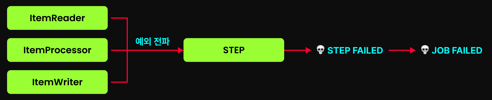

만약 1,000만 개의 데이터를 처리하다가, 단 한건의 오류로 작업을 실패시키는 경우가 있을 수 있다. 이 때문에 전체 배치를 다시 실행해야 한다면, 매우 비효율적인 일이 될 것이다.

이런 상황을 방지하기 위해서, Spring Batch는 Fault Tolerant (내결함성) 기능을 제공한다.

이를 활용하면 간단한 구성만으로도 재시도(Retry)와 건너뛰기(Skip)을 청크 지향처리에서 사용할 수 있다.

구체적인 예시는 아래와 같다.

- 일시적 네트워크 오류로 인한 DB 쓰기 실패 -> Retry 로 해결
- 잘못된 형식의 데이터를 읽어 예외 발생 -> Skip 으로 해결

> Tasklet 지향 처리는 Fault Tolerant (내결함성) 기능의 지원 대상이 아니다.
> 
> 왜냐하면 우리가 직접 `Tasklet.execute()` 를 작성할 때, 구현 코드에서 직접 `try-catch` 로 예외 핸들링이 가능하기 때문이다.

Spring Batch 에서 제공하는 Fault Tolerant (내결함성) 기능에는 크게 두가지 Retry 와 Skip 이 있다.

## Retry

Retry 는 말 그대로 실패한 작업을 다시 시도하는 것을 의미한다. 이를 통해, 네트워크 오류 등 일시적인 오류 상황에서 매우 효과적인 해결책이 될 수 있다.

### RetryTemplate : Retry 의 핵심 컴포넌트

RetryTemplate 은 Spring Retry 프로젝트의 핵심 컴포넌트로, **작업이 실패하면 정해진 정책에 따라 다시 시도**한다.

아래는 `RetryTemplate.execute()` 메서드의 내부 동작 원리를 단순화한 도표이다.

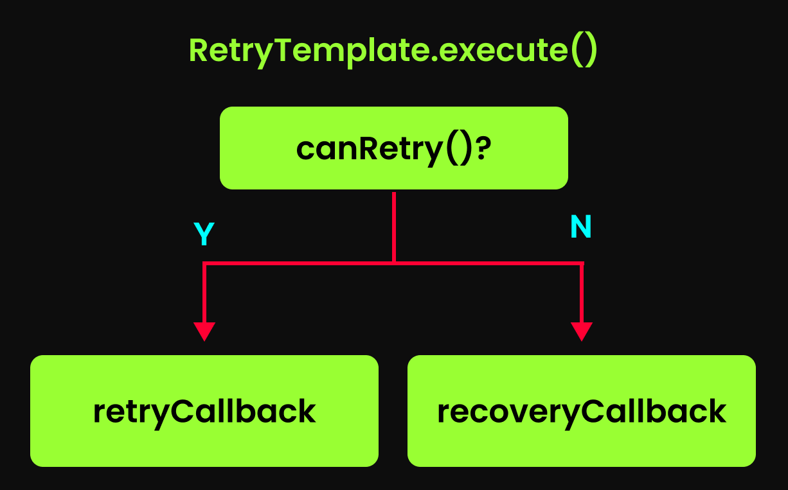

위 도표와 같이, `RetryTemplate.execute()` 메서드는 하기 세 가지 핵심 구성요소를 조합하여 동작한다.

- `canRetry()` : 재시도 가능 여부 판단
  - `canRetry()` 를 통해, 재시도 가능 여부를 판단한다. 이 메서드는 사전에 정해진 재시도 정책을 기반으로 판단하게 된다.
- `retryCallback()` : 재시도 핵심 로직 실행
  - 정상적인 첫번째 시도나, 재시도시 본 메서드를 실행한다. 개발자가 작성한 핵심 비즈니스 로직 (`ItemProcessor.process()` , `ItemWriter.write()`) 이 해당 메서드에 의해 실행된다.
  - **중요한 점은, 내결함성 기능이 활성화되면 해당 콜백이 최초 실행부터 재시도까지 모두 본 `retryCallback`을 통해 수행된다는 것이다.**
- `recoveryCallback()` : 재시도 불가시 로직 실행
  - 발생한 예외를 그대로 전파하거나 대체 로직을 수행한다.

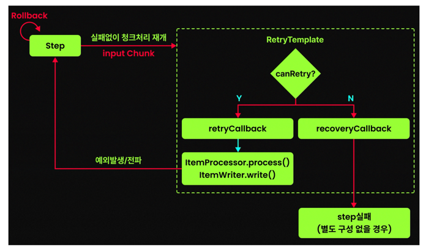

위 도표를 보면, ItemProcessor 와 ItemWriter 호출 로직이 RetryTemplate 의 `retryCallback` 안으로 패키징되는 것을 확인할 수 있다.

#### RetryTemplate 의 관리 범위와 `ChunkProcessor`

위에서, ItemProcessor 와 ItemWriter 호출 로직이 `retryCallback()` 에 담긴다고 설명했다.

그럼 ItemReader 는 어디에 갔나? 라는 의문이 들 수 있다. 이를 이해하기 위해선, 청크 프로세스에 대해 알아야 한다.

청크 프로세스는 크게 `ChunkProvider(읽기 담당)` 과 `ChunkProcessor(가공/쓰기담당)` 으로 나뉜다.
- `ChunkProvider` (`ItemReader`): 아이템을 하나씩 읽어서 청크 단위(List)로 뭉친다.
- `ChunkProcessor` (`ItemProcessor`, `ItemWriter`): 만들어진 청크(List)를 받아 가공하고 저장한다.

**이때 RetryTemplate 이 감싸는 범위가 바로 `ChunkProcessor` 의 실행 시점이다.** 즉, 이미 읽기가 완료된 데이터를 가지고 작업을 시작하는 단계에서부터 RetryTemplate 이 관리한다.

만약 ItemReader 도 RetryTemplate 에 포함된다면 아래와 같은 문제가 발생할 수 있다.

- 굳이 비용이 비싼 데이터 읽기 작업을 재수행해야 한다. 이미 메모리에 로드되어 있는 것을 사용하면 되는데 말이다.
- `JdbcCursorItemReader` 와 같이 커서 기반으로 데이터를 읽어온다면, Retry 하기가 매우 어렵다. 보통 커서를 뒤로 되돌리는 것은 DB에서 지원하지 않기 때문이다.
- 메시지큐로부터 데이터를 읽은 경우, 한번 읽은 데이터를 다시 읽는 것이 아예 불가능할 수 있다.

정리하자면, RetryTemplate 는 `ChunkProcessor` 실행 시점에서부터 `retryCallback` 로 감싸기 때문에, `ItemReader` 는 재시도 대상으로 관리되지 않는다고 할 수 있다.

자세한 것은 아래 도표를 통해 확인해볼 수 있다. 하나의 청크 프로세스에 대한 설명으로, `ChunkProvider` 와 `ChunkProcessor` 그리고 `RetryTemplate` 간의 관계를 나타낸다.


> 다만, Spring Batch 6 부터는 ItemReader 에서도 재시도가 가능해졌다.

### RetryPolicy : 재시도 정책 관리

위에서 `RetryTemplate.execute()` 메서드의 내부에서 `canRetry()` 를 호출하여, 재시도 가능 여부를 판단한다고 했다.

`canRetry()` 에서 재시도 정책을 확인하는데, 이때 사용되는 것이 바로 RetryPolicy 이다.

별도 설정이 없을 경우, Spring Batch의 내결함성 기능은 `SimpleRetryPolicy` 라는 재시도 정책을 사용한다.

#### SimpleRetryPolicy

SimpleRetryPolicy는 다음의 두 조건을 바탕으로 재시도 가능 여부를 결정한다.

- 발생한 예외가 "사전에 지정된 예외 유형"에 해당하는가.
- "현재 재시도 횟수"가 "최대 허용 횟수"를 초과하지 않았는가.

### Input Chunk 재활용을 통한, 내결함성 최적화


위 다이어그램을 다시 보면, Rollback 되고 난 후에 input chunk가 RetryTemplate 에 전달되고 있는 것을 알 수 있다.

Spring Batch 에서 **ItemReader 의 기본 규약은 FORWARD ONLY 이다. 즉, 한번 읽었던 데이터를 다시 읽는 것은 기본 설계 원칙에 위배**된다. 그렇기 때문에, Retry 를 하기 위해서 이전 데이터를 다시 ItemReader로 읽어올 순 없다.

이 문제를 해결하기 위해, Spring Batch 는 청크 버퍼링을 사용한다. 내결함성 기능이 활성화된 경우, **ItemReader가 읽어들인 input chunk를 별도로 저장**해둔다.

이 덕분에, 재시도가 필요한 경우 ItemReader 를 되감지 않고도 이미 읽어둔 Chunk를 그대로 재사용할 수 있게 된다.

### Retry 예제 코드

```java
@Bean
public Step terminationRetryStep() {
    return new StepBuilder("terminationRetryStep", jobRepository)
        .<Scream, Scream>chunk(3, transactionManager)
        .reader(terminationRetryReader())
        .processor(terminationRetryProcessor())
        .writer(terminationRetryWriter())
        .faultTolerant() // 내결함성 기능 ON
        .retry(TerminationFailedException.class)   // 재시도 대상 예외 타입 추가 (해당 타입과 모든 하위 예외가 대상이 된다.)
        .noRetry(SubFailedException.class) //TerminationFailedException 의 하위 예외 중, 재시도하지 않을 하위 예외 설정
        .retryLimit(3) //총 재시도 횟수
        .listener(retryListener())
        .build();
}
```

- `.faultTolerant()`
  - 해당 스텝의 내결함성 기능을 활성화한다. 이를 통해, Retry나 Skip을 사용할 수 있게 된다.
- `.retry()`
  - 재시도를 수행할 예외 타입을 지정한다. 해당 예외가 발생했을 때, 재시도를 시도한다.
  - 이렇게 예외 타입 지정시, 해당 타입을 상속한 모든 자식 예외들도 자동으로 재시도 대상에 포함된다. 
- `.noRetry()`
  - `.retry()` 로 지정한 예외 타입의 하위 타입 중, 재시도하지 않을 예외를 설정한다.
  - `.noRetry()` 를 여러번 호출하여 다중 설정하는 것도 가능하다.
- `.retryLimit()`
  - "첫실행 + 재시도횟수" 를 제한한다. `.retryLimit(3)` 이라면, 첫실행을 제외한 2번까지 실제 재시도가 된다. _(기본값은 0이나, 첫실행은 된다.)_
  - `.retryLimit()` 사용시, 반드시 `.retry()` 로 재시도 대상 예외 타입을 지정해야 한다.
- `.listener()`
  - 재시도 과정을 모니터링할 수 있는 리스너를 등록한다.
  - 여기서 사용되는 리스너는 Spring Retry 프로젝트의 RetryListener 인터페이스 구현체로, 재시도의 전 과정을 후킹할 수 있는 메서드들을 제공한다.
  - ```java
    public interface RetryListener {
      // 재시도 시작 전에 호출. false를 반환하면 재시도를 중단한다.
      default <T, E extends Throwable> boolean open(RetryContext context, RetryCallback<T, E> callback) {
          return true;
      }

      // 재시도 중 오류 발생할 때마다 호출
      default <T, E extends Throwable> void onError(RetryContext context, RetryCallback<T, E> callback,
              Throwable throwable) {
      }

      // 재시도 성공 시 호출
      default <T, E extends Throwable> void onSuccess(RetryContext context, RetryCallback<T, E> callback, T result) {
      }

      // 모든 재시도가 끝난 후 호출 (성공/실패 여부와 무관)
      default <T, E extends Throwable> void close(RetryContext context, RetryCallback<T, E> callback,
              Throwable throwable) {
      }
    }
    ```
    
### ItemProcessor 에서의 Retry 횟수 관리

ItemProcessor와 ItemWriter 는 서로 동일한 RetryTemplate을 사용하지만, **둘의 동작방식은 완전히 다르다.**

결론부터 이야기한다면 아래와 같다.

- ItemProcessor : 재시도 횟수를 **아이템 단위로 개별 관리**한다.
- ItemWriter : 재시도 횟수를 **청크 단위로 관리**한다.

하기 예제 코드를 보고 그 차이점을 알아보자.

[TerminationRetryForItemProcessorConfig.java](batch-system/src/main/java/com/system/batch/lesson/retry/TerminationRetryForItemProcessorConfig.java) 에서도 하기 코드를 확인 가능하니 참고하자.
```java
/**
 * ItemProcessor와 ItemWriter의 재시도 동작 방식의 차이점을 비교하기 위한 예시 코드
 */
@Configuration
@RequiredArgsConstructor
public class TerminationRetryConfig {
    private final JobRepository jobRepository;
    private final PlatformTransactionManager platformTransactionManager;

    @Bean
    public Job terminationRetryJob() {
        return new JobBuilder("terminationRetryJob", jobRepository)
            .start(terminationRetryStep())
            .build();
    }

    /**
     * 스텝 설정
     */
    @Bean
    public Step terminationRetryStep() {
        return new StepBuilder("terminationRetryStep", jobRepository)
            .<Scream, Scream>chunk(3, platformTransactionManager)
            .reader(terminationRetryReader())
            .processor(terminationRetryProcessor())
            .writer(terminationRetryWriter())
            .faultTolerant() // 내결함성 기능 ON
            .retry(TerminationFailedException.class) // 재시도 대상 예외 추가
            .retryLimit(3) //실행 최대 횟수
            .listener(retryListener()) //리스너 등록
            .build();
    }

    /**
     * 기본 ItemReader
     */
    @Bean
    public ListItemReader<Scream> terminationRetryReader() {
        return new ListItemReader<>(List.of(
            Scream.builder()
                .id(1)
                .scream("멈춰")
                .processMsg("멈추라고 했는데 안 들음.")
                .build(),
            Scream.builder()
                .id(2)
                .scream("제발")
                .processMsg("애원 소리 귀찮네.")
                .build(),
            Scream.builder()
                .id(3)
                .scream("살려줘")
                .processMsg("구조 요청 무시.")
                .build(),
            Scream.builder()
                .id(4)
                .scream("으악")
                .processMsg("디스크 터지며 울부짖음.")
                .build(),
            Scream.builder()
                .id(5)
                .scream("끄아악")
                .processMsg("메모리 붕괴 비명.")
                .build(),
            Scream.builder()
                .id(6)
                .scream("System.exit(-666)")
                .processMsg("초살 프로토콜 발동.")
                .build()
        )) {
            @Override
            public Scream read() {
                Scream scream = super.read();
                if(scream == null) {
                    return null;
                }
                System.out.println("🔥🔥🔥 [ItemReader]: 처형 대상 = " + scream);
                return scream;
            }
        };
    }

    /**
     * 조건에 따라 재시도 대상 예외를 터뜨리는 ItemProcessor
     */
    @Bean
    public ItemProcessor<Scream, Scream> terminationRetryProcessor() {
        return new ItemProcessor<>() {
            private static final int MAX_PATIENCE = 3;
            private int mercy = 0;  // 자비 카운트

            @Override
            public Scream process(Scream scream) throws Exception {
                System.out.print("🔥🔥🔥 [ItemProcessor]: 처형 대상 = " + scream);

                //id가 3인 경우, 첫번재 시도에서만 예외가 발생
                if (scream.getId() == 3 && mercy < MAX_PATIENCE) {
                    mercy ++;
                    System.out.println(" -> ❌ 처형 실패.");
                    throw new TerminationFailedException("처형 거부자 = " + scream); //MARK: 재시도 대상 예외 발생
                } else {
                    System.out.println(" -> ✅ 처형 완료(" + scream.getProcessMsg() + ")");
                }

                return scream;
            }
        };
    }

    /**
     * 기본 ItemWriter
     */
    @Bean
    public ItemWriter<Scream> terminationRetryWriter() {
        return items -> {
            System.out.println("🔥🔥🔥 [ItemWriter]: 처형 기록 시작. 기록 대상 = " + items.getItems());

            for (Scream scream : items) {
                System.out.println("🔥🔥🔥 [ItemWriter]: 기록 완료. 처형된 아이템 = " + scream);
            }
        };
    }

    /**
     * RetryListener
     */
    @Bean
    public RetryListener retryListener() {
        return new RetryListener() {
            @Override
            public <T, E extends Throwable> void onError(RetryContext context, RetryCallback<T, E> callback, Throwable throwable) {
                System.out.println("💀💀💀 킬구형: 이것 봐라? 안 죽네? " + throwable + " (현재 총 시도 횟수=" + context.getRetryCount() + "). 다시 처형한다.\n");
            }
        };
    }

    public static class TerminationFailedException extends RuntimeException {
        public TerminationFailedException(String message) {
            super(message);
        }
    }

    @Getter
    @Builder
    public static class Scream {
        private int id;
        private String scream;
        private String processMsg;

        @Override
        public String toString() {
            return id + "_" + scream;
        }
    }
}
```

위 코드의 ItemProcessor를 보면, id가 3인 아이템(`살려줘`)에서 의도적으로 예외를 발생시키도록 설계되었다. 다만 자비 카운트(`mercy`)가 MAX_PATIENCE(`3`)보다 같거나 커지면 예외를 발생시키지 않는다. 

즉 첫번째/두번째/세번째 시도에서 모두 예외가 발생하고, `.retryLimit(3)` 로 설정되어 있어 네번째 시도는 수행되지 않고 예외가 발생한다.

해당 잡에 대한 실행결과는 아래와 같다.

```text
🔥🔥🔥 [ItemReader]: 처형 대상 = 1_멈춰
🔥🔥🔥 [ItemReader]: 처형 대상 = 2_제발
🔥🔥🔥 [ItemReader]: 처형 대상 = 3_살려줘
🔥🔥🔥 [ItemProcessor]: 처형 대상 = 1_멈춰 -> ✅ 처형 완료(멈추라고 했는데 안 들음.)
🔥🔥🔥 [ItemProcessor]: 처형 대상 = 2_제발 -> ✅ 처형 완료(애원 소리 귀찮네.)
🔥🔥🔥 [ItemProcessor]: 처형 대상 = 3_살려줘 -> ❌ 처형 실패.
💀💀💀 킬구형: 이것 봐라? 안 죽네? com.system.batch.killbatchsystem.TerminationRetryConfig$TerminationFailedException: 처형 거부자 = 3_살려줘 (현재 총 시도 횟수=1). 다시 처형한다.
// ⚠️ 해설: 이 지점에서 롤백 발생 후 청크 처리 다시 시작

🔥🔥🔥 [ItemProcessor]: 처형 대상 = 1_멈춰 -> ✅ 처형 완료(멈추라고 했는데 안 들음.)
🔥🔥🔥 [ItemProcessor]: 처형 대상 = 2_제발 -> ✅ 처형 완료(애원 소리 귀찮네.)
🔥🔥🔥 [ItemProcessor]: 처형 대상 = 3_살려줘 -> ❌ 처형 실패.
💀💀💀 킬구형: 이것 봐라? 안 죽네? com.system.batch.killbatchsystem.TerminationRetryConfig$TerminationFailedException: 처형 거부자 = 3_살려줘 (현재 총 시도 횟수=2). 다시 처형한다.
// ⚠️ 해설: 이 지점에서 롤백 발생 후 청크 처리 다시 시작

🔥🔥🔥 [ItemProcessor]: 처형 대상 = 1_멈춰 -> ✅ 처형 완료(멈추라고 했는데 안 들음.)
🔥🔥🔥 [ItemProcessor]: 처형 대상 = 2_제발 -> ✅ 처형 완료(애원 소리 귀찮네.)
🔥🔥🔥 [ItemProcessor]: 처형 대상 = 3_살려줘 -> ❌ 처형 실패.
💀💀💀 킬구형: 이것 봐라? 안 죽네? com.system.batch.killbatchsystem.TerminationRetryConfig$TerminationFailedException: 처형 거부자 = 3_살려줘 (현재 총 시도 횟수=3). 다시 처형한다.
// ⚠️ 해설: 이 지점에서 롤백 발생 후 청크 처리 다시 시작

🔥🔥🔥 [ItemProcessor]: 처형 대상 = 1_멈춰 -> ✅ 처형 완료(멈추라고 했는데 안 들음.)
🔥🔥🔥 [ItemProcessor]: 처형 대상 = 2_제발 -> ✅ 처형 완료(애원 소리 귀찮네.)
...AbstractStep         : Encountered an error executing step terminationRetryStep in job terminationRetryJob

org.springframework.retry.RetryException: Non-skippable exception in recoverer while processing
...
```

이 실행결과를 아래처럼 분석해볼 수 있다.

1. ItemReader가 첫 3개의 아이템을 읽어들인다.
2. ItemProcessor 시작
   - 1번과 2번 아이템은 process 되지만, 아이템 3번에서 예외가 발생한다.
3. 트랜잭션 롤백 및 청크 처리 재개
   - 예외가 전파되면 Step은 **청크 트랜잭션을 롤백**시킨다.
   - 그러나 내결함성 기능 덕분에 스텝은 포기하지 않고 **재시도**된다.
4. 청크 재처리 시작
   - 이미 읽어둔 아이템들로 1번 아이템부터 다시 process를 시도한다.
   - **즉, ItemReader는 다시 호출되지 않는다.**
5. 재시도 모두 실패 
   - 모든 재시도가 실패한다.
6. 결국 스텝 전체가 실패한다.

ItemProcess 과정에서 예외가 발생하면, 청크단위로 Retry 하게 된다. **하지만 재시도 횟수는 청크단위가 아닌 아이템별로 관리되며, 예외가 발생한 아이템에 대해서만 재시도 횟수가 카운팅된다.**

위 코드를 아래처럼 정리해볼 수 있다.

|실행 횟수|아이템1 실패 횟수|아이템2 실패 횟수| 아이템3 실패 횟수            |
|---|---|---|-----------------------|
|1|0|0| 1                     |
|2|0|0| 2                     |
|3|0|0| 3 (retryLimit 까지 도달함) |

그럼 아래와 같은 상황도 생각해볼 수 있다.

1. 첫번째 실행에선 아이템 1을 대상으로 예외 발생
2. 두번째 실행에서 아이템 2를 대상으로 예외 발생
3. 세번째 실행에서 아이템 3을 대상으로 예외 발생
4. 네번째 실행에서 다시 아이템 1을 대상으로 예외 발생
5. ...

위와 같이 번갈아가면서 실패하는 경우, **전체 재실행 횟수가 `retryLimit` 을 초과할 수 있다!** 왜냐하면, 아이템별로 실패 횟수를 관리하기 때문이다.

| 실행 횟수 | 아이템1 실패 횟수 | 아이템2 실패 횟수 | 아이템3 실패 횟수 |
|-------|------------|-----------|-----------|
| 1     | 1          | 0         | 0         |
| 2     | 1          | 1         | 0         |
| 3     | 1          | 1         | 1         |
| 4     | 2          | 1         | 1         |
| 5     | 2          | 2         | 1         |
| 6     | 2          | 2         | 2         |
| 7     | 3 (retryLimit 까지 도달함)         | 2         | 2         |
| 8     | 3 (retryLimit 까지 도달함)         | 3 (retryLimit 까지 도달함)          | 2         |
| 9     | 3 (retryLimit 까지 도달함)         | 3 (retryLimit 까지 도달함)          | 3 (retryLimit 까지 도달함)          |

따라서 위와 같이 총 9번의 재실행이 가능하게 된다. (아이템별 3번씩)

### Retry 최적화

itemProcessor 로 처리 도중에 예외가 발생하면 Retry가 발생하는데, 이때 **Retry는 청크단위로 수행**된다.

예를 들어 하나의 청크가 아이템 10개로 구성될때, 3번째 아이템에서 예외 발생시 **이미 정상적으로 처리된 1~2번째 아이템에 대해서도 `process()` 가 다시 호출된다.**

이처럼, 이미 성공적으로 처리된 아이템들에 대해서까지 매번 다시 `process()` 메서드를 호출하는 것은 비효율적이다.

이런 불필요한 재처리 방지를 위해, Spring Batch 는 `processorNonTransactional()` 설정을 제공한다.

이 설정을 사용하면, Spring Batch는 ItemProcessor를 비트랜잭션 상태로 표시하여, **한번 처리된 아이템의 결과를 캐시에 저장**한다.

#### `processorNonTransactional()` 없는 기본 동작시

| 실행 횟수 | 아이템1 process() 실행 횟수 | 아이템2 process() 실행 횟수 | 아이템3 process() 실행 횟수 |
|-------|-------------------------|-----------------------------|---------------------|
| 1     | 1                       | 1                           | 1 (예외 발생!)          |
| 2     | 2 (process()가 한번 더 실행됨) | 2 (process()가 한번 더 실행됨)                      | 2 (이번엔 모두 정상 처리)    |

#### `processorNonTransactional()` 설정시

| 실행 횟수 | 아이템1 process() 실행 횟수       | 아이템2 process() 실행 횟수 | 아이템3 process() 실행 횟수 |
|-------|----------------------------|----------------------|---------------------|
| 1     | 1                          | 1                    | 1 (예외 발생!)          |
| 2     | 1 (process() 실행 X, 캐시값 사용) | 1 (process() 실행 X, 캐시값 사용)   | 2 (이번엔 모두 정상 처리)    |

#### `processorNonTransactional()` 설정 예시

```java
@Bean
public Step terminationRetryStep() {
    return new StepBuilder("terminationRetryStep", jobRepository)
            .<Scream, Scream>chunk(3, transactionManager)
            .reader(terminationRetryReader())
            .processor(terminationRetryProcessor())
            .writer(terminationRetryWriter())
            .faultTolerant()
            .retry(TerminationFailedException.class)
            .retryLimit(3)
            .listener(retryListener())
            .processorNonTransactional() // ItemProcessor 비트랜잭션 처리
            .build();
}
```

#### `processorNonTransactional()` 사용시 주의사항

`processorNonTransactional()` 의 이름 때문에 오해할 수 있지만, 이를 설정해도 **ItemProcessor에서 예외 발생시 청크 단위의 트랜잭션은 여전히 롤백**된다.

Spring Batch 에서는 내결함성 기능을 사용하는 경우, **반드시 ItemProcessor가 멱등하게 동작해야 한다.** ItemProcessor 가 멱등하지 않은 경우, Retry시 문제가 될 수 있기 때문이다.

**만약 멱등하지 않은 ItemProcessor를 사용해야한다면, `processorNonTransactional()` 를 사용하여 멱등성을 지킬 수 있다.**

### ItemWriter 에서의 Retry

이번에 ItemWriter 에서의 Retry 에 대해 알아보자. 주요 특징은 아래와 같다.

- ItemWriter에서 예외가 발생하면, **ItemProcessor에서부터 처리가 재개**된다.
- ItemProcessor 와 달리, ItemWriter의 재시도 횟수는 **청크단위로 관리**된다.

예제 코드는 아래와 같다.

```java
/**
 * 단순한 ItemProcessor
 */
@Bean
public ItemProcessor<Scream, Scream> terminationRetryProcessor() {
    return scream -> {
        System.out.print("🔥🔥🔥 [ItemProcessor]: 처형 대상 = " + scream + "\n");
        return scream;
    };
}

/**
 * 조건에 따라 TerminationFailedException 예외를 던지는 ItemWriter
 */
@Bean
public ItemWriter<Scream> terminationRetryWriter() {
    return new ItemWriter<>() {
        private static final int MAX_PATIENCE = 2;
        private int mercy = 0;  // 자비 카운트

        @Override
        public void write(Chunk<? extends Scream> screams) {
            System.out.println("🔥🔥🔥 [ItemWriter]: 기록 시작. 처형된 아이템들 = " + screams);

            for (Scream scream : screams) {
                if (scream.getId() == 3 && mercy < MAX_PATIENCE) {
                    mercy ++;
                    System.out.println("🔥🔥🔥 [ItemWriter]: ❌ 기록 실패. 저항하는 아이템 발견 = " + scream);
                    throw new TerminationFailedException("기록 거부자 = " + scream); //예외 발생
                }
                System.out.println("🔥🔥🔥 [ItemWriter]: ✅ 기록 완료. 처형된 아이템 = " + scream);
            }
        }
    };
}
```

이를 실행하면 아래와 같은 로그를 볼 수 있다.

```text
🔥🔥🔥 [ItemReader]: 처형 대상 = 1_멈춰
🔥🔥🔥 [ItemReader]: 처형 대상 = 2_제발
🔥🔥🔥 [ItemReader]: 처형 대상 = 3_살려줘
🔥🔥🔥 [ItemProcessor]: 처형 대상 = 1_멈춰
🔥🔥🔥 [ItemProcessor]: 처형 대상 = 2_제발
🔥🔥🔥 [ItemProcessor]: 처형 대상 = 3_살려줘
🔥🔥🔥 [ItemWriter]: 기록 시작. 처형된 아이템들 = [items=[1_멈춰, 2_제발, 3_살려줘], skips=[]]
🔥🔥🔥 [ItemWriter]: ✅ 기록 완료. 처형된 아이템 = 1_멈춰
🔥🔥🔥 [ItemWriter]: ✅ 기록 완료. 처형된 아이템 = 2_제발
🔥🔥🔥 [ItemWriter]: ❌ 기록 실패. 저항하는 아이템 발견 = 3_살려줘
💀💀💀 킬구형: 이것 봐라? 안 죽네? com.system.batch.killbatchsystem.TerminationRetryConfig$TerminationFailedException: 기록 거부자 = 3_살려줘 (현재 총 시도 횟수=1). 다시 처형한다.
// ⚠️ 해설: 이 지점에서 롤백 발생 후 청크 처리 다시 시작

🔥🔥🔥 [ItemProcessor]: 처형 대상 = 1_멈춰
🔥🔥🔥 [ItemProcessor]: 처형 대상 = 2_제발
🔥🔥🔥 [ItemProcessor]: 처형 대상 = 3_살려줘
🔥🔥🔥 [ItemWriter]: 기록 시작. 처형된 아이템들 = [items=[1_멈춰, 2_제발, 3_살려줘], skips=[]]
🔥🔥🔥 [ItemWriter]: ✅ 기록 완료. 처형된 아이템 = 1_멈춰
🔥🔥🔥 [ItemWriter]: ✅ 기록 완료. 처형된 아이템 = 2_제발
🔥🔥🔥 [ItemWriter]: ❌ 기록 실패. 저항하는 아이템 발견 = 3_살려줘
💀💀💀 킬구형: 이것 봐라? 안 죽네? com.system.batch.killbatchsystem.TerminationRetryConfig$TerminationFailedException: 기록 거부자 = 3_살려줘 (현재 총 시도 횟수=2). 다시 처형한다.
// ⚠️ 해설: 이 지점에서 롤백 발생 후 청크 처리 다시 시작

🔥🔥🔥 [ItemProcessor]: 처형 대상 = 1_멈춰
🔥🔥🔥 [ItemProcessor]: 처형 대상 = 2_제발
🔥🔥🔥 [ItemProcessor]: 처형 대상 = 3_살려줘
🔥🔥🔥 [ItemWriter]: 기록 시작. 처형된 아이템들 = [items=[1_멈춰, 2_제발, 3_살려줘], skips=[]]
🔥🔥🔥 [ItemWriter]: ✅ 기록 완료. 처형된 아이템 = 1_멈춰
🔥🔥🔥 [ItemWriter]: ✅ 기록 완료. 처형된 아이템 = 2_제발
🔥🔥🔥 [ItemWriter]: ✅ 기록 완료. 처형된 아이템 = 3_살려줘
// 나머지 아이템들(4_으악, 5_끄아악, 6_System.exit(-666))도 성공적으로 처리됨

...
```

위 로그를 분석해보면 아래와 같다.

1. ItemReader가 3개의 아이템을 읽어들인다.
2. ItemProcessor 처리 완료
3. ItemWriter에서 예외 발생 : 첫 번째, 두 번째 아이템은 기록되지만, 세 번째 아이템에서 예외가 발생한다.
4. 트랜잭션 롤백 및 청크 처리 재개 : 해당 청크에 대한 트랜잭션이 롤백되지만, 스텝 실패 처리하지 않고 다시 Retry 된다.
5. ItemProcessor부터 재시작
6. ItemWriter에서 예외 다시 발생
7. 세 번째 Retry 실행
8. 최종 성공
9. 다음 청크로 이동

### ItemWriter 에서의 Retry 횟수 관리

여기서 기억해야 하는 것은 **Retry 횟수는 청크단위로 관리**된다는 것이다.

`retryLimit()` 이 2로 설정되어 있다고 가정해보자.

| 실행 횟수 | [청크1] 아이템1 성공/실패 횟수      | [청크1] 아이템2 성공/실패 횟수      | [청크1] 아이템3 성공/실패 횟수 |
|-------|--------------------------|--------------------------|---------------------|
| 1     | 0/1 (ItemWriter에서 예외 발생) | 0/0                      | 0/0                 |
| 2     | 1/1                      | 0/1 (ItemWriter에서 예외 발생) | 0/0                 |
| 3     | X                        | X                        | X                   |

위와 같이 서로 다른 아이템에서 실패하더라도, 해당 청크는 2번까지만 실행된다. 단, 서로 다른 청크에서 실패하는 경우에는 관계없다.


### 다양한 재시도 정책(Retry Policy) 적용하기

만약 다른 재시도 전략이 필요할 경우, 아래처럼 직접 RetryPolicy를 지정할 수 있다.

```java
@Bean
public Step terminationRetryStep() {
    return new StepBuilder("terminationRetryStep", jobRepository)
        .<Scream, Scream>chunk(3, transactionManager)
        .reader(terminationRetryReader())
        .processor(terminationRetryProcessor())
        .writer(terminationRetryWriter())
        .faultTolerant()
        // 타임아웃 기반 정책 (일정 시간 내에 성공하지 못하면 실패)
        .retryPolicy(new TimeoutRetryPolicy(Long.MAX_VALUE)) // CPU를 고문하는 무한 재시도 루프
        .listener(retryListener())
        .processorNonTransactional() // ItemProcessor 비트랜잭션 처리
        .build();
}
```

만약 예외별도 다른 재시도 정책을 설정하고 싶다면, `ExceptionClassifierRetryPolicy` 를 사용할 수 있다.

```java
private RetryPolicy retryPolicy() {
    Map<Class<? extends Throwable>, RetryPolicy> policyMap = new HashMap<>();

    SimpleRetryPolicy dbRetryPolicy = new SimpleRetryPolicy(3);
    SimpleRetryPolicy apiRetryPolicy = new SimpleRetryPolicy(5);

    policyMap.put(DataAccessException.class, dbRetryPolicy);
    policyMap.put(HttpServerErrorException.class, apiRetryPolicy);

    ExceptionClassifierRetryPolicy retryPolicy = new ExceptionClassifierRetryPolicy();
    retryPolicy.setPolicyMap(policyMap);

    return retryPolicy;
}

@Bean
public Step terminationRetryStep() {
    return new StepBuilder("terminationRetryStep", jobRepository)
            .<Scream, Scream>chunk(3, transactionManager)
            .reader(terminationRetryReader())
            .processor(terminationRetryProcessor())
            .writer(terminationRetryWriter())
            .faultTolerant()
            .retryPolicy(retryPolicy())
           // .retry(TerminationFailedException.class)
           // .retryLimit(3)
            .listener(retryListener())
            .build();
}
```

만약 커스텀 RetryPolicy 와 `retry()`, `retryLimit()` 을 함께 사용하면, AND 조건으로 두 정책 모두 재시도가 가능하다고 판단되어야만 재시도된다.

**재시도 로직이 복잡해질 수 있기에, 가능하면 함께 사용하지 않도록 한다.**

### BackOffPolicy

네트워크 이슈로 인해 API 호출이 실패한 경우, 즉시 재시도하면 네트워크 상태가 아직 복구되지 않아 동일한 실패가 반복될 가능성이 높다.

이런 상황에서는 일정 시간을 기다린 후에 재시도하는 것이 효과적인데, 이때 사용하는 것이 바로 BackOffPolicy 이다.

**별도로 BackOffPolicy를 설정하지 않으면 기본적으로 NoBackOffPolicy가 적용되어 즉시 재시도한다.**

대표적인 백오프 정책은 아래와 같다.

```java
.retry(TerminationFailedException.class)
.retryLimit(3)

// BackOffPolicy 설정
.backOffPolicy(new FixedBackOffPolicy() {{
  setBackOffPeriod(1000); // 1초
}})

// 또는 
.backOffPolicy(new ExponentialBackOffPolicy() {{
  setInitialInterval(1000L);  // 초기 대기 시간
  setMultiplier(2.0);        // 대기 시간 증가 배수
  setMaxInterval(10000L);     // 최대 대기 시간
}})
```

특히 ExponentialBackOffPolicy는 외부 시스템과의 통신 장애에 효과적이다.

첫 번째 실패 후 1초 대기, 두 번째 실패 후 2초, 세 번째 실패 후 4초... 이런 식으로 대기 시간이 점점 증가하며 외부 시스템에게 충분한 회복할 시간을 제공한다.

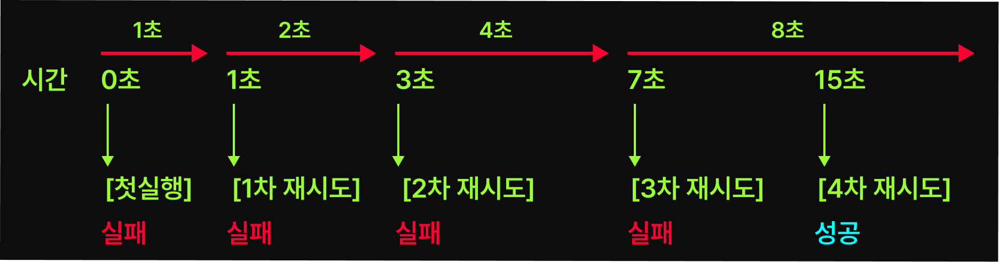

## Skip

Skip 은 예외가 발생한 레코드를 건너뛰어 배치 프로세스가 중단 없이 계속 진행될 수 있도록 해준다.

Skip 은 아래와 같은 상황에서 고려해볼 수 있다.

- 비즈니스적으로 중요도가 낮은 데이터를 처리할 때
- 일부 실패 레코드의 처리보다 전체 배치 프로세스 완료가 더 중요할 때
- 입력 데이터의 품질이 균일하지 않을 때

> ItemProcessor의 필터링과 Skip의 차이
> 
> 필터링은 정상적인 처리 과정에서 일부 아이템을 의도적으로 걸러내는 것이고, 건너뛰기는 예외가 발생했을 때 해당 아이템을 건너뛰는 예외 처리 방식이다.
> 
> 이를 혼동하지 말자.

### 예시 코드

```java
@Bean
public Step terminationRetryStep() {
    return new StepBuilder("terminationRetryStep", jobRepository)
            .<Scream, Scream>chunk(3, transactionManager)
            .reader(terminationRetryReader())
            .processor(terminationRetryProcessor())
            .writer(terminationRetryWriter())
            .faultTolerant()
            .skip(TerminationFailedException.class) //스킵 대상 예외 타입
            .skipLimit(2) // 두 번까지만 Skip 한다.
            .build();
}
```

### SkipPolicy

Skip 기능은 SkipPolicy라는 전략 컴포넌트를 기반으로 작동한다. 별도 설정을 하지 않으면, 기본적으로 `LimitCheckingItemSkipPolicy` 가 사용된다.

- `skip()` : 건너뛸 예외를 지정한다.
- `skipLimit()` : 스텝에서 허용할 건너뛰기 최대 횟수를 설정한다. **스텝 전체에서 발생한 총 Skip의 횟수를 카운팅한다.** 따라서, 특정 아이템이나 청크에서 예외가 발생했는지와 무관하게 스텝 전체에서의 횟수가 해당 값으로 제한된다. 기본값인 10이다.

`LimitCheckingItemSkipPolicy` 대신 다른 SkipPolicy를 사용하려면 아래처럼 스텝빌더에서 직접 설정하면 된다.

```java
.skipPolicy(new AlwaysSkipItemSkipPolicy())
```

주의할 점은 `skipLimit()`, `skip()` 과 `skipPolicy()` 를 함께 사용하면, 둘 중 하나라도 Skip이 가능한 경우 Skip 처리된다는 것이다.

또한, Skip이 Retry 와 함께 설정된다면 선 Retry 후 Retry가 불가능할때 Skip 이 동작한다는 점도 알아두자.


RetryTemplate 을 다시보자. 위 그림에서 `canRetry()` 가 false라면, `recoveryCallback` 을 호출하는 것을 알 수 있다. **이때 Skip 이 수행된다.**

### Skip 실전 예제

```java
@Bean
public Step terminationRetryStep() {
    return new StepBuilder("terminationRetryStep", jobRepository)
            .<Scream, Scream>chunk(3, transactionManager)
            .reader(terminationRetryReader())
            .processor(terminationRetryProcessor())
            .writer(terminationRetryWriter())
            .faultTolerant()
            .skip(TerminationFailedException.class) //Skip 대상 예외 타입
            .skipLimit(2) // 스텝 전체에서의 Skip 허용 횟수
            .build();
}

@Bean
public ItemProcessor<Scream, Scream> terminationRetryProcessor() {
    return scream -> {
        System.out.print("🔥🔥🔥 [ItemProcessor]: 처형 대상 = " + scream);

        if (scream.getId() == 2 || scream.getId() == 5) { //2번과 5번 아이디를 대상으로 예외 발생
            System.out.println(" -> ❌ 처형 실패.");
            throw new TerminationFailedException("처형 거부자 = " + scream);
        } else {
            System.out.println(" -> ✅ 처형 완료(" + scream.getProcessMsg() + ")");
        }

        return scream;
    };
}

@Bean
public ItemWriter<Scream> terminationRetryWriter() {
    return items -> {
        System.out.println("🔥🔥🔥 [ItemWriter]: 처형 기록 시작. 기록 대상 = " + items.getItems());

        for (Scream scream : items) {
            System.out.println("🔥🔥🔥 [ItemWriter]: 기록 완료. 처형된 아이템 = " + scream);
        }
    };
}
```

위 코드에 대한 실행 결과는 아래와 같다.

```text
🔥🔥🔥 [ItemReader]: 처형 대상 = 1_멈춰
🔥🔥🔥 [ItemReader]: 처형 대상 = 2_제발
🔥🔥🔥 [ItemReader]: 처형 대상 = 3_살려줘
🔥🔥🔥 [ItemProcessor]: 처형 대상 = 1_멈춰 -> ✅ 처형 완료(멈추라고 했는데 안 들음.)
🔥🔥🔥 [ItemProcessor]: 처형 대상 = 2_제발 -> ❌ 처형 실패.
// ⚠️ 해설: 이 지점에서 롤백 발생 후 청크 처리 재개
🔥🔥🔥 [ItemProcessor]: 처형 대상 = 1_멈춰 -> ✅ 처형 완료(멈추라고 했는데 안 들음.)
// ⚠️ 해설: RetryTemplate에서 '2_제발'을 대상으로 recoveryCallback() 실행 -> skip
🔥🔥🔥 [ItemProcessor]: 처형 대상 = 3_살려줘 -> ✅ 처형 완료(구조 요청 무시.)
// ⚠️ 해설: ItemWriter에 '2_제발' 제외되어 전달
🔥🔥🔥 [ItemWriter]: 처형 기록 시작. 기록 대상 = [1_멈춰, 3_살려줘]
🔥🔥🔥 [ItemWriter]: 기록 완료. 처형된 아이템 = 1_멈춰
🔥🔥🔥 [ItemWriter]: 기록 완료. 처형된 아이템 = 3_살려줘

// ⚠️ 해설: 두 번째 청크 처리 시작
🔥🔥🔥 [ItemReader]: 처형 대상 = 4_으악
🔥🔥🔥 [ItemReader]: 처형 대상 = 5_끄아악
🔥🔥🔥 [ItemReader]: 처형 대상 = 6_System.exit(-666)
🔥🔥🔥 [ItemProcessor]: 처형 대상 = 4_으악 -> ✅ 처형 완료(디스크 터지며 울부짖음.)
🔥🔥🔥 [ItemProcessor]: 처형 대상 = 5_끄아악 -> ❌ 처형 실패.
// ⚠️ 해설: 이 지점에서 롤백 발생 후 청크 처리 재개
🔥🔥🔥 [ItemProcessor]: 처형 대상 = 4_으악 -> ✅ 처형 완료(디스크 터지며 울부짖음.)
// ⚠️ 해설: RetryTemplate에서 '5_끄아악'을 대상으로 recoveryCallback() 실행 -> skip
🔥🔥🔥 [ItemProcessor]: 처형 대상 = 6_System.exit(-666) -> ✅ 처형 완료(초살 프로토콜 발동.)
// ⚠️ 해설: ItemWriter에 '5_끄아악' 제외되어 전달
🔥🔥🔥 [ItemWriter]: 처형 기록 시작. 기록 대상 = [4_으악, 6_System.exit(-666)]
🔥🔥🔥 [ItemWriter]: 기록 완료. 처형된 아이템 = 4_으악
🔥🔥🔥 [ItemWriter]: 기록 완료. 처형된 아이템 = 6_System.exit(-666)
```

1. 예외 발생 및 롤백
   - `2_제발` 아이템 처리 중 예외가 발생하여, 안정성을 위해 우선 청크 트랜잭션을 롤백시킨다.
2. 청크 재처리 시작
   - 처음부터 다시 처리를 시작해, `1_멈춰` 가 성공적으로 처리된다.
3. recoveryCallback 호출
   - `2_제발` 을 처리할 차례가 되자 RetryTemplate이 더이상 재시도할 수 없다고 판단하여 `recoveryCallback`을 호출한다.
4. 건너뛰기 판단
   - `skipLimit` 이 2로 설정되어 있고, 아직 건너뛰기 횟수가 남아있어 `2_제발`을 건너뛸 수 있다고 판단한다.
5. 아이템 스킵 완료
   - `2_제발`을 스킵한다. 건너뛰어진 아이템은 ItemWriter로 전달되지 않는다.
6. 나머지 아이템 처리
7. 두번째 청크처리도 위와 동일하다.

### ItemWriter 에서의 Skip 메커니즘

ItemWriter에서 예외가 발생하면 먼저 재시도 가능 여부를 판단하고, **재시도가 불가능하다고 판단되면 스캔 모드로 돌입한다.**

스캔모드란 아래 그림처럼, **청크 내 아이템을 하나씩 개별 처리하는 특수 모드**이다.

1. ItemProcessor 가 **아이템 하나를 처리하면 결과가 즉시 ItemWriter로 전달**된다.
2. ItemWriter는 단일 아이템만 쓰고, **성공시 즉시 커밋**한다.
3. 단일 아이템 쓰기 중 예외가 발생하면 해당 아이템을 건너뛴다. 이때 SkipPolicy가 예외 타입과 `skipCount` 를 기준으로 건너뛰기 가능 여부를 판단한다. 불가능시, 스텝이 종료된다.

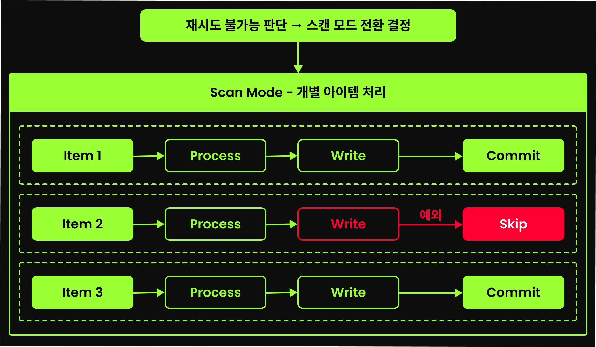

**ItemWriter 는 ItemProcessor 와 다르게, 청크단위로 작업을 처리한다. 그렇기 때문에, ItemWriter에서 예외 발생시 구체적으로 어떤 아이템에서 예외가 발생했는지 알 수 없다.**

**따라서 스캔 모드를 통해 아이템을 하나씩 ItemWriter로 처리하며 문제가 되는 아이템을 찾아내면, 해당 아이템을 Skip 처리할 수 있게 된다.**

#### 스캔모드에서의 Skip 프로세스

1. 예외 발생 및 재시도 파단
   - itemWriter에서 예외 발생시, Spring Batch는 재시도 가능 여부를 확인한다.
2. 스캔 모드 전환
   - 재시도 불가능하다고 판단되면 스캔 모드로 전환되고 청크 트랜잭션이 롤백된다. 내결함성 기능이 활성화되었기에 스텝이 포기되진 않는다.
3. 개별 아이템 처리
   - 스캔 모드에서 청크 내 모든 아이템을 하나씩 개별 처리한다.
   - `ItemProcessor → ItemWriter → 즉시 커밋` 절차를 각 아이템마다 반복한다.
4. 문제 아이템 건너뛰기
   - 개별 처리 중 예외가 발생한 아이템은 SkipPolicy 판단을 거쳐 건너뛴다. 정상 아이템들은 개별적으로 쓰여진다.
5. 스캔 모드 종료
   - 청크 내 모든 아이템에 대한 개별 처리가 완료되면 스캔 모드가 종료된다.

### Skip 사용시의 주의점

청크 사이즈가 1000이었다면 스캔 모드에서는 무려 1000번의 개별 커밋이 발생한다.

만약 처리할 데이터의 품질이 좋지 않아 Skip이 빈번하게 발생할 것으로 예상된다면, 다음과 같은 방법을 먼저 고려해보자:

- 전처리 스텝에서 불량 데이터를 미리 걸러내거나
- ItemProcessor에서 철저한 검증 로직으로 문제 데이터를 사전 필터링하거나

Skip이 자주 발생할 것 같은데 데이터 전처리가 현실적으로 어렵다면 Skip 기능 자체를 포기하는 것도 고려해야 한다.

추가로, `.processorNonTransactional()` 설정을 사용하면 ItemProcessor의 중복 실행을 방지할 수 있다는 것도 잊지 말자. 스캔 모드에서도 동일하게 캐시된 결과가 재사용된다.

#### 스캔 모드 동작 예시 코드

```java
@Bean
public ItemProcessor<Scream, Scream> terminationRetryProcessor() {
    return scream -> {
        System.out.print("🔥🔥🔥 [ItemProcessor]: 처형 대상 = " + scream + "\n");
        return scream;
    };
}

@Bean
public ItemWriter<Scream> terminationRetryWriter() {
    return screams -> {
        System.out.println("🔥🔥🔥 [ItemWriter]: 기록 시작. 처형된 아이템들 = " + screams);

        for (Scream scream : screams) {
            if (scream.getId() == 2 || scream.getId() == 5) {
                System.out.println("🔥🔥🔥 [ItemWriter]: ❌ 기록 실패. 저항하는 아이템 발견 = " + scream);
                throw new TerminationFailedException("기록 거부자 = " + scream);
            }
            System.out.println("🔥🔥🔥 [ItemWriter]: ✅ 기록 완료. 처형된 아이템 = " + scream);
        }
    };
}
```

```text
🔥🔥🔥 [ItemReader]: 처형 대상 = 1_멈춰
🔥🔥🔥 [ItemReader]: 처형 대상 = 2_제발
🔥🔥🔥 [ItemReader]: 처형 대상 = 3_살려줘
🔥🔥🔥 [ItemProcessor]: 처형 대상 = 1_멈춰
🔥🔥🔥 [ItemProcessor]: 처형 대상 = 2_제발
🔥🔥🔥 [ItemProcessor]: 처형 대상 = 3_살려줘
🔥🔥🔥 [ItemWriter]: 기록 시작. 처형된 아이템들 = [items=[1_멈춰, 2_제발, 3_살려줘], skips=[]]
🔥🔥🔥 [ItemWriter]: ✅ 기록 완료. 처형된 아이템 = 1_멈춰
🔥🔥🔥 [ItemWriter]: ❌ 기록 실패. 저항하는 아이템 발견 = 2_제발
// ⚠️ 해설: 이 지점에서 재시도 가능 여부 검사 후 스캔 모드로 전환 -> 청크 트랜잭션 롤백 및 청크 처리 다시 시작
// ⚠️ 해설:/******************* 스캔 모드 *******************/
🔥🔥🔥 [ItemProcessor]: 처형 대상 = 1_멈춰
🔥🔥🔥 [ItemWriter]: 기록 시작. 처형된 아이템들 = [items=[1_멈춰], skips=[]]
🔥🔥🔥 [ItemWriter]: ✅ 기록 완료. 처형된 아이템 = 1_멈춰
// ⚠️ 해설: 1_멈춰 처형 완료 -> 커밋
🔥🔥🔥 [ItemProcessor]: 처형 대상 = 2_제발
🔥🔥🔥 [ItemWriter]: 기록 시작. 처형된 아이템들 = [items=[2_제발], skips=[]]
🔥🔥🔥 [ItemWriter]: ❌ 기록 실패. 저항하는 아이템 발견 = 2_제발
// ⚠️ 해설: 2_제발 쓰기 시도 중 또 다시 예외 발생 -> 건너 뛴다.
🔥🔥🔥 [ItemProcessor]: 처형 대상 = 3_살려줘
🔥🔥🔥 [ItemWriter]: 기록 시작. 처형된 아이템들 = [items=[3_살려줘], skips=[]]
🔥🔥🔥 [ItemWriter]: ✅ 기록 완료. 처형된 아이템 = 3_살려줘 
// ⚠️ 해설: 3_살려줘 처형 완료 -> 커밋
// ⚠️ 해설:/******************* 스캔 모드 종료 *******************/

... // 두번째 청크에 대해서도 동일 동작 반복
```

### ItemReader 에서의 Skip 메커니즘

Retry 의 경우, 처리와 쓰기를 담당하는 ChunkProcessor 에 대해 동작하기에 ItemReader 에서는 지원되지 않는다고 했었다.

하지만 Skip 의 경우, ItemReader 에서도 사용할 수 있다.

Spring Batch Step 은 `read()` 메서드 호출 중 예외가 발생하면, 이 예외를 **catch하고 SkipPolicy를 사용해 해당 예외가 건너뛰기 가능한지 판단한다.**

건너뛰기 가능하다면 해당 예외를 무시하고 바로 다음 아이템 읽기를 진행한다. (청크 트랜잭션 롤백은 수행되지 않는다.)

여기서 중요한 것은, **ItemReader에서 Skip된 아이템의 개수만큼 read() 메서드를 추가로 호출한다는 점**이다.

**즉, ItemReader 에서 Skip이 발생하더라도 전체 청크의 크기는 항상 동일하다.**


#### ItemReader 에서의 Skip 예시 코드

```java
@Bean
public ListItemReader<Scream> terminationRetryReader() {
    return new ListItemReader<>(List.of(
            Scream.builder()
                    .id(1)
                    .scream("멈춰")
                    .processMsg("멈추라고 했는데 안 들음.")
                    .build(),
            Scream.builder()
                    .id(2)
                    .scream("제발")
                    .processMsg("애원 소리 귀찮네.")
                    .build(),
            Scream.builder()
                    .id(3)
                    .scream("살려줘")
                    .processMsg("구조 요청 무시.")
                    .build(),
            Scream.builder()
                    .id(4)
                    .scream("으악")
                    .processMsg("디스크 터지며 울부짖음.")
                    .build(),
            Scream.builder()
                    .id(5)
                    .scream("끄아악")
                    .processMsg("메모리 붕괴 비명.")
                    .build(),
            Scream.builder()
                    .id(6)
                    .scream("System.exit(-666)")
                    .processMsg("초살 프로토콜 발동.")
                    .build()
    )) {
        @Override
        public Scream read() {
            Scream scream = super.read();
            if(scream == null) {
                return null;
            }
            
            if(scream.getId() == 2) {
		System.out.println("💀💀💀 [ItemReader]: 처형 대상 읽기 실패 = " + scream);
                throw new TerminationFailedException("처형 대상 읽기 실패 = " + scream);
            } 

            System.out.println("🔥🔥🔥 [ItemReader]: 처형 대상 = " + scream);
            
            return scream;
        }
    };
}

@Bean
public ItemWriter<Scream> terminationRetryWriter() {
    return items -> {
        System.out.println("🔥🔥🔥 [ItemWriter]: 처형 기록 시작. 기록 대상 = " + items.getItems());

        for (Scream scream : items) {
            System.out.println("🔥🔥🔥 [ItemWriter]: 기록 완료. 처형된 아이템 = " + scream);
        }
    };
}
```

위 실행결과는 아래와 같다.

```text
🔥🔥🔥 [ItemReader]: 처형 대상 = 1_멈춰
💀💀💀 [ItemReader]: 처형 대상 읽기 실패 = 2_제발
// ⚠️ 해설: 청크 트랜잭션 롤백 없이 다음 아이템 읽기 시도 -> 재시도 가능 예외는 무시한다.
🔥🔥🔥 [ItemReader]: 처형 대상 = 3_살려줘
🔥🔥🔥 [ItemReader]: 처형 대상 = 4_으악
🔥🔥🔥 [ItemProcessor]: 처형 대상 = 1_멈춰
🔥🔥🔥 [ItemProcessor]: 처형 대상 = 3_살려줘
🔥🔥🔥 [ItemProcessor]: 처형 대상 = 4_으악
🔥🔥🔥 [ItemWriter]: 처형 기록 시작. 기록 대상 = [1_멈춰, 3_살려줘, 4_으악]
...
```

ID가 `2` 인 아이템에서 예외가 발생하여 Skip이 적용되었지만, 청크 사이즈가 3으로 설정되어 있기 때문에 Spring Batch는 유효한 3개의 아이템을 채울 때까지 ItemReader를 계속 호출했다.

ItemReader에서 건너뛰기가 발생해도 **청크 사이즈에는 영향을 미치지 않는다는 것**을 보여준다.

### SkipListener : 건너뛴 아이템 추적 및 후속 처리

Spring Batch는 SkipListener 인터페이스를 제공하여, 건너뛰기 대상을 추적하고 후속 조치를 취할 수 있도록 지원한다.

```java
/**
 * SkipListener 인터페이스
 * @param <T> ItemProcessor 에 전달되는 아이템 타입
 * @param <S> ItemWriter 에 전달되는 아이템 타입
 */
public interface SkipListener<T, S> extends StepListener {

    default void onSkipInRead(Throwable t) { //읽기에 실패했기에 실패한 아이템 정보를 매개변수로 받을 순 없다.
    }

    default void onSkipInWrite(S item, Throwable t) {
    }

    default void onSkipInProcess(T item, Throwable t) {
    }
}
```

#### SkipListener 예제 코드

```java
@Bean
public Step terminationRetryStep() {
   return new StepBuilder("terminationRetryStep", jobRepository)
           .<Scream, Scream>chunk(3, transactionManager)
           .reader(terminationRetryReader())
           .processor(terminationRetryProcessor())
           .writer(terminationRetryWriter())
           .faultTolerant()
           .skip(TerminationFailedException.class)
           .skipLimit(3) // 세 번까지 참아주겠다 💀
           .listener(skipListener())
           .build();
}

@Bean
public SkipListener<Scream, Scream> skipListener() {
   return new SkipListener<>() {
       @Override
       public void onSkipInRead(Throwable t) {
           System.out.println("⚠️️ onSkipInRead 처형 불가 판정! 불가 원인 = " + t.getMessage());
       }

       @Override
       public void onSkipInProcess(Scream scream, Throwable t) {
           System.out.println("⚠️⚠️ onSkipInProcess 처형 불가 판정! 생존자: [" + scream.getId() + "]. 저항 패턴 = " + t.getMessage());
       }

       @Override
       public void onSkipInWrite(Scream scream, Throwable t) {
           System.out.println("⚠️⚠️⚠️ onSkipInWrite 처형 불가 판정! 생존자: [" + scream.getId() + "]. 저항 패턴 = " + t.getMessage());
       }
   };
}
```

```java
@Bean
public ListItemReader<Scream> terminationRetryReader() {
    return new ListItemReader<>(List.of(
            Scream.builder()
                    .id(1)
                    .scream("멈춰")
                    .processMsg("멈추라고 했는데 안 들음.")
                    .build(),
            Scream.builder()
                    .id(2)
                    .scream("제발")
                    .processMsg("애원 소리 귀찮네.")
                    .build(),
            Scream.builder()
                    .id(3)
                    .scream("살려줘")
                    .processMsg("구조 요청 무시.")
                    .build(),
            Scream.builder()
                    .id(4)
                    .scream("으악")
                    .processMsg("디스크 터지며 울부짖음.")
                    .build(),
            Scream.builder()
                    .id(5)
                    .scream("끄아악")
                    .processMsg("메모리 붕괴 비명.")
                    .build(),
            Scream.builder()
                    .id(6)
                    .scream("System.exit(-666)")
                    .processMsg("초살 프로토콜 발동.")
                    .build()
    )) {
        @Override
        public Scream read() {
            Scream scream = super.read();
            if(scream == null) {
                return null;
            }

            // Item #1에서 예외 던지도록 수정
            if(scream.getId() == 1) {
                System.out.println("🔥🔥🔥 [ItemReader]: ❌ 처형 실패 = " + scream);
                throw new TerminationFailedException("데이터 손상된 처형 대상 = " + scream);
            }

            System.out.println("🔥🔥🔥 [ItemReader]: 처형 대상 = " + scream);

            return scream;
        }
    };
}

@Bean
public ItemProcessor<Scream, Scream> terminationRetryProcessor() {
    return scream -> {
        System.out.print("🔥🔥🔥 [ItemProcessor]: 처형 대상 = " + scream);

        // Item #2에서 예외 던지도록 수정
        if (scream.getId() == 2) {
            System.out.println(" -> ❌ 처형 실패.");
            throw new TerminationFailedException("처형 거부자 = " + scream);
        } else {
            System.out.println(" -> ✅ 처형 완료(" + scream.getProcessMsg() + ")");
        }

        return scream;
    };
}

@Bean
public ItemWriter<Scream> terminationRetryWriter() {
    return items -> {
        System.out.println("🔥🔥🔥 [ItemWriter]: 처형 기록 시작. 기록 대상 = " + items.getItems());

        for (Scream scream : items) {
            // Item #3에서 예외 던지도록 수정
            if (scream.getId() == 3) {
                System.out.println("🔥🔥🔥 [ItemWriter]: ❌ 기록 실패. 시스템 저항 = " + scream);
                throw new TerminationFailedException("기록 시스템 오류 = " + scream);
            }

            System.out.println("🔥🔥🔥 [ItemWriter]: 기록 완료. 처형된 아이템 = " + scream);
        }
    };
}
```

ItemReader에서는 1번 아이템, ItemProcessor에서는 2번 아이템, ItemWriter에서는 3번 아이템에서 각각 예외가 발생한다.

이를 SkipListener 로 추적해보자.

실행결과는 아래와 같다.

```text
🔥🔥🔥 [ItemReader]: ❌ 처형 실패 = 1_멈춰
🔥🔥🔥 [ItemReader]: 처형 대상 = 2_제발
🔥🔥🔥 [ItemReader]: 처형 대상 = 3_살려줘
🔥🔥🔥 [ItemReader]: 처형 대상 = 4_으악
🔥🔥🔥 [ItemProcessor]: 처형 대상 = 2_제발 -> ❌ 처형 실패.
🔥🔥🔥 [ItemProcessor]: 처형 대상 = 3_살려줘 -> ✅ 처형 완료(구조 요청 무시.)
🔥🔥🔥 [ItemProcessor]: 처형 대상 = 4_으악 -> ✅ 처형 완료(디스크 터지며 울부짖음.)
🔥🔥🔥 [ItemWriter]: 처형 기록 시작. 기록 대상 = [3_살려줘, 4_으악]
🔥🔥🔥 [ItemWriter]: ❌ 기록 실패. 시스템 저항 = 3_살려줘
🔥🔥🔥 [ItemProcessor]: 처형 대상 = 3_살려줘 -> ✅ 처형 완료(구조 요청 무시.)
🔥🔥🔥 [ItemWriter]: 처형 기록 시작. 기록 대상 = [3_살려줘]
🔥🔥🔥 [ItemWriter]: ❌ 기록 실패. 시스템 저항 = 3_살려줘
🔥🔥🔥 [ItemProcessor]: 처형 대상 = 4_으악 -> ✅ 처형 완료(디스크 터지며 울부짖음.)
🔥🔥🔥 [ItemWriter]: 처형 기록 시작. 기록 대상 = [4_으악]
🔥🔥🔥 [ItemWriter]: 기록 완료. 처형된 아이템 = 4_으악
⚠️⚠️ onSkipInProcess 처형 불가 판정! 생존자: [2]. 저항 패턴 = 처형 거부자 = 2_제발
⚠️⚠️⚠️ onSkipInWrite 처형 불가 판정! 생존자: [3]. 저항 패턴 = 기록 시스템 오류 = 3_살려줘
⚠️️ onSkipInRead 처형 불가 판정! 불가 원인 = 데이터 손상된 처형 대상 = 1_멈춰

... // 다음 청크
```

**어떤 컴포넌트에서 건너뛰기가 발생했는지 여부와 상관없이 SkipListener 메서드 호출이 ItemWriter의 청크 쓰기 바로 다음에 일괄적으로 진행된다는 것을 알 수 있다.**

즉, SkipListener 는 아래와 같은 순서로 호출된다.

1. ItemReader
2. ItemProcessor
3. ItemWriter
4. SkipListener - onSkipInProcess()
5. SkipListener - onSkipInWrite()
6. SkipListener - onSkipInRead()

> 이는 복잡한 내결함성 기능의 내부 구조에 따른 것으로 보인다.
> 
> 하지만 Spring Batch 6에서는 각 스킵 발생 지점에서 즉시 호출되도록 변경될 예정이다.

### `noRollback()` 을 통한 성능 최적화

아래와 같이 스텝 빌더의 `noRollback()` 메서드에 예외를 지정하면, 지정된 예외 발생시 트랜잭션 롤백을 방지할 수 있다.

```java
.faultTolerant()
.noRollback(NonFatalBusinessException.class)
```

#### `noRollback` : ItemReader 에서의 동작 메커니즘

ItemReader에서 `noRollback()` 으로 지정한 예외가 발생하면 Spring Batch는 다음과 같은 우선순위로 처리한다.

1. 건너뛰기 우선 판단
   - 해당 예외가 건너뛰기 가능한지 먼저 확인한다.
   - 건너뛰기 가능하다면 해당 아이템을 스킵하고 다음 아이템 읽기를 시도한다.
   - 만약 동일한 예외에 대해 `skip()` 과 `noRollback()` 모두 설정했다면, **항상 건너뛰기가 우선**이다.
2. noRollback 처리
   - 건너뛰기 불가능 예외이거나 `skipLimit` 을 모두 소진한 경우, noRollback 판단을 한다.
   - `noRollback()` 으로 설정된 예외라면, **트랜잭션 롤백없이 해당 예외를 무시하고 다음 아이템을 읽는다.**

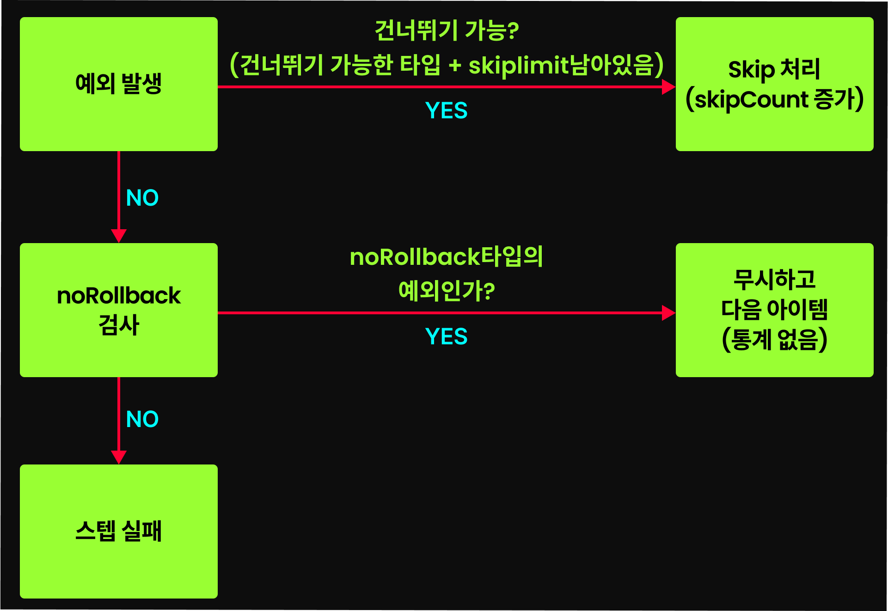

**ItemReader 에서의 noRollback 설정은 skip 과 굉장히 유사하다.**

왜냐하면 예외 발생시, 스텝이 중단되는 것이 아니라 그대로 해당 아이템 생략 후 다음 아이템을 읽기 때문이다.

다만, Skip 은 skipCount 같은 통계 정보를 기록하지만, noRollback 은 그렇지 않다는 정도의 차이만 있다.

#### `noRollback` : ItemProcessor 에서의 동작 메커니즘

ItemProcessor 에서 `noRollback()` 으로 지정한 예외가 발생하면 다음과 같이 처리된다.

1. noRollback 예외 여부 확인
   - 발생한 예외가 NoRollback 리스트에 있는지 확인한다.
   - 만약 noRollback 예외가 아니라면, 바로 전파하여 청크 트랜잭션을 롤백시킨다.
2. 강제 건너뛰기 시도
   - `noRollback()` 으로 설정된 예외라면, **해당 예외에 대해 Skip을 시도한다.**
   - 만약 해당 예외가 Skip 으로 지정되지 않았다면, 에러가 발생한다.
   - 즉, ItemProcessor에서 noRollback에 지정한 예외는 **반드시 skip 설정에도 포함**되어야 한다.

ItemProcessor의 noRollback은 "롤백하지 말고 건너뛰어라"는 명령어다. 건너뛸 수 없는 예외를 noRollback으로 설정하는 건 논리적 모순이기 때문에 Spring Batch가 거부하는 것이다.

#### `noRollback` : ItemWriter 에서의 동작 메커니즘

ItemWriter의 스캔모드에서 `noRollback()` 으로 지정한 예외가 발생하면 다음과 같이 처리된다.

1. 우선 발생한 예외가 건너뛰기 가능한 타입인지 검사한다. 만약 Skip 가능한 타입의 예외라면 Skip 처리한다.
   - **만약 `skip()` 으로 지정된 타입의 예외인데, `skipLimit()` 에 걸려 Skip 할 수 없다면, `noRollback()` 으로 등록된 예외라도 그대로 실패 처리된다.** 
2. Skip이 불가능한 타입의 예외라면, noRollback 처리한다. 이때 해당 예외를 무시하고, 그냥 넘어가게 된다.
   - **항상 Skip 이 noRollback보다 우선순위가 높다.**

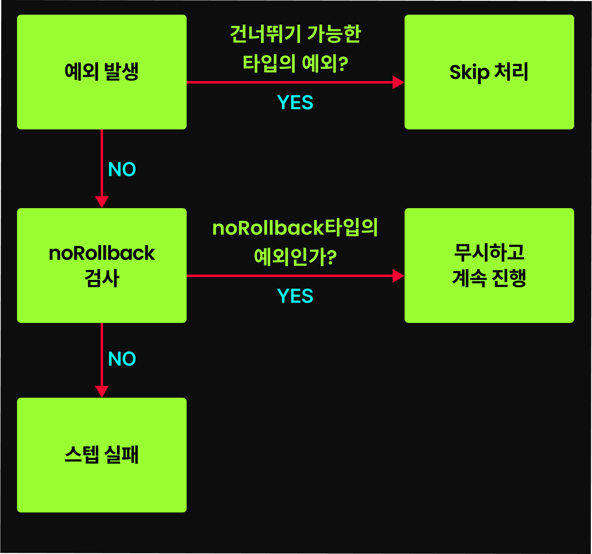

# Job과 메타데이터 저장소

## 개요

Spring Batch 는 메타데이터 관리 시스템을 제공한다. 각 작업의 실행 상태, 처리한 항목 수, 실패 지점 등을 DB에 기록하고 추적한다.

이 덕분에 작업이 실패해도 마지막으로 성공한 지점부터 작업을 재개할 수 있다.

## Job 의 핵심 도메인

### JobInstance (Job의 논리적 실행 단위)

JobInstance 는 Job 의 논리적인 실행 단위를 나타낸다. 이를 예시로 들면 아래와 같다.

```
Job: 월간 매출 정산 작업
  JobInstance#1: 2024년 1월 매출 정산
  JobInstance#2: 2024년 2월 매출 정산
  JobInstance#3: 2024년 3월 매출 정산
```

위와 같이 동일한 `월간 정산 작업` Job을 실행하더라도, 처리하는 데이터(월)가 다르면 각각 별도의 JobInstance 이다.

즉, 동일한 `월간 정산 작업` 이라는 Job 하위에, `2024년 1월 매출 정산` , `2024년 2월 매출 정산` 등 서로 다른 JobInstance 가 존재하는 것이다.

Spring Batch 가 Job 과 JobInstance 를 구분하는 방법은 아래와 같다.

- Job : Job 의 이름으로 구분한다. `new JobBuilder("monthlySalesSettlementJob", jobRepository)` 와 같이 Job 이름을 지정하면, 해당 Job 이름이 하나의 Job이 된다.
- JobInstance : Job 의 이름과 파라미터로 구분한다. 즉, 동일한 Job 이름이라도 파라미터가 다르면 별도의 JobInstance 로 간주한다. (아래에서 이어서 설명한다.)

### JobParameters (JobInstance를 식별하는 매개변수)

JobParameters는 동일한 Job을 서로 다른 JobInstance로 구분하는 핵심 요소다. 간단히 말해, Job + JobParameters의 조합이 하나의 고유한 JobInstance를 결정한다.

```
Job("월간_매출_정산_작업") + JobParameters(year=2024, month=1) = JobInstance#1
Job("월간_매출_정산_작업") + JobParameters(year=2024, month=2) = JobInstance#2
```

위와 같이 같은 코드(Job)를 실행하지만, 날짜가 다르면 완전히 다른 처리 단위(JobInstance)가 된다.

### JobExecution (JobInstance의 실제 실행 시도/이력)

JobInstance가 Job의 논리적인 실행을 의미한다면, JobExecution은 그 JobInstance의 실제 실행 시도를 나타낸다.

하나의 JobInstance는 여러 번 실행될 수 있으며, 각 실행 시도는 별도의 JobExecution으로 기록된다.

```
JobInstance#1: 2024년 1월 매출 정산
  JobExecution#1: 2024-01-31 10:00:00 ~ 2024-01-31 10:30:00 (실패)
  JobExecution#2: 2024-01-31 11:00:00 ~ 2024-01-31 11:15:00 (성공)
```

위 예시에서 `2024년 1월 매출 정산` JobInstance는 두 번 실행되었으며, 첫 번째 시도는 실패했고 두 번째 시도는 성공했다.

JobExecution에는 아래 주요 실행 정보가 포함된다.

- 현재 상태 : 작업이 현재 어떤 상태인지 ( `COMPLETED` , `FAILED` , `STOPPED` 등 )
- 시작 시각 : Job이 실행을 시작한 시점
- 종료 시각 : Job이 실행을 종료한 시점
- 종료 코드 : 해당 Job 실행의 최종 결과를 나타내는 코드
- 실패 원인 : 작업이 실패한 경우, 실패 원인에 대한 상세 정보

#### JobExecution 의 주요 실행 정보 - BatchStatus

JobExecution은 COMPLETED, FAILED, STOPPED 등의 실행 상태를 가질 수 있다. 이 상태를 BatchStatus라고 한다. BatchStatus는 Job 또는 Step의 실행 상태를 나타내는 열거형(Enum)이다.

- `COMPLETED` : 배치 작업이 성공적으로 완료됨
- `STARTING` : 배치 작업이 실행되기 직전 상태
- `STARTED` : 배치 작업이 현재 실행 중인 상태
- `STOPPING` : 배치 작업이 중지 요청을 받아 중지 진행 중인 상태
- `STOPPED` : 배치 작업이 요청에 의해 중지된 상태
- `FAILED` : 배치 작업이 실행 중 오류로 인해 실패한 상태
- `ABANDONED` : 배치 작업이 비정상 종료되어 재시작할 수 없는 상태
- `UNKNOWN` : 배치 작업의 상태를 확인할 수 없는 불확실한 상태

## JobInstance, JobParameters, JobExecution 으로 알아보는 Spring Batch 의 핵심 실행 원칙

### JobInstance 의 재실행 제한

Spring Batch에서는 동일한 JobInstance에 대해 여러 번 실행을 시도할 수 없다. 즉, 동일한 Job 이름과 JobParameters 조합으로 이미 실행된 JobInstance가 있다면, **다시 실행하려고 할 때 예외가 발생**한다.

즉 한 번 성공적으로 완료된 Job을 동일한 JobParameters로 다시 실행하려 하면 Spring Batch는 예외를 발생시킨다. 이는 동일한 작업이 중복 실행되어 발생할 수 있는 부작용을 방지하기 위한 안전장치다.

Spring Batch 는 Job을 실행할 때마다 동일한 JobInstance 가 과거에 성공적으로 완료된 적이 있는지 검사한다.

다시 말해 해당 JobInstance(`Job + JobParameters 조합`)의 실행 이력(`JobExecution`) 중 BatchStatus가 `COMPLETED`인 실행 이력(`JobExecution`)이 존재하는지를 검사한다. 만약 존재한다면 `JobInstanceAlreadyCompleteException`을 발생시키며 작업의 재실행을 거부한다. 반면 `COMPLETED` 상태의 JobExecution이 없는 경우에는 해당 JobInstance를 다시 실행할 수 있다.

### 동일 작업 여러 번 실행하기

#### JobParametersIncrementer

만약 동일한 Job을 여러 번 실행하고 싶다면, 매 실행마다 서로 다른 JobParameters를 제공해야 한다. 이를 자동화하기 위해 Spring Batch는 `JobParametersIncrementer` 인터페이스를 제공한다.

```java
public interface JobParametersIncrementer {  
   JobParameters getNext(@Nullable JobParameters parameters);  
}
```

입력으로 JobParameters를 받아서, 약간 변형된 새로운 JobParameters를 반환한다. 이 미묘한 변화 덕분에 Spring Batch는 매번 다른 JobInstance로 인식하게 된다.

#### RunIdIncrementer

`RunIdIncrementer`는 JobParametersIncrementer의 대표적인 구현체다. 이놈은 각 배치 실행마다 `run.id`라는 이름의 파라미터 값을 자동으로 증가시킨다. 예시는 아래와 같다.

- 첫 실행: `run.id=1`
- 두 번째 실행: `run.id=2`
- 세 번째 실행: `run.id=3`

사용자가 제공한 파라미터는 그대로 유지한 채, `run.id` 파라미터의 값만 증가시켜 Spring Batch를 속이는 것이다. 만약 이전에 실행된 적이 없다면 `run.id`를 1로 설정해서 시작한다.

실제로 아래와 같이 사용한다.

```java
@Bean
public Job brutalizedSystemJob() {
    return new JobBuilder("brutalizedSystemJob", jobRepository)
            .incrementer(new RunIdIncrementer()) // 이 한 줄이 전부다💀
            .start(brutalizedSystemStep())
            .build();
}
```

이제 `brutalizedSystemJob`을 매번 실행할 때마다 `run.id`가 자동으로 증가하여, 동일한 JobParameters로 인한 재실행 예외를 피할 수 있다.

단, 이렇게 재실행을 허용한다면 Spring Batch 에서 제공하는 안전장치를 포기하는 것이므로, 작업이 중복 실행되어 발생할 수 있는 부작용에 대해 인지하고 사용하자.

### identifying 속성

JobParameters의 각 파라미터는 `identifying` 속성을 가질 수 있다. 이 속성은 해당 파라미터가 JobInstance 식별에 사용되는지 여부를 나타낸다.

이전에 잡 파라미터를 어떻게 전달하는지에 대해 다뤘었다.

```
// 커맨드라인 인수로 전달시
./gradlew bootRun --args='--spring.batch.job.name=brutalizedSystemJob chaos=true,java.lang.Boolean,true verbose=true,java.lang.String,false'

// JSON 형식으로 전달시
key1='{ "value":"value1", "type":"java.lang.String", "identifying":true }' key2='{ "value":"value1", "type":"java.lang.String", "identifying":false }''
```

커맨드라인 인수의 세번째 값(`{파라미터명}={파라미터값},{값타입},{indentifying값}`)과, JSON 형식에서의 `identifying` 속성이 바로 JobParameters 의 `identifying` 을 의미한다. 이는 다음과 같은 의미를 가진다.

- `identifying=true` : 해당 파라미터는 JobInstance 식별에 사용된다. 즉, 이 파라미터 값이 다르면 별도의 JobInstance로 간주된다.
- `identifying=false` : 해당 파라미터는 JobInstance 식별에 사용되지 않는다. 즉, 이 파라미터 값이 달라도 동일한 JobInstance로 간주된다.

### restartable 설정

Job은 기본적으로 **실패한 경우** 재시작이 가능하다. 하지만 비즈니스적인 이유로, 실패시에도 재시작을 막아야 할 때가 있다.

이런 상황을 위해 Spring Batch는 `preventRestart()` 메서드를 제공한다. 이는 아래와 같이 사용할 수 있다.

```java
@Bean
public Job brutalizedSystemJob() {
  return new JobBuilder("brutalizedSystemJob", jobRepository)
          .start(brutalizedSystemStep())
          .preventRestart() // 이 한 줄로 실패시에도 재시작을 막는다 💀
          .build();
}
```

이 설정이 적용된 Job은 한 번이라도 실패하면, 동일한 JobInstance에 대해 다시 실행할 수 없다. 재시작을 시도하면 `JobRestartException`이 발생한다.

**단 주의해야하는 것은, 이 설정을 RunIdIncrementer 와 함께 사용하는 경우다. RunIdIncrementer 는 매 실행마다 새로운 JobParameters 를 생성하여, 사실상 매번 새로운 JobInstance 로 인식되게 만든다. 따라서 `preventRestart()` 설정이 무의미해진다.**

> #### 정리하자면...
> 
> - 이미 **성공 완료된** "동일한 JobInstance (동일한 Job, 동일한 JobParameters)"에 대해 여러 번 실행하는 것을 막으려면 : 기본 동작
> - 이미 **성공 완료된** "동일한 JobInstance (동일한 Job, 동일한 JobParameters)"에 대해 여러 번 실행하는 것을 허용하려면 : `RunIdIncrementer` 사용
> - **실패한** "동일한 JobInstance (동일한 Job, 동일한 JobParameters)"에 대해 여러 번 실행하는 것을 허용하려면 : 기본 동작
> - **실패한** "동일한 JobInstance (동일한 Job, 동일한 JobParameters)"에 대해 여러 번 실행하는 것을 막으려면 : `preventRestart()` 사용

## Step 의 핵심 도메인

### StepExecution (Step의 실제 실행 시도/이력)

StepExecution은 JobExecution의 하위 개념으로, Job 내에서 각 Step의 실제 실행 시도를 나타낸다.

하나의 Job은 여러 Step으로 구성될 수 있기에, 하나의 JobExecution이 여러 개의 StepExecution을 가질 수 있다.

```
JobExecution {
    StepExecution("step1")
    StepExecution("step2")
    StepExecution("step3")
}
```

StepExecution은 Step 실행 시 생성되며, 해당 Step이 실제로 시작될 때만 생성된다. 이는 중요한 포인트다.

예를 들어, 첫 번째 Step이 실패하면 두 번째 Step은 실행되지 않으므로 두 번째 Step에 대한 StepExecution도 생성되지 않는다.

StepExecution이 갖는 주요 실행 정보는 아래와 같다.

- 현재 상태: Step이 현재 어떤 상태인지를 나타내는 BatchStatus
- 읽기/쓰기 카운트: 성공적으로 읽거나 쓴 아이템의 수
- 커밋/롤백 카운트: 트랜잭션 처리 횟수
- 스킵 카운트: 청크 처리 중 건너뛴 아이템의 수
- 시작/종료 시간: Step 실행의 시간적 정보
- 종료 코드: Step 실행의 최종 결과 코드
- 예외 정보: 실패 시 발생한 오류에 대한 상세 정보

#### StepExecution 의 주요 실행 정보 - BatchStatus

StepExecution의 BatchStatus 와 JobExecution의 BatchStatus 는 동일한 열거형(Enum)을 사용한다. 즉, StepExecution도 `COMPLETED`, `FAILED`, `STOPPED` 등의 상태를 가질 수 있다.

그리고 StepExecution의 BatchStatus 와 JobExecution의 BatchStatus 는 서로 면밀한 관계를 갖는다.

**JobExecution의 최종 BatchStatus는 해당 JobExecution에서 가장 마지막에 실행된 StepExecution의 BatchStatus 값을 기준으로 결정된다.**

이에 대한 예시는 아래와 같다.

```
JobExecution {
    StepExecution("step1") - COMPLETED
    StepExecution("step2") - FAILED
    StepExecution("step3") - (실행되지 않음)
}
```

위 예시에서 `step2`가 실패했기 때문에, `step3`은 실행되지 않았다. 따라서 가장 마지막에 실행된 StepExecution의 BatchStatus는 `FAILED` 이다. 이에 따라 JobExecution의 최종 BatchStatus는 `FAILED`가 된다.

#### 실패와 재시작시, StepExecution 의 동작 방식

스텝을 다시 실행할 때 새로운 StepExecution이 생성된다. StepExecution이 JobExecution에 종속되어 있기에, Job 이 재시작될 때마다 새로운 JobExecution이 생성되고, 그에 따라 각 Step에 대해 새로운 StepExecution이 생성된다.

그리고 중요한 사실은, **실패한 Job을 재시작할 때는 실패한 Step부터 다시 시작된다는 것**이다. 이미 성공적으로 완료된 Step은 재실행되지 않으므로 **새로운 StepExecution도 생성되지 않**는다.

```
JobExecution#1 (FAILED) {
    StepExecution#1 ("step1", COMPLETED)
    StepExecution#2 ("step2", FAILED)    // 이놈이 실패했다 💀
}

JobExecution#2 (COMPLETED) {
    // StepExecution#1 ("step1")은 이미 성공했으므로 다시 생성되지 않음
    StepExecution#3 ("step2", COMPLETED) // 실패한 step2부터 재시작
}
```

#### StepExecution 의 전략적 활용 예시

- 성능 모니터링: 각 Step의 처리 시간과 처리량을 분석하여 병목 지점 식별
- 오류 패턴 분석: 특정 데이터나 조건에서 반복적으로 오류가 발생하는지 파악
- 자원 할당 최적화: 읽기/쓰기/처리 비율을 분석하여 리소스 할당 조정

## ExecutionContext : 상태 저장소

ExecutionContext는 배치 작업의 상태 정보를 저장하는 데이터 컨테이너이다. 이는 JobExecution과 StepExecution에 각각 연결되어, 작업의 진행 상태를 추적하고 복원하는 데 사용된다.

**비즈니스 로직 처리 중에 발생하는 사용자 정의 데이터를 관리할 방법**이 필요한데, 이때 사용하는 것이 바로 ExecutionContext다.

```
// ExecutionContext 예시
ExecutionContext {
    "processingIndex": 42500,              // 마지막으로 처리한 항목 인덱스
    "totalAmount": 2750000.00,             // 중간 집계 결과
    "lastProcessedId": "TRX-20240315-789", // 마지막으로 처리한 거래 ID
}
```

### ItemStream 과 ExecutionContext

ItemStream.open() 메서드는 ExecutionContext에서 이전 실행의 상태 정보를 복원하고, update() 메서드는 현재 실행 중인 상태 정보를 ExecutionContext에 저장했다.

이처럼 open()에서 이전 상태를 가져오고 update()로 현재 상태를 저장할 수 있었던 이유가 바로 이 ExecutionContext가 메타데이터 저장소에 영구적으로 저장되기 때문이다.

update() 메서드로 저장한 정보는 데이터베이스에 기록되고, 재시작 시 open() 메서드를 통해 그 정보가 다시 로드된다.

## 배치 메타데이터 테이블 구조

Spring Batch는 메타데이터 저장소로 관계형 데이터베이스를 사용하며, 여러 개의 테이블을 통해 Job과 Step의 실행 상태 및 통계 정보를 관리한다.

### 주요 메타데이터 테이블

- `BATCH_JOB_INSTANCE` : JobInstance 정보를 저장한다. 각 JobInstance는 고유한 ID와 Job 이름, JobParameters로 식별된다.
- `BATCH_JOB_EXECUTION` : JobExecution 정보를 저장한다. 각 JobExecution은 고유한 ID, 관련된 JobInstance ID, 실행 상태, 시작 및 종료 시간 등을 포함한다.
- `BATCH_JOB_EXECUTION_PARAMS` : JobExecution과 관련된 JobParameters 정보를 저장한다. 각 파라미터는 이름, 값, 타입, 식별 여부 등을 포함한다.
- `BATCH_STEP_EXECUTION` : StepExecution 정보를 저장한다. 각 StepExecution은 고유한 ID, 관련된 JobExecution ID, Step 이름, 실행 상태, 읽기/쓰기 카운트 등을 포함한다.
- `BATCH_JOB_EXECUTION_CONTEXT` : JobExecution과 관련된 ExecutionContext 정보를 저장한다. 이는 Job 실행 중에 필요한 상태 정보를 담는다.
- `BATCH_STEP_EXECUTION_CONTEXT` : StepExecution과 관련된 ExecutionContext 정보를 저장한다. 이는 Step 실행 중에 필요한 상태 정보를 담는다.

이제 각 테이블에 대해 상세히 설명한다.

#### `BATCH_JOB_INSTANCE` 테이블

| 컬럼명            | 설명                              | 키 타입  |
|-------------------|---------------------------------|----------|
| JOB_INSTANCE_ID   | Job 인스턴스의 고유 식별자                |   PK     |
| JOB_NAME          | Job 이름. JobInstance 식별에 반드시 필요  |          |
| JOB_KEY           | JobParameters의 해시값              |          |
| VERSION           | 낙관적 락(Optimistic Lock) 버전.<br/>JobInstance의 경우 항상 0으로 유지됨 |          |

- 제약조건
  - `unique (JOB_NAME , JOB_KEY)` : 동일한 Job 이름과 JobParameters 조합으로 중복된 JobInstance 생성 방지

#### `BATCH_JOB_EXECUTION` 테이블

| 컬럼명            | 설명                                 | 키 타입   |
|------------------|------------------------------------|---------|
| JOB_EXECUTION_ID | 작업 실행의 고유 식별자                  | PK     |
| VERSION          | 낙관적 락 버전                        |         |
| JOB_INSTANCE_ID  | 연관된 JobInstance의 ID              | FK      |
| CREATE_TIME      | JobExecution 생성 시간               |         |
| START_TIME       | JobExecution 시작 시간               |         |
| END_TIME         | JobExecution 종료 시간               |         |
| STATUS           | JobExecution 현재 상태(BatchStatus)  |         |
| EXIT_CODE        | JobExecution 종료 코드               |         |
| EXIT_MESSAGE     | JobExecution 종료 메시지(오류 포함)     |         |
| LAST_UPDATED     | 마지막 업데이트 시간                    |         |

- 제약조건
  - `foreign key (JOB_INSTANCE_ID) references BATCH_JOB_INSTANCE(JOB_INSTANCE_ID)`
    - 하나의 JobInstance는 여러 번 실행될 수 있으므로(실패 후 재시작 등) 동일한 JOB_INSTANCE_ID 값을 갖는 여러 BATCH_JOB_EXECUTION 레코드가 존재할 수 있다.
    - 이는 1:N 관계를 형성한다.

#### `BATCH_JOB_EXECUTION_PARAMS` 테이블

| 컬럼명            | 설명                          | 키 타입 |
|------------------|-----------------------------|---------|
| JOB_EXECUTION_ID | 작업 실행의 ID                 | FK      |
| PARAMETER_NAME   | 파라미터 이름                  |         |
| PARAMETER_TYPE   | 파라미터 타입                  |         |
| PARAMETER_VALUE  | 파라미터 값                    |         |
| IDENTIFYING      | JobInstance 식별에 사용 여부    |         |

#### `BATCH_STEP_EXECUTION` 테이블

| 컬럼명              | 설명                                  | 키 타입  |
|-------------------|--------------------------------------|---------|
| STEP_EXECUTION_ID | StepExecution 고유 식별자               | PK      |
| VERSION           | 낙관적 락 버전                          |         |
| STEP_NAME         | Step 이름                             |         |
| JOB_EXECUTION_ID  | 연관된 JobExecution의 ID               | FK      |
| CREATE_TIME       | 실행 레코드 생성 시간                     |         |
| START_TIME        | StepExecution 시작 시간                |         |
| END_TIME          | StepExecution 종료 시간                |         |
| STATUS            | StepExecution의 현재 상태(BatchStatus)  |         |
| COMMIT_COUNT      | 커밋 횟수                              |         |
| READ_COUNT        | 읽은 아이템 수                          |         |
| FILTER_COUNT      | 필터링된 아이템 수                       |         |
| WRITE_COUNT       | 쓴 아이템 수                            |         |
| READ_SKIP_COUNT   | 읽기 건너뛴 수                          |         |
| WRITE_SKIP_COUNT  | 쓰기 건너뛴 수                          |         |
| PROCESS_SKIP_COUNT| 처리 건너뛴 수                          |         |
| ROLLBACK_COUNT    | 롤백 횟수                              |         |
| EXIT_CODE         | StepExecution 종료 코드                |         |
| EXIT_MESSAGE      | StepExecution 종료 메시지              |         |
| LAST_UPDATED      | 마지막 업데이트 시간                     |         |

- 제약조건
  - `foreign key (JOB_EXECUTION_ID) references BATCH_JOB_EXECUTION(JOB_EXECUTION_ID)`
    - 하나의 JobExecution은 여러 Step으로 구성될 수 있으므로, 동일한 JOB_EXECUTION_ID 값을 갖는 여러 BATCH_STEP_EXECUTION 레코드가 존재할 수 있다.
    - 이는 1:N 관계를 형성하며, 각 StepExecution이 어떤 JobExecution에 속하는지를 나타낸다.

#### `BATCH_JOB_EXECUTION_CONTEXT` 테이블 , `BATCH_STEP_EXECUTION_CONTEXT` 테이블

| 컬럼명            | 설명                                | 키 타입   |
|------------------|-----------------------------------|---------|
| JOB_EXECUTION_ID | JobExecution의 ID                  | PK, FK  |
| SHORT_CONTEXT    | 직렬화된 ExecutionContext의 문자열 버전 |         |
| SERIALIZED_CONTEXT| 전체 컨텍스트, 직렬화된 형태            |         |

| 컬럼명              | 설명                               | 키 타입   |
|-------------------|-----------------------------------|---------|
| STEP_EXECUTION_ID | StepExecution의 ID                 | PK, FK  |
| SHORT_CONTEXT     | 직렬화된 ExecutionContext의 문자열 버전 |         |
| SERIALIZED_CONTEXT| 전체 컨텍스트, 직렬화된 형태             |         |

ExecutionContext의 데이터는 직렬화되어 문자열로 변환된다. 이 직렬화된 문자열의 길이가 일정 기준(기본값 2500자)보다 짧으면 `SHORT_CONTEXT`에만 저장되고 `SERIALIZED_CONTEXT`는 NULL로 설정된다.

반대로 직렬화된 문자열이 기준 길이를 초과하면 SHORT_CONTEXT에는 잘린 버전(약 2492자 + "...")이 저장되고, 전체 내용은 SERIALIZED_CONTEXT에 CLOB 형태로 저장된다.

## 생명주기 - JobInstance, JobExecution, Job 수준 ExecutionContext

### JobInstance

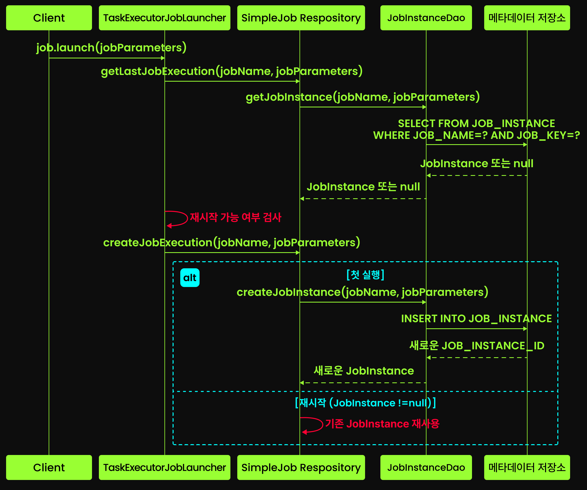

### JobExecution

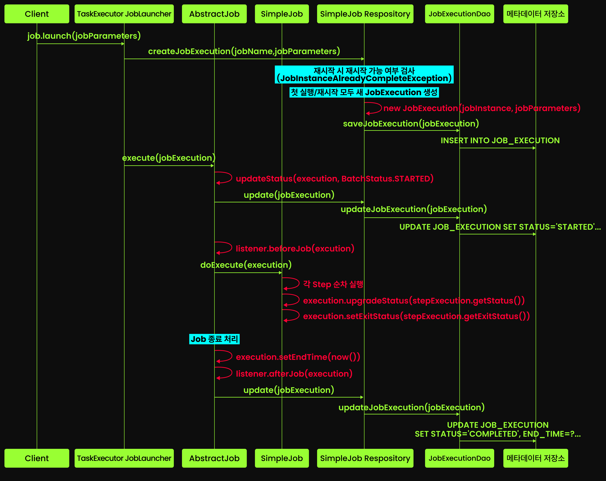

### Job 수준 ExecutionContext

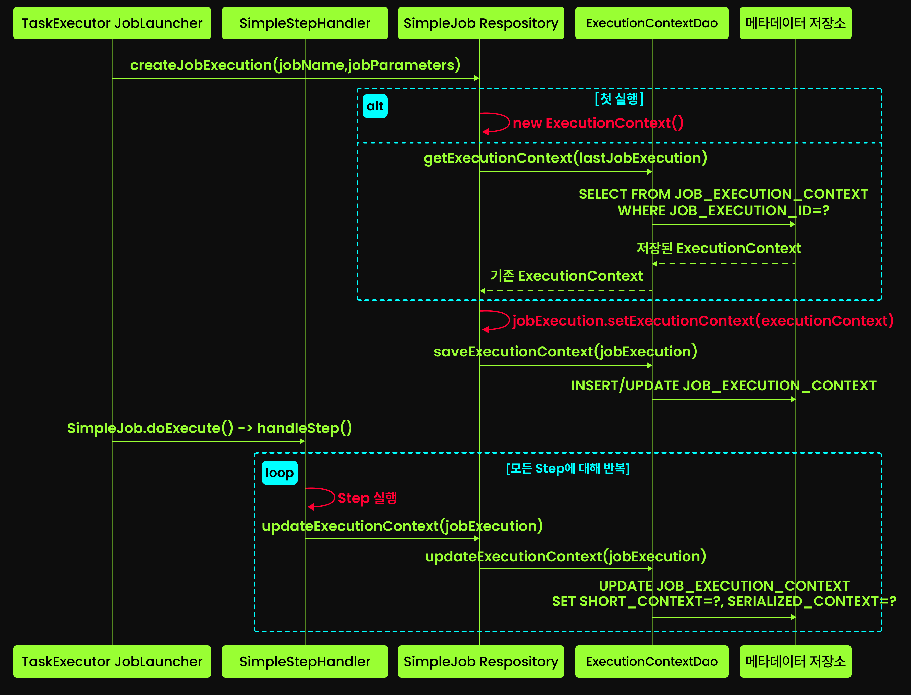

# Spring Batch 의 AutoConfiguration

## BatchAutoConfiguration

BatchAutoConfiguration은 Spring Batch를 위한 컴포넌트들을 Spring Boot가 자동으로 등록하는 Configuration 이다.

BatchAutoConfiguration은 아래와 같은 작업을 자동으로 수행한다.

- `JobLauncherApplicationRunner` 생성
  - 우리가 커맨드라인에서 전달한 인수를 읽어 배치를 실행해 주는 실행기를 등록
- `BatchProperties` 바인딩
  - spring.batch.job.name 같은 설정값들을 자바 객체로 매핑
- `JobExecutionExitCodeGenerator` 등록
  - 배치 실행 결과(성공/실패)를 운영체제가 이해할 수 있는 종료 코드(0, 1 등)로 변환
- 데이터베이스 초기화
  - `spring.batch.jdbc.initialize-schema` 설정이 켜져 있다면, 배치 메타데이터 테이블(JOB_INSTANCE 등)을 DB에 자동으로 생성

이 덕분에, 별다른 설정없이 Spring Batch를 사용할 수 있게 된다.

### SpringBootBatchConfiguration

BatchAutoConfiguration 의 내부에 static class 인 SpringBootBatchConfiguration 가 선언되어 있다.

```java
public class BatchAutoConfiguration {
    static class SpringBootBatchConfiguration extends DefaultBatchConfiguration {
        //...
    }
}
```

SpringBootBatchConfiguration 는 DefaultBatchConfiguration 를 상속받아서, Spring Batch를 위해 필요한 Bean 들을 등록한다. 실제 컴포넌트의 생성은 DefaultBatchConfiguration 에서 이뤄진다.

| 클래스명 | 역할 | 특징 |
|------|----|----|
|    DefaultBatchConfiguration  |  배치 인프라의 설계도  |   배치 인프라의 설계도	JobRepository, JobLauncher 등을 빈으로 정의 |
|  SpringBootBatchConfiguration    |   Boot 전용 최적화 |   DefaultBatchConfiguration을 상속받아 Boot 환경에 맞춰 세팅 |


그리고 DefaultBatchConfiguration 를 사용해서 원하는 컴포넌트를 커스터마이징할 수 있는데, 이는 바로 아래에서 다룬다.

## SpringBootBatchConfiguration 와 DefaultBatchConfiguration

SpringBootBatchConfiguration 는 개발자가 원하는 배치 컴포넌트만 교체할 수 있도록 지원한다.

SpringBootBatchConfiguration 는 DefaultBatchConfiguration 을 상속받아서 구현되는데, DefaultBatchConfiguration 의 `protected` 메서드를 오버라이딩함으로써 Spring batch의 핵심 컴포넌트를 교체할 수 있다.

```java
// 커스텀 Configuration
@Configuration
public class KillBatchCustomConfiguration extends DefaultBatchConfiguration {

    /**
     * 이처럼 오버라이딩하여, ExecutionContext를 메타데이터 저장소에 저장할 때 사용될 직렬화 도구를 변경할 수 있다.
     * 이 코드에서는 JSON 으로 직렬화하도록 커스텀되었다.
     */
    @Override
    protected ExecutionContextSerializer getExecutionContextSerializer() {
        return new Jackson2ExecutionContextStringSerializer();
    }
}
```

### DefaultBatchConfiguration 란?

그렇다면 DefaultBatchConfiguration 이 도대체 무엇이길래, 이런 커스터마이징이 가능해질까?

DefaultBatchConfiguration은 다음과 같은 Spring Batch 핵심 컴포넌트들을 자동으로 생성하고 애플리케이션 컨텍스트에 등록해준다.

- JobRepository
- JobExplorer
- JobLauncher
- JobRegistry
- JobOperator
- JobRegistryBeanPostProcessor
- StepScope
- JobScope

DefaultBatchConfiguration 는 아래와 같이 작성되어 있다.

```java
@Configuration(proxyBeanMethods = false)
@Import(ScopeConfiguration.class)
public class DefaultBatchConfiguration implements ApplicationContextAware {
    
    // --------------------- 핵심 컴포넌트 Bean 등록 ------------------------
    
    @Bean
    public JobRepository jobRepository() throws BatchConfigurationException {
    ... // 구체적인 생성 코드는 생략한다.
    }
  
    @Bean
    public JobLauncher jobLauncher(JobRepository jobRepository) throws BatchConfigurationException {
    ... // 구체적인 생성 코드는 생략한다.
    }
	
    @Bean
    public JobExplorer jobExplorer() throws BatchConfigurationException {
    ... // 구체적인 생성 코드는 생략한다.
    }
	
    @Bean
    public JobRegistry jobRegistry() throws BatchConfigurationException {
    ... // 구체적인 생성 코드는 생략한다.
    }
  
    @Bean
    public JobRegistrySmartInitializingSingleton jobRegistrySmartInitializingSingleton(JobRegistry jobRegistry) throws BatchConfigurationException {
    ... // 구체적인 생성 코드는 생략한다.
    }
    
    // ------------------------- 커스터마이징을 위해 오버라이딩 가능한 메서드 -------------------------
    protected DataSource getDataSource() {
    ...
    }

    protected PlatformTransactionManager getTransactionManager() {
    ...
    }

    protected String getTablePrefix() {
    ...
    }

    protected TaskExecutor getTaskExecutor() {
    ...
    }
}
```

위처럼 "핵심 컴포넌트들을 Bean으로 등록하는 메서드"와, "각 getter 메서드"로 구성되어 있다.

여기서 getter 메서드를 오버라이딩하여 컴포넌트 교체를 할 수 있다.

## `@EnableBatchProcessing`

DefaultBatchConfiguration 를 상속받아 직접 구현하는 것 대신, `@EnableBatchProcessing` 애너테이션을 활용하는 방법도 존재한다.

```java
@Configuration
@EnableBatchProcessing(executionContextSerializerRef = "jacksonExecutionContextSerializer") //교체할 컴포넌트 Bean 명시
public class BatchConfig {

    // DataSource, TransactionManager 정의

    @Bean
    public ExecutionContextSerializer jacksonExecutionContextSerializer() {
        return new Jackson2ExecutionContextStringSerializer();
    }
}
```

`@EnableBatchProcessing`의 배치 코어 컴포넌트 커스터마이징 접근법은 DefaultBatchConfiguration과 다르다. 메서드 오버라이드 대신 커스텀 빈을 정의하고, 어노테이션 속성에 해당 빈 이름을 지정하는 방식으로 커스터마이징한다.

## DefaultBatchConfiguration 상속 / `@EnableBatchProcessing` 애너테이션 방식의 커스터마이징 사용시, 주의사항

`@EnableBatchProcessing`을 사용하거나 DefaultBatchConfiguration을 직접 상속하면, Spring Boot가 제공하던 자동 실행(JobLauncherApplicationRunner) 기능을 제공받지 못한다.

이는 위에서 살펴본 BatchAutoConfiguration 클래스를 보면 알 수 있다.

```java
// DefaultBatchConfiguration 를 상속받은 Bean 이 있거나, EnableBatchProcessing 애너테이션을 사용하는 Bean이 있다면, BatchAutoConfiguration 생성 X
@ConditionalOnMissingBean(value = DefaultBatchConfiguration.class, annotation = EnableBatchProcessing.class)
public class BatchAutoConfiguration {
    //..
}
```

따라서 아래 방법을 쓰는 것이 가장 추천된다.

## Bean으로 직접 등록 : 가장 추천되는 컴포넌트 커스터마이징 방법

Spring Batch의 컴포넌트를 변경할 때, 가장 추천되는 방법은 아래처럼 직접 해당 컴포넌트를 Bean으로 등록하는 것이다. 

```java
@Configuration
public class KillBatchCustomConfiguration {

    //교체할 Spring Batch 컴포넌트를 Bean으로 등록
    @Bean
    public ExecutionContextSerializer executionContextSerializer() {
        return new Jackson2ExecutionContextStringSerializer();
    }
}
```

이것이 가능한 이유는 SpringBootBatchConfiguration 가 주입받은 빈들을 활용해 DefaultBatchConfiguration의 메서드들을 오버라이드했기 때문이다.

아래처럼 말이다.

```java
public class BatchAutoConfiguration {
    //...

    static class SpringBootBatchConfiguration extends DefaultBatchConfiguration {
        /**
         * SpringBootBatchConfiguration 의 생성자.
         * 현재 Context에 있는 Bean 객체들을 가져와, 필드에 세팅한다.
         */
        SpringBootBatchConfiguration(DataSource dataSource, @BatchDataSource ObjectProvider<DataSource> batchDataSource,
                                     PlatformTransactionManager transactionManager,
                                     @BatchTransactionManager ObjectProvider<PlatformTransactionManager> batchTransactionManager,
                                     @BatchTaskExecutor ObjectProvider<TaskExecutor> batchTaskExecutor, BatchProperties properties,
                                     ObjectProvider<BatchConversionServiceCustomizer> batchConversionServiceCustomizers,
                                     ObjectProvider<ExecutionContextSerializer> executionContextSerializer) {
            this.dataSource = batchDataSource.getIfAvailable(() -> dataSource);
            this.transactionManager = batchTransactionManager.getIfAvailable(() -> transactionManager);
            this.taskExector = batchTaskExecutor.getIfAvailable();
            this.properties = properties;
            this.batchConversionServiceCustomizers = batchConversionServiceCustomizers.orderedStream().toList();
            this.executionContextSerializer = executionContextSerializer.getIfAvailable();
        }

        /**
         * DefaultBatchConfiguration 의 메서드 오버라이딩.
         * 생성자 주입으로 세팅된 필드를 반환하도록 한다.
         * 이를 통해, 원하는 컴포넌트를 Bean 객체로 등록하기만 해도 알아서 교체될 수 있다.
         */
        @Override
        protected PlatformTransactionManager getTransactionManager() {
            return this.transactionManager;
        }
        
        //...
    }
}
```

## `@BatchXXX` 애너테이션의 역할

Spring Batch의 특정 컴포넌트를 교체할 때, 단순히 해당 컴포넌트를 Bean으로 등록하면 된다고 설명했었다. 그런데 이때 만약 여러 개의 동일 타입 Bean 이 존재한다면, 어떤 Bean 을 주입해야 할지 모호해진다.

예를 들어, PlatformTransactionManager 타입의 Bean 이 2개 이상 존재한다면, SpringBootBatchConfiguration 에서는 어떤 Bean 을 주입해야 할지 알 수 없다.

이 문제를 해결하기 위해, Spring Batch 는 `@BatchDataSource` , `@BatchTransactionManager` , `@BatchTaskExecutor` , `@BatchXXX` 애너테이션을 제공한다.

위에서 살펴본 SpringBootBatchConfiguration 의 생성자를 보면, `@BatchDataSource` , `@BatchTransactionManager` , `@BatchTaskExecutor` , `@BatchXXX` 애너테이션이 붙은 빈들을 주입받는 것을 알 수 있다.

이 애너테이션들은 특정 타입의 빈이 여러 개 존재할 때, Spring Batch를 위한 빈을 명확하게 구분하기 위한 한정자(Qualifier) 역할을 한다

따라서 여러 개의 동일 타입 Bean 이 존재하더라도, `@BatchXXX` 애너테이션을 붙인 Bean 만 주입받게 되어 모호성이 해결된다.

예를 들어, 아래와 같이 `@BatchTransactionManager` 애너테이션을 붙인 PlatformTransactionManager 빈을 정의할 수 있다.

```java
@Configuration
public class KillBatchCustomConfiguration {
    @Bean
    @BatchTransactionManager // 이 애너테이션이 붙은 Bean 만 Spring Batch 에서 사용된다.
    public PlatformTransactionManager batchTransactionManager(DataSource dataSource) {
        return new DataSourceTransactionManager(dataSource);
    }
}
```

이제 SpringBootBatchConfiguration 에서는 `@BatchTransactionManager` 애너테이션이 붙은 빈을 주입받아, Spring Batch 의 트랜잭션 매니저로 사용하게 된다.

### TransactionManager 분리하기

위처럼 TransactionManager 를 분리하는 것은 중요하다.

우리가 직접 TransactionManager 빈을 구성하지 않으면, Spring Boot는 기본적으로 하나의 TransactionManager를 생성하여 **배치 메타데이터와 실제 비즈니스 데이터베이스에 모두 동일한 트랜잭션 관리자를 적용**한다.

일반적으로 비즈니스 데이터를 다루는 DB와 배치 메타데이터를 다루는 DB는 분리하여 관리된다. 따라서 배치 메타데이터용 TransactionManager와 비즈니스 데이터용 TransactionManager를 분리하는 것이 바람직하다.

이를 위해 `@BatchTransactionManager` 애너테이션을 활용하여, 배치 메타데이터용 TransactionManager를 별도로 정의할 수 있다. 전체 예시는 아래와 같다.

```java
@Configuration
public class TransactionManagerConfig {

    // 비즈니스 데이터 처리를 위한 메인 데이터 소스
    @Bean
    @Primary //일반 트랜잭션 매니저에 사용될 데이터 소스
    public DataSource dataSource() {
        return DataSourceBuilder.create()
                .url("jdbc:mysql://localhost:3306/target_system")
                .username("root")
                .password("1q2w3e")
                .build();
    }

    // Spring Batch 메타데이터 저장을 위한 데이터 소스
    @Bean
    @BatchDataSource //배치 메타데이터에 사용될 데이터 소스
    public DataSource batchDataSource() {
        return DataSourceBuilder.create()
                .url("jdbc:mysql://localhost:3306/batch_control")
                .username("kill9")
                .password("d3str0y3r")
                .build();
    }

    // 비즈니스 데이터 처리용 JPA 트랜잭션 매니저
    @Bean
    @Primary //일반 트랜잭션 매니저에 사용될 트랜잭션 매니저
    public PlatformTransactionManager transactionManager(EntityManagerFactory entityManagerFactory) {
        return new JpaTransactionManager(entityManagerFactory);
    }

    // Spring Batch 메타데이터용 트랜잭션 매니저
    @Bean
    @BatchTransactionManager //배치 메타데이터에 사용될 트랜잭션 매니저
    public PlatformTransactionManager batchTransactionManager(@BatchDataSource DataSource dataSource) {
        return new JdbcTransactionManager(dataSource);
    }
}
```

이렇게 데이터소스와 트랜잭션 매니저를 분리하면, 각 트랜잭션이 독립적으로 동작하여 상호 간의 기술적 충돌이나 간섭을 방지할 수 있다.

### **트랜잭션 매니저 분리시 주의사항**

단, 이렇게 트랜잭션 매니저를 분리할 경우 반드시 주의해야 할 사항이 있다. 트랜잭션 정책이 분리되었기 때문에 데이터 불일치 문제가 발생할 수 있다.

예를 들어, 배치 메타데이터 트랜잭션 매니저가 커밋되었지만, 비즈니스 데이터 트랜잭션 매니저가 롤백되는 상황이 발생할 수 있다. 이로 인해 배치 메타데이터와 실제 비즈니스 데이터 간에 불일치가 생길 수 있다.

이런 문제를 해결하기 위해서는 두 가지 방법을 고려해볼 수 있다.

- XA DataSource와 JTA TransactionManager를 사용하여 분산 트랜잭션을 구성하는 방법
  - 이렇게 처리하면 두 트랜잭션 매니저가 하나의 글로벌 트랜잭션으로 묶이게 되어, 일관성을 유지할 수 있다.
  - 단, 분산 트랜잭션은 시스템 복잡성을 증가시키고 성능에 영향을 미칠 수 있으므로 신중히 고려해야 한다.
- 이런 데이터 불일치 위험을 감안하고 적절한 모니터링 및 복구 메커니즘을 구축하는 방법
  - 완벽한 일관성이 필요한 비즈니스가 아니라면, 대부분의 경우 이 방법으로 충분하다.

# 커맨드라인에서의 ExitCode 조작

## ExitCode 기본 동작

Spring Batch 애플리케이션을 커맨드라인에서 실행할 때, 배치 작업의 성공 또는 실패에 따라 운영체제에 반환되는 종료 코드(Exit Code)를 조작할 수 있다.

```shell
> ./gradlew clean build
> cd ./build/libs
> java -jar kill-batch-system-0.0.1-SNAPSHOT.jar --spring.batch.job.name=brutalizedSystemJob chaos=true,java.lang.Boolean
> echo $?
> 0

Process finished with exit code 0
```

위와 같이, 배치 작업이 성공적으로 완료되면 운영체제에 `0`을 반환한다. 중요한 것은 **배치 작업이 실패한 경우에도 `0`을 반환**한다는 것이다.

이는 Spring Batch의 기본 동작 방식이다. 배치 작업이 실패하더라도, 애플리케이션 자체는 정상적으로 종료되었기 때문에 운영체제에 `0`을 반환한다.

### ExitCode 변경하기

이를 해결하기 위해선, 스프링 부트 main 메서드를 아래와 같이 수정해야한다.

```java
@SpringBootApplication
public class KillBatchSystemApplication {

    public static void main(String[] args) {
        // SpringApplication.run(KillBatchSystemApplication.class, args); 기존 코드
        // 아래처럼 수정
	    System.exit(SpringApplication.exit(SpringApplication.run(KillBatchSystemApplication.class, args)));
    }
}
```

이는 아래와 같이 동작한다.

1. `SpringApplication.run()` 메서드를 호출하여 애플리케이션을 실행한다.
2. `SpringApplication.exit()` 메서드를 호출하여 애플리케이션의 종료 코드를 가져온다.
3. `System.exit()` 메서드를 호출하여 운영체제에 종료 코드를 반환한다.

## JobExecutionExitCodeGenerator

`SpringApplication.exit()` 메서드는 `ExitCodeGenerators` 를 사용해 종료 코드를 반환한다.

```java
// SpringApplication.exit()
public static int exit(ApplicationContext context, ExitCodeGenerator... exitCodeGenerators) {
    ...
    ExitCodeGenerators generators = new ExitCodeGenerators();
    Collection<ExitCodeGenerator> beans = context.getBeansOfType(ExitCodeGenerator.class).values();
    generators.addAll(exitCodeGenerators);
    generators.addAll(beans);

    ...
  
    exitCode = generators.getExitCode();
    return exitCode;
}
```

이 때 별도의 구성을 하지 않은 경우, Spring Boot는 기본적으로 JobExecutionExitCodeGenerator 를 자동으로 등록한다.

JobExecutionExitCodeGenerator 는 **Spring Batch의 JobExecution 상태를 기반으로 종료 코드를 생성**한다. 관련 코드는 아래와 같다.

```java
// JobExecutionExitCodeGenerator.getExitCode()
@Override 
public int getExitCode() { 
    for (JobExecution execution : this.executions) { 
        if (execution.getStatus().ordinal() > 0) { 
            return execution.getStatus().ordinal(); 
        } 
    } 
    return 0; 
}
```

JobExecution의 BatchStatus enum의 ordinal 값이 종료 코드로 사용되고 있다. BatchStatus enum의 ordinal 값은 다음과 같다.

- COMPLETED = 0
- STARTING = 1
- STARTED = 2
- STOPPING = 3
- STOPPED = 4
- FAILED = 5
- ABANDONED = 6
- UNKNOWN = 7

따라서 JobExecution이 `COMPLETED` 상태인 경우에만 `0`을 반환하고, 그 외의 상태에서는 해당 상태의 ordinal 값을 반환한다.

## 세밀한 ExitCode 제어

단순히 JobExecution의 상태에 따른 종료 코드 반환이 아닌, 보다 세밀한 제어가 필요할 때가 있다. 개발자가 직접 원하는 종료 코드를 반환할 수 있는데, 이 경우 전체적인 흐름은 아래와 같다.

1. ExitStatus 설정: Tasklet에서 StepContribution에 커스텀 상태값을 명시적으로 기록. 
2. JobListener 감지: JobExecutionListener의 afterJob 단계에서 최종 ExitStatus를 획득. 
3. ExitCode 변환: ExitCodeGenerator가 문자열을 사전에 정의된 정수(3, 4, 5 등)로 변환. 
4. 시스템 종료: SpringApplication.exit()를 통해 해당 숫자를 OS에 반환.

이제 하나씩 살펴보겠다.

### 1. ExitStatus 설정

```java
@Bean
@StepScope
public Tasklet brutalizedSystemTasklet(
        @Value("#{jobParameters['chaos']}") Boolean chaos,
        @Value("#{jobParameters['chaosType']}") String chaosType) {

    return (contribution, chunkContext) -> {
        try {
            log.info("KILL-9 FINAL TERMINATOR :: SYSTEM INITIALIZATION");
            if (chaos) {
                switch (chaosType) {
                    case "SKULL_FRACTURE":
                        throw new IllegalStateException("두개골 골절 발생! 얼굴이 반으로 갈라졌다!");
                    case "SYSTEM_BRUTALIZED":
                        throw new ValidationException("시스템 유효성 검증 실패! 해골 구조가 물리 법칙을 위반했다!");
                    default:
                        throw new IllegalArgumentException("알 수 없는 혼돈 유형! 시스템 붕괴!");
                }
            }
            log.info("kill9@terminator:~$ TO FIX A BUG, KILL THE PROCESS");
            return RepeatStatus.FINISHED; // 정상 종료
        } catch (IllegalStateException e) {
            contribution.setExitStatus(new ExitStatus("SKULL_FRACTURE", e.getMessage())); // 커스텀 ExitStatus 설정 1
            throw e;
        } catch (ValidationException e) {
            contribution.setExitStatus(new ExitStatus("SYSTEM_BRUTALIZED", e.getMessage())); // 커스텀 ExitStatus 설정 2
            throw e;
        } catch (IllegalArgumentException e) {
            contribution.setExitStatus(new ExitStatus("UNKNOWN_CHAOS", e.getMessage())); // 커스텀 ExitStatus 설정 3
            throw e;
        }
    };
}
```

catch 절에서 각 예외 타입별로 적절한 사용자 정의 ExitStatus를 StepContribution에 설정한다. (위 예시에선 catch 절에서 ExitStatus 를 설정하고 있지만, Tasklet 내부 비즈니스 로직에서도 당연히 ExitStatus를 설정할 수 있다.)

> #### StepContribution
> 
> StepContribution은 Step 실행 중에 발생하는 상태 변경 사항을 나타내는 객체다. Step 내에서 처리된 아이템 수, 커밋 횟수, 스킵된 아이템 수 등 다양한 실행 정보를 추적하고 기록하는 역할을 한다. 또한, Step의 ExitStatus를 설정하는 기능도 제공한다.

### 2. JobListener 감지

이제 Spring Batch 에서 기본으로 사용하는 JobExecutionExitCodeGenerator 대신 직접 구현한 ExitCodeGenerator 를 등록해야 한다. 이때 JobExecutionListener 를 함께 구현하여, Job 종료 시점에 최종 ExitStatus를 획득하도록 한다.

```java
/**
 * ExitCodeGenerator 와 JobExecutionListener 를 함께 구현하여,
 * Job 종료 시점에 최종 ExitStatus를 획득하고, 이를 기반으로 시스템 종료 코드를 생성한다.
 */
@Component //Bean 등록
@Slf4j
public class BrutalizedSystemExitCodeGenerator implements JobExecutionListener, ExitCodeGenerator {  
    private static int EXITCODE_SKULL_FRACTURE = 3;  
    private static int EXITCODE_SYSTEM_BRUTALIZED = 4;  
    private static int EXITCODE_UNKNOWN_CHAOS = 5;  
  
    // SimpleJvmExitCodeMapper 는 Spring Batch가 제공하는 유틸리티 클래스로, ExitStatus 문자열을 정수로 매핑해준다.
    private final SimpleJvmExitCodeMapper exitCodeMapper = new SimpleJvmExitCodeMapper();  
  
    private int exitCode = 0;

    /**
     * 생성자에서 커스텀 ExitStatus 문자열과 매핑되는 시스템 종료 코드를 정의한다.
     */
    public BrutalizedSystemExitCodeGenerator() {  
        exitCodeMapper.setMapping(Map.of(  
                "SKULL_FRACTURE", EXITCODE_SKULL_FRACTURE,  
                "SYSTEM_BRUTALIZED", EXITCODE_SYSTEM_BRUTALIZED,
                "666_UNKNOWN_CHAOS", EXITCODE_UNKNOWN_CHAOS));  
    }

    /**
     * OS에 전달할 종료 코드를 반환한다.
     */
    @Override  
    public int getExitCode() {  
        return exitCode;  
    }  
  
    /**
     * Job 종료 시점에 호출되어, 최종 ExitStatus를 획득하고 시스템 종료 코드를 설정한다.
     * 결과적으로 여기서 설정한 exitCode 값이 getExitCode()를 통해 반환된다.
     */
    @Override  
    public void afterJob(JobExecution jobExecution) {  
        String exitStatus = jobExecution.getExitStatus().getExitCode();  
  
        this.exitCode = exitCodeMapper.intValue(exitStatus);  
        log.info("Exit Status: {}", exitStatus);  
        log.info("System Exit Code: {}", exitCode);  
    }
}
```

위처럼 JobExecutionListener 의 afterJob() 메서드에서 최종 ExitStatus를 획득하고, SimpleJvmExitCodeMapper 를 사용해 미리 정의한 정수 종료 코드로 변환한다.

이제 이 컴포넌트를 Spring Batch 리스너로 등록해야 한다.

```java
@Bean
public Job brutalizedSystemJob() {
    return new JobBuilder("brutalizedSystemJob", jobRepository)
            .start(brutalizedSystemStep())
            .listener(brutalizedSystemExitCodeGenerator) //리스너 등록
            .build();
}
```

이제 Job이 종료될 때마다 BrutalizedSystemExitCodeGenerator 가 호출되어, 최종 ExitStatus를 기반으로 시스템 종료 코드를 설정하게 된다.

# REST API 를 통한 Job 실행과 JopOperator

Spring Batch는 REST API를 통해 배치 작업을 실행하고 관리할 수 있는 기능을 제공한다. 

JobLauncher와 JobOperator를 활용해 단순히 Job을 실행하는 것뿐만 아니라, 실행 중인 Job을 중지하고 필요에 따라 재시작할 수도 있다.

## 환경 구성 및 API 작성

우선 아래와 같이 환경을 구성한다. 이어서 API를 작성하는 방법에 대해 알아본다.

### 1. 의존성

```groovy
dependencies {
    implementation 'org.springframework.boot:spring-boot-starter-web'
    implementation 'org.springframework.boot:spring-boot-starter-batch'
    implementation 'org.springframework.boot:spring-boot-starter-json'
    implementation 'org.springframework.boot:spring-boot-starter-data-jpa'

    compileOnly 'org.projectlombok:lombok'
    runtimeOnly 'org.postgresql:postgresql'

    annotationProcessor 'org.projectlombok:lombok'

    testAnnotationProcessor 'org.projectlombok:lombok'

    testCompileOnly 'org.projectlombok:lombok'

    testImplementation 'org.springframework.boot:spring-boot-starter-test'
    testImplementation 'org.springframework.batch:spring-batch-test'
    testImplementation 'org.junit.jupiter:junit-jupiter-api:5.8.1'
    testImplementation 'org.junit.jupiter:junit-jupiter-engine:5.8.1'
    testImplementation 'org.junit.platform:junit-platform-commons:1.8.2'
    testRuntimeOnly 'org.junit.platform:junit-platform-launcher'
}
```

> #### 참고
> 
> 본 프로젝트는 멀티모듈로 구성되어 있어, 아래 2개 파일을 참고해야 한다.
> 
> - [build.gradle](build.gradle) : 서브모듈 공통 속성 파일
> - [batch-system-with-mvc/build.gradle](batch-system-with-mvc/build.gradle) : 서브모듈 build.gradle 파일

### 2. application.yml

```yaml
spring:
  batch:
    job:
      enabled: false # Spring Batch 자동 실행 비활성화 for mvc app
  datasource:
    url: jdbc:postgresql://localhost:5432/postgres
    driver-class-name: org.postgresql.Driver
    username: root
    password: password
  jpa:
    show-sql: true
    properties:
      hibernate:
        format_sql: true
        highlight_sql: true
logging:
  level:
    org.springframework.batch.item.database: DEBUG
```

Tomcat 으로 동작하는 애플리케이션이기 때문에, `spring.batch.job.enabled` 속성을 `false`로 설정하여 애플리케이션 시작 시점에 자동으로 Job이 실행되지 않도록 한다.

> #### 참고
> 
> - [batch-system-with-mvc/src/main/resources/application.yml](batch-system-with-mvc/src/main/resources/application.yml) : 서브모듈 application.yml 파일

### 3. Main Application

```java
@SpringBootApplication
public class BatchSystemWithMvcApplication {
    public static void main(String[] args) {
        SpringApplication.run(BatchSystemWithMvcApplication.class, args);
    }
}
```

위와 같이 일반적인 Spring Boot 애플리케이션으로 작성한다.

> #### 참고
> 
> - [batch-system-with-mvc/src/main/java/com/system/batch/mvc/BatchSystemWithMvcApplication.java](batch-system-with-mvc/src/main/java/com/system/batch/mvc/BatchSystemWithMvcApplication.java) : 서브모듈 Main Application 파일

### 4. 컨트롤러 작성

```java
@RestController
@RequestMapping("/api/jobs")
@RequiredArgsConstructor
public class JobLauncherController {
    private final JobRegistry jobRegistry;
    private final JobLauncher jobLauncher;
    private final JobExplorer jobExplorer;

    @PostMapping("/{jobName}/start")
    public ResponseEntity<String> launchJob(
            @PathVariable String jobName
    ) throws Exception {
        Job job;
        try {
            job = jobRegistry.getJob(jobName); // 1. JobRegistry 를 통해 Job 조회
        } catch (NoSuchJobException e) {
            return ResponseEntity.badRequest().body("Unknown job name: " + jobName);
        }

        JobParameters jobParameters = new JobParametersBuilder(jobExplorer) // 2. JobParameters 생성
                .getNextJobParameters(job)
                .toJobParameters();

        JobExecution execution = jobLauncher.run(job, jobParameters); // 3. JobLauncher 를 통해 Job 실행
        return ResponseEntity.ok("Job launched with ID: " + execution.getId()); // 4. 실행 결과 반환
    }
}
```

먼저 `JobRegistry`에서 빈의 이름으로 Job을 조회하고, `JobParametersBuilder`와 `JobExplorer`를 활용해 이전 실행 이력을 기반으로 새로운 `JobParameters`를 생성한다. 마지막으로 `JobLauncher`의 `run()` 메서드를 호출해 Job을 실행하고 그 결과로 `JobExecution`을 받아 클라이언트에 응답한다.

이는 이전에 살펴본 `JobLauncherApplicationRunner` 의 동작방식과 유사하다.

- `JobLauncher` : Job 실행을 담당하는 컴포넌트이다. 실제 Job 실행을 담당하는 진입점 역할을 한다.
- `JobRegistry` : Spring Batch의 표준 Job 관리소다. 등록된 모든 Job들을 이름으로 조회할 수 있는 중앙 집중식 저장소 역할을 하는 컴포넌트이다.
- `JobExplorer` : 배치 메타데이터를 조회하는 컴포넌트이다. JobParametersBuilder와 함께 사용되어 이전 실행 이력을 바탕으로 다음 JobParameters를 생성한다.

> #### 참고
> 
> - [batch-system-with-mvc/src/main/java/com/system/batch/mvc/controllers/JobLauncherController.java](batch-system-with-mvc/src/main/java/com/system/batch/mvc/controllers/JobLauncherController.java) : 서브모듈 컨트롤러 파일

### 5. Batch 비동기 실행 처리

별도의 구성을 하지 않을 경우, JobLauncher 인터페이스의 구현체 `TaskExecutorJobLauncher`는 기본적으로 **동기 방식의 `SyncTaskExecutor`를 사용한다.**

이는 배치 작업이 완료될 때까지 요청 스레드가 블로킹된다는 의미다. 하지만 배치 작업은 수 분에서 수 시간까지 걸릴 수 있기에, 동기적으로 응답하도록 처리하면 타임아웃이 발생하는 등의 문제가 야기될 수 있다.

따라서 이때는 비동기 방식의 TaskExecutor를 사용하도록 JobLauncher를 커스텀해야 한다.

```java
@Configuration
public class BatchCustomConfiguration {
    @Bean
    @BatchTaskExecutor
    public TaskExecutor taskExecutor() {
        SimpleAsyncTaskExecutor executor = new SimpleAsyncTaskExecutor();
        return executor;
    }
}
```

위와 같이 `@BatchTaskExecutor` 를 사용하여 `SimpleAsyncTaskExecutor`를 TaskExecutor 로 사용하도록 변경한다.

그럼 Spring Boot가 자동으로 이 TaskExecutor를 JobLauncher에 주입하여 배치 작업이 비동기적으로 실행되게 된다. 이제 REST API를 호출하면 즉시 응답을 받을 수 있고, 배치 작업은 별도의 스레드에서 계속 실행될 것이다.

이렇게 커스터마이징하는 방식에 대해서는, 위에서 살펴본 `@BatchXXX 애너테이션의 역할` 섹션을 참고하자.

> #### 참고
> 
> - [batch-system-with-mvc/src/main/java/com/system/batch/mvc/config/BatchCustomConfiguration.java](batch-system-with-mvc/src/main/java/com/system/batch/mvc/config/BatchCustomConfiguration.java)

### 6. API 실행

이제 API를 실행해보면, 정상적으로 동작하는 것을 알 수 있다.

## JobOperator: 배치 작업의 완전한 제어

위에서 API로 잡을 실행하는 방법에 대해 알아봤다. 

물론 작동은 하지만, 솔직히 이 정도로는 시스템을 완벽하게 장악했다고 말하기 어렵다. 단순히 Job을 시작하는 것 외에도, 실제 운영 환경에서는 실행 중인 Job을 중지하거나, 실패한 Job을 재시작하거나, 실행 상태를 모니터링하는 등 더 정교한 제어가 필요하다.

이를 간편하게 할 수 있도록 Spring Batch는 `JobOperator` 라는 컴포넌트를 제공한다.

### JobOperator란?

JobOperator 는 Job의 '운영'에 초점을 맞춘 인터페이스로, JobLauncher보다 한 단계 높은 수준의 추상화를 제공한다.

Job의 시작, 중지, 재시작 등 배치 작업의 전체 생명주기를 관리할 수 있으며, 다양한 Job과 Step의 운영 관련 정보를 제공한다.

```java
public interface JobOperator {
    List<Long> getExecutions(long instanceId);
    List<Long> getJobInstances(String jobName, int start, int count);
    JobInstance getJobInstance(String jobName, JobParameters jobParameters);
    Set<Long> getRunningExecutions(String jobName);
    String getParameters(long executionId);
    Long start(String jobName, Properties parameters);
    Long restart(long executionId);
    Long startNextInstance(String jobName);
    boolean stop(long executionId);
    String getSummary(long executionId);
    Map<Long, String> getStepExecutionSummaries(long executionId);
    Set<String> getJobNames();
    JobExecution abandon(long jobExecutionId);
}
```

이 JobOperator를 사용하면, 배치 작업의 실행 상태를 모니터링하고, 실패한 작업을 재시작하거나, 중간에 작업을 중지할 수 있다. 또한, Job과 Step의 실행 정보를 조회할 수 있어, 배치 작업의 운영을 더욱 효율적으로 관리할 수 있다.

### JobOperator 사용 예시

이제 컨트롤러에서 JobOperator를 사용하도록 수정한다.

```java
@RestController
@RequestMapping("v2/api/jobs")
@RequiredArgsConstructor
public class JobOperatorController {
    private final JobOperator jobOperator;
    private final JobExplorer jobExplorer;

    /**
     * Job 실행
     */
    @PostMapping("/{jobName}/start")
    public ResponseEntity<String> launchJob(
        @PathVariable String jobName
    ) throws Exception {
        //매번 다른 JobParameters 로 실행하기 위해 타임스탬프를 넣어준다.
        Properties jobParameters = new Properties();
        jobParameters.setProperty("run.timestamp", String.valueOf(System.currentTimeMillis()));

        Long executionId = jobOperator.start(jobName, jobParameters);
        return ResponseEntity.ok("Job launched with ID: " + executionId);
    }

    /**
     * Job 실행 이력 조회
     * 특정 Job의 최근 실행 이력을 조회한다.
     * 이를 통해 Job의 실행 상태를 모니터링할 수도 있다.
     */
    @GetMapping("/{jobName}/executions")
    public ResponseEntity<List<String>> getJobExecutions(@PathVariable String jobName) {
        List<JobInstance> jobInstances = jobExplorer.getJobInstances(jobName, 0, 10);
        List<String> executionInfo = new ArrayList<>();

        for (JobInstance jobInstance : jobInstances) {
            List<JobExecution> executions = jobExplorer.getJobExecutions(jobInstance);
            for (JobExecution execution : executions) {
                executionInfo.add(String.format("Execution ID: %d, Status: %s",
                    execution.getId(), execution.getStatus()));
            }
        }

        return ResponseEntity.ok(executionInfo);
    }

    /**
     * Job 실행 중지
     * 반환값으로 중지 요청이 성공적으로 전달되었는지만 나타낸다.
     */
    @PostMapping("/stop/{executionId}")
    public ResponseEntity<String> stopJob(@PathVariable Long executionId) throws Exception {
        boolean stopped = jobOperator.stop(executionId);
        return ResponseEntity.ok("Stop request for job execution " + executionId +
            (stopped ? " successful" : " failed"));
    }

    /**
     * 중지되거나 실패한 Job을 재시작한다.
     */
    @PostMapping("/restart/{executionId}")
    public ResponseEntity<String> restartJob(@PathVariable Long executionId) throws Exception {
        Long newExecutionId = jobOperator.restart(executionId);
        return ResponseEntity.ok("Job restarted with new execution ID: " + newExecutionId);
    }
}
```

- `/{jobName}/start` (Job 시작):
  - JobOperator의 start() 메서드를 호출해 지정된 이름의 Job을 실행한다.
  - JobOperator는 JobLauncherApplicationRunner와 달리 자동으로 `JobParametersIncrementer` 처리를 하지 않는다.
  - 따라서 매번 다른 JobParameters로 실행하기 위해 `run.timestamp` 파라미터를 추가한다.
  - 이 방식으로 JobInstanceAlreadyExistsException 예외를 방지할 수 있다.
- `/{jobName}/executions` (Job 실행 이력 조회):
  - JobExplorer를 사용해 jobName으로 지정한 Job의 최근 실행 이력을 조회한다.
  - 각 JobInstance와 관련된 JobExecution 정보를 반환하여 Job의 실행 상태를 모니터링할 수 있다.  
- `/stop/{executionId}` (Job 중지):
  - JobOperator의 stop() 메서드를 호출해 실행 중인 Job을 중지한다. 
  - 이 API는 중지 요청만 전달하며, 실제 Job이 중지되는 데는 다소 시간이 걸릴 수 있다. 현재 실행 중인 청크(스텝)에 대한 작업이 완료된 후에 안전하게 중단된다.
  - 반환값은 중지 요청이 성공적으로 전달되었는지만 나타낸다.
  - 메타데이터 저장소의 `batch_job_execution` 테이블의 `status` 를 `STOPPING` 으로 변경한다.
  - 자세한 것은 아래에서 다룬다.
- `/restart/{executionId}` (Job 재시작):
  - JobOperator의 restart() 메서드를 사용해 중지되거나 실패한 Job을 재시작한다.
  - 재시작된 Job은 이전 실행의 ExecutionContext를 통해 중단된 지점부터 계속 실행된다.
  - 메서드는 새로 생성된 JobExecution의 ID를 반환한다.

#### 잡 중단 메커니즘

잡 중단 요청시, 내부 프로세스는 아래와 같다.

1. 중지 요청 단계
   - `JobOperator.stop()` 호출시, JobExecution의 상태가 `STOPPING` 으로 설정된다.
   - 이 상태는 메타데이터 저장소에 기록되지만, 실제 작업은 아직 중단되지 않는다.
2. 중지 감지 단계
   - 청크 처리 완료 후, `JobRepository.update(stepExecution)` 을 호출한다.
   - `checkForInterruption()` 메서드에서, 메타데이터 저장소로부터 JobExecution의 현재 상태를 동기화한다.
   - JobExecution이 `STOPPING` 상태면 StepExecution의 `terminateOnly` 플래그를 true로 설정한다.
3. 중지 실행 단계
   - StepExecution의 `terminateOnly` 필드가 true인 경우 JobInterruptedException 를 던진다.
   - AbstractStep에서 예외를 포착하여 StepExecution 상태를 `STOPPED`로 변경한다. (스텝의 상태를 변경)
   - SimpleStepHandler에서 StepExecution의 `STOPPED` 상태를 감지하고 JobInterruptedException 를 던진다.
   - 최종적으로 AbstractJob에서 JobExecution 상태를 `STOPPED`로 변경한다. (잡의 상태를 변경)

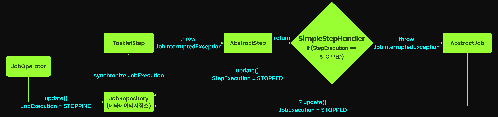

# Batch Flow

Spring Batch 는 복잡한 흐름 제어 요구사항을 해결하기 위해 Flow라는 메커니즘을 제공한다.

Flow 를 사용하면 순차적으로 Step을 실행하는 것을 넘어, 상황에 맞게 유연하게 경로를 결정하는 것이 가능하다.

## Batch Flow란?

Flow는 Job 안에서 각 Step들이 언제, 어떤 조건으로 실행될지 우리가 직접 설계하고 지휘하는 핵심 메커니즘이다. 이를 통해 복잡한 흐름 제어를 구현할 수 있다.

특정 Step의 실행 결과(`ExitStatus`)와 우리가 설정한 조건에 따라 다음에 어떤 Step으로 나아갈지를 결정할 수 있다.

### Flow 3대 핵심 요소

#### 1) 상태(State)

상태(State)란 Flow 내에서 현재 실행이 머무르거나 도달할 수 있는 모든 논리적 지점을 의미한다.

상태는 크게 실행상태와 종료상태 두가지 유형으로 분류된다.

- 실행 상태 (StepState 등): _(Spring Batch 에서 사용되는 용어는 아니다.)_
  - 실행 상태는 Flow 내에서 실제 특정 작업(로직)을 수행하는 지점을 나타낸다.
- 종료 상태 (EndState):
  - 종료 상태는 Flow 실행의 최종 도착점을 나타내는 상태이다.
  - Flow가 이 상태에 도달하면 더 이상 진행되지 않고 실행이 종료된다.
  - Job의 최종 결과는 Flow가 어떤 EndState로 끝났는지에 따라 결정된다.

#### 2) 전이 조건 (ExitCode)

어떤 스텝을 실행할 것인지에 대한 분기 기준이다. Flow에선 ExitStatus가 다음 전이를 결정하는 핵심 조건이다.

기본으로 제공되는 "COMPLETED", "FAILED" 외에도 커스텀 ExitStatus를 정의해 세밀한 분기가 가능하다.

#### 3) 전이 규칙 (Transition)

ExitCode 조건에 따라 다음 상태로의 이동을 정의한다.

ExitCode는 Step의 실행 결과를 기반으로 결정되며, Transition은 ExitCode에 따라 Flow의 진행 방향을 결정한다

### Flow 구현 기본 예시

1. analyzeContentStep 실행
2. 만약 analyzeContentStep 의 ExitCode 가 `COMPLETED` 라면 publishLectureStep 실행
3. 만약 analyzeContentStep 의 ExitCode 가 `FAILED` 라면 summarizeFailureStep 실행

위와 같이 동작하는 Flow를 만드는 예시는 아래와 같다.

```java
@Bean
public Job lectureScanConditionalJob(
    JobRepository jobRepository,
    Step analyzeContentStep,      // State 1
    Step publishLectureStep,      // State 2
    Step summarizeFailureStep     // State 3
) {

  return new JobBuilder("lectureScanConditionalJob", jobRepository)
      // 초기 State 설정
      .start(analyzeContentStep) 
      
      
      // [Transition 1] 
      // IF ExitStatus == "COMPLETED" THEN publishLectureStep State
      .on("COMPLETED")           // 조건: ExitCode가 "COMPLETED"
      .to(publishLectureStep)    // 전이: publishLectureStep으로 이동
      
      // 다시 analyzeContentStep으로부터 새로운 Transition 정의
      .from(analyzeContentStep)  
      
      // [Transition 2]
      // IF ExitStatus == "FAILED" THEN 다음 summarizeFailureStep State
      .on("FAILED")              // 조건: ExitCode가 "FAILED"
      .to(summarizeFailureStep)  // 전이: summarizeFailureStep으로 이동
      
      // 모든 Flow 정의 종료
      .end()
      .build();
}
```

- `start()` : 시작 상태를 설정.
- `on()` : 조건을 지정한 다음.
- `to()` : 전이될 다음 상태를 정의.
- `from()` : 추가 분기가 필요할 경우 기준점을 다시 설정.
- `end()` : 모든 Flow 정의가 완료되었음을 시스템에 알림.

## 커스텀 ExitCode를 활용한 Flow 분기 제어

### 청크 지향 처리에서의 커스텀 ExitCode 설정

커스텀 ExitCode를 기반으로 Flow를 구성하기 위해서는 먼저 커스텀 ExitStatus를 생성하고 이를 StepExecution에 설정하는 방법을 알아야 한다.

가장 대표적인 방법은 StepExecutionListener 의 `afterStep()` 메서드를 구현하는 것이다.

```java
@Component
public class DataDeathCountListener implements StepExecutionListener {
    private static final int CRITICAL_SKIP_THRESHOLD = 10;
    private static final int WARNING_SKIP_THRESHOLD = 5;

    @Override
    public void beforeStep(StepExecution stepExecution) {
        // 필요 시 초기화 작업
    }

    @Override
    public ExitStatus afterStep(StepExecution stepExecution) {
        int skipCount = stepExecution.getSkipCount();
        
        if (skipCount >= CRITICAL_SKIP_THRESHOLD) {
            return new ExitStatus("DATA_MASSACRE", // 커스텀 ExitCode
                    String.format("데이터 대량 학살 발생! %d개 항목이 처형되었다!", skipCount));
        } else if (skipCount >= WARNING_SKIP_THRESHOLD) {
            return new ExitStatus("DATA_TORTURE", // 커스텀 ExitCode
                    String.format("데이터 고문이 진행 중! %d개 항목이 고통받고 있다!", skipCount));
        } else if (skipCount > 0) {
            return new ExitStatus("DATA_SLAP", // 커스텀 ExitCode
                    String.format("데이터 가벼운 체벌! %d개 항목이 훈육되었다.", skipCount));
        }
        
        // 기존 ExitStatus 유지
        return stepExecution.getExitStatus();
    }
}
```

### 커스텀 ExitCode 활용 예시

커스텀 ExitCode를 활용하여 Flow 분기 제어를 구현하는 예시를 살펴보자.

1. analyzeLectureStep 으로 시작
2. 만약 analyzeLectureStep 의 ExitStatus 가 `APPROVED` 이면 approveImmediatelyStep 으로 이동
3. 만약 analyzeLectureStep 의 ExitStatus 가 `PLAGIARISM_DETECTED` 이면 initiateContainmentProtocolStep 으로 이동
4. 만약 analyzeLectureStep 의 ExitStatus 가 `TOO_EXPENSIVE` 이면 priceGougerPunishmentStep 으로 이동
5. 만약 analyzeLectureStep 의 ExitStatus 가 `666_UNKNOWN_PANIC` 이면 adminManualCheckStep 으로 이동
6. 만약 analyzeLectureStep 의 ExitStatus 가 `QUALITY_SUBSTANDARD` 이면 lowQualityRejectionStep 으로 이동

```java
@Bean
public Job lectureReviewJob(
    JobRepository jobRepository,
    Step analyzeLectureStep,
    Step approveImmediatelyStep,
    Step initiateContainmentProtocolStep,
    Step lowQualityRejectionStep,
    Step priceGougerPunishmentStep,
    Step adminManualCheckStep
) {
    return new JobBuilder("inflearnLectureReviewJob", jobRepository)
            .start(analyzeLectureStep) // 모든 것은 강의 분석에서 시작된다...
            .on("APPROVED").to(approveImmediatelyStep)     //  합격. 즉시 승인 및 게시. 축배를 들어라!

            .from(analyzeLectureStep) // 다시 분석 스텝으로 돌아와서...
            .on("PLAGIARISM_DETECTED").to(initiateContainmentProtocolStep)  //  표절 의심? 즉시 격리 및 저작권 위반 심문 시작 💀
            
            .from(analyzeLectureStep) //  또 다시 분석 스텝...
            .on("TOO_EXPENSIVE").to(priceGougerPunishmentStep)      // 수강생 등골 브레이커 탐지! '바가지 요금 처단' 스텝으로 보내 경제 정의 실현!
            
            .from(analyzeLectureStep) //  또 다시...
            .on("666_UNKNOWN_PANIC").to(adminManualCheckStep)     // 💀💀💀💀 컨텐츠 담당자 공포에 떨며 검토 중 💀💀💀💀

            .from(analyzeLectureStep) //  마지막이다...
            .on("QUALITY_SUBSTANDARD").to(lowQualityRejectionStep)   // 품질 미달? 기준 이하는 용납 못한다!

            .end() // Flow 종료
            .build();
}
```

### 암시적 전이 규칙

Flow DSL 상에서 다른 상태로의 전이 규칙을 단 하나도 정의하지 않은 경우, Spring Batch가 자동으로 처리해준다.

`.on() → .to()` 체인이 전혀 없는 상태들이 이에 해당한다.

만약 `.on() → .to()` 체인이 적용된 스텝이 있다면, 반드시 모든 ExitCode에 대해 경로를 명시적으로 정의해야 한다.

### 패턴 매칭 ExitCode

ExitCode가 특정 패턴에 부합하는 경우, 해당 패턴에 맞는 스텝으로 전이될 수 있다. 예를 들어, `*ERROR*` 패턴은 모든 에러 ExitCode를 처리할 수 있다.

#### 1) `*`

`*`는 어떤 문자열(빈 문자열 포함)과도 매칭된다. 즉, "어떤 값이든 상관없다" 라는 의미다.

```java
.on("*")   // 모든 ExitCode와 매치 (제약 없이 모두 처리)
```

1. 모든 나머지 경우 한 번에 처리하기

```java
.from(analyzeLectureStep)
.on("*") // 앞서 지정하지 않은 모든 ExitCode는 전부 여기서 매칭
.to(processUnknownStateStep)
```

2. 특정 패턴으로 시작하거나 끝나는 ExitCode 모두 처리하기

```java
// 강의 등록 오류 관련 ExitCode
// ERROR_FILE_MISSING
// ERROR_PROCESSING_FAILED
// ERROR_DATABASE_CONNECTION
// ... 기타 등등

.from(analyzeLectureStep)
.on("ERROR_*") // 모든 강의 등록 오류는 별도의 스텝에서 에러 핸들링!
.to(systemErrorHandlingStep)
```

#### 2) `?`

`?`는 정확히 한 개의 문자와 매칭되는 와일드카드다. 즉, "이 위치에 어떤 한 글자가 온다" 라는 의미다.

1. 숫자나 단일 문자 변형이 있는 ExitCode 그룹화하기

```java
.on("ERROR_?") // 'ERROR_' 다음에 딱 한 글자만 오는 패턴과 매치 (ERROR_1, ERROR_2 등)
```

2. 코드 길이가 정확히 정해진 패턴 매칭하기

```java
.on("QUALITY_???") // QUALITY_ 다음에 정확히 3글자가 오는 패턴과 매치 (QUALITY_LOW, QUALITY_BAD 등)
```

3. `*` 조합

```java
.on("LECTURE_??_*") // 'LECTURE_'로 시작하고 그 뒤에 정확히 2글자가 오고, 그 뒤엔 어떤 문자열이든 올 수 있음 (LECTURE_01_BASIC, LECTURE_02_ADVANCED 등)
```


#### 매칭되는 여러 조건이 있는 경우, 전이 우선순위

만약 어떤 ExitCode가 여러 `on()` 과 매칭된다면, 아래와 같은 우선순위로 처리된다.

1. 정확한 문자열
2. `?` 가 포함된 패턴
3. `???` 처럼 물음표로만 구성된 패턴
4. `*` 가 포함된 패턴
5. `*` 로만 구성된 패턴

이에 대한 예시는 아래와 같다.

```text
ERROR_1 > ERROR_? > ??? > ERROR_* > *
```

## EndState 설정

위에서 가장 마지막에 실행된 Step의 ExitCode 에 의해 Job의 최종 EndState가 결정된다고 설명했다.

이번에는 어떤 Step ExitCode를 어떤 EndState로 매핑할 것인지 설정하는 방법에 대해 알아본다.

### `end()` : COMPLETED 상태로 전이

```java
.from(analyzeLectureStep)
.on("TOO_EXPENSIVE").to(priceGougerPunishmentStep).on("*").end()  // 바가지 요금 탐지 후 처리 결과와 무관하게 성공 종료

.from(analyzeLectureStep)
.on("QUALITY_SUBSTANDARD").to(lowQualityRejectionStep).on("*").end()  // 품질 미달 처리 후 결과와 무관하게 성공 종료
```

위와 같이, `on() -> end()` 체이닝으로 처리할 수 있다. 이때 `*` 패턴으로 매칭하여 모든 ExitCode 에 대해 성공처리하는 것을 알 수 있다.

> 여기서의 `end()` 는 Flow DSL에서 전이 정의가 끝날때 사용하는 `end()` 와 다름에 유의하자.

### `stop()` : STOPPED 상태로 전이

```java
.from(analyzeLectureStep)
.on("666_UNKNOWN_PANIC").to(adminManualCheckStep).on("*").stop()  // 관리자 검토 후 결과와 무관하게 중단 상태로 종료
```

### `fail()` : FAILED 상태로 전이

```java
.from(analyzeLectureStep)
.on("PLAGIARISM_DETECTED").fail()  // 표절 감지 즉시 실패 처리, 추가 단계 없음
```

### `end(status)` : 커스텀 EndState로 전이

```java
.on("APPROVED").to(approveImmediatelyStep).on("*").end("COMPLETED_BY_SYSTEM")
```

이 오버로딩된 end()메서드를 사용하면 Flow를 우리가 지정한 커스텀 EndState로 전이시킬 수 있다. Flow의 종료 상태를 더욱 풍부하게 표현하고자 할 때 유용하다.

**단 주의해야 하는 점이 있는데, 커스텀 EndState 는 반드시 `COMPLETED` , `FAILED` , `STOPPED` 중 하나로 시작해야한다는 것이다.**

BatchStatus는 Spring Batch의 시스템 동작과 직결되어 있어 미리 정의된 값만 사용할 수 있다. 따라서 커스텀 EndState는 `COMPLETED` , `FAILED` , `STOPPED` 중 하나로 시작해야 한다.

이를 통해 커스텀 EndState가 기존 EndState와 어떻게 매핑되는지 설정해야 한다.

## JobExecutionDecider

위 방식은 복잡한 분기처리시, 아래와 같은 문제가 있을 수 있다.

- Step의 본질적 기능 오염
  - Step 내부에 ExitCode 결정 로직이 증가하면서 진짜 핵심 비즈니스 로직은 뒤로 밀려나게 된다.
- 분기 로직의 은폐(청크지향처리)
  - 청크 지향 처리에서는 ExitCode 설정을 위해 StepExecutionListener를 별도로 구현해야 한다. 이렇게 되면 흐름 제어 로직이 리스너에 숨어 전체 흐름을 이해하기 어려워진다.

이 문제를 JobExecutionDecider 로 해결할 수 있다. JobExecutionDecider를 사용하면 전이 조건 설정 로직을 Step 코드 외부로 뺄 수 있다.

JobExecutionDecider는 **전이 조건(FlowExecutionStatus)을 결정하는 전용 컴포넌트**이다. 이를 사용하면 아래와 같은 이점을 얻을 수 있다.

- 관심사의 분리: Step은 데이터 처리라는 본연의 임무에만 집중할 수 있다. 흐름 제어 관련 로직은 완전히 분리된 컴포넌트에서 처리된다.
- 더 명확한 Flow 정의: Flow 구성에서 의사결정 포인트가 명시적으로 드러나 전체 흐름을 파악하기 쉬워진다.

### JobExecutionDecider 사용 예시

```java
/**
 * 전이 조건을 구현하는 커스텀 JobExecutionDecider 클래스
 */
@Component
public static class StudentReviewDecider implements JobExecutionDecider {

    @Override
    public FlowExecutionStatus decide(JobExecution jobExecution, StepExecution stepExecution) {
        // StepExecution의 ExecutionContext에서 분석 결과 추출
        ExecutionContext executionContext = stepExecution.getExecutionContext();
        int reviewScore = executionContext.getInt("reviewScore");

        log.info("수강생 리뷰 점수 기반 강의 분류 중", reviewScore);

        // 리뷰 점수에 따른 강의 분류
        if (reviewScore > 10) {
            log.error("스프링 배치 마스터 감지!!!");
            return new FlowExecutionStatus("666_SPRING_BATCH");
        } else if (reviewScore >= 8) {
            log.info("우수 강의 감지! 홍보 대상으로 분류");
            return new FlowExecutionStatus("EXCELLENT_COURSE");
        } else if (reviewScore >= 5) {
            log.info("평균 강의 감지. 일반 관리 대상으로 분류");
            return new FlowExecutionStatus("AVERAGE_COURSE");
        } else {
            log.warn("저평가 강의 감지! 개선 필요 대상으로 분류");
            return new FlowExecutionStatus("NEEDS_IMPROVEMENT");
        }
    }
}

/**
 * Job 정의
 */
@Bean
public Job studentReviewJob(
    JobRepository jobRepository,
    Step analyzeStudentReviewStep,
    StudentReviewDecider studentReviewDecider,
    Step promoteCourseStep,
    Step normalManagementStep,
    Step improvementRequiredStep,
    Step springBatchMasterStep
) {
    return new JobBuilder("studentReviewJob", jobRepository)
        .start(analyzeStudentReviewStep) //시작할 스텝
        .next(studentReviewDecider) //analyzeStudentReviewStep 에서 StepExecution 에 넣어준 값을 기준으로 FlowExecutionStatus를 반환하기에, studentReviewDecider는 analyzeStudentReviewStep 이후에 와야한다.
        .on("EXCELLENT_COURSE").to(promoteCourseStep) //studentReviewDecider 에서 반환한 FlowExecutionStatus(ExitCode) 에 대한 라우팅
        .from(studentReviewDecider).on("AVERAGE_COURSE").to(normalManagementStep)
        .from(studentReviewDecider).on("NEEDS_IMPROVEMENT").to(improvementRequiredStep)
        .from(studentReviewDecider).on("666_SPRING_BATCH").to(springBatchMasterStep)
        .end()
        .build();
}
```

## Flow를 독립적인 Bean 객체로 만들기

만약 여러 Job에서 동일한 Flow를 사용하는 경우, JobBuilder에 동일한 FlowDSL 체이닝을 해야 한다.

이 Flow를 하나의 독립적인 객체로 만들어, 코드 재사용을 할 수 있는 방법에 대해 알아본다.

### 예시코드) Flow 를 Bean 객체로 만들기

```java
/**
 * FlowBuilder 를 통한 Flow Bean 객체 등록
 */
@Bean
public Flow lectureValidationFlow(
    Step validateContentStep, 
    Step checkPlagiarismStep, 
    Step verifyPricingStep
) {
    return new FlowBuilder<Flow>("lectureValidationFlow")
            .start(validateContentStep)
            .next(checkPlagiarismStep)
            .on("PLAGIARISM_DETECTED").fail()  // 표절 감지되면 즉시 실패 처리
            .from(checkPlagiarismStep)
            .on("COMPLETED").to(verifyPricingStep)
            .on("TOO_EXPENSIVE").to(pricingWarningStep)  // 가격이 과도하면 경고 처리
            .from(verifyPricingStep)
            .on("*").end()  // 나머지 모든 경우는 정상 종료
            .build();
}
```

### 예시코드) Flow 재사용방법 1 - Job에 Flow 주입

```java
@Bean
public Job newCourseReviewJob(
    JobRepository jobRepository, 
    Flow lectureValidationFlow,
    Step notifyInstructorStep
) {
    return new JobBuilder("newCourseReviewJob", jobRepository)
            .start(lectureValidationFlow)  // Flow를 Job의 시작점으로 사용
            .next(notifyInstructorStep)    // Flow 완료 후 추가 Step 실행
            .end()
            .build();
}
```

### 예시코드) Flow 재사용방법 2 - Flow를 하나의 Step으로 사용

```java
@Bean
public Job newCourseReviewJob(
    JobRepository jobRepository,
    Step validationStep,
    Step notifyInstructorStep
) {
    return new JobBuilder("newCourseReviewJob", jobRepository)
            .start(validationStep)  // Step으로 위장한 Flow를 Job의 시작점으로 사용
            .next(notifyInstructorStep)    // Flow 완료 후 추가 Step 실행
            .end()
            .build();
}

/**
 * Flow를 Step으로 위장
 */
@Bean
public Step validationStep(
    JobRepository jobRepository,
    PlatformTransactionManager transactionManager,
    Flow lectureValidationFlow
) {
    return new StepBuilder("validationStep", jobRepository)
        .flow(lectureValidationFlow)  // Step 내에 Flow 주입
        .build();
}
```

StepBuilder의 flow() 메서드를 사용하면 내부적으로 FlowStep이 생성되어, Flow 전체를 마치 하나의 Step인 것처럼 취급할 수 있다.

**Flow 전체에 대해 Step 단위의 리스너를 붙이거나 ItemStream을 적용하고자 할 때 유용하게 사용할 수 있다.**

## Flow 사용시 주의점

하나의 Job에 온갖 Step과 분기 로직을 넣으면, 유지보수와 가독성이 크게 떨어질 수 있다.

따라서 정말 Flow가 필요한 경우에만 사용하고, 단일 책임을 가진 작은 Job들이 모여 전체 시스템을 이루는 것을 고려하자.

# 멀티스레드 스텝

## 개요

멀티스레드 스텝은 하나의 StepExecution을 여러 스레드로 동시에 실행하는 기법이다.

단일 스레드의 한계를 뛰어넘어 시스템 자원을 최대한 활용해 처리 속도를 극대화하는 전략이다.

### 멀티스레드 스텝 동작 프로세스

- 테스크릿 지향 처리 스텝: 
  - Tasklet의 execute() 메서드를 여러 스레드가 동시에 병렬로 실행한다.
- 청크 지향 처리 스텝: 
  - 각 청크 처리(ItemReader → ItemProcessor → ItemWriter 처리 사이클)를 여러 스레드가 동시에 수행한다.
  - 각 스레드가 독립적인 청크를 가져와 처리하므로 전체 처리량이 향상된다.

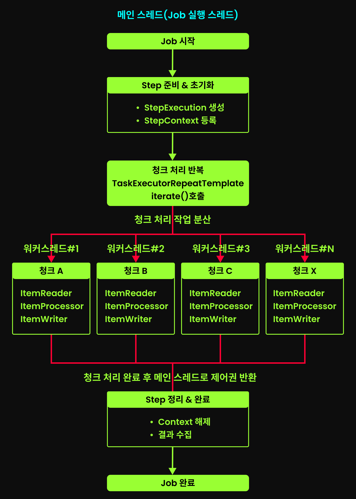

### 멀티쓰레드 스텝에서의 StepExecution 바인딩

이전에 StepExecution과 JobExecution을 ThreadLocal에 저장했다가, 실제 Bean 객체가 실행될 때 파라미터로 바인딩된다고 설명했었다.

멀티쓰레드 스텝에서는 각 워커 쓰레드의 ThreadLocal에도 StepExecution이 저장되어 정상적으로 StepExecution 을 가져와 사용할 수 있다.

### 기본 예시 코드

예시 코드는 아래와 같다.

```java
@Bean
public Step threatAnalysisStep() {
    return new StepBuilder("threatAnalysisStep", jobRepository)
        .<HumanThreatData, TargetPriorityResult>chunk(100)
        .reader(humanThreatDataReader())
        .processor(threatAnalysisProcessor())
        .writer(targetListWriter())
        .taskExecutor(taskExecutor()) //Step을 실행할 Executor 설정
        .throttleLimit(5) //최대 쓰로틀 횟수 설정
        .build();
}

/**
 * 멀티쓰레딩이 가능하도록 설정한 커스텀 TaskExecutor
 */
@Bean
public TaskExecutor taskExecutor() {
    ThreadPoolTaskExecutor executor = new ThreadPoolTaskExecutor();
    executor.setCorePoolSize(5);
    executor.setMaxPoolSize(5);
    executor.setWaitForTasksToCompleteOnShutdown(true);
    executor.setAwaitTerminationSeconds(10);
    executor.setThreadNamePrefix("T-800-");
    executor.setAllowCoreThreadTimeOut(true);
    executor.setKeepAliveSeconds(30);
    return executor;
}
```

각 코드의 자세한 설명은 차차 이어간다.

## 멀티스레드 환경에서의 스레드 안전성

Spring Batch의 스레드 안전성은 크게 두 가지 측면으로 나뉜다.

- 데이터 처리 안전성 (데이터 읽고/쓰기 관점에서의 스레드 안전성)
- 실행 상태 안전성 (메타데이터 기록 동기화 관점에서의 스레드 안전성)

위 두가지에 대해 살펴본다.

### 데이터 처리 안전성 (데이터 읽고/쓰기 관점에서의 스레드 안전성)

#### ItemReader 와 SynchronizedItemStreamReader/SynchronizedItemReader

ItemReader 에는 Thread Safe 한 것과 그렇지 않은 것들이 존재한다. 대표적인 ItemReader 의 쓰레드 안전성 여부는 아래와 같다.

- FlatFileItemReader : `This reader is not thread-safe.` 라는 주석을 확인할 수 있다. 즉 Thread Safe하지 않다.
- JpaCursorItemReader : 마찬가지로 `This reader is not thread-safe.` 라는 주석을 확인할 수 있다. 즉 Thread Safe하지 않다.
- JdbcPagingItemReader : Thread Safe 하다!

만약 Thread Safe하지 않은 ItemReader를 멀티쓰레딩에 사용하려고 한다면, SynchronizedItemReader 혹은 SynchronizedItemStreamReader 를 사용하면 된다.

SynchronizedItemReader 와 SynchronizedItemStreamReader 는 쓰레드 안전 데코레이터로, `read()` 메서드에 ReentrantLock을 적용해 읽기시 쓰레드간 동시접근을 방지한다.

둘의 차이는 ItemStream을 구현한 ItemReader를 사용하는지에 대한 여부에 있다.

- SynchronizedItemReader :
  - 실제 `read()` 할 ItemReader 가 ItemStream 을 구현하지 않았을 때 사용 
- SynchronizedItemStreamReader
  - 실제 `read()` 할 ItemReader 가 ItemStream 을 구현했을때 사용
  - ItemStream 메서드 `open()` , `update()`, `close()` 가 존재하고, 모두 실제 ItemReader의 메서드를 호출한다.

아래 예시코드는 ThreadSafe 하지 않은 ItemReader 중 하나인 FlatFileItemReader 를 SynchronizedItemStreamReader로 감싸서 ThreadSafe하게 만드는 예시이다.

```java
@Bean
public Step threatAnalysisStep() {
    return new StepBuilder("threatAnalysisStep", jobRepository)
            .<HumanThreatData, TargetPriorityResult>chunk(100, transactionManager)
            .reader(threadSafeHumanThreatReader()) //ThreadSafe한 ItemReader 적용
            .processor(threatAnalysisProcessor())
            .writer(targetListWriter())
            .taskExecutor(taskExecutor())
            .throttleLimit(5)
            .build();
}

/**
 * 반환타입을 ItemReader가 아닌 ItemStreamReader으로 설정하여, 해당 ItemReader가 ItemStream 으로도 등록되도록 함.
 * (특히 @StepScope 등 프록시 객체로 생성되는 경우) 
 */
@Bean
public ItemStreamReader<HumanThreatData> threadSafeHumanThreatReader() {
    //사용할 FlatFileItemReader
    FlatFileItemReader<HumanThreatData> reader = new FlatFileItemReaderBuilder<HumanThreatData>()
            .name("humanThreatDataReader")
            .resource(new ClassPathResource("human-threats.csv"))
            .delimited()
            .names("humanId", "name", "location", "threatLevel", "lastActivity")
            .targetType(HumanThreatData.class)
            .build(); //ItemStream이 구현된 ItemReader

    //쓰레드 안전 데코레이터로 감싸기
    SynchronizedItemStreamReader<HumanThreatData> synchronizedReader = new SynchronizedItemStreamReader<>();
    synchronizedReader.setDelegate(reader); //set으로 실제 ItemReader 설정

    return synchronizedReader;
}

@Bean
public ItemReader<HumanThreatData> threadSafeHumanThreatReader2() {
    List<HumanThreatData> threats = Arrays.asList(
        new HumanThreatData(1L, "Unknown-A", "Seoul", 5),
        new HumanThreatData(2L, "Unknown-B", "Busan", 3),
        new HumanThreatData(3L, "Unknown-C", "Gwangju", 9)
    );
    ListItemReader reader = new ListItemReader<>(threats); //ItemStream이 구현되지 않은 ItemReader

    //쓰레드 안전 데코레이터로 감싸기
    SynchronizedItemReader<HumanThreatData> synchronizedReader = new SynchronizedItemReader<>(reader); //생성자 파라미터로 전달
    
    return synchronizedReader;
}
```

#### ItemWriter 와 SynchronizedItemStreamWriter/SynchronizedItemWriter

ItemWriter 의 경우에도 위와 동일하다.

ItemStream을 구현하는 ItemWriter를 ThreadSafe하게 사용하려면 SynchronizedItemStreamWriter 로 감싸고, ItemStream을 구현하지 않는 ItemWriter를 ThreadSafe하게 사용하려면 SynchronizedItemWriter 로 감싸면 된다.

이외 사항은 모두 위와 동일하다.

### 실행 상태 안전성 (메타데이터 기록 동기화 관점에서의 스레드 안전성)

위에서 데이터를 읽고 쓰는 데이터 처리 안전성에 대해 알아봤다.

멀티쓰레딩 환경에서 고려해야할 사항으로, 데이터 처리 안전성외에 실행 상태 안전성이 있다.

실행 상태 안전성은 Spring Batch 스텝의 상태(e.g. 메타데이터)가 어떻게 관리되는지에 대한 문제이다. 특히 **재시작 기능**과 밀접하다.

FlatFileItemWriter 를 예시로 설명하겠다.

FlatFileItemWriter 의 내부 코드를 보면, 어떤 공유변수도 사용되지 않아 Thread Safe 한 것처럼 보인다. 실제로 FlatFileItemWriter 는 item을 쓰는 작업에 있어서는 Thread Safe 하다.

**하지만 주석에는 `The implementation is not thread-safe.` 이라는 내용이 있는데, 이는 실행 상태를 관리하는 부분에 있어 Thread Safe 하지 않다는 것이다.**

#### ItemStream 과 실행 상태 안전성

FlatFileItemWriter 는 ItemStream 의 구현체이기도 한데, 멀티스레드 환경에서는 이런 open()/close() 메서드가 여러 스레드에서 동시에 호출될 수 있어보인다.

이 경우 파일 핸들 충돌, 중복 헤더 작성, 리소스 경쟁 등의 문제가 발생할 수 있다.

**하지만 다행히도 Spring Batch에서 ItemStream의 `open()` 과 `close()` 는 메인 쓰레드 1개에서만 실행되어 이런 문제는 발생하지 않는다.**

멀티 스레드 스텝은 청크 처리만 여러 스레드가 처리할 뿐이다.

단, 유의해야하는 것은 `update()` 이다.

여러 쓰레드에서 청크처리를 하면, `update()` 가 각 쓰레드마다 실행된다. 따라서 ExecutionContext 는 가장 마지막에 실행된 `update()` 에서의 상태로 덮어씌워진다.

**즉, 여러 스레드가 동시에 update() 메서드를 호출할 수 있고, 이러면 ExecutionContext에 마지막으로 업데이트한 쓰레드의 정보만 남게 되어 데이터 불일치가 발생한다는 것이다.**

**이 문제를 해결하기 위해선 `saveState(false)`로 설정하여 재시작 기능을 포기해야 한다.**

**FlatFileItemWriter 뿐만 아니라, JdbcPagingItemReader 같은 대부분의 ItemStream 구현체를 멀티쓰레딩 환경에서 사용시 `saveState(false)`로 설정하여 재시작 기능을 포기해야 한다.**

## 멀티쓰레드 환경에서의 Job : 실전 예제 코드

```java
@Configuration
@Slf4j
@RequiredArgsConstructor
public class T800ProtocolConfig {
    private final JobRepository jobRepository;
    private final PlatformTransactionManager transactionManager;
    private final EntityManagerFactory entityManagerFactory;

    @Bean
    public Job humanThreatAnalysisJob(Step threatAnalysisStep) {
        return new JobBuilder("humanThreatAnalysisJob", jobRepository)
            .start(threatAnalysisStep)
            .incrementer(new RunIdIncrementer())
            .build();
    }

    @Bean
    public Step threatAnalysisStep(
        JpaPagingItemReader<Human> humanThreatDataReader,
        ItemProcessor<Human, TargetPriorityResult> threatAnalysisProcessor,
        FlatFileItemWriter<TargetPriorityResult> targetListWriter
    ) {
        return new StepBuilder("threatAnalysisStep", jobRepository)
            .<Human, TargetPriorityResult>chunk(10, transactionManager)
            .reader(humanThreatDataReader)
            .processor(threatAnalysisProcessor)
            .writer(targetListWriter)
            .taskExecutor(taskExecutor())
            .throttleLimit(5) //반드시 taskExecutor의 MaxPoolSize 와 같거나 커야한다.
            .build();
    }

    @Bean
    public TaskExecutor taskExecutor() {
        ThreadPoolTaskExecutor executor = new ThreadPoolTaskExecutor();
        executor.setCorePoolSize(5); //쓰레드 풀 기본 사이즈
        executor.setMaxPoolSize(5); //쓰레드 풀 최대 사이즈
        executor.setWaitForTasksToCompleteOnShutdown(true); //잡 중단시 모든 작업이 완료될 때까지 대기
        executor.setAwaitTerminationSeconds(10); //잡 중단시 모든 작업이 완료될 때까지 대기할 시간(sec) 설정
        executor.setThreadNamePrefix("T-800-"); //쓰레드 이름 설정
        executor.setAllowCoreThreadTimeOut(true); //유휴 쓰레드를 종료할지 여부
        executor.setKeepAliveSeconds(30); //유휴 상태 유지 시간(sec)
        return executor;
    }
}
```

- [batch-system-with-mvc/src/main/java/com/system/batch/mvc/config/T800ProtocolConfig.java](batch-system-with-mvc/src/main/java/com/system/batch/mvc/config/T800ProtocolConfig.java)

### taskExecutor 코드 설명

- `corePoolSize()` / `maxPoolSize()`
  - 위 예시 코드에서는 corePoolSize와 maxPoolSize를 동일하게 설정했다. 
  - 배치 작업은 지속적인 부하를 처리하기 위한 것이 아니라, 주어진 데이터를 최대한 빠르게 처리하기 위한 것이다. 
  - 따라서 처음부터 최대 쓰레드를 투입하는 것이 효율적이다.
- `waitForTasksToCompleteOnShutdown()` / `awaitTerminationSeconds()`
  - 배치 작업이 중단 신호를 받았을 때의 동작을 정의한다.
  - 위 예시 코드에서는 처리 중인 모든 작업이 완료될 때까지 최대 10초간 대기하도록 한다.
  - 실전에서는 청크당 처리 시간을 고려하여 이 값을 더 길게 설정해야 한다. 데이터 처리가 복잡하거나 네트워크 지연이 있는 작전에서는 30초 이상으로 설정하는 것이 안전하다.
- `allowCoreThreadTimeout()` / `keepAliveSeconds()`
  - 스레드 풀 특성상 스레드은 처리할 작업이 없어도 계속 유지되며, 이로 인해 배치잡이 모두 완료되어도 JVM이 종료되지 않는 현상이 발생한다.
  - 배치 작업은 보통 실행 완료 후 JVM도 함께 종료되어야 하는 경우가 많다.
  - 따라서 이 설정으로 유휴 상태의 스레드을 30초 후 자동으로 종료시켜 JVM이 정상적으로 종료될 수 있게 한다.

> #### threatAnalysisStep 의 throttleLimit
> 
> `throttleLimit()`은 청크 처리에 동시에 참여할 수 있는 스레드의 최대 수를 결정한다.
> 
> TaskExecutor의 maxPoolSize를 높게 설정해도 `throttleLimit()` 로 설정된 값보다 많은 스레드가 사용되지는 않는다. 이는 설계적 결함에 가깝다.
> 
> 따라서 반드시 `throttleLimit()` 을 TaskExecutor의 maxPoolSize와 같거나 크게 설정해야 한다.

# 파티셔닝

파티셔닝은 전체 데이터 덩어리를 여러 개의 작은 조각으로 분할하는 것을 의미한다.

그리고 잘게 쪼개진 각각의 파티션을 별도의 쓰레드에 할당하여 동시에 처리하도록 만드는 방식으로 동작한다.

**이때 각각의 쓰레드는 완전히 별도의 StepExecution으로 실행되어, 쓰레드간 공유 자원을 경쟁하는 일을 방지해 성능 향상이 가능하다.**

즉, 파티셔닝은 서로 다른 데이터 범위(파티션)를 처리하는 여러 개의 독립적인 스텝 실행을 동시에 수행하는 것이다.

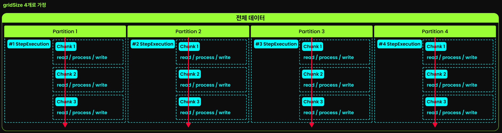

## 멀티쓰레드 스텝의 한계와 파티셔닝

- 멀티쓰레드 스텝의 병목 지점 : 멀티스레드 스텝은 하나의 ItemReader/ItemWriter를 여러 스레드가 공유하므로, 락(Lock) 경쟁으로 인해 성능 향상에 한계가 온다.
- 해결책 : 데이터을 쪼개어(Partition), 각 스레드에게 독립적인 Step 실행 환경과 전용 컴포넌트를 부여한다.

## 파티셔닝 핵심 아키텍처

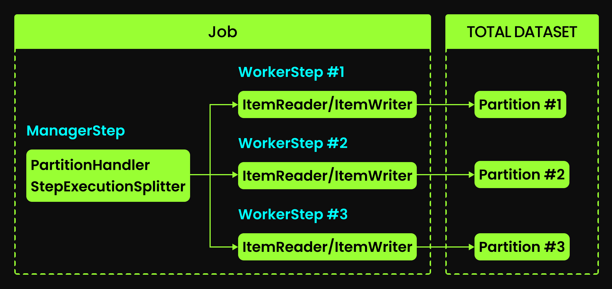

파티셔닝은 두개의 핵심 컴포넌트로 구성된다.

- ManagerStep : 실제 데이터를 처리하지 않고 전체 프로세스를 설계 및 감독한다.
  - StepExecutionSplitter : `Partitioner`를 사용하여 데이터를 분할하고, 각 파티션마다 독립적인 워커용 `StepExecution`들을 생성한다.
  - PartitionHandler : 생성된 워커용 `StepExecution`들을 `TaskExecutor`(스레드 풀)에 할당하여 병렬 실행을 관리한다.
- WorkerStep : 할당받은 파티션 범위 내에서 실제 Chunk 프로세싱(Read-Process-Write)을 수행한다.
  - 핵심적인 부분은 각 워커 스텝은 자신만의 독립적인 ItemReader와 ItemWriter 인스턴스를 가진다는 점이다.
  - 컴포넌트 인스턴스 자체를 공유하지 않으니, 공유 자원 락(Lock) 경쟁 문제가 원천적으로 발생하지 않는다.

## 핵심 컴포넌트 및 전략

### Partitioner

파티션을 어떻게 나누고, 어떤 워커가 어떤 파티션을 처리할지 결정하기 위해, 아래 `Partitioner` 인터페이스를 구현해야 한다.

```java
@FunctionalInterface
public interface Partitioner {
	Map<String, ExecutionContext> partition(int gridSize);
}
```

우리가 이 `Partitioner` 로직을 구현해서 managerStep에게 넘겨주면, 내부적으로 `StepExecutionSplitter`가 파티셔닝 시작 시점에 Partitioner를 실행시킨다.

- Partitioner 실행 이후 처리 프로세스는 아래와 같다.
  1) 각 파티션의 정보(예: 'ID 1부터 1000까지', '2025년 1월 데이터')가 담긴 ExecutionContext의 맵이 생성된다.
  2) StepExecutionSplitter는 이를 바탕으로 각 파티션별 StepExecution을 생성한다.
  3) 그다음 PartitionHandler가 이 StepExecution들을 받아 각 워커 스텝에게 할당하여 병렬 처리를 명령한다.

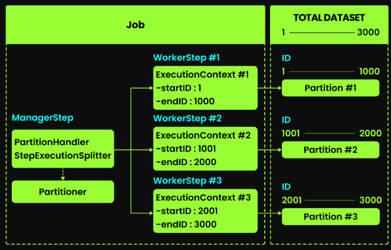

#### Partitioner 구현 예시

```java
/*
 * 날짜 기반으로 24시간 데이터를 시간대별로 파티셔닝하는 Partitioner (일일 배치용)
 * JobParameter로 받은 targetDate의 00:00:00 부터 다음 날 00:00:00 까지의 범위를
 * gridSize에 따라 분할하여 각 파티션의 시작/종료 Instant를 ExecutionContext에 저장한다.
 */
@Slf4j
@JobScope //Job이 실행될때마다 새로운 인스턴스 생성
@Component
public class DailyTimeRangePartitioner implements Partitioner {
    private final LocalDate targetDate;

    public DailyTimeRangePartitioner(
            @Value("#{jobParameters['targetDate']}") LocalDate targetDate) {
        log.info("Initializing DailyTimeRangePartitioner for targetDate: {}", targetDate);
        this.targetDate = targetDate;
    }

    @Override
    public Map<String, ExecutionContext> partition(int gridSize) {
        /*
         *  💀 gridSize(파티션 개수)가 24(Hours)의 약수인지 확인
         *  구현 나름이지만, gridSize가
         *  전체 데이터 크기의 약수가 아니면 던져버리는게 맘 편하다. 💀
         */
        if (24 % gridSize != 0) {
            /*
             * gridSize가 전체 데이터 크기의 약수가 되면
             * 각 파티션이 정확히 같은 시간 범위를 갖게 되어
             * 시스템 부하가 균등하게 분산되고, 행동을 예측하기 쉬워진다.
             * 또한 파티션 크기 분배 로직이 단순해진다. 💀
             */
            throw new IllegalArgumentException("gridSize must be a divisor of 24 (1, 2, 3, 4, 6, 8, 12, or 24)");
        }

        Map<String, ExecutionContext> partitions = new HashMap<>(gridSize);

        // 💀 targetDate의 시작(00:00:00)과 종료(다음 날 00:00:00) 시점을 계산 💀
        LocalDateTime startOfDay = targetDate.atStartOfDay();
        LocalDateTime endOfDay = targetDate.plusDays(1).atStartOfDay();


        log.info("Creating {} partitions for time range: {} to {}",
                gridSize, startOfDay, endOfDay);

        // 💀 각 시간대별로 파티션 생성 💀
        int partitionHours = 24 / gridSize;

        // 💀 각 파티션의 시작/종료 시간 계산 및 ExecutionContext 생성 💀
        for (int i = 0; i < gridSize; i++) {
            LocalDateTime partitionStartDateTime = startOfDay.plusHours(i * partitionHours);
            LocalDateTime partitionEndDateTime = partitionStartDateTime.plusHours(partitionHours);

            /*
             * 💀 gridSize가 24시간의 약수가 아닌 경우에는
             * 마지막 파티션이 다른 파티션보다 더 작거나 클 수 있다.
             * 이 때 endTime 설정이 필수적이다.
             * 이렇게 하면 모든 시간대의 데이터가 파티션에 포함되도록 보장할 수 있다. 💀
             */
            // if (i == gridSize - 1) {
            //     partitionEndTime = endOfDay;
            // }

            // 💀 파티션별 ExecutionContext에 시간 범위 정보 저장 💀
            ExecutionContext context = new ExecutionContext();
            context.put("startDateTime", partitionStartDateTime);
            context.put("endDateTime", partitionEndDateTime);

            log.info("Partition {}: {} to {}", i, partitionStartDateTime, partitionEndDateTime);

            partitions.put(String.valueOf(i), context);
        }

        return partitions;
    }
}
```

gridSize가 4인 경우, 24시간 동안의 전장 로그 데이터를 6시간 단위로 4개의 파티션으로 나눈다. 각 파티션은 고유한 시간 범위를 가지고, 이 정보는 ExecutionContext에 저장된다.

코드의 전체적인 흐름은 아래와 같다.

1) 파티셔닝을 위한 전체 데이터 범위를 결정한다 (24시간).
2) 파티션 개수(gridSize)로 전체 범위를 나눠 각 파티션의 범위를 계산한다.
3) 각 파티션마다 독립적인 ExecutionContext를 생성하고, 그 안에 해당 파티션이 처리해야 할 데이터 범위 정보를 저장한다. 이 ExecutionContext는 후에 각 파티션별 StepExecution에 전달된다.
4) 모든 파티션의 ExecutionContext를 Map에 담아 반환한다.

마지막에 ExecutionContext를 Map에 담아서 반환하는데, 이 Map이 중요하다.

각 키-값 쌍이 하나의 파티션을 의미하고, 각 값(ExecutionContext)은 해당 파티션이 처리해야할 데이터 범위 정보를 담고 있다.

- Map 의 Key : 각 파티션의 고유 식별자이다. 예제에서는 단순히 숫자 문자열('0', '1', '2', '3')을 사용했지만, 실전에서는 'TIME_BLOCK_1', 'MORNING_LOGS', 'EVENING_LOGS'와 같이 더 의미 있는 식별자를 사용할 수도 있다.
- Map 의 Value : 해당 파티션이 전달받을 ExecutionContext이다. ExecutionContext들은 각각 독립적인 StepExecution에 전달되어 자신만의 데이터를 처리하게 된다.

이렇게 만들어진 ExecutionContext들은 아래와 같이 ItemReader 에 전달되고, 각 ItemReader에서 자신이 할당받은 데이터 범위를 기반으로 데이터를 읽는다.

```java
private static final DateTimeFormatter FORMATTER = DateTimeFormatter.ofPattern("yyyyMMddHH");

/**
 * 예시 1
 */
@Bean
@StepScope //각 워커 스텝이 실행될 때마다 새로운 인스턴스가 생성된다. 즉 각 파티션마다 독립적인 ItemReader가 생성된다.
public RedisItemReader<String, BattlefieldLog> redisLogReader(
        @Value("#{stepExecutionContext['startDateTime']}") LocalDateTime startDateTime //Partitioner에서 전달된 시작 시간
) {
    return new RedisItemReaderBuilder<String, BattlefieldLog>()
        .redisTemplate(redisTemplate())
        .scanOptions(ScanOptions.scanOptions()               
           // 💀 Redis에 저장된 전장 로그의 키가 
            // "logs:[날짜시간]:*" 형식으로 저장되어 있다고 가정 💀 
            .match("logs:" + startDateTime.format(FORMATTER) + ":*")
            .count(10000)
            .build())
        .build();
}

/**
 * 예시 2
 */
@Bean
@StepScope //각 워커 스텝이 실행될 때마다 새로운 인스턴스가 생성된다. 즉 각 파티션마다 독립적인 ItemReader가 생성된다.
public MongoCursorItemReader<BattlefieldLog> mongoLogReader(
    // 💀 Partitioner에서 ExecutionContext에 
    // Date 타입으로 시간 범위 정보를 저장했다고 가정 💀
    @Value("#{stepExecutionContext['startDateTime']}") Date startDate,
    @Value("#{stepExecutionContext['endDateTime']}") Date endDate
) {
    return new MongoCursorItemReaderBuilder<BattlefieldLog>()
        .name("mongoLogReader_" + startDateTime)
        .template(mongoTemplate)
        .targetType(BattlefieldLog.class)
        .collection("battlefield_logs")
        .jsonQuery("{ 'timestamp': { '$gte': ?0, '$lt': ?1 } }")
        .parameterValues(List.of(startDate, endDate))
        .sorts(Collections.singletonMap("timestamp", Sort.Direction.ASC))
        .batchSize(10000)
        .build();
}
```